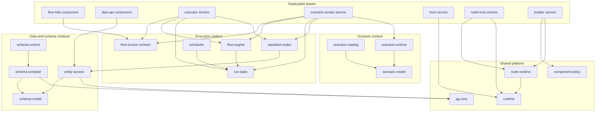
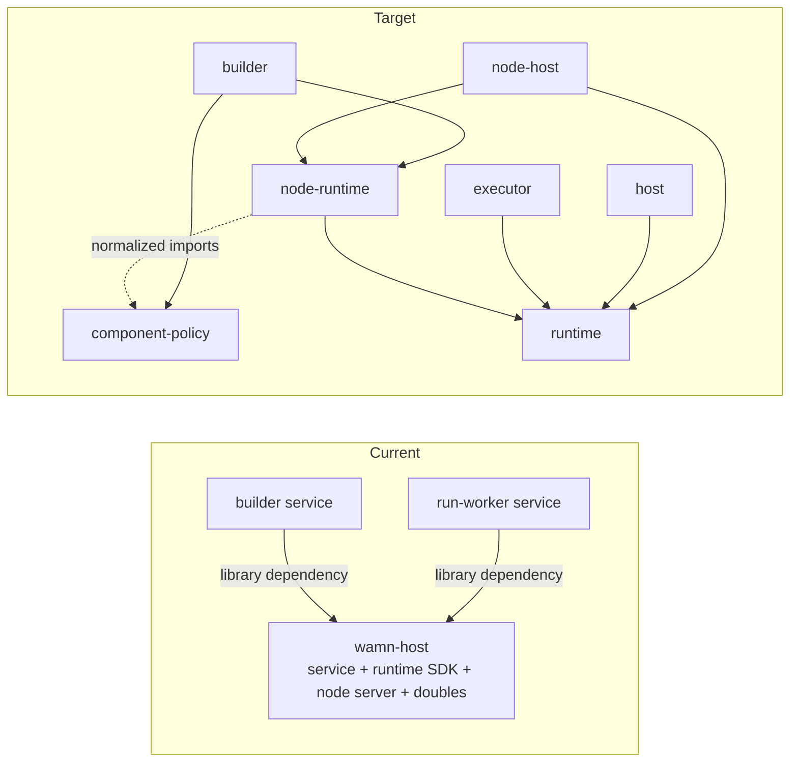
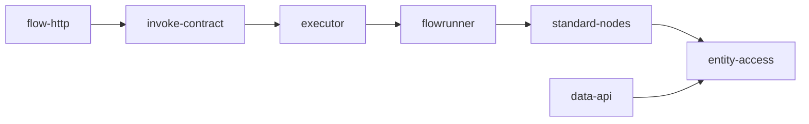
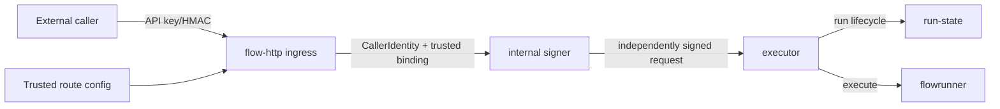

# Wamn Architecture Restructure Proposal

*Repository, runtime, execution, data-access, schema, identity, ingress, scenario, and test architecture*

> **Central thesis**
>
> Wamn should restructure now. The objective is not an arbitrary crate-count reduction; it is to make deployment, contract, target, state-ownership, trust, and bounded-context boundaries explicit, remove service-to-service library dependencies, consolidate accidental packages, and deliver the missing generic HTTP flow ingress through the target architecture.

| Field | Value |
|---|---|
| **Repository** | <https://github.com/dkkloimwieder/wamn> |
| **Source architecture baseline** | `1da2a10` — the baseline independently reviewed by the external reviewer |
| **Evidence snapshot** | `ffdbd1e` — current `main` on 23 July 2026; descends from `1da2a10` through audit/documentation commits |
| **Status** | Revised proposed architectural direction and migration plan |
| **Review stance** | Critical; optimized for durable boundaries and a shippable product path rather than minimum change |

> This is a decision document, not an implementation specification. Repository evidence is pinned to `ffdbd1e`; the structural findings cited here were checked against both stated revisions. [E0](#e0)

### Revision 2 amendments

This revision closes the actionable gaps raised in external review:

- Places `wamn-nodes` explicitly as `standard-nodes` behind the execution boundary.
- Rejects `standard-nodes -> data-api` as a permanent exception; extracts a shared `entity-access` kernel instead.
- Adds an explicit inbound identity and authentication decision for public flow invocation.
- Replaces the state-ownership template with a populated target matrix and a Phase 0 owner-manifest deliverable.
- Reclassifies deterministic replay, doubles, and recorders as product scenario capabilities where appropriate.
- Moves the generic HTTP ingress to Phase 2, before broad package consolidation.
- Names the consolidated execution-state package `execution/run-state` to avoid a redundant nested path.
- Treats duplicated SQL quoting as a security-sensitive consistency surface.
- Moves workspace dependency centralization into Phase 0.
- Repositions `wamn-sysschema` as an identity/project-state contract rather than provisioning-owned state.

## 1. Executive decision

> **Recommendation**
>
> Approve a staged architecture restructure and use the missing generic HTTP flow ingress as the first end-to-end product slice through the new boundaries. Do not preserve the current topology by default, and do not attempt a big-bang rewrite. Each phase must leave `main` buildable and preserve existing behavior except where a product surface is intentionally added.

### Decision summary

| ID | Decision | Required outcome |
|---|---|---|
| **D1** | Adopt an explicit layered package architecture | Services and components become leaves; contracts, guest-safe cores, and platform primitives sit below them. |
| **D2** | Split the current host package | Extract component-policy, runtime, node-runtime, host service, and node-host service. |
| **D3** | Create shared Postgres and entity-access seams | Centralize security-sensitive SQL primitives and one catalog-derived entity access engine used by both data API and standard nodes. |
| **D4** | Consolidate schema and execution bounded contexts | Merge packages only after target/dependency seams are corrected; separate scheduler from durable run state. |
| **D5** | Make scenario execution an explicit product subsystem | Separate scenario model, scenario persistence, deterministic scenario runtime, scenario worker, and repository-only test support. |
| **D6** | Define a versioned flow-invocation boundary | Use a stable application and wire contract; a Rust trait alone is not the deployable boundary. |
| **D7** | Build generic authenticated flow HTTP ingress early | Deliver the product path in Phase 2 through the canonical invocation boundary; do not embed a second executor. |
| **D8** | Replace the gate sink with test levels and enforce architecture in CI | White-box tests return to owners; conformance, integration, and system suites exercise stable boundaries and architecture rules. |
| **D9** | Establish inbound identity and authentication | Public flow invocation derives trusted tenancy from route/deployment context and authenticates callers; external and internal authentication remain separate protocols. |

### Scope and non-goals

**In scope:** repository organization, package roles, runtime/service boundaries, guest-safe dependency closure, shared entity access, durable-state ownership, public flow ingress, machine authentication for the first ingress slice, scenario execution, test topology, and CI enforcement.

**Not in scope:** replacing wasmCloud, Wasmtime, Postgres, NATS, Kubernetes, or the event-delivery model; redesigning public contracts without a compatibility plan; implementing a complete human user-session/JWT/RBAC product in the first ingress slice; or changing data/control/execution semantics merely to simplify packaging.

**Migration principle:** establish guardrails and stable seams first; deliver authenticated ingress second; decompose runtime services and consolidate bounded contexts underneath stable contracts; simplify tests continuously.

## 2. Current-state diagnosis

The evidence below is taken from the evidence snapshot on the cover. References are indexed in Appendix A.

| Observation | Evidence | Architectural consequence |
|---|---|---|
| **Flat workspace topology** | The native workspace lists 38 explicit members and no `default-members`; POCs and production packages are peers, while the README reconstructs package roles in prose. [E1](#e1) [E15](#e15) | The root does not encode architectural role or target class. Crate count is a signal, not the diagnosis. |
| **Host is three architectures in one package** | The host library exports doubles, egress policy, engine, memory metrics, plugins, cluster host, and serve-node. [E3](#e3) | A deployable service doubles as runtime SDK, scenario container, and custom-node server. |
| **Wrong service dependency direction** | Both builder and run-worker depend directly on `wamn-host`. [E4](#e4) [E5](#e5) | Deployable services inherit another service package's dependency closure and release cadence. |
| **Queue state and scheduling are coupled** | `wamn-run-queue` owns queue/lease logic and feature-gates cron/calendar/dispatcher cadence; flowrunner disables defaults. [E6](#e6) [E7](#e7) | The feature flag protects guest closure, but package responsibility is mixed. |
| **Standard nodes depend on the data API context** | `wamn-nodes` owns standard node dispatch and depends on `wamn-api` to reuse catalog-derived Postgres access. [E16](#e16) [E17](#e17) | One execution-context core depends on another context's API implementation because the shared entity-access kernel is missing. |
| **SQL safety primitives have incidental owners** | The guest data API depends on DDL for `quote_ident`; provisioning carries a duplicate quoting implementation; `wamn-sql` separately carries placeholder arity. [E8](#e8) [E12](#e12) [E22](#e22) | Injection-critical identifier and fragment handling can drift across packages. This is a security-sensitive consistency surface, not only a structure issue. |
| **Product scenarios are named and split as test utilities** | `wamn-testkit` defines persisted cases/assertions; `wamn-flow-tests` persists suites; run-worker can select host doubles and egress recording. [E9](#e9) [E10](#e10) [E20](#e20) | Product replay/simulation capabilities and repository-only testing machinery are conflated. |
| **State ownership remains distributed** | Multiple checked-in SQL artifacts define catalog, run, queue, scenario, project-system, and registry state while package code also emits SQL. [E23](#e23) | Table, migration, writer, and query ownership are not yet represented as one enforceable architecture. |
| **System tests are a second composition root** | `wamn-gates` links the host and multiple independently deployed services and drives their internals. [E13](#e13) | White-box system tests increase refactoring cost and duplicate composition responsibility. |
| **Generic HTTP flow ingress is not a production boundary** | The F1 POC exports `wasi:http`, loads flows, writes run state, drives the runner, and dispatches F1 nodes itself. [E14](#e14) | The proof demonstrates behavior, but not a reusable generic ingress through one canonical execution boundary. |
| **Public ingress authentication is not implemented** | The current data API explicitly excludes authentication from its v1 scope; existing request authentication protects custom-node invocation rather than generic external callers. [E18](#e18) [E24](#e24) | A production flow ingress cannot satisfy tenant-binding and negative-auth acceptance criteria without an explicit identity decision. |
| **The current flowrunner interface is not a complete HTTP invocation contract** | The component exports execution operations, but the current WIT does not define the full external-to-internal request/result, trust, deadline, and HTTP response semantics required by generic ingress. [E19](#e19) | An in-process trait can hide internals but cannot by itself define a deployable cross-workload boundary. |

### Diagnosis

Wamn is atomized in a precise sense: packages represent roadmap concepts and pure procedures as often as they represent compatibility, compilation-target, deployment, security, state, or trust boundaries. Because all appear as flat peers, the repository does not distinguish intentional boundaries from incidental ones.

The restructuring task is therefore two-sided:

1. Preserve contracts and guest/native seams that carry real architectural meaning.
2. Remove context inversions, mixed ownership, service-as-library dependencies, and product/test category errors.

The missing generic HTTP ingress is not a reason to postpone restructuring. It is the forcing function that should validate the new seams early.

## 3. Architectural principles

**P1 — Deployable services are leaves.** A native service or Wasm component may depend on shared libraries, contracts, and adapters. It must not be a normal library dependency of another deployable artifact.

**P2 — Target class is explicit.** Every production package is guest-safe, shared, or native-only. Guest packages may not acquire runtime, database-driver, real-clock, scheduler, operator, or test-only dependencies through defaults or transitive edges.

**P3 — Contracts are separate from implementation.** Published JSON, WIT, wire, signing, and manifest models remain small and stable. Compilers, engines, adapters, and services depend on them; never the reverse.

**P4 — One owner per durable state boundary.** The owner of a transactional lifecycle owns its schema source, migration artifact, write API, query builders, compatibility rule, and drift test.

**P5 — Component shells stay thin.** HTTP, WIT, Postgres, NATS, and runtime shells translate effects; they do not duplicate flow execution, node dispatch, state reconstruction, identity policy, or schema compilation.

**P6 — Shared kernels resolve cross-context reuse.** When two bounded contexts need the same audited implementation, extract a lower-level shared kernel. Do not make one context depend on another context's transport or adapter package.

**P7 — Product simulation is not test support.** Persisted scenarios, deterministic execution, virtual time, controlled randomness, and captured egress are product capabilities when users can invoke them. Repository fixtures, harnesses, spies, and temporary infrastructure remain test support.

**P8 — Trust boundaries are explicit.** External caller authentication, route-to-tenant binding, internal service authentication, and business authorization are separate concerns with separate credentials and policies.

**P9 — A new package needs an objective justification.** Independent target, deployment, compatibility, security, dependency closure, state ownership, or lifecycle is sufficient; “pure,” “reusable someday,” or “has a roadmap item” is not.

**P10 — Architecture is executable.** Cargo metadata, dependency checks, target builds, contract compatibility, state-owner validation, artifact composition checks, and black-box journeys enforce the design.

### Package-boundary test

| A separate package is justified by | Not sufficient on its own |
|---|---|
| Different target/ABI; independently deployed artifact; public or cross-process contract; security/dependency boundary; durable-state owner; materially independent lifecycle. | The code is pure; it has a design item; it may be reused; it has several hundred lines; it is conceptually nameable. |

### Target dependency model



*Figure 1 — Deployable artifacts sit above stable contracts, bounded-context cores, and shared platform primitives. The data API and standard nodes share `entity-access`; neither owns the other.*

## 4. Target repository organization

The filesystem should expose architectural role before package name. Directory grouping is not a substitute for dependency enforcement, but it gives reviewers, ownership rules, and CI a stable vocabulary.

```text
services/
  host/
  node-host/
  executor/             # target home of current run-worker responsibilities
  scenario-worker/
  dispatcher/
  builder/
  cdc-reader/
  waker/
  ctl/

crates/
  platform/
    pg-core/
    component-policy/
    runtime/
    node-runtime/

  data/
    entity-access/

  schema/
    model/               # current catalog contract
    compiler/
    control/

  execution/
    invoke-contract/
    flow-model/
    flow-engine/
    run-state/
    scheduler/
    standard-nodes/

  events/
    wire/
    registration/
    materializer/

  node/
    sdk/
    guest/
    invoke/
    manifest/

  control/
    registry/
    provision/

  identity/
    caller-model/
    ingress-auth/
    project-state/       # current app_system state and claim contract

  scenarios/
    model/
    catalog/
    runtime/

components/
  ingress/
    data-api/
    flow-http/
  execution/
    flowrunner/
    materializer/
  fixtures/
  samples/

test-support/
  harness/
  fixtures/
  infrastructure/

tests/
  conformance/
  integration/
  system/

poc/
```

Names may change during implementation. Roles and dependency direction may not.

### Package metadata

Every package declares its architectural role, target class, bounded context, and whether it is deployable.

```toml
[package.metadata.wamn]
role = "core"                 # service | component | contract | core | adapter | test-support | system-test | poc
target-class = "guest"        # guest | shared | native
bounded-context = "execution"
deployable = false
state-owner = false
```

### Workspace and Phase 0 guardrails

- Add root `default-members` for the normal native developer loop; exclude POCs and heavyweight system suites.
- Retain `components/` as a separate `wasm32-wasip2` workspace and lockfile; it is a legitimate target boundary. [E2](#e2)
- Keep full verification explicit in CI with `cargo test --workspace` plus the component-workspace build matrix.
- Centralize repeated versions and Git revisions in `[workspace.dependencies]`, especially runtime forks, serialization, async, database, and test tooling. Preserve narrow per-package features so guest closures do not inherit native defaults.
- Freeze new root-level peer crates during migration. A new package must be placed under a bounded context and pass the package-boundary test.
- Record the current dependency graph and produce a dependency delta on every pull request.
- Complete `architecture/state-owners.toml` before code or SQL ownership moves begin.

## 5. Runtime and service decomposition

The highest-value restructuring is to turn `wamn-host` into an actual deployable service rather than a combined service, runtime SDK, scenario container, and custom-node server. The builder and run-worker edges expose the problem; they are not the whole problem.



*Figure 2 — Remove service-to-service library dependencies by extracting shared runtime and node capabilities.*

| Target package/artifact | Owns | Must not own |
|---|---|---|
| **component-policy** | Pure import classification, interface allowlists, grant derivation, allowed-host validation, typed policy reports. | Wasmtime, HTTP, host CLI, concrete credentials. |
| **runtime** | Engine configuration, epoch ticker, memory limits/metrics, common Wasmtime/wash-runtime configuration, only adapters shared by multiple runtime processes. | Service command parsing, deployment routing, custom-node HTTP transport. |
| **node-runtime** | Compile/instantiate a `wamn:node` component, warm-instance lifecycle, invocation, and capability-provider interfaces. | HTTP, route lookup, concrete vault or egress policy. |
| **services/host** | Cluster host/washlet composition and production host process. | Reusable runtime SDK; dependency of builder, executor, gates, or node-host. |
| **services/node-host** | HTTP transport, internal request authentication, config cache, production credentials/egress adapters, process lifecycle. | Node execution implementation; delegates to node-runtime. |
| **services/builder** | Build, lint, conformance-test, attest, sign, and publish artifacts. | Dependency on host/node-host; production HTTP/auth details. |
| **services/executor** | Synchronous invocation endpoint, queue claiming, flowrunner hosting, standard/custom node dispatch orchestration, operational metrics. | Dependency on host service internals; scenario-only capability switches. |

### Builder conformance path

The builder still needs a conformance runtime, but it should consume narrow boundaries directly. Component imports are normalized once; pure policy produces a report; node-runtime instantiates with deny-all providers.

```text
builder
  -> component-policy::analyze_imports
  -> node-runtime::instantiate(DenyAllCredentials, DenyAllEgress)
  -> scenario-model::evaluate

node-host
  -> node-runtime::instantiate(ProductionCredentials, PolicyEgress)
  -> HTTP/auth/config shell
```

`ServeNodeAuthn`, HTTP headers, and concrete credentials do not travel into the builder. Removing only policy code does not close the finding; the `builder -> host` edge is closed only when builder uses runtime/node-runtime directly.

## 6. Data access, schema, Postgres, and state ownership

### 6.1 Shared Postgres primitive seam

Create a guest-safe `pg-core` package owning:

```text
quoted identifiers and qualified names
literal quoting only where unavoidable
validated SQL identifier types
positional parameter fragments
placeholder renumbering and arity
fragment composition
adversarial safety tests
```

The current duplicate `quote_ident` implementations are not evidence of a known exploitable vulnerability. They are a security-sensitive drift risk: an injection-hardening fix or edge case can land in one implementation and not another. [E8](#e8) [E22](#e22)

Required tests include embedded quotes, empty identifiers, qualified names, control characters, Unicode edge cases, and cross-fragment placeholder numbering.

### 6.2 Extract one entity-access kernel

`wamn-nodes -> wamn-api` should not become a documented permanent exception. The valid product requirement is one audited catalog-derived SQL implementation for generated REST operations and standard Postgres nodes. The current owner is wrong.

Create `entity-access` with:

```text
catalog-derived operation resolution
allowlisted entity/field/relation lookup
SQL planning and parameter binding
SqlValue and exact-decimal behavior
row shaping and expansion primitives
server-side tenant injection assumptions
no HTTP request/response types
no node-dispatch types
```

Then:

```text
data-api component -> entity-access
standard-nodes     -> entity-access

standard-nodes     -X-> data-api
flow-http          -X-> standard-nodes
```

`data-api` owns HTTP method/path/body adaptation, response encoding, registration, warnings, and API-specific policy. `standard-nodes` owns node configuration, capability requirements, and conversion between node values and entity-access operations. The ingress does not dispatch nodes; the executor/flowrunner does.

### 6.3 Schema and control consolidation

| Target | Action and ownership | Boundary rationale |
|---|---|---|
| **pg-core** | Absorb `wamn-sql` and canonical SQL primitives. | Guest-safe leaf shared across contexts. |
| **schema-model** | Retain the canonical catalog model, validation, JSON Schema, and diff vocabulary. | Stable product contract. |
| **schema-compiler** | Consolidate DDL, RLS, seed, and migration-plan compilation modules. | One schema-compilation context; no deployment effects. |
| **schema-control** | Consolidate lifecycle, migration application, impact analysis, promotion, and app-system schema application. | Native control-plane application logic. |
| **entity-access** | Extract the pure reusable part of current `wamn-api`. | Shared audited access kernel for data API and standard nodes. |
| **data-api component** | Thin `wasi:http` shell over entity-access and Postgres capability. | Transport adapter, not owner of shared SQL semantics. |
| **identity::project-state** | Reposition the current `wamn-sysschema` as the canonical `app_system` state and claim contract; `schema-control` owns generated/applied migration artifacts, while provisioning invokes that owner. | The schema is security-significant product state used by provisioning and future AuthN/AuthZ. Provisioning applies it but should not own its semantics. [E11](#e11) |

A temporary `wamn-api` facade may re-export `entity-access` while consumers migrate. It must have an expiry milestone and may not gain new behavior.

### 6.4 Target durable-state ownership matrix

The following matrix covers every named Postgres table in the checked-in platform SQL artifacts at the evidence snapshot. The machine-readable manifest must expand grouped rows into one entry per table.

| Durable object(s) | Semantic owner | Physical schema/migration owner | Authorized writers | Principal readers | Required drift/compatibility gate |
|---|---|---|---|---|---|
| `catalog.catalogs` | schema-model lifecycle | schema-control | schema-control | compiler, control, API metadata | Catalog model/schema round-trip and generated SQL drift |
| `catalog.schema_migrations` | schema-control | schema-control | schema-control only | control, audit tooling | Append-only migration journal and checksum gate |
| `catalog.entities`, `catalog.fields`, `catalog.relations`, `catalog.indexes`, `catalog.constraints` | schema-model | schema-control | schema-control | compiler, entity-access, control | Catalog serialization and physical-schema drift |
| `catalog.rls_policies` | schema-compiler::rls model | schema-control | schema-control | compiler, impact analysis | RLS definition/compiler conformance |
| `catalog.seed_datasets` | schema-compiler::seed model | schema-control | schema-control | compiler, scenario provisioning | Seed model/compiler conformance |
| `catalog.event_registrations` | event-registration | event-registration | event-registration application service | CDC/materializer/control | Registration model/SQL drift and compatibility |
| `wamn_run.flows` | run-state::flow-registry | run-state | flow publication/activation service through run-state API | executor, dispatcher, ingress route resolver | Flow contract/schema and one-active-version invariant |
| `wamn_run.runs`, `wamn_run.node_runs` | run-state | run-state | executor through run-state API | executor, ctl, observability, scenario pinning | State-machine, write-ahead, replay, and schema drift gates |
| `wamn_run.run_queue`, `wamn_run.partition_owner`, `wamn_run.run_dead_letters` | run-state | run-state | executor/dispatcher through run-state API | executor, dispatcher, ctl | Claim/lease/dead-letter transactional conformance |
| `wamn_run.cron_anchor` | scheduler semantically | run-state physically | scheduler through a narrow run-state API | scheduler, dispatcher | Monotonic anchor and recovery conformance |
| `wamn_run.test_suites`, `wamn_run.test_cases` | scenario-catalog | scenario-catalog | scenario application service | scenario-worker, ctl | Scenario model/storage round-trip and ordering gate |
| `registry.meta`, `registry.orgs`, `registry.env_policies`, `registry.projects`, `registry.project_envs`, `registry.event_readers` | control-registry | control-registry | control-plane registry service | provision, CDC reader, control tooling | Registry model/schema/version drift |
| `provisioning.sagas`, `provisioning.dumps` | provision | provision | provisioning service | provision, control tooling | Saga transition and backup metadata conformance |
| `app_system.users`, `app_system.api_keys` | identity | schema-control::app-system | identity application service | ingress-auth, control tooling | Credential lifecycle, hashing-provider, RLS, and schema drift |
| `app_system.roles`, `app_system.user_roles`, `app_system.permissions` | authorization | schema-control::app-system | authorization service | ingress/business authorization | Role/permission and RLS conformance |
| `app_system.configurations` | project-config | schema-control::app-system | project-config service | components/services through config capability | Config model/schema drift |
| `app_system.audit_log` | audit | schema-control::app-system | approved application services through audit API | audit tooling | Append-only and retention conformance |
| Generated tenant/application tables | schema-model semantically | schema-control applies schema-compiler output | data-api and standard-nodes only through entity-access plans | data-api, standard-nodes, CDC | Compiler output, RLS floor, entity-access, and live-schema drift |
| Per-project `<app_schema>.wamn_entities` OID mapping | schema-control::event-mapping | schema-control applies schema-compiler output | schema-control only during publish/migration | CDC reader, control tooling | OID-map rename/backlog and catalog-to-physical mapping conformance |

*Table 1 — Target state ownership. Shared physical schemas do not imply shared write ownership.*

### 6.5 Owner manifest and accountability

Create `architecture/state-owners.toml` in Phase 0. Each table gets one entry:

```toml
[[state]]
object = "wamn_run.runs"
semantic_owner = "run-state"
migration_owner = "run-state"
schema_source = "crates/execution/run-state/schema"
writers = ["executor"]
readers = ["executor", "ctl", "scenario-worker", "observability"]
guest_sql_owner = "run-state"
drift_gate = "run_state_schema_drift"
```

Phase 0 accountability:

- **Architecture/restructure lead:** accountable for completeness and conflict resolution.
- **Database architecture owner:** accountable for mapping every checked-in table and generated schema family.
- **Bounded-context owner:** approves writers, readers, compatibility rule, and migration owner for its rows.
- **CI owner:** implements validation before Phase 1 exits.

CI must eventually fail when a new table lacks an owner entry, two packages define migrations for the same table, or write SQL appears outside the declared owner/API.

The initial manifest covers Postgres state. NATS streams/consumers, Kubernetes CRs, Secrets, OCI artifacts, and replication slots should be added as durable-resource classes after the table inventory is enforced.

## 7. Execution, standard nodes, scheduling, and invocation

### 7.1 Target execution packages

| Target | Responsibility |
|---|---|
| **invoke-contract** | Versioned transport-neutral request/result, caller context, deadlines, idempotency, sync/async outcome, signing domain, and compatibility fixtures. |
| **flow-model** | Canonical published flow graph and trigger contract. |
| **flow-engine** | Pure graph compilation, branch/merge, retry, resume, occurrence, and terminal-response decisions. |
| **run-state** | Run/queue models, write-ahead lifecycle, flow registry, claim/lease/janitor, persistence SQL, capture metadata, and application-facing state APIs. |
| **scheduler** | Cron parsing, next-fire/due-tick evaluation, adaptive cadence, and dispatcher envelope construction. |
| **standard-nodes** | Standard node vocabulary, capability policy, and dispatch against `NodeCtx`; Postgres nodes use entity-access. |

`execution/run-state` avoids a redundant nested package name and states the bounded context directly.

### 7.2 Standard-node placement

`standard-nodes` is an execution core, not an ingress dependency. It remains separate because its guest-safe dependency closure, node SDK contract, capability policy, and independent purity lint are meaningful boundaries. [E16](#e16) [E17](#e17)



*Figure 3 — The ingress invokes execution; it does not link standard nodes or entity SQL directly.*

Allowed edge:

```text
standard-nodes -> entity-access
```

Forbidden edges:

```text
standard-nodes -> data-api
flow-http      -> standard-nodes
flow-http      -> flow-engine/run-state internals
```

### 7.3 Canonical invocation contract

An in-process trait is useful as an adapter seam, but it is not the deployable architecture. The boundary must define application semantics, a versioned wire representation, transport, service authentication, deadlines, and compatibility.

Conceptual contract:

```rust
pub struct InvokeFlowRequest {
    pub route_binding: TrustedRouteBinding,
    pub flow: FlowRef,
    pub caller: CallerIdentity,
    pub trigger_source: TriggerSource,
    pub input: Payload,
    pub idempotency_key: Option<IdempotencyKey>,
    pub mode: InvocationMode,
    pub deadline: Deadline,
}

pub struct InvokeFlowResult {
    pub run_id: RunId,
    pub outcome: InvokeOutcome,
    pub response: Option<FlowHttpResponse>,
    pub terminal: bool,
    pub retryability: Retryability,
}
```

The external request never supplies `TrustedRouteBinding`; the ingress derives it from host/path/deployment configuration after authentication.

The first implementation should expose a Rust application trait over today's runner/store/queue so Phase 1 can stabilize callers. Phase 2 must also define the cross-workload wire contract. The first transport is signed cluster-local HTTP:

```text
flow-http component
  exports wasi:http/incoming-handler
  imports wasi:http/outgoing-handler
        |
        | signed wamn.flow.invoke.v1 request
        v
executor service
  verifies internal signature and deadline
  invokes resident flowrunner through application adapter
```

This fits wasmCloud's standard HTTP component boundary while avoiding a hidden dependency on a Rust library across deployable artifacts. A future typed WIT/wRPC link may replace the internal transport only through a separate ADR and compatibility plan. Official wasmCloud documentation treats `wasi:http/incoming-handler` as the HTTP export boundary and WIT interfaces as the contract by which linked entities interact. [E25](#e25)

### 7.4 Why run state is one owner

- Run, node-run, queue, lease, and dead-letter rows form one durable execution lifecycle and contain transactionally coupled transitions.
- The current cross-package SQL composition and arity carrier are symptoms of split ownership, not durable public contracts. [E6](#e6) [E12](#e12)
- Scheduler extraction removes cron/calendar dependencies before store and queue-core consolidation.
- The pure flow engine remains separate because graph semantics and persistence lifecycle are independently testable abstractions.

## 8. Generic authenticated HTTP flow ingress

> **Product forcing function**
>
> Build the missing generic HTTP ingress through the target invocation boundary in Phase 2. This prevents the restructure from becoming repository housekeeping and prevents ingress from becoming a second POC-derived flow engine.

Create `components/ingress/flow-http`. It resolves an active webhook-triggered flow and invokes the executor through `invoke-contract`. It must not contain flow-specific nodes, direct run-state SQL, graph walking, or independent retry/replay behavior.

### 8.1 D9 — inbound identity and authentication

> **Decision**
>
> Public flow invocation must establish caller identity at the ingress boundary. Tenant, project, environment, and flow identity are derived from trusted route and deployment context, not accepted from caller-controlled headers or payloads. External caller authentication and internal ingress-to-executor authentication use separate credentials, signature domains, replay rules, and rotation policies.

The first production slice implements machine-to-machine authentication, not the complete future human identity system.

Supported initial provider:

```text
per-route HMAC credential
  stored in/referenced by Kubernetes Secret or approved secret store
  scoped to organization/project/environment/flow trigger
  signs a timestamp, nonce, method, route, and body digest
  enforces a bounded replay window and nonce uniqueness
  supports key versioning, revocation, and rotation overlap
  produces CallerIdentity
```

A later API-key, `app_system.api_keys`, JWT/session, or identity-aware proxy provider may produce the same `CallerIdentity` without changing the execution contract.

Explicit unauthenticated mode is permitted only for local development or a cluster-internal deployment protected by an approved upstream policy. It is not the default for an externally exposed production route.

### 8.2 Trust boundaries



External and internal authentication are intentionally separate:

```text
client -> flow ingress
flow ingress -> executor
```

Even where both use HMAC primitives, they do not share keys, signature domains, replay windows, claims, or rotation policy.

### 8.3 Ingress responsibilities

- Resolve host/path to organization, project, environment, trigger, and active flow.
- Authenticate the external caller and establish `CallerIdentity`.
- Reject or ignore caller-supplied tenant/project/environment/schema identity.
- Enforce request-size, content-type, deadline, and synchronous-response limits.
- Map client idempotency to stable invocation identity.
- Sign the internal request independently.
- Translate terminal flow response to HTTP status, headers, and body.
- For asynchronous mode, return a durable run handle after the authoritative enqueue boundary.

### 8.4 Executor responsibilities

- Verify internal service authentication, deadline, and route-binding integrity.
- Create write-ahead run state before the first effect.
- Pin the flow version and preserve occurrence identity across retry/resume.
- Dispatch standard and custom nodes through their capability boundaries.
- Persist node outcomes and terminal state through run-state.
- Return a terminal response or explicit timeout/accepted result without overstating delivery semantics.

### 8.5 Minimum acceptance journey

1. A non-POC active flow declares a synchronous webhook route.
2. A real HTTP request resolves the route without compiling a flow-specific component.
3. A valid route-scoped credential invokes only its authorized project/environment/flow.
4. Missing, invalid, revoked, or cross-project credentials are rejected before a run row is created.
5. Caller-provided tenant/project/environment/schema identity cannot override trusted route context.
6. The ingress-to-executor request is independently authenticated and replay-protected.
7. The run row exists before the first node effect and the active flow version is pinned.
8. The same executor, flow engine, run-state owner, and node dispatch used by durable workers execute the request.
9. A standard-node flow and a custom-node flow both complete through the public HTTP surface.
10. A terminal respond node controls status, headers, and body within documented limits.
11. Timeout, maximum body size, content type, idempotency, rotation overlap, and tenant isolation have explicit negative tests.

The existing F1 webhook POC is evidence for the behavioral slice, not the production architecture: it loads flows, writes run state, walks the engine, and dispatches F1 nodes inside one component. [E14](#e14)

## 9. Product scenarios and test architecture

### 9.1 Scenario subsystem

The current “test” vocabulary includes user-facing persisted suites, record-and-replay, deterministic clocks/randomness, and captured egress. Those are product capabilities, not repository-only helpers.

| Target | Owns |
|---|---|
| **scenario-model** | Test cases, suites, assertions, normalization, pinned inputs, captured-fact vocabulary, `EgressObservation`, replay specification. |
| **scenario-catalog** | Persistence and queries for `test_suites` and `test_cases`; pin-from-run transforms and suite ordering. |
| **scenario-runtime** | Virtual clock, seeded randomness, recording/deny egress, scenario credentials, sandbox providers, deterministic capability adapters. |
| **scenario-worker service** | Product execution of stored scenarios/replays using the same flowrunner component with scenario-runtime adapters. |
| **test-support** | Repository-only fixtures, temporary infrastructure, orchestration harnesses, spies, and assertions used only by tests. |

`wamn-testkit` and `wamn-flow-tests` should be decomposed into the first two targets rather than preserved under test-flavored names. [E9](#e9) [E10](#e10)

### 9.2 Serving and scenario artifacts must differ structurally

Current run-worker use of `DoubleSet` and `EgressRecorder`, backed by host-owned deterministic machinery, proves that a simple “no production test dependency” criterion is currently unattainable. [E20](#e20) [E21](#e21)

The target is:

```text
executor
  production credentials, clock, randomness, egress, and database adapters only

scenario-worker
  scenario-runtime adapters only
  same compiled flowrunner component
```

The production executor must not expose a `--test-doubles` or equivalent switch. Capability composition, image contents, and deployment policy—not command-line discipline—separate serving from simulation.

`EgressObservation` is a product contract. `RecordingEgress` is a scenario runtime adapter. A fixture that starts a temporary recorder and asserts on output belongs in `test-support`.

### 9.3 Test levels

| Level | What it proves | Placement |
|---|---|---|
| **Package tests** | Pure decisions, state transitions, validation, SQL shapes, white-box invariants. | With the owning package. |
| **Conformance tests** | WIT, wire, signing, manifest, component-policy, SQL schema, and compatibility contracts. | `tests/conformance` with narrow dependencies. |
| **Integration tests** | Real Postgres, NATS, runtime adapters, migrations, auth providers, and failure injection. | `tests/integration`; compose adapters, not whole service libraries. |
| **System tests** | Deployed HTTP/event journeys, scale-to-zero, failover, recovery, auth isolation, scenario isolation, and security boundaries. | `tests/system`; call public surfaces and inspect observable state. |

### 9.4 Disposition of `wamn-gates`

- Immediately prohibit new white-box gates unless they genuinely compose multiple deployable artifacts.
- Move internal-engine tests to owning packages; WIT/wire/signing tests move to conformance.
- Retain a small black-box system orchestrator only where deployment orchestration is the behavior under test.
- Prevent the system suite from importing service libraries for convenience; it may invoke binaries, components, HTTP, WIT, Postgres, NATS, and Kubernetes surfaces.
- Remove old gates only after equivalent public-boundary evidence exists.

### Production dependency rule

> Production-serving services and domain packages may depend on scenario contracts only where scenario data is part of the product. They may not depend on repository-only test support. `scenario-worker` may depend on `scenario-runtime`; `executor` may not.

## 10. Migration program

The program is staged so every phase is buildable, product progress arrives early, and no long-lived rewrite branch is required. Move and re-export before changing behavior where practical.

| Phase | Work | Exit criteria |
|---|---|---|
| **Phase 0 — Baseline and guardrails** | Reconcile snapshot provenance; add package role/target metadata and `default-members`; centralize workspace dependency versions/revisions; record dependency graph; freeze new root peers; create architecture checker; populate `state-owners.toml`; preserve current system-test evidence. | Every package and every checked-in platform table is classified; CI can fail a forbidden edge or missing state owner; full native/component builds remain explicit and green. |
| **Phase 1 — Stable seams** | Create `pg-core`, `entity-access`, and `component-policy`; define caller identity model and auth-provider interface; define `invoke-contract`; implement an application adapter over today's runner/store/queue; add compatibility fixtures. | Data API and standard nodes share entity-access; policy tests pass without Wasmtime; ingress callers need only invoke-contract, not host/run-state internals. |
| **Phase 2 — Generic HTTP product slice** | Build `flow-http`; implement first route-scoped machine-auth provider; add signed ingress-to-executor transport over current execution stack; deliver standard/custom-node black-box journeys and negative auth/limit tests. | The Section 8 acceptance journey passes through real HTTP; the product-blocking non-POC ingress gap is closed without embedding a second executor. |
| **Phase 3 — Runtime and service decomposition** | Extract runtime and node-runtime; create node-host and executor service shells; move production adapters; remove builder -> host and run-worker/executor -> host. | No deployable service is a library dependency of another; builder conformance uses deny-all providers; ingress contract remains unchanged. |
| **Phase 4 — Bounded-context consolidation** | Create schema-compiler, schema-control, run-state, scheduler, standard-nodes placement, and scenario-model/catalog/runtime; reposition `wamn-sysschema` as `identity/project-state`; migrate state ownership; retain expiring compatibility facades. | Guest/native checks pass; declared state owners own schema/write/query paths; `standard-nodes -> data-api` is gone; old facades have removal dates. |
| **Phase 5 — Scenario and test topology** | Create scenario-worker; remove scenario switches from executor; move white-box tests to owners; split conformance/integration/system suites; reduce gates to deployment orchestration. | Serving artifacts contain no scenario adapters; system tests use public surfaces; equivalent evidence exists before old gates are deleted. |

### Accountable roles

| Workstream | Accountable role |
|---|---|
| Package metadata, dependency checker, provenance, workspace defaults | Architecture/restructure lead |
| State-owner manifest, pg-core, SQL drift | Database architecture owner |
| Entity-access and standard-node/data-API split | Data/schema owner plus execution owner |
| Invoke contract, executor adapter, run-state | Execution owner |
| Runtime/node-runtime/host split | Runtime owner |
| External and internal authentication | Security/identity owner |
| Ingress black-box journeys and gate migration | System-test owner |

### Compatibility and rollout strategy

- Use temporary facade crates or re-exports only to keep `main` buildable; attach an owner, removal issue, and expiry criterion.
- Move code without semantic change before rewriting APIs. Run old and new behavior against the same fixtures when practical.
- Keep published JSON/WIT/wire contracts stable unless a separate compatibility decision authorizes a change.
- Do not use feature flags to recreate arbitrary package layering. Features are for genuine target/capability variants, not mixed ownership.
- Keep ingress on the stable invoke contract while Phase 3 and Phase 4 move implementation underneath it.
- Preserve or replace each system proof before deleting its old gate.

## 11. Architecture fitness functions

The following checks convert the proposal into an enforceable architecture. Exact tooling may be an `xtask`, a small Rust binary over `cargo metadata`, schema-manifest tooling, or CI scripts; the rules are the important part.

| Fitness function | Failure condition | Evidence |
|---|---|---|
| **Package classification** | A workspace package lacks role, target class, bounded context, or deployable metadata. | Cargo metadata check. |
| **Service leaves** | A deployable service/component is a normal library dependency of another deployable artifact. | Dependency graph. |
| **Guest closure** | A guest package transitively acquires native runtime, database-driver, scheduler, operator, or test-only dependencies. | `cargo tree` plus `wasm32-wasip2` build. |
| **Workspace dependency policy** | Repeated version/Git revisions bypass approved workspace dependencies without a documented feature/target reason. | Manifest lint. |
| **Shared entity access** | Data API or standard nodes contain a second catalog-derived SQL planner, or standard-nodes depends on data-api. | Dependency and source ownership checks. |
| **SQL primitive ownership** | Identifier quoting or parameter-fragment logic exists outside pg-core without approved compatibility code. | Source/API allowlist plus adversarial tests. |
| **State ownership** | A durable object lacks an owner entry, has multiple migration owners, or receives write SQL from an undeclared writer. | `state-owners.toml` validation and SQL inventory. |
| **Contract compatibility** | Invoke, flow, node, event, catalog, manifest, or signing fixtures break without an authorized version change. | Conformance suite. |
| **Ingress thin shell** | Flow-http imports run-state/flow-engine/standard-nodes directly, emits private execution SQL, or walks graphs. | Dependency and source-boundary checks. |
| **Ingress authentication** | Externally exposed flow ingress can run without an approved auth mode, accepts caller tenancy, or shares external/internal keys. | Deployment-policy lint and negative system tests. |
| **Scenario isolation** | Executor/shipping serving image contains scenario-runtime or can enable doubles by runtime flag. | Cargo/image composition and deployment checks. |
| **System-test boundary** | System tests instantiate private service constructors rather than public surfaces without an approved exception. | Test dependency check. |
| **Architecture delta** | A pull request does not report new packages, edges, target classes, state objects, or forbidden-edge status. | CI artifact/comment. |

### Core forbidden and allowed edges

```text
deployable -> deployable library dependency          forbidden
contract -> service/runtime                         forbidden
guest -> native                                     forbidden
standard-nodes -> data-api                          forbidden
standard-nodes -> entity-access                     allowed
flow-http -> standard-nodes                         forbidden
flow-http -> flow-engine/run-state internals        forbidden
flow-http -> invoke-contract                        allowed
executor -> scenario-runtime                        forbidden
scenario-worker -> scenario-runtime                 allowed
production-serving -> test-support                  forbidden
new SQL table without state-owner entry             forbidden
writer SQL outside declared state owner/API         forbidden
component SQL outside its declared owner/kernel     forbidden
new root-level peer package                         forbidden during migration
```

## 12. Risks, controls, governance, and success

### Risks and controls

| Risk | Failure mode | Control |
|---|---|---|
| **Runtime behavior drift** | Engine configuration, plugins, limits, or component behavior diverge among host, executor, builder, and node-host. | Golden engine/config tests, component conformance, one shared runtime builder. |
| **Guest dependency contamination** | Consolidation introduces native crates into Wasm guests. | Target metadata, transitive graph check, component build after every move. |
| **Entity-access extraction changes behavior** | Data API and standard Postgres nodes diverge or regress during the split. | Shared golden plans/rows, old/new differential tests, one compatibility facade. |
| **Authentication is underbuilt** | Ingress ships exposed, accepts caller tenancy, or conflates external and internal trust. | D9, machine-auth minimum, deployment lint, negative tests, separate keys/domains. |
| **Authentication scope explodes** | Phase 2 becomes a complete user/JWT/RBAC project. | Limit first slice to route-scoped machine auth and stable `CallerIdentity` provider interface. |
| **Rust trait mistaken for deployment boundary** | Ingress and executor remain coupled through library internals. | Versioned wire contract, signed transport, compatibility fixtures, service-leaf rule. |
| **Scenario adapters leak into serving** | Production executor can enable deterministic doubles or recording by flag. | Separate scenario-worker artifact and image-composition checks. |
| **State-owner matrix becomes paperwork** | Names change but DDL/query duplication survives. | Machine-readable manifest, writer inventory, schema drift and SQL-owner checks. |
| **Long-lived compatibility shims** | Re-export crates become a permanent second architecture. | Named owner, removal issue, expiry criterion, CI ban on new uses. |
| **Ingress becomes a second executor** | HTTP shell compiles graphs, writes run SQL, or dispatches nodes. | Thin-shell rule, invoke contract, forbidden edges, black-box tests. |
| **System-test coverage falls during moves** | White-box gates are removed before equivalent public-boundary evidence exists. | Move one proof at a time; require old/new equivalence before removal. |
| **Scope expands into technology replacement** | Restructure becomes a wasmCloud/Postgres/NATS rewrite. | Explicit scope, separate ADR for technology changes, phase exit criteria. |

### Governance

- Record approved decisions in dedicated ADRs/findings and close findings only on commits that remove the edge or ambiguity.
- Review package moves against target, compatibility, state, deployment, security, trust, and co-change evidence; purity alone is not sufficient.
- Require architecture fitness checks before merging new platform behavior during migration.
- Keep the program interruptible: every phase leaves a supported topology and explicit rollback or compatibility shims.
- Re-baseline repository evidence when source-bearing commits invalidate a cited structural fact; documentation-only commits do not automatically invalidate the source baseline.

### Success criteria

- No deployable service is a normal library dependency of another deployable service.
- Every production package declares role, target class, bounded context, and deployment status.
- Builder and executor no longer depend on `wamn-host`.
- Custom-node HTTP serving is a distinct service over node-runtime.
- Data API and standard nodes share entity-access; `standard-nodes -> data-api` is absent.
- Data API remains guest-safe without depending on the complete schema compiler.
- Security-sensitive identifier/fragment handling has one pg-core owner and adversarial tests.
- Cron/scheduling dependencies are absent from execution guests without mixed-ownership feature workarounds.
- Every listed platform table has one semantic owner, one migration owner, declared writers/readers, and a drift gate.
- Flow-http depends only on ingress/auth/invoke contracts and transport adapters, not execution internals.
- A generic authenticated HTTP flow ingress passes standard-node and custom-node journeys through canonical execution.
- External and internal invocation credentials are separate and caller-supplied tenancy cannot alter route binding.
- The serving executor contains no scenario runtime or runtime switch that enables doubles.
- Scenario-worker provides deterministic replay through the same flowrunner component.
- System tests exercise public surfaces rather than private service constructors.

## 13. Decision record

> **Proposed disposition**
>
> Approve D1–D9 as the target direction. Authorize Phases 0, 1, and 2 as the initial program: establish enforceable architecture, create stable seams, and close the generic authenticated ingress gap before broad consolidation. Continue runtime decomposition, bounded-context consolidation, and test migration underneath the stable invocation boundary.

| Field | Decision record |
|---|---|
| **Problem** | The repository lacks an explicit package and trust architecture. Intentional contract/target boundaries and incidental concept-level boundaries appear as flat peers, producing service dependencies, context inversion, mixed durable-state ownership, feature-gated target workarounds, product/test ambiguity, and a white-box second composition root. |
| **Decision** | Adopt layered deployable leaves, stable contracts, bounded-context cores, shared platform kernels, explicit identity boundaries, product scenario infrastructure, and machine-enforced dependency/state rules. Deliver generic authenticated HTTP flow ingress through a versioned invocation contract in Phase 2. |
| **Consequences** | Substantial code movement and package churn; clearer ownership and smaller service closures; fewer accidental packages; stronger CI; explicit scenario isolation; and a supported HTTP-to-flow product path early in the program. |
| **Alternatives rejected** | Preserve topology and only group directories; document `standard-nodes -> data-api` as a permanent exception; ship external ingress unauthenticated by default; treat a Rust trait as the complete deployment boundary; postpone ingress until after all consolidation; or merge packages without correcting guest/native seams. |
| **Review trigger** | Revisit after the Phase 2 ingress journey and Phase 3 runtime split are complete, or when a new target/deployment/compatibility/trust boundary invalidates a proposed consolidation. |

## Appendix A — Evidence index

<a id="e0"></a>**E0.** Commit history — `ffdbd1e` follows `1da2a10` through audit/documentation commits — [permalink](https://github.com/dkkloimwieder/wamn/commits/main)

<a id="e1"></a>**E1.** Root workspace manifest — 38 explicit members; no `default-members` — [permalink](https://github.com/dkkloimwieder/wamn/blob/ffdbd1e0b2ce6d1c7d1faca23d9efbfe48cebfee/Cargo.toml)

<a id="e2"></a>**E2.** Component workspace manifest — separate `wasm32-wasip2` workspace — [permalink](https://github.com/dkkloimwieder/wamn/blob/ffdbd1e0b2ce6d1c7d1faca23d9efbfe48cebfee/components/Cargo.toml)

<a id="e3"></a>**E3.** Host library exports runtime, doubles, plugins, host, and serve-node modules — [permalink](https://github.com/dkkloimwieder/wamn/blob/ffdbd1e0b2ce6d1c7d1faca23d9efbfe48cebfee/crates/wamn-host/src/lib.rs)

<a id="e4"></a>**E4.** Builder manifest — direct dependency on `wamn-host` — [permalink](https://github.com/dkkloimwieder/wamn/blob/ffdbd1e0b2ce6d1c7d1faca23d9efbfe48cebfee/crates/wamn-builder/Cargo.toml)

<a id="e5"></a>**E5.** Run-worker manifest — direct dependency on `wamn-host` — [permalink](https://github.com/dkkloimwieder/wamn/blob/ffdbd1e0b2ce6d1c7d1faca23d9efbfe48cebfee/crates/wamn-run-worker/Cargo.toml)

<a id="e6"></a>**E6.** Run-queue manifest — queue ownership plus dispatcher-only cron feature — [permalink](https://github.com/dkkloimwieder/wamn/blob/ffdbd1e0b2ce6d1c7d1faca23d9efbfe48cebfee/crates/wamn-run-queue/Cargo.toml)

<a id="e7"></a>**E7.** Flowrunner manifest — `default-features = false` on run-queue — [permalink](https://github.com/dkkloimwieder/wamn/blob/ffdbd1e0b2ce6d1c7d1faca23d9efbfe48cebfee/components/flowrunner/Cargo.toml)

<a id="e8"></a>**E8.** Data API manifest — guest-safe API depends on DDL for quoting — [permalink](https://github.com/dkkloimwieder/wamn/blob/ffdbd1e0b2ce6d1c7d1faca23d9efbfe48cebfee/crates/wamn-api/Cargo.toml)

<a id="e9"></a>**E9.** Testkit manifest/source — persisted case/assertion vocabulary — [manifest](https://github.com/dkkloimwieder/wamn/blob/ffdbd1e0b2ce6d1c7d1faca23d9efbfe48cebfee/crates/wamn-testkit/Cargo.toml), [source](https://github.com/dkkloimwieder/wamn/blob/ffdbd1e0b2ce6d1c7d1faca23d9efbfe48cebfee/crates/wamn-testkit/src/lib.rs)

<a id="e10"></a>**E10.** Flow-tests manifest — persisted suite envelope over testkit cases — [permalink](https://github.com/dkkloimwieder/wamn/blob/ffdbd1e0b2ce6d1c7d1faca23d9efbfe48cebfee/crates/wamn-flow-tests/Cargo.toml)

<a id="e11"></a>**E11.** System-schema manifest — current per-project `app_system` state model — [permalink](https://github.com/dkkloimwieder/wamn/blob/ffdbd1e0b2ce6d1c7d1faca23d9efbfe48cebfee/crates/wamn-sysschema/Cargo.toml)

<a id="e12"></a>**E12.** SQL manifest — arity-carrying composition leaf between store and queue — [permalink](https://github.com/dkkloimwieder/wamn/blob/ffdbd1e0b2ce6d1c7d1faca23d9efbfe48cebfee/crates/wamn-sql/Cargo.toml)

<a id="e13"></a>**E13.** Gate manifest — white-box composition over host and services — [permalink](https://github.com/dkkloimwieder/wamn/blob/ffdbd1e0b2ce6d1c7d1faca23d9efbfe48cebfee/crates/wamn-gates/Cargo.toml)

<a id="e14"></a>**E14.** F1 webhook POC — HTTP, direct run SQL, engine drive, and flow-specific node dispatch — [permalink](https://github.com/dkkloimwieder/wamn/blob/ffdbd1e0b2ce6d1c7d1faca23d9efbfe48cebfee/components/poc-webhook-f1/src/lib.rs)

<a id="e15"></a>**E15.** Repository README and declared package roles — [permalink](https://github.com/dkkloimwieder/wamn/blob/ffdbd1e0b2ce6d1c7d1faca23d9efbfe48cebfee/README.md)

<a id="e16"></a>**E16.** Standard-node manifest — node dispatch core depends on `wamn-api` for the audited Postgres entity surface — [permalink](https://github.com/dkkloimwieder/wamn/blob/ffdbd1e0b2ce6d1c7d1faca23d9efbfe48cebfee/crates/wamn-nodes/Cargo.toml)

<a id="e17"></a>**E17.** Standard-node implementation and design — `is_standard`, dispatch, capability policy, and catalog-derived Postgres nodes — [source](https://github.com/dkkloimwieder/wamn/blob/ffdbd1e0b2ce6d1c7d1faca23d9efbfe48cebfee/crates/wamn-nodes/src/lib.rs), [design](https://github.com/dkkloimwieder/wamn/blob/ffdbd1e0b2ce6d1c7d1faca23d9efbfe48cebfee/docs/node-library.md)

<a id="e18"></a>**E18.** Data API source — authentication excluded from v1; SQL identifier safety references DDL quoting — [permalink](https://github.com/dkkloimwieder/wamn/blob/ffdbd1e0b2ce6d1c7d1faca23d9efbfe48cebfee/crates/wamn-api/src/lib.rs)

<a id="e19"></a>**E19.** Flowrunner WIT world — current exported execution interface — [permalink](https://github.com/dkkloimwieder/wamn/blob/ffdbd1e0b2ce6d1c7d1faca23d9efbfe48cebfee/components/flowrunner/wit/world.wit)

<a id="e20"></a>**E20.** Run-worker source — production path imports/selects host doubles and egress recording — [permalink](https://github.com/dkkloimwieder/wamn/blob/ffdbd1e0b2ce6d1c7d1faca23d9efbfe48cebfee/crates/wamn-run-worker/src/lib.rs)

<a id="e21"></a>**E21.** Host doubles implementation — reusable deterministic host machinery — [permalink](https://github.com/dkkloimwieder/wamn/blob/ffdbd1e0b2ce6d1c7d1faca23d9efbfe48cebfee/crates/wamn-host/src/doubles.rs)

<a id="e22"></a>**E22.** Provisioning SQL helpers — local identifier quoting to avoid a larger dependency closure — [permalink](https://github.com/dkkloimwieder/wamn/blob/ffdbd1e0b2ce6d1c7d1faca23d9efbfe48cebfee/crates/wamn-provision/src/sql.rs)

<a id="e23"></a>**E23.** Checked-in platform SQL artifacts — catalog, flows, run state/queue, scenarios, per-project system schema, and global registry/provisioning schema — [directory](https://github.com/dkkloimwieder/wamn/tree/ffdbd1e0b2ce6d1c7d1faca23d9efbfe48cebfee/deploy/sql)

<a id="e24"></a>**E24.** Platform plan — existing custom-node request signing is an internal service boundary; application auth/RBAC remains a distinct concern — [permalink](https://github.com/dkkloimwieder/wamn/blob/ffdbd1e0b2ce6d1c7d1faca23d9efbfe48cebfee/docs/archive/platform-plan.md)

<a id="e25"></a>**E25.** Official wasmCloud references — [`wasi:http/incoming-handler`](https://wasmcloud.com/docs/v1/reference/wasi/incoming-http/), [WIT interface linking](https://wasmcloud.com/docs/overview/interfaces/), [HTTP component examples](https://wasmcloud.com/docs/examples/), and [runtime/Wasmtime relationship](https://wasmcloud.com/docs/v1/ecosystem/wasmtime/)

## Appendix B — Initial `state-owners.toml` quality bar

The Phase 0 manifest is complete only when:

1. Every table named in Table 1 has an individual entry.
2. Every entry names one semantic owner and one physical migration owner.
3. Every write path—Rust SQL builder, static SQL, component query, migration, or administrative command—is attributed to an authorized writer.
4. Every generated schema family identifies its generator, applier, and live-drift gate.
5. Temporary multi-owner conditions have an owner and removal milestone.
6. CI rejects an unregistered table or writer.
7. The manifest is updated in the same change as any new durable object.

## Appendix C — Source and validation note

This is a static architecture proposal based on the identified repository snapshots and current official wasmCloud documentation. It does not claim that the repository was compiled or deployed as part of this document revision. Each migration phase requires implementation-level validation, dependency graphs, native and `wasm32-wasip2` builds, conformance evidence, and black-box system tests before closure.
