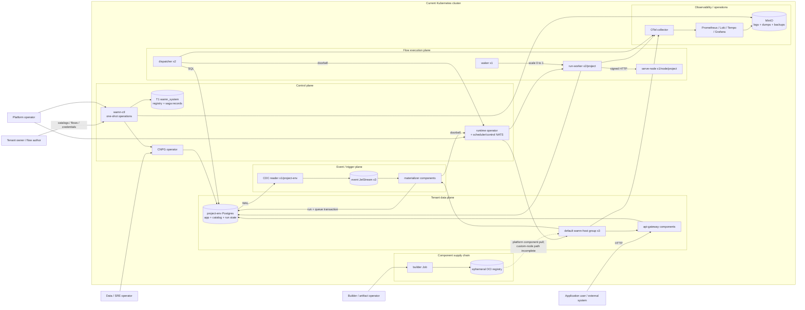
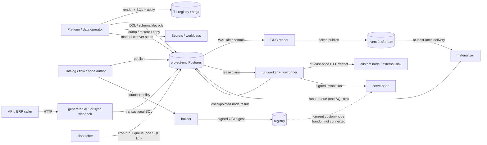

# wamn — Findings Ledger

**The single findings document.** Absorbs `review-findings.md` (R1–R9c) and
`structure-review.md` (SR1–SR7) from the repo, and **mints R10–R16, SR8–SR14,
and E1–E14 here** (from the 2026-07-18 review passes; none of those IDs existed
in the prior files). The prior ledgers fragmented the same question —
*what is open, how bad, what next* — across three files, three numbering
schemes, and three sequencing sections, requiring cross-references to be
readable. That was the problem, not the fix.

**Identifiers are preserved** (R/SR/E prefixes) so existing beads, commits, and
conversations keep resolving. They are now *sections of one ledger*, not
separate documents.

**Status rule (adopted, see R10):** *A finding closes on a commit that removes
or fixes code — never on a decision that plans to. Decisions change a finding's
**priority**; only commits change its **status**. Questions close on verified
evidence, cited to source.* Every `closed` row below carries its commit, bead,
or evidence citation.

**Sources merged:** internal architectural passes (2026-07-11 … 07-18, tips
`155ac4b` → `8f1b53d`), the pinned-fork audit (`dkkloimwieder/wasmCloud`
`d3d83f3`; `pg-walstream` `wamn/0.8.0`), and a second external static-read pass
(2026-07-18, tip `8f1b53d`).

---

## A — First-principles audit baseline (2026-07-23)

This section is the frozen input and decision rubric for
`wamn-4tob.7` (`AUDIT-B0`). It is not an architecture verdict and it closes no
finding. Later audit work may cite evidence pinned here, but a recommendation
does not alter the decision table or represent an implementation fix.

### A.1 Source and evidence snapshot

Snapshot time: **2026-07-23 07:56 EDT**.

| Evidence class | Frozen baseline | Qualification |
|---|---|---|
| Git source | local `HEAD`, local `origin/main`, and remote `refs/heads/main` all `1da2a10087ff3404f72983d139ddb5c8de07b6db`; tree `5fb399786ad2bbdee7df9871410fb7730e5e4fd0` | This commit is the tracked source baseline. |
| Dirty worktree | modified `.beads/interactions.jsonl` and `AGENTS.md`; untracked `docs/REVIEW-260723.md` | These were present before B0. They are not silently folded into the source baseline. `AGENTS.md` and the interactions log remain user-owned working state. |
| External review | `docs/REVIEW-260723.md`, SHA-256 `3fcb2d272dd2b5ea761da0aa2459a8627cd3da3405dc55b66a81652a8455dbc5` | Static review only: it says it inspected current `main`, did not compile or run the repository, and links mutable `/blob/main/` URLs rather than a commit. The exact revision seen by its author is therefore **not attestable** from the document. For this audit its claims are hypotheses against the frozen source above and receive credit only when re-checked there. |
| Root Rust workspace | 38 packages from root `cargo metadata --no-deps` | `Cargo.toml` has 38 explicit members, excludes `components`, and has no `default-members`. |
| Component workspace | 18 Rust component/fixture/sample packages from `components/Cargo.toml` | Built separately for `wasm32-wasip2`; non-Rust sample sources remain part of the repository surface even when absent from Cargo metadata. |
| Contracts | 65 `.wit` files including vendored component copies; 3 checked-in `*.schema.json` contracts | Canonical ownership and copy drift are questions for STR5/STR6, not assumptions in this count. |
| Deployment | 117 files: `platform` 22, `infra` 19, `gates` 56, `sql` 8, `poc` 9, `cred` 2, plus `deploy/README.md` | Files are inventory evidence, not proof that the same revision is deployed. |
| Design and measurements | 91 files under `docs/`: 45 top-level Markdown files, 36 ceiling-data CSVs, 4 archived Markdown files, and 6 top-level WIT/JSON contracts | `docs/README.md` is the navigation index; `docs/platform-plan.md` contains D1–D24; this file remains the sole findings ledger. |
| Beads | Dolt `main` commit `pjm30ol4ei704jlrsr4nbdgh5r5jfqs2`; 577 issues: 296 closed, 280 open, 1 in progress; 44 open audit records after B0 filed the three missing-requirement decisions | Canonicalized `bd list --all --json --limit 0` SHA-256: `440cb703eb692c3629ffb1b5c442a22cbdb2b0a570211ae198166994b6825c3b`. Beads are scope, ownership, and history evidence; a closed bead alone is not behavioral proof. |
| Live environment | kind context `kind-wamn`, cluster `wamn`, three Ready Kubernetes 1.36.1 nodes; inspected running workloads use local wamn `:dev` images | The wamn images have no source-revision label and no registry digest; Kubernetes reports kind-import content IDs only. They cannot be tied to `1da2a100…`. Live behavior is therefore **unavailable as baseline-matched evidence**, and no live audit gate may run or receive credit until source-to-artifact provenance is established. |

The reproducible inventory commands are:

```text
git rev-parse HEAD HEAD^{tree} origin/main
git ls-remote origin refs/heads/main
git status --porcelain=v1
cargo metadata --no-deps --format-version 1
cargo metadata --manifest-path components/Cargo.toml --no-deps --format-version 1
find deploy -type f
find docs -type f
find . \( -path './.git' -o -path './target' \) -prune -o \
  -type f \( -name '*.wit' -o -name '*.schema.json' \) -print
bd list --all --json --limit 0
bd vc status --json
kind get clusters; kubectl config current-context
kubectl get nodes; kubectl get pods -A
kubectl get deploy,statefulset,daemonset,job,cronjob -A
docker image inspect <wamn-image>:dev
```

### A.2 Scope and evidence rules

The audit covers the product architecture, all architectural planes and
canonical journeys, state authorities, trust and failure boundaries, service
and component placement, both Cargo workspaces, deployment/configuration/SQL
artifacts, public contracts, documentation, backlog, and the roadmap seams
named by the audit program. UI and edge features that are explicitly parked
are not current implementation debt; the architecture seams required to add
them remain in scope.

Implementation fixes, opportunistic refactors, canonical decision-table
rewrites, and a second review report are out of scope. Recommendations go into
this ledger and granular Beads records. Existing decisions are hypotheses to
classify `keep`, `amend`, `replace`, or `defer`, not constraints or sunk-cost
credit.

Evidence is ranked as follows:

1. Baseline-matched executable behavior with a named reproduction or gate and
   captured inputs/results.
2. Baseline-matched code, migrations, contracts, and generated-artifact drift
   guards that directly establish the claim.
3. Deployment manifests, runtime configuration, and operational records whose
   revision and environment are proven.
4. Canonical design/decision documents and measurement records, retaining
   their stated environment and limitations.
5. Beads history and external/static reviews as leads and rationale, never as
   sole proof of behavior.
6. Current official/primary platform sources for external capability claims;
   secondary commentary may identify a question but cannot settle it.

Every assertion is labeled **verified** (executable or direct source proof),
**observed** (inventory/current state), **measured** (reproducible result with
conditions), **claimed/hypothesis** (requires discrimination), or **unknown**
(a bead is required). Critical/high behavioral claims require a named
reproduction, discriminating test, or targeted gate. A live gate is admissible
only when its source revision, build inputs, immutable artifact identity,
deployment manifest, and observed workload identity form one provenance chain.

### A.3 Controlling fitness gates

An architecture option is eliminated, regardless of cost or delivery speed,
if it cannot credibly satisfy all of these:

| Gate | Minimum credible response |
|---|---|
| Tenant and secret isolation | Default-deny capabilities and credentials; tenant data, control-plane privilege, replication privilege, and artifact/build authority cannot cross tenant or plane boundaries through a shared role, process, broker identity, or operator convention. |
| No acknowledged-write loss or silent corruption | Each acknowledged mutation has an authoritative durable boundary, unambiguous recovery semantics, and detectable refusal; partial publish/materialization cannot silently lose, duplicate as a new logical effect, or corrupt state. |
| Deterministic, resumable flow execution | Persisted graph/version, occurrence, inputs, outcome, timers, and ordering information are sufficient to resume after interruption without depending on wall-clock timing, process memory, or a changed definition. |
| Idempotent recovery | Every retry, replay, redelivery, failover, restore, and reconciliation path has stable identity and either produces the same logical result or makes non-idempotent external effects explicit and bounded. |
| Bounded failure domains | A compromised credential/component or a failed tenant, database, broker partition, worker, migration, or operator action has an explicit containment boundary and cannot cause unbounded cross-tenant or cross-plane loss. |
| Safe schema, runtime, and deployment upgrades | Compatibility, quiescence/cutover, rollback/forward-fix, state migration, artifact provenance, and mixed-version behavior are defined; partial upgrades fail detectably and recoverably. |

Options surviving those gates are ranked, in order, by **operability,
evolvability, performance, infrastructure cost, then delivery speed**. Lower
criteria never compensate for failure of a higher criterion, and none can
rescue a correctness-gate failure.

### A.4 Scenario and journey evidence template

Every quality-attribute scenario and canonical journey uses the same record:

```text
actor / tenant / privilege:
stimulus:
environment and deployment class:
entry point and trust-boundary crossings:
authoritative state:
transaction, acknowledgement, and durability boundary:
ordering and delivery semantics:
partial-failure states and bounded blast radius:
required response and recovery owner:
measure (latency/throughput/RPO/RTO/error or isolation invariant):
baseline-matched evidence and provenance:
verdict / unknown bead:
```

Missing product targets are not guessed. Three granular owner decisions now
block ARC11's final target verdict:

- `wamn-4tob.1.12` — supported tenant and deployment cardinality envelopes.
- `wamn-4tob.1.13` — end-to-end latency, throughput, backlog, and catch-up
  service objectives.
- `wamn-4tob.1.14` — availability, durability, degradation, RPO, and RTO by
  plane and deployment class.

ARC1 may document conditional scenarios while these are open, but ARC11 cannot
present an unconditional target architecture without their resolution or an
explicit owner deferral.

### A.5 Authorization and external-review routing

Authorization is wave-specific and does not carry across a bead boundary.
Only the named issue is claimed; after it is closed, validated, committed, and
pushed, work stops until the owner authorizes the next issue or parallel wave.
Parallel evidence collection is capped by the audit plan and does not allow
parallel edits to this ledger.

The 2026-07-23 external review was routed as evidence, not accepted as a
verdict: its plane/process observations are attached to ARC2/ARC3; state,
runtime, topology, event, trust, operability, evolution, and synthesis claims
to ARC4–ARC11; and its package, deployment, hotspot, contract, drift,
build/test, and target-decomposition claims to STR1–STR7 and STR9. Corroborated
facts such as the 38-member workspace, `wamn-builder → wamn-host`, production
dependencies on `wamn-testkit`, the large `serve_node.rs` workload surface,
fork pins, and broad gate dependencies remain observations. Proposed crate
merges, package moves, process extraction, and infrastructure restraint remain
hypotheses until the owning audit task supplies dependency, co-change,
deployment, correctness, and operability evidence.

---

## B — Product forces and architecture fitness criteria (2026-07-23)

This section is the conditional requirements baseline for `wamn-4tob.1.1`
(`AUDIT-ARC1`). It asks what job the product architecture must do before judging
whether wasmCloud, native services, Postgres tiers, JetStream, or the current
repository decomposition are the right means. It reviews the frozen source from
§A; no live gate was run because §A found no source-to-running-artifact
provenance chain.

**ARC1 verdict:** the product job and its controlling correctness invariants are
clear enough to discriminate alternatives, but its supported scale, service
objectives, recovery contract, isolation/compliance contract, and upgrade
contract are not owner-set. Architecture assessments may therefore give
conditional verdicts against the scenarios below, but ARC11 must not present an
unconditional target until `wamn-4tob.1.12`–`.16` are decided or explicitly
deferred.

### B.1 Product job, actors, and trust assumptions

Wamn's documented product job is to let an organization define and promote a
versioned application catalog, expose the resulting tenant data through a
generated API, author and test flows, execute those flows synchronously or
durably from scheduled/database triggers, run sandboxed custom nodes, and
observe, copy, restore, and upgrade each project environment. The current
product is SaaS-first and HTTP/DB/webhook/cron-first; MQTT, industrial
connectors, edge execution, and on-prem/air-gapped distribution are roadmap
seams rather than shipped requirements (`docs/platform-plan.md:22-26`,
`docs/platform-plan.md:118-131`). The receiving POC is the concrete product
journey, while the newer pivot explicitly prioritizes correct flow execution
and API behavior and parks UI, auth, deep security, and IaC
(`docs/poc-material-receiving.md:1-12`, `docs/core-pivot-plan.md:7-21`).

| Actor | Authority and intended privilege boundary | Product action and current requirement status |
|---|---|---|
| Organization/project owner, platform builder, deployer, and viewer | Owns tenant definitions and deployments but not platform/T1 or another tenant. The `builder`/`admin`/`viewer`/`deployer` plane is specified, not yet a current authentication system. | Define catalogs and flows, manage credentials, run tests, and promote releases (`docs/platform-plan.md:133-141`, `docs/core-pivot-plan.md:167-173`). |
| Application user | Has an application role and server-established claims within one project environment. It must not choose its tenant identity or bypass RLS. | The POC's inspector is site-scoped and its quality manager spans sites; the app schema is substrate, not current JWT/session behavior (`docs/poc-material-receiving.md:8-20`, `docs/app-schema.md:1-7`, `docs/app-schema.md:39-54`). |
| External industrial/business system | Machine client with narrowly authorized API or callback access; v0 means ERP-like HTTP/DB integration, not native PLC protocols. | The POC ERP submits receipts and receives disposition callbacks with an API key (`docs/poc-material-receiving.md:8-9`, `docs/poc-material-receiving.md:44-50`). |
| Flow author | Chooses graph, ordering, retry, trigger, credential names, and allowed hosts, but must not mint host claims or broaden runtime grants. | Publishes immutable flow versions and expects in-flight runs to remain pinned to their version (`docs/flow-schema.md:1-15`, `docs/run-state.md:115-126`). |
| Custom-node author | Tenant code is untrusted by the intended boundary: build and execution must be credential-less and deny capabilities unless imports and policy grant them. | Author, test, sign, publish, and invoke a component. User-source ingestion, persistent registry state, and deploy-time signature verification remain incomplete (`docs/builder.md:1-36`, `docs/builder.md:194-204`). |
| Standard-node/runtime maintainer | Trusted platform-code author. Standard nodes share the flowrunner's union of capabilities; per-node restriction is logical dispatch policy, not a hostile-code sandbox. | Curates compiled-in nodes and the policy that maps each node to allowed effects (`docs/platform-plan.md:77-85`, `docs/node-library.md:111-123`). |
| Platform/control-plane operator | Privileged across T1, placement, schema/provisioning sagas, Kubernetes artifacts, and tenant database creation. T1 authority must not become a tenant request-path credential. | Provision, place, migrate, quiesce, copy, restore, cut over, and recover environments (`docs/system-cluster.md:18-29`, `docs/provisioning.md:359-371`). |
| Data-plane/SRE operator | Operates project runners/gateways, Postgres, CDC slots, JetStream, backups, and runtime forks. Replication authority can see cluster-wide WAL and is materially more privileged than an application credential. | Detect stalls, contain failures, restore service/data, and upgrade dependencies (`docs/event-plane-jetstream.md:425-466`, `docs/wash-runtime-fork.md:61-129`). A cross-plane incident RACI is not yet named. |
| Builder and artifact operator | Controls the source-to-component supply chain and registry/signing authority; this must be separate from tenant runtime credentials. | Compile, lint imports, test, attest, sign, publish, and deploy custom-node artifacts (`docs/builder.md:10-36`, `docs/builder.md:121-171`). |
| Auditor | Needs immutable, tenant-scoped evidence of acknowledged requests, run/effect outcomes, administrative actions, and recovery. No explicit auditor grant model is specified. | The POC requires an auditor to prove zero silent losses; the app schema supplies audit storage but not the reader's authorization contract (`docs/poc-material-receiving.md:44-50`, `docs/app-schema.md:72-82`). |

The labels `pooled`, `standard`, `dedicated`, and `regulated` do not themselves
establish an adversary model, compliance regime, residency promise, acceptable
operator access, secret boundary, or audit/retention policy. Those product
requirements are now owned by `wamn-4tob.1.15`; ARC6 and ARC8 must not infer
stronger isolation merely from a deployment-class name.

### B.2 Lifecycle and deployment classes

| Lifecycle stage | Required product invariant | Current authority or seam |
|---|---|---|
| Onboard and place | A stable `(org, project, env)` identity maps to exactly one intended policy and placement; retries cannot create a second authority. | T1 registry is the identity/placement source; provisioning creates the target database, role, rows, and Secret (`docs/registry-model.md:1-18`, `docs/provisioning.md:313-371`). |
| Design catalog | Draft edits are isolated from the applied application and have a stable base version. | Versioned catalog is the model source; draft is the only mutable lifecycle state (`docs/catalog-model.md:3-24`, `docs/schema-lifecycle.md:41-67`). |
| Stage, migrate, and promote | Stale-base and incompatible changes refuse; DDL and lifecycle movement are atomic; destructive promotion requires explicit evidence/authorization. | Applied catalog plus physical tenant schema; promotion remains within `(org, project)` (`docs/schema-lifecycle.md:94-126`, `docs/migration-engine.md:25-53`). |
| Publish API and flow | A request or run resolves one compatible, immutable catalog/flow contract; activation is atomic and old in-flight work remains interpretable. | Applied schema and active flow-version pointer; REST exists, while GraphQL, auth, hot reload, SDK generation, masks, and rate/cost limits are still excluded from the current gateway (`docs/api-gateway.md:107-115`). |
| Build and publish a custom node | Source is built without tenant/runtime credentials; disallowed imports or failing tests prevent publication; the invoked artifact is the reviewed artifact. | Builder pipeline, manifest, signature/SBOM, and OCI identity are the intended seams; the shipped deployment path is still partial (`docs/builder.md:10-36`, `docs/builder.md:173-204`). |
| Execute and recover a flow | Synchronous acknowledgement and asynchronous enqueue boundaries are explicit; crash, retry, park, wake, and replay use stable identities and the persisted version. | Postgres run/queue state is authoritative; NATS is a lossy hint; node effects are at least once unless the sink honors idempotency (`docs/run-queue.md:24-30`, `docs/run-state.md:87-126`). |
| Capture a database event | A committed write is not forgotten between WAL, broker, materializer, queue, and run creation; ordering and duplicate scope are explicit. | Confirmed LSN advances only after JetStream acknowledgement; deterministic run creation is narrower than exactly-once external effects (`docs/event-plane-jetstream.md:126-138`, `docs/event-plane-jetstream.md:191-229`). |
| Test, observe, audit, and replay | Evidence identifies tenant, version, node occurrence, cause, and outcome without leaking secrets; replay never disguises repeated external effects. | Test/replay is a product surface in the plan, but per-node observability, tenant isolation of logs, immutable audit export, and replay permissions remain incomplete (`docs/platform-plan.md:175-187`, `docs/run-state.md:147-179`, `docs/dashboards.md:88-106`). |
| Copy, back up, restore, and move | Quiesce, snapshot, restore, verify, and cutover are ordered and resumable; destructive restore is explicit; recovered point and audit rewind are reported. | Logical per-project dump and cluster PITR coexist; copy records durable steps, while the general compensating saga remains future work (`docs/postgres-topology.md:247-331`, `docs/provisioning.md:787-838`). |
| Upgrade | Schema, host, guest, service, WIT, event-wire, and deployment changes preserve acknowledged and persisted work or fail detectably with a recoverable prior artifact. | Subsystem lifecycle and fork gates exist, but fleet-wide mixed-version support, maintenance allowance, rollout order, and deployed artifact identity are not specified; `wamn-4tob.1.16` owns that product contract. |

The current deployment taxonomy is a design hypothesis:

| Class | Documented shape | Requirement status |
|---|---|---|
| Platform environment | One T1 HA control-plane database cluster per platform dev/staging/prod; tenant request paths should continue during T1 loss. | Specified qualitative failure boundary; numeric availability/durability is open (`docs/system-cluster.md:16-31`, `docs/system-cluster.md:47-57`). |
| Trials / T3 | Multiple organizations share the pool. | Pooled service is intended, but supported tenant count, noisy-neighbor envelope, acceptable shared privilege, and unit economics are open. |
| Standard / T2 | Organization-scoped prod/dev recovery domains; prod HA and backup-enabled, dev cheaper/hibernatable; canary may share prod. | Current placement policy, not a customer-certified SLO or isolation contract (`docs/provisioning.md:143-173`, `docs/deployment-model.md:351-367`). |
| Dedicated or regulated / T4 | Project environments, including canary, may receive their own recovery domain. | Product option is named, but regulatory controls, data residency, operator trust, RPO/RTO, and price/cardinality assumptions are not set (`docs/deployment-model.md:241-261`). |
| Edge/on-prem/air-gapped | Later distribution profile with MQTT first and OPC UA/Modbus/local HTTP at the edge. | Architectural seam only; supported topology, fleet count, offline duration, upgrade ownership, and recovery expectations remain unknown (`docs/platform-plan.md:118-131`). |

The topology note explicitly assumes organizations are few, paying, and able to
absorb instance cost (`docs/postgres-topology.md:1-20`). That is a design input,
not a product requirement. `wamn-4tob.1.12` must decide the supported
cardinalities before ARC6 or ARC11 credits either per-project deployments or the
four-tier topology for scale or cost.

### B.3 Requirements, measurements, and unsupported extrapolations

Historical gate and ceiling records are useful design evidence, but they are
not current baseline-matched behavioral proof under §A. The table preserves
workload, durability, and environment so development thresholds are not
silently promoted to product SLOs.

| Area | Recorded evidence | What it supports | What it does not support |
|---|---|---|---|
| Runtime/component substrate | S1 recorded 6.1/25.3 µs instantiate p50/p99, 46.7 MiB for 100 residents, an 80.5 ms workload start, and a trapped 256 MiB cap (`docs/p0-results.md:35-56`). | Feasibility at the measured local/in-cluster shape. | Project-fleet cardinality, cold end-to-end request latency, noisy-neighbor isolation, or production cost. |
| Postgres host path | The final durable-commit S2 record reports 13,804 qps, p99 3.59 ms; multiproject reports 14,162 qps, p99 3.06 ms, and 10,000/10,000 addressability (`docs/p0-results.md:187-198`). Security probes reported zero leakage/mismatch in their workloads (`docs/p0-results.md:200-221`). | A specific query shape, pool, and containment gate passed with `fsync` and synchronous commit enabled. | A production database durability/HA claim: the fixture is still one replica on `emptyDir` (`deploy/platform/postgres.yaml:1-3`, `deploy/platform/postgres.yaml:44-61`). Addressability is not supported active-project cardinality. |
| Reducer/resume and invocation | S3 recorded 0.83 µs dispatch p99, 428 µs worst reload, and 10/10 duplicate-absorbed resumes; S4 recorded 33/89 µs cross-pod p50/p99 (`docs/p0-results.md:291-321`, `docs/p0-results.md:378-402`). | Reducer and invocation overhead are small in the tested paths. | End-to-end durable-flow latency, failover RTO, arbitrary external-effect exactly-once, or a production workload mix. |
| Proposed dispatch SLO | D15 proposes write-ahead p99 `<15 ms`, fast path p99 `<10 ms`, async warm p50/p99 `<25/100 ms`, and async cold p99 `<250 ms` (`docs/platform-plan.md:105`). Durable re-gates recorded 6.94/6.06 ms and doorbell 6.3/9.46 ms (`docs/ceilings.md:12-20`). | The current development gates meet the proposed thresholds in their fixture. | Product sign-off, percentile windows/error budgets, payload/concurrency classes, or customer-facing SLOs. Those belong to `wamn-4tob.1.13`. |
| Queue capacity and recovery | The 60-second C7 ramp knee was about 2,000–2,500 transitions/s, but only 550/s was flat in the sustained run and 1,599/s oscillated; tenfold bursts recovered in 26–66 seconds (`docs/ceilings.md:70-127`). | A noisy, untuned saturation shape and concrete backpressure questions. | A 1–5k sustained production ceiling or SLO; C7 is explicitly measurement-only and production-grade remeasurement is deferred (`docs/ceilings.md:149-153`). |
| CDC and event path | Release C-E2E records commit-to-first-enqueue p50 around 157–184 ms and N=1/5/20 commit-to-last-run p50 166/166/185 ms; C-CDC drained narrow rows around 60k/s and wide rows around 13.4k/s (`docs/ceilings.md:513-556`, `docs/ceilings.md:587-607`). A local reader restart delivered 222/222 with a 2.17 s publish gap (`docs/ceilings.md:658-679`). | Path feasibility, payload sensitivity, and a local recovery mechanism. | Accepted event latency/catch-up SLO, a materializer ceiling, live primary-failover RTO, or slot-loss recovery. |
| Backup and restore | Policy examples use daily/six-hour/hourly logical dumps and 7/14/30-day PITR windows; an exact target-time restore was demonstrated (`docs/postgres-topology.md:253-267`, `docs/postgres-topology.md:292-314`). | Restore mechanisms and candidate tier knobs. | Contractual RPO/RTO, formal restore-drill cadence, immutable audit continuity, or named recovery ownership. |

Earlier S2 and dispatch latency figures used non-durable fixture settings and
are not comparable regressions to the durable-commit rows
(`docs/p0-results.md:5-7`, `docs/p0-results.md:167-198`). C-MAT local debug data
is a shape result rather than a ceiling, and the live CDC availability event was
not recorded (`docs/ceilings.md:357-372`, `docs/ceilings.md:658-679`). ARC1 gives
no architecture option credit for extrapolating any of these records beyond its
captured workload.

### B.4 Quality-attribute scenarios

The response measures below are the acceptance interface for later
architecture comparisons. **Required** marks a controlling invariant; cited
decision beads supply missing numeric or product boundaries and do not lower
the correctness gate while open.

| # | Actor, stimulus, and environment | Authority, boundary, and delivery semantics | Required response, blast radius, and recovery owner | Measure and evidence status |
|---|---|---|---|---|
| QA1 | A hostile or defective API client for tenant A supplies forged claims, unknown identifiers, injection values, or tenant B identifiers in pooled T3. | Tenant database plus applied catalog are authoritative; the gateway/plugin establishes claims and uses bound values; RLS is the last database boundary. | Refuse before unauthorized SQL/effect, reveal no victim existence or data, record an attributable denial, and contain impact to the caller/project. Platform security owns recovery from a boundary failure. | **Required:** zero cross-tenant reads/writes and zero claim override. Historical S2 probes are supporting evidence only (`docs/api-gateway.md:54-75`, `docs/p0-results.md:200-221`). Trust and permitted sharing: `.15`. |
| QA2 | A builder stages a destructive catalog change while another version is applied or a DDL statement fails in a live environment. | Applied catalog and tenant schema must advance in one migration transaction; staged base version controls ordering. | Refuse stale base, roll back all partial DDL/lifecycle/history, identify dependent API/flows/tests, and require destructive authorization plus backup evidence. Project operator owns correction. | **Required:** zero partial schema state and no history row for a failed migration (`docs/schema-lifecycle.md:94-126`, `docs/migration-engine.md:25-53`). Downtime/compatibility: `.16`; RPO/RTO: `.14`. |
| QA3 | An ERP client submits a synchronous write-ahead flow and a runner dies after an external effect but before checkpoint. | Run/node history and sink data are authoritative at their respective transactions; the persisted flow version and occurrence-derived idempotency key survive process loss. | Do not acknowledge before the promised durable boundary; reclaim and reconstruct on another worker; collapse an idempotent sink effect, and explicitly surface a possibly repeated non-idempotent effect. Blast radius is one run/project. | **Required:** zero acknowledged run loss or silent duplicate logical effect. POC proposes 20 receipts/zero silent loss and D15 proposes p99 `<15 ms`; neither is completed product proof (`docs/poc-material-receiving.md:44-47`, `docs/run-state.md:87-100`). Latency: `.13`; recovery: `.14`. |
| QA4 | An idle project's cron fires while its runner is at zero and the initial NATS doorbell is lost. | Postgres `runs` plus `run_queue` are atomic/authoritative; NATS is only a hint. | Reconciliation re-hints, the narrowly privileged waker scales 0→1, one worker leases and resumes the run, and unrelated projects continue. Dispatcher/data-plane operator owns a stalled backlog. | **Required:** zero lost enqueues; bounded wake/dispatch latency. Mechanism is documented (`docs/run-queue.md:47-98`, `docs/run-queue.md:582-615`); cold p99 target awaits `.13`, degraded RTO `.14`. |
| QA5 | Two runner replicas process a strict/partitioned flow whose head retries, parks, crashes, or becomes business-terminal. | Numeric stream sequence, stable ordering key, and Postgres leases govern delivery; retries share occurrence and attempt advances. | No transient head is overtaken in blocking mode; a business-terminal head dead-letters and releases atomically; crash-exhaustion remains visibly blocked until an authorized redrive/purge. | **Required:** zero per-key reorder and no concurrent lease owner (`docs/run-queue.md:149-237`). Operator authority and response time remain open under `.14`. |
| QA6 | A tenant transaction commits while JetStream is unavailable or the CDC reader restarts in standard dedicated prod. | WAL is the first committed event authority; confirmed LSN moves only after broker acknowledgement; deterministic materialization dedupes run creation. | Retain WAL, emit stall/headroom signals, retry without inventing a new logical run, and declare a capture-gap incident rather than silently recreating an invalid slot. Event/DB operator owns containment and backfill. | **Required:** zero silent committed-event gaps while the slot remains valid. Alert lead time, backlog/catch-up, failover, and gap RPO/RTO: `.13`/`.14` (`docs/event-plane-jetstream.md:126-138`, `docs/event-plane-jetstream.md:458-466`). |
| QA7 | A custom-node author submits source importing sockets/Postgres or a deployed node requests a credential/host outside its manifest and policy. | Builder artifact/manifest/signature and host-injected project/grant context form the boundary; tenant code cannot mint claims. | Reject before publish or effect, disclose no secret/existence oracle, and contain failure to the artifact/invocation. Builder/runtime security owns quarantine and revocation. | **Required:** zero unauthorized import, secret byte, DB access, or egress. Current lint/credential gates support the mechanism, while ingestion and deploy-time verification are partial (`docs/builder.md:10-36`, `docs/credential-vault.md:77-133`). Trust/rotation requirements: `.15`. |
| QA8 | A flow definition or dispatcher attempts to give standard node A a capability declared only for standard node B. | The current flowrunner owns the union of standard-node capabilities and applies logical dispatch checks. A malicious standard-node maintainer remains inside that trusted component boundary. | Under the present trust hypothesis, the double checks refuse the misdispatch; if standard-node authors/code are adversarial, the architecture must instead create a structural boundary. | **Required:** zero disallowed dispatch from untrusted flow input. Whether logical containment is acceptable by class is an owner decision in `.15` (`docs/platform-plan.md:81-85`, `docs/node-library.md:111-123`). |
| QA9 | T1 loses its primary or becomes unavailable while existing tenant APIs and flows are active. | T1 is authoritative for control-plane identity/saga state but excluded from tenant request paths; tenant databases/run state remain authoritative for live work. | Existing data-plane requests continue; provisioning, placement, and promotion fail closed/pause; acknowledged T1 mutations are either present after failover or a durability violation is declared and reconciled. Platform control-plane operator owns recovery. | **Required:** no tenant request-path dependency and no silent acknowledged registry loss. The qualitative boundary is specified; async-replication durability, availability, RPO, and RTO are `.14` (`docs/system-cluster.md:47-85`). |
| QA10 | An operator restores/copies a corrupted project environment in trials, standard, or dedicated service. | Backup artifact/PITR point, source registry identity, and durable copy saga steps govern restore and cutover. | Restore to scratch by default; require explicit in-place confirmation; quiesce→snapshot→restore→verify→cutover; report recovered point, missing interval, and audit rewind; never append stale rows. DB/control-plane operator owns the operation. | **Required:** verified data/identity integrity and no unannounced loss. Existing gates prove mechanisms; cadence, RPO/RTO, audit retention, and owner authority are `.14`/`.15` (`docs/provisioning.md:699-785`, `docs/postgres-topology.md:325-331`). |
| QA11 | Offered API, queue, or CDC load exceeds the supported sustained/burst envelope or a tenant creates a runaway backlog. | Each authoritative store must expose accepted work, backlog, age, and progress; lossy hints cannot become the authority. | Apply bounded backpressure or fail explicitly, preserve acknowledged work, contain noisy-neighbor impact to the promised class, alert before WAL/lease/retention safety is exhausted, and catch up within the contract. | **Required:** zero silent loss plus owner-set backlog age, drain time, throughput, and blast radius. C7/C-CDC only supply candidate shapes; `.12`–`.14` own the product envelope. |
| QA12 | Old and new host/guest/service/WIT/event-wire/SQL versions coexist or a rollout fails with active, parked, and scheduled runs. | Immutable artifact identity, persisted flow/catalog/event versions, and migration state must determine compatibility and rollback/forward-fix. | Detect incompatibility before destructive replacement, keep compatible old capacity or quiesce explicitly, preserve acknowledged/persisted work, and select a proven prior artifact or recover forward. Release/platform operator owns rollout. | **Required:** zero silent state reinterpretation or acknowledged-work loss. Subsystem pins/gates exist, but the mixed-version and maintenance contract is `.16`, with numeric outage/recovery in `.14` (`docs/wash-runtime-fork.md:61-129`, `docs/migration-engine.md:122-130`). |
| QA13 | A component, operator credential, broker identity, replication role, observability store, or cluster is compromised in a regulated/dedicated environment. | Product-defined trust zones, credential scopes, encryption/residency controls, and audit authorities—not tier names—must bound access. | Prevent cross-tenant/plane escalation; revoke and rotate within a defined interval; preserve/produce tamper-evident evidence; notify affected tenants; contain recovery to the promised domain. | **Required:** zero access outside the declared domain and an explicit maximum blast radius. The baseline has no certified regulated contract; `.15` owns it and `.14` owns recovery time. |

### B.5 How these criteria discriminate alternatives

Later architecture work must apply these rules before considering sunk cost or
delivery speed:

| Question | Eliminate an alternative when... | Primary downstream comparison |
|---|---|---|
| State authority and acknowledgement | A request can be acknowledged before its authoritative state is durable, or two authorities can diverge without an atomic handoff, stable identity, reconciliation, and visible gap. | Current distributed state vs Postgres-centered vs log-centered vs durable-workflow ownership (ARC4/ARC7). |
| Flow durability and determinism | Resume depends on process memory, current rather than persisted definitions, wall-clock coincidence, or unbounded duplicate external effects. | Custom runner vs a durable-workflow engine; native vs component execution (ARC4/ARC5). |
| Tenant, secret, artifact, and operator isolation | Default deny depends only on naming/list conventions, a shared credential crosses the accepted threat boundary, or a compromised component exceeds the deployment class's promised blast radius. | Pooled/per-org/per-env topology, runtime sandbox role, builder supply chain, and broker/account layout (ARC5/ARC6/ARC8). |
| Event/log necessity | A broker adds an acknowledged state authority without a required replay/ordering/fan-out property, or a queue-only alternative cannot meet a stated event-log requirement. | CDC→JetStream vs outbox/direct Postgres/log/workflow alternatives (ARC7). |
| Failure containment and recovery | A single tenant, slot, broker, primary, rollout, or operator mistake can create unbounded cross-tenant loss, or recovery requires undocumented expert repair beyond `.14`. | Topology, event plane, service placement, backup, and day-two design (ARC6/ARC7/ARC9). |
| Scale and operability | Per-project/per-environment objects, pools, subscriptions, metrics, cold starts, or upgrades cannot fit `.12` and `.13`, or the on-call burden violates `.14`. | Runtime deployment unit, Postgres tiering, and scale-to-zero claims (ARC5/ARC6/ARC9). |
| Evolution and upgrades | There is no compatible path for the version combinations, in-flight work, maintenance posture, rollback provenance, and state migration required by `.16`. | Runtime/fork role, contracts, roadmap seams, and target migration order (ARC5/ARC9/ARC10/STR5). |

These tests deliberately do not assume that wasmCloud is the platform, that
JetStream is necessary, that four Postgres tiers are correct, or that durable
orchestration should remain custom. They also prevent a cheaper/faster option
from surviving a correctness-gate failure.

### B.6 External review: accepted feedback, corrections, and routing

`docs/REVIEW-260723.md` is a static review that did not build or run the system
(`docs/REVIEW-260723.md:9-11`). ARC1 therefore used it as a hypothesis source:

- **Corroborated and adopted as an ARC1 requirement question:** the current
  event path can provide deterministic exactly-once *run-row creation* while
  node execution and nontransactional external effects remain at least once
  unless the sink honors idempotency. The review's narrower wording
  (`docs/REVIEW-260723.md:334-369`) agrees with the canonical state/event
  contracts (`docs/event-plane-jetstream.md:191-229`,
  `docs/run-state.md:87-113`). Later work must not market or reason from a
  broader end-to-end exactly-once claim.
- **Corroborated as unproven, not accepted as a negative verdict:** per-project
  workloads are not yet shown to be “nearly free” after CRDs, routes, secrets,
  pools, subscriptions, telemetry, reconciliation, cold starts, and upgrade
  fan-out. The proposed 100/1,000/10,000 campaign
  (`docs/REVIEW-260723.md:373-399`) is a useful input to `.12`; it is not a
  product scale requirement or completed measurement.
- **Corroborated and made explicit in QA8:** standard-node isolation is logical
  within a trusted component, unlike the custom-node sandbox
  (`docs/REVIEW-260723.md:403-415`). This is not a newly proven exploit; `.15`
  must decide whether that trust boundary is acceptable for each deployment
  class.
- **Correct direction, stale detail:** the two pinned forks are product
  subsystems with upgrade/on-call cost, but D23 already accepts runtime-fork
  maintainer status and the current wash-runtime ledger carries six rather than
  the review's five commits (`docs/REVIEW-260723.md:314-330`,
  `docs/wash-runtime-fork.md:120-140`). ARC5/ARC9 must compare that continuing
  cost; ARC1 does not reopen it solely from patch count.
- **Useful product-boundary observation:** the review argues that `testkit` and
  `flow-tests` may implement a customer-facing test/replay product rather than
  mere repository support (`docs/REVIEW-260723.md:216-241`). The platform plan
  independently specifies stored suites, replay, assertions, publish gates, and
  schema-impact analysis as product capabilities
  (`docs/platform-plan.md:175-187`). ARC1 therefore includes that lifecycle,
  while STR2/STR3/STR9 must decide its code and deployment ownership.
- **Retained only as later hypotheses:** “over-designed,” freeze-infrastructure,
  crate merges, process extraction, and broker/runtime replacement are
  architecture/structure verdicts rather than product forces. They remain
  routed to ARC4–ARC11 and STR1–STR9 and receive no ARC1 credit without the
  relevant state, dependency, failure-domain, and operability comparison
  (`docs/REVIEW-260723.md:5-11`, `docs/REVIEW-260723.md:516-518`).

The review also helped expose current-document drift that later tasks must not
mistake for product requirements: `platform-plan.md` still mentions dispatcher
outbox polling although D19 retired it (`docs/platform-plan.md:87`,
`docs/platform-plan.md:200-215`), and its REST+GraphQL target is wider than the
current REST-only gateway (`docs/platform-plan.md:63-73`,
`docs/api-gateway.md:107-115`). ARC2/ARC3 must model what runs now; ARC10/STR8
must distinguish roadmap intent from stale wording.

### B.7 Owner decisions and ARC1 hand-off

| Bead | Missing owner requirement | Why it blocks an unconditional target |
|---|---|---|
| `wamn-4tob.1.12` | Supported organizations, projects, environments, active workloads, regional/edge installations, and other cardinality envelopes by deployment class. | Current 10,000-project addressability and small benchmark shapes do not establish supported production scale or unit economics. |
| `wamn-4tob.1.13` | End-to-end latency, sustained/burst throughput, backlog, catch-up, backpressure, payload, percentile, and error-budget objectives. | Development gates and measurement knees cannot be ranked as customer SLOs. |
| `wamn-4tob.1.14` | Availability, acknowledged-write durability, degraded modes, RPO, RTO, manual-repair allowance, and recovery owner by plane/class. | Existing HA labels, backup cadences, and local recovery drills do not define a product recovery contract. |
| `wamn-4tob.1.15` | Adversary/trust model; permitted shared privilege and data boundaries; regulatory, residency, audit, retention, erasure, and operator-access promises. | `regulated` and `dedicated` are topology labels until the promised isolation outcome is stated. |
| `wamn-4tob.1.16` | Maintenance/degradation allowance, mixed-version support, rollout/rollback/forward-fix semantics, and artifact provenance across schemas, runtimes, contracts, and services. | Subsystem upgrade mechanisms do not define how the product preserves active and persisted work during a platform release. |

Technology choices already deferred in the roadmap—Timescale versus a separate
TSDB, hosted versus customer MQTT, and payload-store backend—are not additional
ARC1 requirement decisions. ARC7/ARC10 should evaluate them after `.12`–`.16`
bound the use case. Incident RACI and CDC-gap recovery are part of `.14`;
credential scope and rotation are part of `.15`; numeric upgrade outage is
shared by `.14` while compatibility semantics belong to `.16`.

ARC1 closes no implementation finding and ratifies no foundational decision.
It supplies actors, lifecycle, evidence classes, discriminating scenarios, and
explicit owner unknowns for the current-state and alternatives waves.

---

## C — Current system context and plane model (2026-07-23)

This section records the current architecture for `wamn-4tob.1.2`
(`AUDIT-ARC2`). It describes the source and desired deployments at
`ffdbd1e0b2ce6d1c7d1faca23d9efbfe48cebfee`; it is not evidence that those
artifacts are live. Section A's provenance restriction still applies.

**ARC2 verdict:** the control database and event broker are structurally
separate from tenant databases and scheduler NATS, and the native worker,
dispatcher, reader, waker, and node-host are separate processes. The seven
named planes are nevertheless **not seven trust or failure zones**. API and
materializer components share one host group and its plugins; nearly all
workloads share one namespace and cluster operators; several services reuse
broad database or broker identities; observability and recovery share an
object store; and human cluster administration crosses every plane. Later
alternatives must evaluate these real boundaries, not the plane labels.

### C.1 Current system context



The concrete runtime boundary is more important than the box containing it:
the API gateway and materializer are distinct component stores in the same
three host processes, while the runner directly embeds `flowrunner.wasm` in a
native image and the custom-node host is a separate Deployment using the
general `wamn-host` binary (`deploy/infra/values-wamn.yaml:14-50`,
`Dockerfile:57-66`, `deploy/platform/serve-node.yaml:79-138`).

### C.2 Plane ownership and boundary matrix

| Plane | Owner and authoritative state | Privileged identities | Runtime and deployment units | Scale / failure boundary | Cross-plane protocols |
|---|---|---|---|---|---|
| **Control** | Platform operator; T1 `wamn_system` is authoritative for the identity triple, placement, policies, CDC registrations, saga and dump metadata. It expressly excludes tenant data and request-path reads (`docs/system-cluster.md:16-57`, `docs/registry-model.md:1-48`). | T1 superuser or control role, Kubernetes/CNPG operator authority, and authority to render tenant roles and Secrets (`deploy/platform/wamn-sysdb.yaml:1-74`, `docs/provisioning.md:313-371`). | `wamn-ctl`, `wamn-registry`, `wamn-provision`, `wamn-migrate`; a three-instance T1 CNPG cluster. There is no current long-lived product control API (`crates/wamn-ctl/src/main.rs:32-98`). | T1 is a separate database cluster, but shares the Kubernetes environment and cluster-wide CNPG operator with tenant storage. Operations are CLI/render/apply driven. | T1 SQL; rendered Kubernetes CRs/Secrets; tenant SQL; object storage; readers select registrations from T1. |
| **Tenant data** | Data/SRE operator; each project-env PostgreSQL database is authoritative for generated entity data, applied catalog/serving snapshot, flow definitions, runs, node history, and queue rows (`docs/platform-plan.md:41-50`, `docs/run-state.md:18-57`). | `wamn_app` is `NOBYPASSRLS` but is a cluster-global role reused across rendered databases; pooled environments can therefore share principal and cluster blast radius (`crates/wamn-provision/src/database.rs:27-78`, `crates/wamn-provision/src/sql.rs:25-41`). | API-gateway component plus `wamn:postgres`; project-env databases rendered into pooled, per-org, or dedicated CNPG placement. | T1/data separation is physical. Within a project-env, app, catalog, run, and materialization state share one database. Pooled orgs share a cluster; schema/RLS separation is logical. | Incoming HTTP to WIT Postgres; SQL from gateway, worker, dispatcher, materializer, and control operations; WAL exits to the event plane. |
| **Flow execution** | Flow author plus runtime/data operator; Postgres `runs`, `node_runs`, `run_queue`, and persisted flow version are authoritative. External effects are at least once unless their sink honors the stable occurrence key (`docs/run-state.md:18-100`, `docs/run-state.md:115-126`). | Per-project DB and credential Secrets, optional invocation-signing key, and the shared broad runtime-NATS certificate (`deploy/platform/runner.yaml:40-44`, `deploy/platform/runner.yaml:89-106`, `deploy/platform/runner.yaml:118-186`). | Native `wamn-run-worker` with embedded `flowrunner.wasm`; two replicas per project. Custom nodes use separate `wamn-host serve-node` Deployments (`deploy/platform/runner.yaml:13-30`, `deploy/platform/serve-node.yaml:43-152`). | Queue leases and `SKIP LOCKED` bound a worker crash to leased work. Standard nodes share one component and a union capability set, so their separation is logical policy; custom-node execution is a separate workload (`docs/platform-plan.md:77-85`, `docs/node-library.md:111-123`). | Postgres queue, scheduler-NATS doorbells, WIT Postgres/HTTP/credential capabilities, signed in-cluster HTTP to custom nodes. |
| **Event / trigger** | Data/SRE operator; WAL and confirmed LSN own capture, JetStream owns durable delivery/replay, and the deterministic run-plus-queue transaction owns execution handoff (`docs/event-plane-jetstream.md:67-79`, `docs/event-plane-jetstream.md:181-229`). | Per-env replication and T1-read credentials; a current unauthenticated single event-NATS account; materializer host plugins also carry DB and scheduler-NATS authority (`deploy/platform/event-reader.example.yaml:17-44`, `deploy/infra/nats-jetstream.yaml:15-19`). | Native reader, three-node event JetStream, materializer Service component, native cron dispatcher, and native waker. | Current reader shape is one `Recreate` Deployment and slot session per project-env; the D22 lease-sharded fleet is target state, not current code. Materializers are per project-env/tenant but share the default host group (`deploy/platform/event-reader.example.yaml:1-15`, `deploy/platform/materializer.example.yaml:26-78`). | WAL to reader to event JetStream to materializer to Postgres queue to separate scheduler-NATS doorbell. Cron starts at dispatcher and bypasses the event log. |
| **Component build / supply chain** | Builder/artifact operator; intended authority is source, dependency/import policy, tested bytes, signed digest/SBOM, and OCI manifest. That chain does not yet reach the invoked custom-node bytes (`docs/builder.md:10-36`, `docs/builder.md:121-204`). | Builder signing key and registry write authority; the Job has no service-account token. Signing is optional if no key is supplied (`deploy/platform/builder-job.yaml:1-20`, `deploy/platform/builder-signing-key.yaml:1-25`). | One bounded `wamn-builder` Job, a separate component workspace, and a single plain-HTTP `registry:2` Deployment (`Cargo.toml:1-5`, `components/Cargo.toml:1-6`, `Dockerfile:136-168`). | Job resource/deadline boundaries exist, but its NetworkPolicy is explicitly inert in kind. Registry storage is `emptyDir`, so one pod restart loses the artifacts (`deploy/platform/builder-netpol.yaml:1-14`, `deploy/platform/registry.yaml:18-61`). | Source/toolchain to Wasm to signature/SBOM to OCI; current serve-node manifest instead permits ConfigMap-mounted bytes. |
| **Observability** | Data/SRE operator; process telemetry is exported through OTel to shared Prometheus, Loki, and Tempo stores. Execution truth remains in the source databases/queues, not dashboards (`docs/metrics.md:11-26`, `docs/metrics.md:77-98`). | Grafana admin Secret and a shared MinIO root credential used by Loki and operational storage consumers (`deploy/infra/grafana.yaml:1-37`, `deploy/infra/minio.yaml:1-35`). | Singleton OTel collector, Prometheus, Loki, Tempo, Grafana, and MinIO deployments (`deploy/infra/otel-collector.yaml:81-124`, `deploy/infra/loki.yaml:97-145`, `deploy/infra/tempo.yaml:46-92`). | Sinks are a shared cross-tenant failure and disclosure domain. Prometheus and Tempo use `emptyDir`; Loki is single-replica and uses shared MinIO. Tenant labels are filters, not structural isolation (`docs/dashboards.md:88-106`, `docs/dashboards.md:162-172`). | All instrumented planes to OTel; collector to shared stores; Grafana queries those stores; Loki and recovery data converge on MinIO. |
| **Operational** | Platform and data/SRE operators; Kubernetes desired/current objects, CNPG state, T1 saga records, and backup artifacts each own part of operations. Incident RACI and release authority are unresolved (`docs/findings.md:386-401`). | Human cluster-admin/Helm/kubectl authority, cluster-wide CNPG controller, T1 privilege, object-store credentials, and the waker's narrow namespace `deployments/scale` grant (`deploy/platform/waker.yaml:20-53`). | Runtime-operator chart, CNPG operator, `wamn-ctl`, waker, reconciliation Jobs/CronJobs, and backup/copy/restore runbooks. | Nearly every workload shares the cluster and `wamn-system`; CNPG's controller is in `cnpg-system` with cluster-wide authority. Operators intentionally bridge all other planes. | Kubernetes API/CRDs, Helm, SQL, NATS, OCI, object storage, and manual runbooks. |

### C.3 Structural separation versus shared authority

| Resource | What is actually separated | What remains shared and why it matters |
|---|---|---|
| **Processes** | Worker, dispatcher, reader, waker, builder, and node-host are separate OS processes. | Gateway and materializer stores share each host process and its Postgres, JetStream, logging, and node-control plugins (`crates/wamn-host/src/host.rs:102-164`). A host/plugin failure crosses the named API and event planes. |
| **Databases** | T1 has its own CNPG cluster; dedicated placement can isolate tenant recovery. | A project-env's app/catalog/run state shares one database, and pooled tenants share a cluster. The global `wamn_app` role and replication visibility are already tracked by `wamn-286` and R28/`wamn-2jkm.46`. |
| **Brokers** | Event JetStream is separate from runtime/scheduler NATS (`deploy/infra/nats-jetstream.yaml:1-19`). | Dispatcher, runner, waker, and host group reuse one allow-all runtime certificate; event NATS has one global account. Materializer bridges both inside a shared host. Existing seams are `wamn-ngb` and `wamn-4xw`. |
| **Kubernetes** | CNPG's operator namespace is separate and the waker has a deliberately narrow ServiceAccount. | Platform and tenant workloads otherwise share `wamn-system`; runtime and CNPG operators and human admins cross planes. The plan's namespace-per-tenant wording is not current manifest reality (`docs/platform-plan.md:22-25`). |
| **Images and forks** | Native services have distinct Docker targets. | `wamn-host:dev` is both shared runtime and custom-node host; the runtime fork is a common upgrade dependency across host, worker, builder conformance, and gates (`Cargo.toml:12-28`, `Dockerfile:34-168`). |
| **Object storage** | Buckets distinguish logs, dumps, and backups. | One MinIO service and root credential join observability and recovery into one outage/credential domain (`deploy/infra/minio.yaml:1-35`, `deploy/infra/minio.yaml:98-134`). |

### C.4 Current, target, and unknown must not be conflated

- The current CDC reader accepts one `(org, project, env)` and the manifest is
  one replica with no lease. D22's multi-tenant lease-sharded fleet remains a
  target; `.33`/`.34` are not present as executable fleet behavior
  (`crates/wamn-cdc-reader/src/lib.rs:86-157`,
  `deploy/platform/event-reader.example.yaml:1-34`).
- Run-worker is a native Deployment today. Its proposed wasmCloud `Service`
  placement is future work (`deploy/platform/runner.yaml:45-68`,
  `docs/findings.md:1011-1051`).
- Per-org event-NATS accounts, builder source ingestion, an enforcing build
  CNI, persistent registry storage, custom-node OCI fetch, and deploy-time
  signature verification are filed seams, not current guarantees
  (`deploy/infra/nats-jetstream.yaml:15-19`, `docs/builder.md:194-209`).
- The runtime-operator chart is remote rather than rendered or vendored here.
  Its exact ServiceAccounts, RBAC, NATS subject permissions, scheduling, and
  telemetry injection are therefore unknown from repository evidence
  (`deploy/infra/values-wamn.yaml:1-7`).
- Named incident ownership, recovery authority, trust promises, upgrade
  compatibility, supported scale, and SLOs remain the owner decisions in
  `wamn-4tob.1.12`–`.16`; no plane label answers them.

The external review's broad process map is therefore useful but incomplete.
Its event sketch correctly identifies the WAL-to-run chain, but collapses the
separate event and scheduler brokers and misses their materializer/host bridge
(`docs/REVIEW-260723.md:334-369`). Its node-host observation is confirmed by
deployment rather than accepted from package size
(`docs/REVIEW-260723.md:179-215`, `deploy/platform/serve-node.yaml:43-138`).
Its “per-project nearly free” challenge remains an unproven scale hypothesis,
owned by `.12`/`.13`, rather than either a fact or a refutation
(`docs/REVIEW-260723.md:373-399`).

ARC2 adds no duplicate security or topology finding: the shared database,
replication, broker, builder, and ownership gaps already have the Beads owners
named above or the ARC1 decision beads. ARC4–ARC9 must use this matrix to judge
whether each shared authority is compatible with the promised deployment
class; STR1 supplies the physical repository/deployable ownership map.

---

## D — End-to-end capability journeys (2026-07-23)

This section records `wamn-4tob.1.3` (`AUDIT-ARC3`) against source baseline
`ffdbd1e0b2ce6d1c7d1faca23d9efbfe48cebfee`. The paths below are static,
baseline-matched code/contract evidence. Historical live results are not
credited as behavior for this baseline because §A cannot tie the running
mutable `:dev` artifacts to the reviewed source.

**ARC3 verdict:** the asynchronous Postgres queue and CDC-to-materialization
path have the clearest authorities, stable identities, and recovery mechanics.
Provisioning, catalog publication, synchronous delivery, replay, custom-node
provenance, copy/cutover, and in-place restore are partial journeys composed
from useful primitives without one durable completion owner. Source inspection
establishes the failure windows below; the high-impact behavioral consequences
remain explicitly gated by `wamn-4tob.6.1`–`.7`.

### D.1 Journey boundary map



The solid event path does not imply end-to-end exactly once. WAL confirmation,
JetStream acknowledgement, run creation, queue claim, node checkpoint, and an
external sink are distinct durability/acknowledgement boundaries.

### D.2 Canonical journey matrix

| Journey | Actor, trust crossings, authority, and acknowledgement | Delivery, partial failure, recovery owner, and proof signals | Current verdict |
|---|---|---|---|
| **Provision org / project / environment** | A platform operator crosses T1-superuser, target-Postgres, Kubernetes, and Secret boundaries. `provision-org` records org/policies atomically and separately renders cluster objects. `provision-project-env` renders Database/role/privilege/Secret artifacts, then records registry intent (`crates/wamn-ctl/src/provision_org.rs:148-167`, `crates/wamn-ctl/src/provision_org.rs:223-245`, `crates/wamn-ctl/src/provision_project_env.rs:162-203`). T1 is the identity/placement authority, not proof of a ready database. | Project and project-env are two autocommit statements; emitted external resources have no durable step receipt or readiness reconciliation (`crates/wamn-ctl/src/provision_project_env.rs:290-321`). A crash can leave a project without its env or a resolvable env whose DB/role/Secret does not exist. The human operator is the only current recovery owner; required signals are step state, resource identity, readiness, and reconciliation result. | **Partial primitive, not a convergent journey.** Source-verified windows are R34/`wamn-2jkm.70`; crash proof is `wamn-4tob.6.1`; the durable orchestration owner remains `wamn-2ib`. |
| **Define, stage, migrate, and publish catalog** | The versioned catalog is the design authority; draft/staged/applied lifecycle and stale-base refusal are explicit (`docs/catalog-model.md:3-24`, `docs/schema-lifecycle.md:41-67`). Migration locks and commits DDL, lifecycle/history, and entity-map changes in one database transaction (`crates/wamn-ctl/src/migrate_catalog.rs:342-395`). The gateway instead reads the separate `wamn_catalog` serving snapshot. | `publish-catalog` performs setup, optional floor/run-state/seed/flow changes, then commits a snapshot `DELETE` and `INSERT` separately before entity-map and replica-identity reconciliation (`crates/wamn-ctl/src/publish_catalog.rs:149-301`). A crash can expose no snapshot or a snapshot ahead of mandatory follow-on state. Required proof compares applied catalog, physical schema, snapshot version, cache, entity map, and RI at every crash point. | **Migration core is coherent; publication is split-authority and non-atomic.** R35/`wamn-2jkm.71`; behavioral matrix `wamn-4tob.6.2`. Gateway invalidation remains `wamn-32n`, not a substitute for atomic publication. |
| **Serve generated API request** | An untrusted HTTP caller crosses Wasm to the host-owned `wamn:postgres` capability. Request identifiers/values are compiled to parameterized SQL; host-injected tenant claims and RLS bind the transaction, and mutation success returns after commit (`docs/api-gateway.md:54-75`, `crates/wamn-host/src/plugins/wamn_postgres/claims.rs:643-763`). The project DB and serving snapshot are the authorities. | The component memoizes its catalog once, so a new publish is not observed until instance restart; relation expansions are additional reads after the primary query (`components/api-gateway/src/lib.rs:50-62`, `components/api-gateway/src/lib.rs:103-220`). Authentication, masks, GraphQL, hot reload, and rate/cost controls are explicitly outside the current gateway (`docs/api-gateway.md:107-115`). SQL errors are request-visible; schema/snapshot mismatch lacks a version signal. | **REST CRUD primitive shipped, not an authenticated/hot-reloaded fleet API.** Missing roadmap features are not reminted as defects. R35 is the cross-journey correctness risk; `wamn-32n` owns reload. |
| **Start and complete a synchronous flow** | The concrete path is the F1 POC webhook: an ERP caller crosses HTTP to a tenant component, which reloads the active flow, writes a run before effects, marks it running, drives nodes, persists terminal state, and then answers (`components/poc-webhook-f1/src/lib.rs:67-140`). Each run-state call is a separate Postgres capability transaction. | Each POST mints a new server run ID and accepts no stable delivery identity. A host death can leave an unqueued run in `dispatched`/`running`; queue reconciliation cannot see it. Client retry creates a new run and may repeat an effect (`docs/poc-f1.md:158-170`). Recovery is currently delegated to a caller retry with no ownership of the orphan. Signals required: delivery key, run lineage/state, effect key/count, deadline, sweeper outcome, and HTTP retry result. | **POC-specific write-ahead path; deterministic recovery is incomplete.** R36/`wamn-2jkm.72` (delivery identity), R37/`.73` (orphan owner), combined proof `wamn-4tob.6.3`. |
| **Schedule, park, wake, resume, retry, and replay** | Dispatcher/worker identities operate on project DB state. `runs` plus `run_queue` are atomic authority; NATS is only a hint. Deterministic cron IDs/anchors, leases, `SKIP LOCKED`, re-hints, lease expiry, and transactional completion/dead-letter transitions support recovery (`docs/run-queue.md:24-98`, `docs/run-queue.md:191-315`, `docs/run-queue.md:432-616`). Resume loads the persisted flow version and retry state (`components/flowrunner/src/lib.rs:1318-1447`). | Node/effect execution is at least once: death after effect and before checkpoint re-executes it, so the sink must honor the occurrence idempotency key (`docs/run-state.md:87-100`). A crash-exhausted blocking head deliberately waits for authorized redrive (`wamn-umt4`). Replay/partial-rerun exists only as a pure planner with no production effect-shell caller (`crates/wamn-run-store/src/rerun.rs:1-13`, `crates/wamn-run-store/src/rerun.rs:83-133`). | **Async queue/park/wake/resume is the strongest execution path; replay is model-only.** R39/`wamn-2jkm.69`; latency/recovery objectives remain `.13`/`.14`. |
| **Database commit to CDC/event to run** | The tenant transaction commits to WAL first. Reader publication is transaction-framed; it waits for broker acknowledgements before advancing confirmed/applied LSN (`crates/wamn-cdc-reader/src/lib.rs:739-794`, `crates/wamn-cdc-reader/src/lib.rs:839-939`). JetStream is durable delivery authority. Materializer inserts deterministic run plus queue row in one transaction; only the insert winner enqueues (`components/materializer/src/main.rs:340-388`). | Reader/broker and broker/materializer delivery are at least once; deterministic run-row creation is exactly once for the `(flow,event)` identity. Fire failures NACK; a lost post-commit doorbell only delays. Deterministic refusals and malformed messages instead ACK/TERM after process-local counters/stderr and an optional local report (`components/materializer/src/main.rs:427-550`). Recovery owners are DB/event operators for slot/gap incidents and materializer operators for refusal/backlog; required signals include LSN, stream sequence, consumer state, registration, run ID, and durable refusal reason. | **Composed and resumable through run creation, not end-to-end exactly once.** Durable refusal provenance is R38/`wamn-2jkm.74`; proof `wamn-4tob.6.4`; slot-gap objectives remain `.14` and `wamn-l5i9.35`. |
| **Build, sign, publish, deploy, and invoke custom node** | Builder/artifact operator crosses source/toolchain, signing, OCI, deployment, then runtime grant boundaries. Intended authority is reviewed source → tested bytes → digest/signature/SBOM/manifest → OCI. Runner emits a stable per-occurrence signed invocation and host-injected grants (`docs/builder.md:1-55`, `docs/builder.md:121-171`, `components/flowrunner/src/lib.rs:606-697`). | Current ingestion is a baked fixture; the emitted serve-node path mounts component bytes from a ConfigMap and does not fetch/verify the OCI artifact. Host signing is optional and invocation can fall back to network trust (`docs/builder.md:173-209`, `deploy/platform/serve-node.yaml:43-138`, `crates/wamn-host/src/serve_node.rs:109-160`). A reviewed artifact and invoked artifact can therefore diverge. Required proof records every digest and substitutes bytes at each mutable handoff. | **Build/publish and invocation are useful but disconnected primitives.** R43 maps to existing `wamn-fqg.23` plus `wamn-0si.9`; no duplicate remediation bead. End-to-end proof is `wamn-4tob.6.7`. |
| **Copy, back up, restore, and upgrade environment** | DB/control operators own dump/PITR artifacts, T1 metadata, superuser restore, serving cutover, and release artifacts. Scratch restore is the default; copy quiesces the source and stages snapshot/restore/verification (`crates/wamn-ctl/src/restore_project_env.rs:260-314`, `crates/wamn-ctl/src/copy_project_env.rs:357-408`, `crates/wamn-ctl/src/copy_project_env.rs:892-1038`). | Copy external effects and saga advancement are separate; restart does not resume from durable per-step receipts. `exec_cutover` prints repoint instructions and succeeds, so the saga can complete before serving identity changes (`crates/wamn-ctl/src/copy_project_env.rs:268-343`, `crates/wamn-ctl/src/copy_project_env.rs:1041-1053`). In-place restore runs `pg_restore --clean` against the live DB after only a confirmation flag, without traffic fencing or post-restore verification (`crates/wamn-ctl/src/restore_project_env.rs:290-324`). Fleet mixed-version upgrade is still `.16`. | **Backup/copy/restore primitives exist; resumable cutover and safe destructive recovery do not.** R40/`wamn-2jkm.75`, R41/`.76`, proof `wamn-4tob.6.5`; orchestration coordinates with `wamn-2ib`. |

Runner rollout is a cross-cutting failure in the execution journey: there is
no readiness probe, while the worker treats drain/DB failure as nonfatal.
Kubernetes therefore marks the running container Ready and, after
`minReadySeconds`, can replace healthy capacity despite the manifest comment
claiming the opposite (`deploy/platform/runner.yaml:32-61`,
`crates/wamn-run-worker/src/lib.rs:591-648`). This is R42/`wamn-2jkm.77`;
the discriminating bad-database rollout is `wamn-4tob.6.6`.

### D.3 Delivery and “exactly once” precision

| Boundary | Stable identity / authority | Honest guarantee |
|---|---|---|
| Tenant DB commit → WAL | PostgreSQL transaction and LSN | One committed database history, subject to the product RPO contract. |
| WAL → event JetStream | transaction framing, stream subject, `Nats-Msg-Id`, confirmed LSN after ACK | At least once across reconnect/failover; no silent slot recreation. |
| Event → run/queue | deterministic `(flow,event)` run ID plus transactional run/queue insert | Exactly-once **run-row creation** for that identity; broker delivery remains at least once. |
| Queue → worker | queue row, numeric stream sequence, lease owner/expiry, occurrence | At-least-once claim/execution with deterministic resume and ordering policy. |
| Node checkpoint | `(run,node,occurrence)` history and idempotency key | Retry of one occurrence has a stable key; death before checkpoint can repeat the effect. |
| External sink | sink transaction and its enforcement of the supplied key | Exactly once only when the sink durably deduplicates; otherwise at least once or indeterminate after timeout. |
| Synchronous client retry | no current delivery key | A new run/effect attempt today; R36 is required before calling this a retry of one logical request. |

This accepts the external review's correction that deterministic materialization
must not be advertised as end-to-end exactly once
(`docs/REVIEW-260723.md:334-369`). It also adds the missing refusal,
synchronous-orphan, cutover, and second-broker boundaries found in source.

### D.4 New journey findings and proof owners

All findings below are **open**. A target design or audit recommendation does
not close them. “Source-verified” means the failure window follows directly
from baseline code; the named AUDIT-VERIFY task remains required before the
high-impact behavioral consequence receives executable credit.

| ID | Sev | Finding and direct evidence | Remediation owner | Executable proof |
|---|---:|---|---|---|
| **R34** | High | Provisioning records T1 intent independently of resource application and commits project/project-env separately (`provision_project_env.rs:162-203,290-321`). | `wamn-2jkm.70`, coordinated with `wamn-2ib` | `wamn-4tob.6.1` |
| **R35** | High | Catalog serving snapshot uses committed `DELETE` then `INSERT`, outside the migration transaction and before follow-on reconciliation (`publish_catalog.rs:149-301`). | `wamn-2jkm.71`; reload remains `wamn-32n` | `wamn-4tob.6.2` |
| **R36** | High | Sync webhook accepts no stable delivery identity; same client delivery can mint another run/effect (`docs/poc-f1.md:158-165`). | `wamn-2jkm.72` | `wamn-4tob.6.3` |
| **R37** | High | A dead sync host leaves an unqueued nonterminal run with no sweeper/recovery owner (`docs/poc-f1.md:166-170`). | `wamn-2jkm.73` | `wamn-4tob.6.3` |
| **R38** | High | Materializer ACK/TERM can advance after only ephemeral refusal evidence (`components/materializer/src/main.rs:427-550`). | `wamn-2jkm.74` | `wamn-4tob.6.4` |
| **R39** | Med | Flow rerun is a pure planner with no executable authorized persistence/queue path (`crates/wamn-run-store/src/rerun.rs:1-133`). | `wamn-2jkm.69` | Acceptance gate in that bead; reconcile `wamn-l5i9.26` |
| **R40** | High | Copy can advance through a print-only cutover and lacks durable per-effect resume (`copy_project_env.rs:268-343,1041-1053`). | `wamn-2jkm.75`, coordinated with `wamn-2ib` | `wamn-4tob.6.5` |
| **R41** | High | In-place restore runs destructive `pg_restore --clean` without quiescence or verified recovery state (`restore_project_env.rs:290-324`). | `wamn-2jkm.76` | `wamn-4tob.6.5` |
| **R42** | High | A DB-broken worker remains running and Kubernetes-ready, so rollout guards do not preserve working capacity (`runner.yaml:32-61`; `run-worker/lib.rs:591-648`). | `wamn-2jkm.77` | `wamn-4tob.6.6` |
| **R43** | High, latent | Signed/published OCI identity does not determine ConfigMap-mounted invoked bytes; fail-closed verification is not the default (`docs/builder.md:173-209`, `deploy/platform/serve-node.yaml:43-138`). | Existing `wamn-fqg.23` + `wamn-0si.9` | `wamn-4tob.6.7` |

Existing backlog owners were retained where they already matched the defect:
`wamn-32n` for gateway invalidation, `wamn-l5i9.35` for capture-gap response,
`wamn-umt4` for blocked-head redrive, `wamn-fqg.23`/`wamn-0si.9` for node
artifact loading/verification, and `wamn-2ib` for compensating orchestration.
The new Beads isolate defects those broader items did not already own.

### D.5 Recovery and observability hand-off

Every journey now names its current recovery owner, but several owners are
only “the human operator” because there is no machine-owned reconciler. ARC4
must decide whether T1, project Postgres, JetStream, and the run queue form a
coherent state model; ARC9 must turn the failure rows into detection,
containment, RPO/RTO, and runbooks. `.14` owns numeric recovery promises,
`.15` owns authority and trust, and `.16` owns mixed-version upgrades. The
proof tasks above block `AUDIT-X1`; no live audit gate may run until its
deployable has the provenance chain required by §A.

---

## 0 — Status board

Priority is (impact ÷ cost), not severity. **§1 comes first**: it is the
prerequisite that makes everything else findable.

| # | Finding | Sev | Status | Do when |
|---|---|---|---|---|
| R34 | Provisioning publishes T1 intent without convergent runtime readiness | High | open | wamn-2jkm.70; proof wamn-4tob.6.1; coordinate wamn-2ib |
| R35 | Catalog publish can tear serving snapshot from applied state | High | open | wamn-2jkm.71; proof wamn-4tob.6.2 |
| R36 | Sync retries have no stable delivery identity | High | open | wamn-2jkm.72; proof wamn-4tob.6.3 |
| R37 | Unqueued synchronous runs have no orphan recovery owner | High | open | wamn-2jkm.73; proof wamn-4tob.6.3 |
| R38 | Materializer ACK/TERM lacks durable refusal evidence | High | open | wamn-2jkm.74; proof wamn-4tob.6.4 |
| R39 | Flow rerun is planner-only, without an executable effect shell | Med | open | wamn-2jkm.69 |
| R40 | Copy can record completion without applying serving cutover | High | open | wamn-2jkm.75; proof wamn-4tob.6.5 |
| R41 | In-place restore lacks quiescence and verified recovery | High | open | wamn-2jkm.76; proof wamn-4tob.6.5 |
| R42 | DB-broken runner can become Ready and displace healthy capacity | High | open | wamn-2jkm.77; proof wamn-4tob.6.6 |
| R43 | Reviewed custom-node OCI identity does not determine invoked bytes | High (latent) | open | wamn-fqg.23 + wamn-0si.9; proof wamn-4tob.6.7 |
| **§1** | **Docs consolidation + archive (single source of truth)** | — | **closed** | `b7fa9af`…`6ac07d9` (2026-07-19, wamn-2jkm.1–.6); residuals as beads: §1.5=wamn-2jkm.28, §1.9a=wamn-2jkm.10, in-cluster deploy verify=wamn-2jkm.41 |
| SR14 | D4/D19 contradiction unmarked in the decision table (§1.2) | High | **closed** | `b7fa9af` (wamn-2jkm.1; table sweep found no other same-shape row) |
| §1.9a | Amendment-density audit (verdict per file) | Med | **closed** | `3a3bb34` (wamn-2jkm.10; 15 stamped — 13 additive, 2 contradict → rewrites wamn-2jkm.59/.60; platform-plan re-audit wamn-2jkm.63) |
| R10 | R8c closed against code that ships; adopt the closure rule | High | **closed** | `c6f2f54` (wamn-2jkm.5; rule in AGENTS/CLAUDE; audit: 8 closures PASS, R8c reopened=wamn-2jkm.31, SR5 corrected the other way) |
| R13 | `next_interval` panics on `min > max` (unvalidated CLI) | Med | **closed** | `6b22e84` (wamn-2jkm.7; `Cadence::new → Result`, silent `.max()` coercion removed) |
| R11 | Reader reopen: no backoff, no cap, budget reset on *open* | High | **closed** | `d41e682` (wamn-l5i9.39; one ladder both arms, productivity reset, rate cap) |
| E2 | Reader stall: no alarm, no attempt metric, no slot headroom gauge | High | **closed** | `7147f07` (wamn-l5i9.40; `CDC_PUBLISH_STALLED` + slot-headroom monitor; exporter follow-up wamn-2jkm.54) |
| E13 | `wasi:sockets` unconditional; `TcpConnect` ignores `allowedHosts` | **Crit** | **closed** | build `845d023` (wamn-2jkm.8) + fork `8b76869`/pin `627a108` (wamn-7j0.1); UDP arms → E15 (wamn-7j0.2); runtime gate rides wamn-2jkm.41 |
| E4 | `run_id` lexical vs numeric `stream_seq` | High | **closed** | `709d2cf` (wamn-l5i9.43; `stream_seq BIGINT` ahead of `run_id` in every claim key; zero-pad mint + pure-model field ride l5i9.17) |
| E1 | Sequential publish caps capture at ~1/RTT | High | **closed** | `35a8bff` (wamn-l5i9.42; acks settle at Commit, in-flight 256, retry from first unacked; readerbench rides wamn-2jkm.41) |
| E10 | `wasmcloud:messaging@0.2.0` cannot carry the materializer (verified) | High | **closed** | `f8f7abd` (wamn-l5i9.44; `wamn:jetstream@0.1.0` + host plugin); e2e rider delivered `89ffce3` (wamn-l5i9.57 — js-sample first producer importer, samplebench 17/17 in-cluster vs evt-nats) |
| E11 | Native-service drift; adopt the default rule | High | **closed** | `cb86099` (wamn-l5i9.45; **D21**) |
| E12 | `Service` workloads exist in 2.5.2 — corrects E11's run-worker verdict | High | **closed** | recorded in D21 (`cb86099`); implementation = wamn-l5i9.17 then .49/.50 |
| SR11 | Positional SQL params compose across crates with no type | High | **closed** | `7b4671f` (wamn-2jkm.19; `wamn-sql` leaf — `Sql{text,arity}.param()`; three call sites renumber against head arity) |
| R16 | R2 propagated (`app.runner`); duplicated, diverged validators | Med | **closed** | `f7652c6` + `e235abb` (wamn-5x0.2/wamn-2jkm.20; all four claims bound; one validator owner `identifiers.rs`) |
| R2 | Claim interpolation → `set_config` binds | Med | **closed** | `f7652c6` (wamn-5x0.2; bound `CLAIM_SQL`, template deleted; S2 re-gate rides wamn-2jkm.41) |
| R12 | Stream config drift: `get_or_create_stream` never asserts | High→Med | **closed** | `e350524` (wamn-l5i9.41; REFUSE posture; E1 unblocked) |
| R14 | Held outbox rows head-of-line-block the poll window | Med | **closed** | `cebd722` (wamn-2jkm.18; `held_since` exclusion + backlog age; dispatchbench scenario rides wamn-2jkm.41) |
| R1 | Park/wake consumes the redelivery budget | High | **closed** | `9de70c2` (wamn-fqg.5) |
| R3 | Per-component memory limits | Med-High | **closed** | `c3356ea` (wamn-bp4.1) + fork ResourceLimiter commit |
| R4 | Fork-based upstream management | — | **closed** | `dd0d60d` (wamn-bp4.2) |
| R6 | `partitioned(key)` ordering under retry/park | High | **closed** | `84233fa` (policy materialized on the row; D20 is the decision, not the evidence) |
| R8c | Outbox amplification + GC | Med | **closed** | `f0cebca` (wamn-l5i9.19 teardown removed the subject — the outbox + its GC are deleted; wamn-2jkm.31) |
| SR1/SR3/SR6 | Gates split, repo tiering, conventions written down | — | **closed** | `3dfee03` / `4a637e2` / `d8e1366` |
| E14 | Q1: `ev.lsn` is per-message — dedupe design sound | — | **closed** | evidence: `pg-walstream stream.rs:1093,1066` (question-class closure); standing guard shipped `7440d33` (wamn-l5i9.55) |
| SR12 | Pure/effect split can't test statement-level bugs | High | **closed** | live-test half `c705c9e` (wamn-2jkm.23); header qualification + composed-statement convention `0d7231f` (wamn-2jkm.17) |
| SR9 | `wamn-host` is three programs in one crate | Med | **closed** | `d4fe3aa`+`7262679`+`157b61b`+`685a7fc` (wamn-2jkm.22) — wamn-ctl / wamn-dispatcher / wamn-run-worker / wamn-cdc-reader split; washlet strings-clean; in-cluster rollout rides wamn-2jkm.41 |
| E7/E8 | Reader as a service: extraction + placement/ownership | Med/High | **closed** | E7 `f044b5f` (wamn-l5i9.48; extraction = SR9 `d4fe3aa`/`157b61b`/`685a7fc`, remainder = zero-grant ServiceAccount + credential scope; in-cluster apply rides wamn-2jkm.41) · E8 = **D22** `055dfe6` (wamn-l5i9.46 ratified; lease-sharded fleet, per-org escape hatch; `.33`/`.34` implement) |
| SR8 | `deploy/` 68 flat files — canonical: §1.6 | — | **closed** | `8123046`…`6ac07d9` (wamn-2jkm.6; local gates only — in-cluster run rides wamn-2jkm.41) |
| SR13 | Two sources of truth for schema | Med | open | next platform-schema change |
| SR4 | `wamn_postgres.rs` split (grew 18% since filing) | Med | **closed** | `7f91e3a` (wamn-cjv.18; `{mod,types,pool,claims,resources}.rs`; claims.rs = the claim boundary as one unit) |
| SR10 | `wamn-gates` flat at 18.8k lines | Med | open | next bench |
| SR2 | flowrunner re-implements run-state SQL | Med | open | before F3/F4 |
| R17 | `NAMEDATALEN` truncation: `wamn_mig_drop_` + long entity collides; `TempNameCollision` compares untruncated | Med | **closed** | `df9fc38` (wamn-2jkm.30) — aside derivation truncates + stable hash-suffix at 63 bytes, `TempNameCollision` compares PG-visible names; the schema-wide truncation-aware catalog guard landed alongside (`dbe0026`, C1-2/wamn-cjv.9) |
| R18 | `standard_conforming_strings` assumed, never asserted | Med | **closed** | `d770302` (wamn-2jkm.21; `post_create` SHOW assert per physical connection, fail closed) |
| R19 | `row_to_map` lossy on non-UTF-8 (`from_utf8_lossy`) | Low | **closed** | `1f21432` (wamn-2jkm.35) — fallible `row_to_map`, non-UTF-8 refuses `Config`→`Fatal` (loud exit, slot holds WAL) instead of `U+FFFD` corruption |
| R20 | Author-supplied retry `cap-ms` unbounded | Low | **closed** | `225dfec` (wamn-2jkm.36) — parse-time clamp to `CAP_MS_CEILING` 1 h (the janitor reap grace); default untouched |
| R21 | `classify` matches `Display` text; PG17+ floor unstated | Low | open | with reader work |
| R22 | `subject_token` collisions (`a.b` ≡ `a_b`) | Low | **closed** | `fa79b79` (wamn-2jkm.38) — stable FNV-1a hash-suffix when sanitization changed the string; clean tokens byte-identical (freeze held); E3 (cross-schema) stays open, decoupled — post-freeze it is a 0.2 wire change; residual: wamn-iaq9 |
| R23 | Unbounded `OFFSET` in the API gateway | Low | open | with keyset pagination |
| R24 | Merge/loop flows unresumable (occurrence collapse) | Med | **closed** | `6edd545` (wamn-03m+cjv.10+2jkm.42) — engine-computed per-visit occurrence end-to-end (builders bind `$3`, never literal 0); visit-by-visit replay; legacy collapsed history fails LOUD (Mismatch); standing guard = runnerbench merge-resume phase (park-mid-merge reconstruction, 7 per-visit rows); in-cluster failoverbench/ladderproof re-run PASS on the rolled runner |
| R25 | `idempotency_key` collides across visits | Low | **closed** | `6b525e7` (wamn-2jkm.43) — `run:node:occurrence`; retries keep their key, distinct visits differ, resumed visits reconstruct the same key |
| R26 | `resume` folds error-routes as Success (`step_seq`/`result` drift) | Low | **closed** | `4918df7` (wamn-2jkm.44) — replay routes ERROR_PORT records via the helper shared with live `error_or_fail`: step_seq/result untouched, occurrence still advances |
| R27 | Slug `--` separator not injective — cross-tenant name collision on the shared pool | High | **closed** | `0d560b6` (wamn-2jkm.45) — both validators + SQL CHECK reject `--` runs; injectivity test; live PG gate |
| R28 | CDC replication credential blast radius is cluster-wide, not "one registration" | Med | open | wamn-2jkm.46, with the l5i9.32 knobs |
| R29 | Replication-slot shape never reconciled (R12 class) | Low | open | wamn-2jkm.47 |
| R30 | Vault secrets plaintext-resident, no zeroization | Low | open | wamn-2jkm.48 |
| R31 | Plugin claim/grant registries never cleared on unbind | Low | **closed** | `f072590`+`fa96675` (wamn-2jkm.49) — `on_workload_unbind` reaps both plugins' per-component registries (fork builtin convention); serve-node per-invocation grant revoked by Drop-guard; nodeinvoke GRANT-REVOKED witness |
| R32 | `Retryable` node errors abort the invocation and hold the lease (prod dispatch path) | High | **closed** | `a59619d` (wamn-2jkm.50) — Step::Wait → park in BOTH drivers, attempt persists across reclaim; in-cluster verify rides wamn-2jkm.41 |
| R33 | Delay wake key is global per run — second delay never delays | Low | **closed** | `579bb05` (wamn-2jkm.51, 2026-07-20 cleanup wave) — wake keyed by node id, cleared on emit; legacy bare wake = ignore-and-clear (row swept late: the fix predates this sweep) |
| E15/E16 | UDP egress allow-all; `UdpBind` all-interfaces (the arms E13's fix left) | High/Med | **closed** | fork `eef76cd8`/pin `4e82c8f` (wamn-7j0.2) — same opt-in as E13, UdpBind = TcpBind posture; runtime gate rides wamn-2jkm.41; **5 carried commits = past the fork escalation threshold** |
| E17 | `egressbench` would PASS a tenant `wamn:postgres` importer | Med (latent) | **closed** | `91659ff` (wamn-2jkm.52) — tenant positive allowlist single-sourced in `egress_guard`; unblocks wamn-bd5; builder interface lint = wamn-2jkm.68 |
| R8b-b | Tenant predicate on the four RLS-only queue statements | Low | **closed** | `79e414b` (wamn-2jkm.53; four builders carry the predicate; R8b-a stays wamn-286) |
| Q1 (§5.1) | `--features caps` not tenant-reachable; `wamn-1nd` stays future conditioning | — | **closed** | evidence in §5.1 (wamn-2jkm.15; minted E17) |
| Q2 (§5.1) | REPLICA IDENTITY de-facto contract = DEFAULT, key-only; `l5i9.31` is non-retroactive | — | **closed** | evidence in §5.1 (wamn-l5i9.56; design para → l5i9.17) |
| Q3 (§5.1) | No `wamn_dispatch` role exists; `wamn_app` verified `NOBYPASSRLS` non-owner FORCE-RLS, live | — | **closed** | evidence in §5.1 (wamn-2jkm.16; R8b split → wamn-286 / wamn-2jkm.53) |
| R5, R7, R9a–c, R15, E3, E5, SR7 | see sections below | Low–Med | open | opportunistic (E6 closed `9ea8da0`; E9 closed `db4d891`; R9a closed — shipped `30be826`, coverage verified wamn-2jkm.32) |

**Deferred by owner decision:** CI/LICENSE (§5.4 records the evidence-based
re-open argument, unactioned); TRUNCATE handling (E5 — the prior question is
undecided, see §5.3).

---

## 1 — Reorganization (do first)

The single source of truth is currently 39 docs, no index, with the entry path
in the root README failing on its first hop and a decision table that
contradicts itself. Everything else in this ledger is harder to action until
this is fixed.

### 1.1 `docs/README.md` — the index that does not exist

`docs/` is 39 `.md` files / ~735 KB / ~10,840 lines with **no index** (the
full directory incl. schemas, WIT, and ceiling CSVs is 65 files / ~796 KB; an
earlier draft's "868 KB" was an `ls` block-count artifact). The root README
says *"start with `docs/platform-plan.md` and the decision table"* — and there
is no file or heading called "the decision table"; it is a section titled
**"Decision Boundaries & Alternatives (denoted)"**. For a repo whose stated
principle is AI-legibility, whose `AGENTS.md`/`CLAUDE.md` point agents at
`docs/` as authoritative, the single documented entry path does not resolve.

**Write `docs/README.md`** with four sections, in this order: **Start here**
(platform-plan → decision table anchor → core-pivot-plan → this ledger);
**Current by subsystem** (the table in §1.4); **Results & measurements**
(p0-results, ceilings — with their provenance caveats named); **Archive**
(what moved and why). Link the decision-table *anchor*, not the file.

### 1.2 (SR14) D4 vs D19 — the table contradicts itself, unmarked

`platform-plan.md:200` carries D4 (*outbox + dispatcher poller; LISTEN/NOTIFY
removed entirely;* **Locked for correctness**; *CDC is the scale-up path*) and
`:215` carries D19 (*CDC via logical decoding → JetStream; retires the outbox
trigger path entirely;* **Decided**). Same table, same subject, opposite
answers, neither row referencing the other — and D4 sorts first, is still
marked **Locked**, and still lists CDC as its *rejected alternative*. Anyone
resolving "how does this platform capture DB events" from the decision table
gets the retired answer.

**Fix:** one line in D4's status cell — `**Superseded by D19** (2026-07-18)`.
Cheapest high-value edit in the repo. Then sweep the table for the same shape
(any row whose alternative column names something a later row adopted).

### 1.3 Archive: what moves, what stays

Convention: superseded material moves to **`docs/archive/`** with a version in
the filename, keeping a one-line pointer at the top of the archived file
(`superseded by <current> on <date> — retained for <reason>`).

| File | Verdict | Reason |
|---|---|---|
| `event-plane-jetstream-outbox.md` (442 ln) | **archive** → `archive/event-plane-v2-outbox.md` | v2, superseded by v3. Today the dead doc is *larger, more specific, and sorts first* — filename, size, and `ls` order all select it. Retain: the outbox-era rationale and the teardown list's provenance |
| `p0-exit-criteria.md` (46 ln) | **archive** → `archive/p0-exit-criteria.md` | P0 closed; results live in `p0-results.md`. Retain: the go/no-go thresholds that gate re-measurement |
| `poc-material-receiving.md` (73 ln) | **keep** | still the acceptance spec for P1/P2 and reference solution #1 |
| `poc-f1.md`, `poc-dm1.md` | **keep** | shipped POC slices, current |
| `p0-results.md` (707 ln), `ceilings.md` (334 ln) | **keep**, banner | measurement records. **Add the `fsync=off` banner** (E6): shape-only, not citable externally |
| `review-findings.md`, `structure-review.md` | **archive** → `archive/` | absorbed by this ledger; keep for commit-message resolution |
| `core-pivot-plan.md` | **keep** | live status ledger, correctly marked suspended by event-plane Phase 0 |
| `build-and-test.md` (1,643 ln) | **keep**, restructure | see §1.5 |
| everything else (subsystem docs-of-record) | **keep** | one per subsystem, current, well-named |

**No other file is superseded.** In-place amendment density is unaudited —
supersession/amendment language appears in ~20 of the 39 files
(`deployment-model`, `provisioning`, `postgres-topology`, `schema-lifecycle`,
`registry-model` lead), which is probably legitimate in-place amendment but has
not been checked file-by-file. The subsystem docs remain the corpus's real
strength — each a doc-of-record with a predictable name. The problem was never
volume; it was the absence of an index and two unmarked supersessions.

### 1.4 Subsystem doc map (for `docs/README.md`)

Catalog/schema: `catalog-model`, `app-schema`, `schema-lifecycle`,
`ddl-compiler`, `migration-engine`, `rls-builder`, `seed-data`.
Execution: `flow-schema`, `flow-runner`, `node-library`, `exec-ladder`,
`run-queue`, `run-state`, `wamn-node-design-notes`, `wamn-node.wit`.
Data path: `security-db-path`, `wamn-postgres.wit`, `credential-vault`.
Event plane: `event-plane-jetstream` (v3, current), `pg-walstream-fork`.
Platform/infra: `platform-plan`, `deployment-model`, `postgres-topology`,
`system-cluster`, `registry-model`, `provisioning`, `wasmcloud-utilization`,
`wash-runtime-fork`, `api-gateway`, `tracing`.
POC: `poc-material-receiving`, `poc-f1`, `poc-dm1`.
Process: `core-pivot-plan`, `findings.md` (this), `build-and-test`,
`p0-results`, `ceilings`.

### 1.5 `build-and-test.md`: 96 KB, two headings, keyed by bead id

1,643 lines with exactly **two** `##` headings ("Build environment", "Gates by
bead") and 57 `###` under the second — indexed by **bead id**, the most
perishable identifier in the system (meaningless once a ticket closes), and it
is the *only* place gate invocations exist. **Fix:** re-key by
crate/subsystem, one section per gate family, bead ids demoted to a
cross-reference column. Split per subsystem if it stays unwieldy.

### 1.6 (SR8) `deploy/` — 68 flat files, five lifecycles

Install-once infra (`cnpg-*`, `nats-jetstream`, `loki*`, `tempo*`, `minio`,
`otel*`, `barman-cloud-plugin`, `kind-config`, `values-wamn`) · production
manifests (`dispatcher`, `runner`, `registry`, `wamn-sysdb`,
`api-gateway-workload`, `event-reader.example`, `trace-relay-workload`,
`*-credentials.example`) · ~25 gate Jobs (`*-job.yaml`) · POC assets
(`f1-*`, `poc-material-receiving.*`, `proof-catalog.json`) · raw SQL
(`app/catalog/system-schema`, `run-queue`, `run-state`, `flows`,
`postgres-init`).

**Fix (pure `git mv`, five batches for readable history):**
`deploy/{infra,platform,gates,poc,sql}/`, `cred/` unchanged. Then grep-fix
`Dockerfile`, `AGENTS.md`/`CLAUDE.md` snippets, `build-and-test.md`, and the
Jobs' own volume paths; add `deploy/README.md` naming what belongs in each
tier (the rule that stops it re-flattening). **Verification:** a full
in-cluster gate run from the moved paths.

### 1.7 Code: what is obsolete vs what needs reorganizing

**Nothing is dead code today.** The distinction that matters:

**(a) Scheduled for deletion, still live — do not treat as gone (R10).** The
outbox capture path: `wamn-ddl/src/outbox.rs`, `wamn-run-queue/src/outbox.rs`,
`outbox_{poll,ack,insert,prune}_sql`, ~40 references in
`wamn-host/src/dispatch.rs`, `outboxbench`, `ddl/examples/emit-outbox.rs`,
plus references in `wamn-api`, `wamn-flow`, `wamn-catalog`, `wamn-provision`
(26 files). D19 Phase 2 deletes it **after** the materializer ships and the
cutover passes. Until then it is the **only working capture path in
production**, and R14 is a live liveness bug in it.

**(b) Needs reorganization, not deletion:**
- `wamn-host` (10,015 ln / 24 files) — three programs in one crate: the
  washlet (`engine`, `host`, `plugins/`), ten one-shot control-plane verbs
  (`provision*`, `dump/restore/copy_project_env`, `migrate_catalog`,
  `publish_catalog`, `enable_cdc_project_env`, `env_policies`), and three
  long-lived services (`dispatch`, `run_worker`, `event_reader`). → **SR9**,
  and E12 changes the destination for two of the three. *(Done — SR9 closed
  2026-07-19, `d4fe3aa`+`7262679`+`157b61b`+`685a7fc`: split into `wamn-ctl` /
  `wamn-dispatcher` / `wamn-run-worker` / `wamn-cdc-reader`; `wamn-host` is the
  washlet only.)*
- `wamn-gates` (18,803 ln / 29 flat modules, 27.8% of all Rust) → **SR10**.
- `wamn_postgres.rs` (1,788 ln, **+18% since SR4 was filed**) → **SR4**.
- `flowrunner` re-implements run-state SQL that `wamn-run-store` owns → **SR2**.

**(c) Genuinely fine, leave alone:** the 22-crate pure/effect split for
everything except the two above; `components/` tiering (`fixtures/`,
`samples/`, `poc-` prefix) — SR3 shipped and *held*, which is evidence the SR6
conventions write-down works; `poc/` as a top tier; the fork ledgers.

### 1.8 Adopt: the closure rule and one index per ledger

The status rule at the head of this document, plus: **this ledger is the only
findings file.** Reviews produce sections, not documents. **Growth rule** (so
§1.5 is never written about this file): every finding with a proposed fix gets
an ID and its own board row — no catch-all rows minting untracked prose (the
R17–R23 correction is the precedent); observations without an action live in §5
notes, un-IDed; grouped board rows are permitted only for **listed** IDs that
each have a section anchor; when a finding closes, its full narrative moves to
`docs/archive/findings-closed.md` leaving the board row + a one-line summary;
if any single section exceeds ~150 lines it is a sign the finding is really a
design doc — write the doc, leave a pointer. Bound: when the open board exceeds
~40 rows, the oldest opportunistic tier gets a scheduling decision or an
explicit `wont-fix`, not silence.

### 1.9 Ongoing docs policy: audit, amend-vs-rewrite, consolidate

§1.3 ruled on the four files that are superseded *today*; this section is the
policy for the other 35 over time — the piece the feedback's item 7 exposed as
missing (the "nothing else is stale" claim was backed by an audit of two
files).

**(a) Amendment-density audit — a tracked work item, not a claim.**
Supersession/amendment language appears in ~20 of the 39 docs. Audit
file-by-file, starting with the five densest: `deployment-model` (8 hits),
`provisioning` (7), `postgres-topology` (6), `schema-lifecycle` (5),
`registry-model` (5). Each file gets one of two verdicts, recorded at its top:
**amendments are additive, base is sound** (no action) or **amendments
contradict the base** (schedule a rewrite). Until audited, a doc's currency is
*unknown*, not presumed.

**(b) The amend-vs-rewrite rule.** In-place amendment is fine while additive.
The moment an amendment *contradicts* base text rather than extending it, the
doc gets rewritten to say what is true now, and the prior version moves to
`docs/archive/<name>-vN.md`. Amendment stacking is exactly how the D4/D19
contradiction happened (§1.2) — a Locked decision amended around instead of
superseded in place. Contradiction, not age or size, is the trigger.

**(c) Archive, never delete.** Commit messages, beads, and this ledger cite
docs by path; deletion breaks resolution, archiving does not. `docs/archive/`
entries keep a one-line header: superseded by what, when, retained for what.

**(d) Consolidation candidates come out of the audit, not intuition.** Likely
merges the audit should confirm or refute: `run-state.md` → `run-queue.md`
(one subsystem, two files); `seed-data.md` → `schema-lifecycle.md`;
`poc-dm1.md`/`poc-f1.md` → sections of `poc-material-receiving.md` once the
POC epic closes. Asserting these now without the audit would repeat the
"nothing else is stale" mistake — the audit produces the verdicts, this
ledger tracks them.

---

## 2 — Correctness (R-series)

*Full narratives for R1–R9c are preserved from the prior ledger; condensed here
to problem → fix → status. Closed items retain their evidence for commit
resolution.*

### R10 — R8c was closed against code that ships *(High, process)*
`review-findings.md` recorded R8c as *"Closed — D19 v3 retires the outbox
capture path; amplification is moot."* The outbox ships in 26 files and is the
only working capture path (§1.7a); the materializer that replaces it is not
built. A scale finding was closed on the grounds that its subject does not
exist. **This closure was mine.** The structural cause: `docs/` is the source
of truth, `docs/` describes the intended future, so findings close against
systems that have not shipped.
**Fix:** reopen R8c (or reclassify *deferred pending D19 Phase 2*) with the
deletion beads named; adopt the closure rule (head of this doc + AGENTS.md);
audit the other 2026-07-18 closures against it.

### R11 — Reader reopen loop: no backoff, no cap *(High, liveness)*
`event_reader.rs`: the **open** path (`:340-348`) counts failures, bails at 10,
sleeps 2 s. The **drain** path (`:370-374`) does `reopens += 1; warn!` and falls
straight back round the loop — no sleep, no cap. `:351` resets
`consecutive_failures` on *open* success, before `drain` runs. A session that
opens cleanly and severs immediately hot-loops `preflight` → connect → sever as
fast as Postgres answers, and the cap can never trip. `Protocol` is reachable
from ordinary code (`:459`) and falls to `_ => Reopen`.
**Fix:** one backoff/cap ladder shared by both arms; `drain` returns
`DrainSummary { commits }` and the counter resets only when `commits > 0`
(measure *productivity*, not open success); cap reopens **per unit time** so a
slow flap is caught too. **Verify:** stubbed stream that opens-then-errs
terminates within the cap; live walsender that accepts-and-drops shows bounded
attempts and a nonzero exit. Add the contract to the module header's
load-bearing list.

### R12 — Stream config drift *(High until the materializer ships, then Med)*
`get_or_create_stream` (`:310`) never reconciles; the CLI help says plainly
that an existing stream keeps its config — so `--dup-window-secs` (120) and
`--stream-replicas` (3) are **inert** against a pre-existing `EVT_` stream,
including one silently at R1.
**Framing (corrected per feedback 2026-07-19):** an earlier draft downgraded
this to Medium on the grounds that the materializer's `run_id` + `ON CONFLICT`
is the plane's real guarantee — **while noting the materializer does not
exist**. Rating a live gap against an unshipped absorber is R10 with the sign
flipped: don't *close* against the future, and don't *downgrade* against it
either. **High until the absorber ships**, Med after; and E1 *depends* on this
finding (E1 widens the crash-republish exposure from 1 in-flight message to
~256, and its recovery argument leans on exactly the dedupe-window and
`ON CONFLICT` properties this finding says are unverified). **R12 lands before
E1.**
**Fix:** read back `StreamInfo` after get-or-create and hard-fail on
`duplicate_window` / `num_replicas` / `storage` mismatch, reporting both
values; decide and record whether the reader may `update_stream` or must
**refuse** (refusing matches the "the reader NEVER creates the slot" posture);
amend the `:20` module doc and `event-plane-jetstream.md` §4 to say
"exactly-once *within the duplicate window*, with `ON CONFLICT` as the
unbounded guarantee."

### R13 — `next_interval` panics on `min > max` *(Med, production panic)*
`run-queue/src/dispatch.rs`: `current.saturating_mul(2).clamp(min, max)` —
`Ord::clamp` panics when `min > max`; the args are unvalidated CLI/env
(`dispatch.rs:111,116`; `run_worker.rs:127,132`). `--min-interval-ms 5000
--max-interval-ms 1000` starts cleanly, serves traffic, and panics on the first
**idle** sweep — it survives every smoke test that has work to do.
**Fix:** per M-PANIC-ON-BUG this is user input, not a broken invariant —
`bail!` at config construction naming both values; better, `Cadence::new(min,
max) -> Result<_,_>` so the check happens once at the boundary
(M-STRONG-TYPES-GUARD).

### R14 — Held outbox rows block the poll window *(Med, liveness — live per R10)*
`outbox_poll_sql` is `WHERE dispatched_at IS NULL ORDER BY seq … LIMIT n`;
`plan_ack` correctly refuses to ack **held** rows (an active-but-unparseable
flow), so they stay `NULL` forever and, being oldest, permanently occupy the
lowest `seq` slots. Once `--batch` (64) held rows accumulate, row-event
dispatch **stops project-wide for every flow** because of one broken flow.
**Fix:** (A, no schema change) pass the held `(table, event)` set into the poll
and exclude it — the dispatcher already reads the registry inside the
transaction, so reorder rather than add a round trip; (B, preferred) a
`held_since timestamptz` the poll filters on, which also gives the backlog an
**age** to alert on. Either way bound the backlog and escalate past it.
**Verify:** pure-layer poll-window model; `dispatchbench` with an invalid flow
generating `batch + 1` events plus one healthy event.

### R15 — Wake scan pins the cadence at min behind a wedged partition *(Med)*
`parked_due_sql` lacks the `partition_key IS NULL` guard both claim paths carry,
so partitioned followers enter `report.woken` every sweep, `found_work()` is
true, and `next_interval` returns `min`. Behind a D20 `blocking` wedge this is
permanent (the janitor is exempt from reaping a blocking head by design): one
wedged key holds the whole project's dispatcher at the 250 ms floor and defeats
"zero continuous polling."
**Fix:** add the guard, or exclude partitioned wakes from `found_work()` —
cadence must reflect *actionable* work.

### R16 — R2 propagated; validators duplicated and diverged *(Med)*
`wamn_postgres.rs:749` still interpolates the claim preamble; since R2 was filed
a **third** interpolated claim landed (`:772`, `app.runner`) with a **third**
validator (`:350`). R2's gate was *"before the `format!` pattern propagates."*
It propagated. `valid_tenant` now exists twice with different rules
(`wamn_postgres.rs:329` bounds length at 64; `dispatch.rs:143` does not).
**Fix:** land R2's `set_config(name, value, is_local := true)` rewrite
**extended to `app.runner`** (one more column in the same bound `SELECT` —
which is the argument for now rather than after a fourth claim); one crate owns
the identity-format validators, both sides import them; keep the grep-gate (no
`format!` containing `SET LOCAL` in the plugin). **Verify:** R2's gate set plus
a test that plugin and dispatcher agree on a 65-character tenant.

### R1–R9c (prior pass) — status
**R1** park/wake budget *(closed, `wamn-fqg.5`)* · **R2** claim interpolation
*(open — see R16)* · **R3** per-component memory limits *(closed, fork commit
#2)* · **R4** fork-based upstream management *(closed)* · **R5a/b** RLS
claim-shape `NULLIF` + S2 scope honesty *(open, low)* · **R6** partition
ordering policy *(closed, D20)* · **R7a/b** failover status-flip alerting +
two-lease latency *(open, low)* · **R8a** cron anchor vs retention *(open —
decide before 9.6 retention)* · **R8b** dispatcher DB role scoping *(split 2026-07-19 by the Q3 answer —
no `wamn_dispatch` role has ever existed; the dispatcher runs as `wamn_app`,
verified `NOBYPASSRLS` non-owner under FORCE RLS, statically and live.
**R8b-a** narrow dedicated role stays open = wamn-286; **R8b-b** explicit
tenant predicate on the four RLS-only statements = wamn-2jkm.53)* ·
**R8c** outbox amplification/GC *(**closed** at `f0cebca` — the l5i9.19 teardown removed the subject; wamn-2jkm.31)* · **R8d** cron misfire
collapse *(open, doc)* · **R9a** reserve the `wamn_` identifier prefix at
catalog validation *(**closed** — already shipped at `30be826` (wamn-66x);
coverage over all four author-identifier classes verified complete and
pinned, wamn-2jkm.32 — synthesized/enum/relation/seed identifiers confirmed
non-gaps)* · **R9b** rename × row-event registration
*(closed at `wamn-l5i9.17` — the decode half landed at l5i9.11 (OID→entity-id
keying, rename drill live) and the registration-continuity half now rides the
materializer's id-keyed match: `catalog.event_registrations.entity_id` ==
`envelope.entity`, both the STABLE catalog id, so a table rename orphans
nothing (matbench + the `wamn-materializer` entity-guard units); the
schema-qualifier residual is E3 = `wamn-l5i9.52`)* · **R9c** one-transaction apply
expiry (`CREATE INDEX CONCURRENTLY`) *(open, doc)*.

### R17–R23 — lower-severity, each with an ID and a board row
**R17 (Med)** `NAMEDATALEN` bound on derived identifiers — and the path is
worse than "collisions after truncation": `wamn_mig_drop_` + a ~50-char entity
name truncates at 63 bytes, the aside-rename is followed by a `DROP`, and
`TempNameCollision` compares **untruncated** names — so the collision the
check exists for is exactly the one it cannot see. Fix at the identifier-derivation
seam (length-check + hash-suffix), with the migration engine's next touch. ·
**R18 (Med)** quoting assumes `standard_conforming_strings = on` — assert via
`SHOW` at connect; **do with R16/R2** (same file, same injection surface; the
only cheap moment is while that file is open). ·
**R19 (Low)** `row_to_map` lossy on non-UTF-8 (`from_utf8_lossy`). ·
**R20 (Low)** author-supplied retry `cap-ms` unbounded. ·
**R21 (Low)** `classify` matches `Display` text — mitigated by preflight (the
string match is an optimization, not the boundary; say so in `classify` so
nobody "simplifies" the preflight away), and `invalidation_reason` is **PG17+**
so the version floor needs stating somewhere enforceable. ·
**R22 (Low)** `subject_token` collisions (`a.b` ≡ `a_b`): reject or hash-suffix
when sanitization changed the string, rather than map; do with E3. ·
**R23 (Low)** unbounded `OFFSET` in the API gateway — bounded in practice by
`statement_timeout`; keyset pagination is the end state, C5-1's stable
tiebreaker its prerequisite.

### R24–R33 — Wave-1 review pass (2026-07-19)
The §5.2 fleet's verified findings, integrated by the single integration pass;
each has a board row and a bead (wamn-2jkm.42–.51). ·
**R24 (Med)** Merge/loop flows are unresumable: the walk dispatches once per
edge (`engine.rs:438–446`; merges/cycles are stated v1 features) but
`record_node_run` writes `occurrence = 0` (`flowrunner/lib.rs:234–237`) into a
PK that collapses repeats, while `Plan::resume` (`engine.rs:529–557`) demands
one record per dispatch — a resumed merge/loop run dies with a spurious
`Mismatch`/`Overrun`. Latent (shipped fixtures acyclic); escalates to High when
a multi-visit flow needs resume. Occurrence end-to-end + visit-aware match
(wamn-2jkm.42). **Shipped `6edd545`** (with wamn-03m + wamn-cjv.10, one fix):
the engine computes `Dispatch::occurrence` from completed visits, both guests
bind it (the store builders take it as `$3` — never a literal 0 again), replay
walks the history visit-by-visit, and a legacy collapsed history now fails a
LOUD `Mismatch` instead of silently re-running recorded effects. Standing
guard: the runnerbench merge-resume phase (a delay-merge diamond parks between
merge visits; the production claim path reconstructs a partially-recorded
merge — 7 per-visit rows or the gate fails). ·
**R25 (Low)** `idempotency_key = run_id:node` is identical across visits — an
external dedupe drops a legitimate second merge arrival re-dispatched on
resume; include the occurrence (wamn-2jkm.43, with R24). **Shipped `6b525e7`**:
`run:node:occurrence` — retries keep their key, visits differ, a resumed visit
reconstructs the key it would have carried live. ·
**R26 (Low)** `resume` folds error-routed records through the Success arm
(`engine.rs:541–549`), bumping `step_seq` and `result` where live routing
touches neither (wamn-2jkm.44). **Shipped `4918df7`**: replay routes an
ERROR_PORT record through the same helper live `error_or_fail` uses —
`step_seq`/`result` untouched, occurrence still advances. ·
**R27 (High, isolation)** The slug validators permit interior `--`
(`name.rs:86–88` — test `:235` asserts `a--b` valid; registry
`validate.rs:76–82`; the DB CHECK) while `--`/`__` are the derived-name
separators: `(a, x--p, dev)` and `(a--x, p, dev)` collide on the same database
**and the same cluster-global CDC role/slot/publication** — one tenant's
reader streams the other's WAL on a shared pool. `validate_project_env` also
never slug-validates org/env. Reject `--`, validate all three components,
injectivity test (wamn-2jkm.45). ·
**R28 (Med)** The CDC credential's true blast radius is **cluster-wide WAL**
(REPLICATION has no per-database scope); the "one registration" comment
self-contradicts (`sql.rs:125–131`). Fix the claim; decide shared-pool CDC
posture (wamn-2jkm.46). ·
**R29 (Low)** `create_failover_slot_sql` guards on existence only — a
pre-existing `failover=false` slot is silently kept; apply R12's read-back
pattern (wamn-2jkm.47). ·
**R30 (Low)** The vault keeps every project's secrets as plain `String` for
the process lifetime and clones on resolve — no zeroization; log hygiene
verified clean (wamn-2jkm.48). ·
**R31 (Low)** Neither `wamn_credentials` nor `wamn_postgres` implements
`on_workload_unbind` — claims/grants survive unbind, maps grow unbounded;
must fix before wamn-bd5's per-invocation grants (wamn-2jkm.49). ·
**R32 (High)** Both flowrunner drivers advance the engine with a hardcoded
clock of 0 and turn `Step::Wait` into `Err("unexpected retry wait")`
(`lib.rs:682/731/987/1032` and `:703/:1005`): a standard http/postgres node's
`Retryable` on the production `run_next→execute_claimed` path aborts the
invocation, holds the lease to expiry, and resets `attempt` on every
reconstruction — the retry budget never advances and the error edge never
fires. The stated design (retries park via the queue layer) is unimplemented.
`Step::Wait` → park (wamn-2jkm.50). ·
**R33 (Low)** The delay node's wake is one global `state_json` key — a
two-delay flow never delays the second, and the stale wake is never cleared
(wamn-2jkm.51).

---

## 3 — Event plane (E-series)

### E13 — Egress bypass *(Critical — a claimed security property is unenforced)*
Verified in the pinned fork: `engine/mod.rs` adds `sockets::{tcp,udp,
tcp_create_socket,udp_create_socket,instance_network,network,ip_name_lookup}`
and `add_p3_to_linker` **unconditionally** — not gated by `hostInterfaces` —
and the policy closure in `engine/linked_call.rs` returns `true` for
`SocketAddrUse::TcpConnect` with no reference to `allowed_hosts`, which is
consulted only on the HTTP path. So wamn's per-flow egress allowlists
(deny-all default, `wamn:runner/egress`, the credproof gate) govern
`wasi:http/outgoing-handler` **only**: a component importing `wasi:sockets`
opens arbitrary outbound TCP, with DNS (`ip_name_lookup` is linked too).
**Fix, both layers.** *Build-time:* the builder derives grants from declared
WIT imports — add an **import denylist** rejecting `wasi:sockets*` at publish,
plus a credproof-style gate asserting refusal. *Runtime (fork commit,
adaptation class):* tighten the `TcpConnect` arm — prefer a **binary** policy
(deny unless the workload opts in via config) over allowlist matching, because
`allowed_hosts` is name-shaped while `TcpConnect` sees a post-DNS `SocketAddr`;
matching properly would also require hooking `ip_name_lookup`, and name→IP
allowlists are fragile (rebinding, shared IPs).
**Scope note:** audit the other unconditionally-linked WASI interfaces
(`wasi:filesystem` especially — volume mounts are the only bound today) against
the platform's stated sandbox claims.
**Closed 2026-07-19, both halves.** Build: `845d023` —
`wamn_host::egress_guard` (package-keyed `wasi:sockets` denylist,
`screen_component`) + the hermetic `socketguard` refusal gate, negative and
positive PASS (wamn-2jkm.8). Runtime: fork `8b76869` consumed at `627a108` —
`TcpConnect` denied unless the workload opts in (`wamn.allow-raw-sockets`
config, then `WAMN_ALLOW_RAW_SOCKETS`, else deny; unparseable denies;
warn-once per component); the fork's 4th carried commit — **at the escalation
threshold** (wamn-7j0.1). The negative runtime gate rides the wamn-2jkm.41
rebake; the deliberately-excluded UDP arms are E15/E16 (wamn-7j0.2); the
scope-note audit ran → E15–E17 below.

### E4 — `run_id` lexical vs numeric `stream_seq` *(High — before the materializer)*
D19 §5 specifies `run_id = <flow>:evt:<stream_seq>`; the queue claims on
`(available_at, run_id)` with `run_id` **text**, so `f1:evt:10` sorts before
`f1:evt:9` and per-key claim order silently interleaves — the corruption class
R6/D20 exists to prevent, arriving through a string comparison.
**Fix:** carry `stream_seq` as a `BIGINT` column ahead of `run_id` in the
ordering key (numeric semantics, indexable, no width ceiling); zero-pad to
fixed width as the belt. **Verify:** enqueue seq 8/9/10/11 on one partition key,
assert claim order is numeric — the test that fails before the fix. Free today,
a data migration later.

### E1 — Sequential publish caps capture at ~1/RTT *(High)*
`drain()` awaits each row's JetStream ack before reading the next, capping the
platform's entire capture path at one round trip per row. **Sequential-ack buys
no ordering**: NATS is ordered per connection and assigns `stream_seq` on
arrival, so pipelined publishes land in publish order regardless of ack timing
— ordering is broken by *parallel connections*, not pipelining.
**Fix:** publish without awaiting, hold the ack futures, settle them **at the
`Commit` frame** before advancing the LSN — the v3 §4 invariant is preserved
exactly, because it was always per-transaction. Bound the in-flight set (e.g.
256) and drain mid-transaction when hit (safe; the LSN still holds). On failure,
retry the transaction's publishes from the first unacked row; the dedupe window
absorbs the landed prefix and `ON CONFLICT` absorbs what it misses.
**If insufficient** (C-CDC decides): shard across M connections **hashed on
partition key** — per-key order preserved, cross-key parallel. **Never**
unordered publish with consumer-side reordering: it needs a watermark/gap
protocol and destroys the monotonic-`stream_seq`-vs-WAL property the queue
depends on.
**Dependency: R12 first.** Pipelining raises in-flight unacked from 1 to ~256,
so a crash republishes a longer prefix more often — the recovery story is the
dedupe window plus the materializer's `ON CONFLICT`, and R12 is what makes the
window's configuration *asserted* rather than hoped. Do not land this ahead of
R12's stream-config assertion.

### E2 — Reader stall is silent *(High — safety interlock, not metrics)*
`publish_acked` retries forever with 10 s cap, emitting identical warns —
nothing distinguishes two retries from six hours. Meanwhile the LSN is held
**by design**, so an unreachable JetStream silently freezes WAL retention on the
customer's database until `max_slot_wal_keep_size` invalidates the slot, which
is a **capture gap** — the worst incident in this architecture. "Delayed never
lost" is correct and only *safe* if someone is told early.
**Fix:** (1) metrics per project-env — `publish_retries`,
`publish_stall_seconds` (age of oldest unacked), `confirmed_lsn_age_seconds`,
`events_published`, `reopens`; (2) escalating levels + a distinct
`CDC_PUBLISH_STALLED` event past a threshold (default 30 s) for alerts to bind
to; (3) **the real backstop** — poll `pg_replication_slots.safe_wal_size` and
publish `slot_safe_wal_bytes`, alerting *before* `wal_status` leaves
`reserved`. Runbook line: on sustained stall, fix JetStream — **do not drop the
slot** (that "fixes" the disk by creating the gap).

### E10 — `wasmcloud:messaging@0.2.0` cannot carry the materializer *(High, verified)*
The only messaging interface in the pinned fork is
`wasmcloud-messaging-0.2.0` (`wasi:messaging` is **not** implemented — it
appears once, as a test string in `wit.rs`). Its whole surface:
`broker-message { subject, body, reply-to }`, `handler.handle-message`,
`consumer.{request, publish}`. Absent: ack/nack, ack floor, durable-consumer
config, pull consumers, redelivery count, `stream_seq` — **and headers**, so a
component cannot set `Nats-Msg-Id` and therefore cannot participate in
JetStream dedupe *on either side*. The implementation matches
(`plugin/wasmcloud_messaging/nats.rs` is core NATS; zero JetStream). There is a
backend-extension seam, but **the WIT is the binding constraint**.
**Fix:** define **`wamn:jetstream@0.1.0`** — a *new* package (never a forked
`wasmcloud:messaging@0.2.0`; namespace collisions are worse than new
namespaces), host plugin over the async-nats JetStream client in the
`wamn:postgres` shape, carrying durable-consumer binding, pull/fetch with
bounded batch, ack/nack/term, redelivery count, `stream_seq`, and headers both
directions. This is a genuine D17 bar-clearing case with a verified citation.
**Ledger exit condition:** upstream `wasmcloud:nats` (#5065) landing with
durable-consumer + header semantics.

### E11 — Native-service drift; adopt the default rule *(High, posture)*
The event pipeline runs entirely outside the model sold to tenants: dispatcher
(justified — multi-org credentials), CDC reader (justified — see E12),
run-worker (*was* "pending #5336"; **corrected by E12** — fixable now),
materializer (**no constraint at all**). Tenant-facing pieces are properly
components. The line — *components for tenant execution, native for platform
machinery* — is defensible and maps onto wasmCloud's own control/data-plane
doctrine, but nobody decided it; it accreted.
**Not drift, for the record:** NATS/JetStream are wasmCloud's own substrate
(the Helm chart supports separate control/data URLs; 2.0 removed JetStream from
*scheduling state*, never messaging), per-org streams are the Posture-C
on-ramp, and CDC is orthogonal. Infrastructure is aligned; *service topology*
drifted.
**Rule (D-row):** *New platform services are components — as `Service`
workloads (E12) — unless a recorded exception names the constraint. Two classes
qualify: no wasm32 client library exists for a required protocol (the reader),
and multi-org credential scope (the dispatcher). Interface absence is not a
constraint — it is an argument for a `wamn:*` WIT (E10). Deployment-shape doubt
is not a constraint — `Service` workloads express long-lived loops today.*

### E12 — `Service` workloads already exist in 2.5.2 *(High — corrects E11)*
`wash-runtime/src/types.rs`: `Workload { service: Option<Service>, components:
Vec<Component>, host_interfaces, … }`, `Service { bytes, digest,
local_resources, max_restarts }`, exposed in the `Workload` CRD
(`spec.service`). The CRD's own words: *"A Service differs from a Component in
that it is long-running… Services export a single WIT interface, shaped as
`wasi:cli/run`. Services can import interfaces from any Component within the
same workload, or from the Host."* Port policy (`linked_call.rs`):
`TcpBind if is_service => is_loopback`, `TcpBind => false`, `TcpConnect =>
true`. *(Two `service` fields exist in the CRD — one references a K8s Service
for EndpointSlice/DNS; don't conflate.)*
**Shapes available today, no upstream dependency:** **run-worker → `Service`**
in a Workload whose `components` include the **flowrunner** — the CRD's
documented pattern — which also frees the flowrunner from the host image and
restores independent rollout; **materializer → `Service`** importing
`wamn:jetstream`; **dispatcher →** re-examine (a `Service` per org is now
expressible, and per-org credentials is the R8b direction anyway).
**Reader — why it stays native, stated correctly after two wrong attempts.**
*Retracted:* ~~"no `wasi:sockets` plugin"~~ (sockets are not a plugin;
`src/sockets/` implements p2 **and** p3 and is linked unconditionally) and
~~"just a transport rewrite"~~. The `--no-default-features` build of
`pg-walstream` exports `protocol::{LogicalReplicationParser, …}` plus encoder
and LSN types — a **byte decoder**; everything the reader calls
(`EventStream`, `LogicalReplicationStream`, `ReplicationStreamConfig`,
`StreamingMode`, `WalRouter`, `RawXLogData`) is behind
`#[cfg(any(feature = "libpq", feature = "rustls-tls"))]`, and all of
`src/connection/` is feature-gated. A component reader means writing the
Postgres startup packet, **SCRAM-SHA-256**, **TLS** (rustls+aws-lc-rs needs
cmake/gcc and won't cross-compile; it would need `wasi:tls`, a wash-runtime
feature this fork does not enable), `IDENTIFY_SYSTEM`/`START_REPLICATION`,
CopyBoth, and the **standby-status feedback loop** — i.e. owning a hand-rolled
protocol client on the most security-critical path, for nothing gained.
**Exception wording:** *native because no wasm32 Postgres replication client
exists.* **Exit:** such a client, or `pg-walstream` gaining a `wasi:sockets`
transport.
**Implementation:** build each as `wasi:cli/run`; declare host imports in
`host_interfaces`; set `max_restarts`, limits, `allowedHosts` in the CRD;
delete the hand-rolled Deployment YAML. **Materializer first** (greenfield —
costs nothing to start correct, validates the shape before the run-worker
migration touches working code). `failoverbench` must then re-run under
**operator**-initiated restarts, not just pod kills.

### E14 — Q1 resolved: `ev.lsn` is per-message *(closed)*
If `pg-walstream` returned the *transaction* LSN, every row after the first in
a multi-row txn would share a `msg_id` and JetStream would dedupe them away —
silent loss, invisible in every metric. **It does not:** `stream.rs:1093` calls
`convert_to_change_event(msg, raw.wal_start.value())` and `wal_start` is parsed
from the **XLogData frame header** (`:1066`), so per-event LSNs are distinct by
construction; `StreamingMode::Off` rules out the v2+ streaming edge.
**Standing guard:** a `streambench` assertion that published-event count ==
distinct `Nats-Msg-Id` count over a run containing a large multi-row
transaction. `poc/cdc1` establishes *monotonicity*; this establishes
*distinctness*, which is what `msg_id` depends on. **Shipped** `7440d33`
(wamn-l5i9.55): txn-shaped 200-row batch (dense per-event LSNs, one XID),
client-side pairwise-distinct msg-ids + server-side stream-delta == N with
JetStream dedupe as the silent-drop detector; runs under `--mode publish`/`all`.

### E3, E5–E9 — remainder
**E3** `entity` is an unqualified table name (publication is single-schema
today, so names are unique — but carry `schema` in the envelope now, before
`l5i9.11` makes catalog-entity id the subject token and registration key) ·
**E5** TRUNCATE — **deferred**, see §5.3 · **E6** `ceilings.md` banner (**closed** `9ea8da0`, wamn-2jkm.3)
(`fsync=off` figures are shape-only; C7 measured the run queue, which survives
the CDC pivot, so the number stays live — C2 is the one whose subject
disappears) · **E7** the reader is a long-lived service living as a CLI
subcommand → extract with **E8** reader placement/ownership (slot exclusivity
means one session per project-env; today one hand-launched process each;
recommend a multi-tenant reader sharded by a system-DB lease — the dispatcher's
proven model — with a per-org isolated reader as the escape hatch, and a
**"registered but not running" alarm**, because that state is invisible in
every other metric) — **E7 closed** `f044b5f` (wamn-l5i9.48; extraction shipped
with SR9, remainder = `event-reader-rbac.yaml` zero-grant identity + credential
scope on the example) · **E8 closed as D22** `055dfe6` (wamn-l5i9.46 ratified
2026-07-19; the alarm stays open as E8b/wamn-l5i9.47) · **E9** — **canonical home is §1.3** (archive moves; **closed** `db4d891`, wamn-2jkm.2).

### E15–E17 — Wave-1 audit additions (2026-07-19)
**E15 (High, wamn-7j0.2)** Raw **UDP** egress is allow-all:
`UdpConnect`/`UdpOutgoingDatagram` return `true` unconditionally
(`linked_call.rs`; enforced call sites `host_udp.rs:136,533`) — the E13 bypass
on UDP, deliberately left by the E13 fork commit (TcpConnect only). Deny by
default behind the same opt-in. ·
**E16 (Med, wamn-7j0.2)** `UdpBind` allows loopback **or unspecified** for
every component — an all-interfaces inbound UDP listener its TCP sibling
forbids (`TcpBind => false` for non-services). Align the arms. ·
**E17 (Med, latent — wamn-2jkm.52, hard precondition of wamn-bd5)**
`egressbench`'s classifier allowlists `wamn:postgres` and asserts custom-node
shapes with `require_postgres=false` (`egressbench.rs:53,158–161`) — a tenant
node importing `wamn:postgres/client` would PASS the named publish-gate
backstop and receive the raw DB surface (and the DO/EXECUTE claim-mutation
bypass). Enforce the positive allowlist; wire `screen_component` (E13a) into
the same chokepoint. ·
**E13 precision (from the audit):** `ip_name_lookup` is linked but
**default-denied** (`allowed_network_uses.ip_name_lookup = false`, enforced at
`host_ip_name_lookup.rs:38`), so E13's "with DNS" overstated — the raw-IP
connect path needs no DNS. Verified consistent elsewhere: filesystem preopens
= validated volume mounts only; env from `local_resources.environment` only;
stdin empty; `proc_exit` traps the component, not the host.

---

## 4 — Structure & quality (SR-series)

### SR11 — Positional SQL parameters compose across crates with no type *(High)*
`run-queue/src/sql.rs:214` hardcodes `$7`/`$8` on the assumption that
`wamn_run_store::sql::insert_node_run_success_sql()` — **a different crate** —
uses exactly `$1..$6`. Same shape at `record_error_and_renew_sql` and
`complete_dequeue_sql`. Add one parameter upstream and this **misbinds
silently**: lease TTL and owner guard shift by one, on the per-node checkpoint
path every run executes. The type system cannot see it; no test in
`wamn-run-queue` can, because the coupling is to a string produced elsewhere.
The only guard is a comment. This is the bill for "pure crates emit SQL
strings": the strings compose, their **contracts** do not.
**Fix:** `struct Sql { text: String, arity: u16 }` with `append(tail,
tail_arity)` renumbering the tail against the head's arity (safer), or exposing
`base.arity` so callers write `${base.arity + 1}` (one afternoon). Put it in
`wamn-ddl` or a new `wamn-sql` leaf; convert the three composing call sites
first; leaves may keep returning `String`. **Verify:** assert `arity` per
composed statement against a pinned constant.

### SR12 — The pure/effect split cannot test the bug class that bites *(High)*
Pure crates emit SQL as `String`, which makes the **decision** testable and
leaves the **statement** untested — the model has no planner, isolation level,
lock manager, or RLS. **Proof from this tree:** `plan_claim` modelled the batch
claim correctly and passed while the real `claim_batch_sql` over-claimed on a
`LIMIT 1` (plan-dependent `SKIP LOCKED` re-scan); the fix (`AS MATERIALIZED`)
is a property of the emitted SQL no pure test can observe, and it surfaced only
through the plugin's cached prepared-statement path. Same blind spot covers
isolation assumptions (the dispatcher's in-transaction registry re-read is
reasoned about in a comment, not tested), lock ordering, RLS, `ON CONFLICT`
races, index selection.
**Not an argument against the split** — it is what makes `wamn-runner`,
`wamn-catalog`, `wamn-ddl` tractable. It is an argument for: **(1)** qualify
the crate headers — *"decisions are unit-testable; statements are not"*
(cheap, do now); **(2)** extend the existing `WAMN_*_PG_URL`-gated live tests
from DDL apply to the **claim/queue SQL**, where plan-sensitivity actually
bites — *not* a second harness, `wamn-gates` already covers this ground and the
gap is the trigger; **(3)** annotate every composed or plan-sensitive statement
with what the pure test does not cover, the way `claim_batch_sql` now does —
make that comment the convention.

### SR13 — Two sources of truth for schema *(Med)*
Tenant tables compile from the catalog via `wamn-ddl`; platform tables are
**hand-written SQL** in `deploy/` (~1,425 lines across seven files). Pure crates
emit SQL naming those tables and nothing checks agreement — the symptom is
already visible in `PartitionPolicy::as_sql`'s comment that its literals are
"drift-guarded against the `deploy/sql/run-queue.sql` CHECK", a bespoke manual
guard for one enum patching a hole that exists for every column.
**Fix — the repo already applies the right pattern elsewhere:**
`catalog-model.schema.json` and `flow-schema.schema.json` are *generated* from
Rust with a drift test. Either compile `deploy/*.sql` through `wamn-ddl`
(stronger, larger decision) or generate them from Rust and check the artifact
in with a drift test (less invasive, buys column-existence for free).

### SR9 — `wamn-host` is three programs in one crate *(Med)*
See §1.7b. Split by **deployment artifact**: `wamn-host` (runtime: engine,
host, plugins — lib + thin bin), `wamn-ctl` (the ten one-shot verbs, subcommand
surface unchanged so Job manifests are a `command:` swap), and **per-service
binaries** — `wamn-dispatcher`, `wamn-run-worker`, `wamn-cdc-reader` — each with
its own image target, Deployment, RBAC, and credential scope. That last part is
exactly what E7/E8 need for the reader, so do it as one change; and note E12
changes the *destination* for run-worker (a `Service` workload) and materializer
(likewise), so only the dispatcher and reader remain native binaries.
Image targets follow SR1's pattern (one Dockerfile, `--target` per artifact);
the washlet image must stop carrying provisioning and replication-credential
code (`strings` spot-check, per SR1's precedent).

**Closed 2026-07-19** (wamn-2jkm.22, solo main-loop): `d4fe3aa` identifiers →
`wamn-registry::identifiers` (the R16b owner relocated, still singular, so the
dispatcher links no runtime) · `7262679` `wamn-ctl` (nine verbs — the bead's
"ten" counted the private `env_policies` helper; `--help` byte-identical to the
pre-split baseline modulo binary name) · `157b61b` the three service crates
(`wamn-dispatcher` wasmtime-free via a local thin `connect_nats`/`init_crypto`
copy; `wamn-run-worker` embeds the runtime via the lib; `wamn-cdc-reader`
standalone, `event_reader_live` moved) · `685a7fc` six Dockerfile targets +
manifest swaps. Strings spot-check held on the SHIPPED release binaries: the
washlet carries zero provisioning/replication-credential markers. Gates: 89
workspace test binaries green, all six image targets built locally; the
in-cluster rollout of the six images rides `wamn-2jkm.41` (rider 11). E7/E8
were NOT taken (not owner-named): E7 `wamn-l5i9.48` is now unblocked on this
layout; the E8 placement decision is `wamn-l5i9.46`.

### SR1–SR8, SR10 — status
**SR1** gates split *(closed)* · **SR2** flowrunner re-implements run-state SQL
that `wamn-run-store` owns — single pure SQL source, guest-compilable; target
≤ ~400 lines of dispatch glue *(open, before F3/F4)* · **SR3** repo tiering
*(closed — and it **held**, which is evidence SR6 works)* · **SR4**
`wamn_postgres.rs` module split — **1,510 → 1,788 lines (+18%) since filing**,
evidence that a filed-but-unscheduled structural finding is not a brake; do it
with R2/R16, which touch the same file *(open)* · **SR5** `CronError(String)`
→ structured variants *(**closed** — `ca59e0e`, wamn-qfr.4; board corrected
2026-07-19: the ledger merge failed to carry structure-review's Done forward —
the inverse of the R8c error, caught by the R10 closure audit)* · **SR6** conventions written down
*(closed)* · **SR7** WIT vendoring consolidation *(open, opportunistic — the
coherence test means no correctness exposure)* · **SR8** `deploy/` tiering
*(open — §1.6 **is** SR8; this line is a pointer only)* · **SR10** `wamn-gates` `{bench,proof,fixture}/`
submodules; audit helper duplication against `wamn-gate-harness` (541 lines
serving 29 modules suggests the duplication SR1 removed is re-accumulating)
*(open, next bench)*.

---

## 5 — Deferred, declined, and open questions

**5.1 Open questions — all three RESOLVED 2026-07-19** (question-class
closure on cited evidence; full citation sets in the wamn-2jkm.15/.16 and
wamn-l5i9.56 close records): ·
*Q1 — is `wamn-node-guest --features caps` tenant-reachable?* **No.** Two
independent verified gates: the `hostInterfaces` CRD allowlist is
operator/control-plane authored and no tenant deployment path exists (the 5.5
builder and custom nodes are unshipped P2), and the 5.6 design excludes
`wamn:postgres` from the custom-node import allowlist outright
(`wamn-node-design-notes.md:64–77`; `f1-workloads.yaml:5–8`;
`node-library.md:86–93` — the raw-SQL facade hard-returns false until
`wamn-1nd`). The RLS boundary is therefore **not** presently bypassable
in-band; `wamn-1nd` stays future conditioning, priority unchanged. The review
also minted **E17**: the shipped `egressbench` classifier would PASS a tenant
node importing `wamn:postgres` (`egressbench.rs:53,158–161`) — the mechanical
allowlist this verdict delegates to is not yet enforced (wamn-2jkm.52). ·
*Q2 — does anything set `REPLICA IDENTITY`?* **No — confirmed exhaustively**
(provisioning, DDL compiler, reader: the string appears only in bench/test/doc
comments), so the de-facto contract is **DEFAULT over the surrogate `id uuid`
PK** (`emit.rs:149`): full `new` on insert/update with unchanged-TOAST columns
*absent* (distinct from a real null); **no `old` on update** (the PK never
changes); key-only `old` (`id` alone — not even `tenant_id`) on delete.
Verified live (`event_reader_live.rs:619–645`; the `poc/cdc1` TOAST test).
Sufficient for the `ON CONFLICT` enqueue (stream_seq-keyed) and new-value
conditions; **insufficient** for old-value/changed-to conditions and delete
payloads — exactly what `l5i9.31` fills. `ALTER … REPLICA IDENTITY FULL` is
**non-retroactive**, so the pre-FULL window is a permanent old-image gap that
grows with capture time: `l5i9.31` must apply at/before registration **before**
the materializer exposes old-value conditions, and old-absent must read as
"cannot evaluate", never "condition false" (design paragraph appended to
wamn-l5i9.17). ·
*Q3 — is `wamn_dispatch` `NOBYPASSRLS` non-owner as deployed?* **The role does
not exist and never did** — the dispatcher connects as `wamn_app`, which IS
`NOBYPASSRLS`, non-super, and a non-owner under `FORCE ROW LEVEL SECURITY`,
verified statically (`postgres-init.sql:13`; `wamn-provision/sql.rs:30–42`;
`run-queue.sql:78–83`) **and live** (pg_roles/pg_class on the fixture). R8b
splits: **R8b-a** (a dedicated narrowly-granted dispatcher role — `wamn_app`
holds DML on tenant data tables and can `SET app.tenant` freely, so a leaked
credential reads any tenant) stays open = **wamn-286**; **R8b-b** (explicit
tenant predicate on the **four** RLS-only statement families —
`outbox_poll_sql`, `parked_due_sql`, `active_flows_sql`, `global_claim_cte` —
not just the two R8b named) = **wamn-2jkm.53**, close-as-defence-in-depth.

**5.2 Never-reviewed surface — reviewed 2026-07-19 (Wave 1,
wamn-2jkm.11–.14).** All four surfaces got a read-only correctness pass:
**`Plan::resume`** — which is the **flow runner's** branch-aware resume
(`wamn-runner/src/engine.rs:522–560`), *not* the migration planner's as this
list previously said — yielded R24–R26; **`wamn-provision` + `wamn-registry`**
yielded R27–R29 (the SQL-injection surface verified well-defended:
`quote_ident`/`quote_literal` drift-tested byte-for-byte, `$n` params
everywhere, NAMEDATALEN bounds tested); **`wamn_credentials.rs`** yielded
R30–R31 (grant-check fail-closed ordering, TOCTOU, tenant scoping, and log
hygiene verified sound); **`components/flowrunner`** yielded R32–R33 (the
causation declare path, `will_error_route` mirroring, checkpoint ordering, and
SQL column-order parsing verified sound). Coverage-rate observation
from the two independent 2026-07-18 passes: `event_reader.rs` yielded 11
findings with exactly **1 overlap** between passes, which estimates the unfound
surface as comparable to the found. That observation is also the strongest
standing argument for the declined item below.

**5.2b Declined by owner:** CI and LICENSE. Recorded, not argued: the
evidence-based re-open case is that R11 (missing backoff), R13 (a `clamp` panic
reachable from a flag), and SR4's 18% growth are each things
`clippy -D warnings` + one idle-path test + a line-count threshold would have
caught unattended, and that the repo's quality argument rests on a gate suite
nothing triggers (see SR10: `wamn-gates` is 27.8% of all Rust, a hand-run
harness outside `cargo test` that no automation invokes). Related nit if it is ever revisited: two `#[allow(...)]` sites
should be `#[expect(...)]` per M-LINT-OVERRIDE-EXPECT, and `POOL_SLOTS = 512` ×
`max_memory_size = 256 MiB` reserves ~144 GiB of virtual address space — fine
on 64-bit Linux, fails under `RLIMIT_AS` or `vm.overcommit_memory=2`, worth a
line next to the kind/helm instructions.

**5.3 Deferred by owner — TRUNCATE — updated 2026-07-19: the stated blocker
is resolved.** The prior note deferred on *"is `TRUNCATE` permitted on tenant
tables at all?"* — **the code already answers no**: the app-role grant is
`SELECT, INSERT, UPDATE, DELETE` only (`wamn-ddl/src/emit.rs:187`; TRUNCATE was
never granted, confirmed independently by `walbench.rs:825`'s own comment), the
CDC role is `SELECT`-only (`wamn-provision/src/sql.rs:207`), and the migration
engine's destructive path is `DROP` + rename-aside, not TRUNCATE. So the
sentinel-vs-exclusion conditional collapses: **exclude-at-capture is correct**
(`WITH (publish = 'insert, update, delete')` + `ALTER PUBLICATION` migration),
and the residual producers are **platform machinery and operators** — real
today: `walbench.rs:829` TRUNCATEs published tables as admin, so a bench run
against a CDC-enabled env produces the divergence now, and v3 §1 scopes psql
in. That argues for exclusion **plus an operator alert** (the reader's
`Truncate` arm becomes a counted incident meaning "publication drifted or an
operator truncated a captured table"), not a consumer-visible sentinel.
**Status: still deferred by owner decision — but it is now a one-line sign-off
on a worked answer, not an open design question.**

---

## 6 — Sequencing

> **⚠ Parallel-editing warning — read before spawning worktrees or agents.**
> **This file is the contention hotspot.** Parallel work streams MUST NOT edit
> `findings.md` (or `docs/` generally, outside their assigned scope): agents
> close findings in **commit messages carrying the finding ID**
> (`fix(R13): …`), and a single integration pass sweeps the status board
> afterward — which is also what the closure rule requires (evidence first,
> board second). Two further shared resources serialize: the **in-cluster gate
> suite** (one cluster ⇒ one runner at a time; either a kind cluster per
> worktree or gates only at merge) and the **wasmCloud fork** (its own repo —
> conflict-free with wamn work, but rebuilding the host image invalidates
> everyone's running cluster). And the standing caution: parallel agents
> *amplify* the failure mode this review cycle kept catching — closing against
> intentions rather than commits. The closure rule is what makes parallelism
> safe; it is not optional under parallelism.

### Wave structure (worktree/agent assignment)

**Wave 0 — solo, first (merge-conflict magnet).** All of §1 (docs
reorganization, index, archive moves, D4 line) + R10's rule adoption + board
corrections. Everything downstream cites IDs and paths this wave creates.
~Half a day.

**Wave 1 — parallel, one worktree each, no file overlap:**
- **Reader cluster** (one agent, serial within): R11 backoff ladder + E2
  stall/slot metrics + R12 stream-config assertion — all `event_reader.rs`;
  they are one review.
- **R13**: `Cadence::new` validation — `wamn-run-queue/dispatch.rs` +
  arg-parsing, isolated.
- **E13 build-time**: builder import denylist + refusal gate — builder crates
  only.
- **E13 runtime**: `TcpConnect` policy commit — **the fork repo**, zero wamn
  contention.
- **E10/E11 sitting**: `wamn:jetstream@0.1.0` WIT draft + D-row + posture
  rows — new files and docs, no code conflict.
- **Review agents (read-only, embarrassingly parallel):** the §5.2
  never-reviewed surface — `Plan::resume`, `wamn-provision`+`wamn-registry`,
  `wamn_credentials.rs`, `components/flowrunner`. Findings come back as
  candidate ledger sections; zero merge risk.

**Wave 2 — after Wave 1 merges** *(executed 2026-07-19: `35a8bff` E1 · `709d2cf` E4 · `cebd722` R14 · `7b4671f` SR11 · `79e414b` R8b-b · `c705c9e` SR12b · `f7652c6` R2/R16 · `e235abb` R16b · `d770302` R18 · `7f91e3a` SR4; riders per §6 "with the next queue work" included)*:
- **Queue cluster** (one agent): E4 `stream_seq` ordering + R14 held-row
  exclusion + SR11 `Sql` arity type — all `wamn-run-queue` and neighbors.
- **E1** publish pipelining — requires the reader cluster merged (R12 is its
  stated prerequisite) and the C-CDC bench slot on the shared cluster.
- **R16/R2 + R18 + SR4** — one sitting, all `wamn_postgres.rs`.

**Wave 2.5 — open-Highs sitting (owner-inserted 2026-07-19, before the sync
point; near-disjoint subsystems) — EXECUTED 2026-07-19:** R32 retry-abort
(`wamn-2jkm.50`, `a59619d`) ∥ E15/E16 fork UDP arms (`wamn-7j0.2`, fork
`eef76cd8` + pin `4e82c8f` — **5th carried commit, escalation threshold
reached: engage upstream**) ∥ R27 slug injectivity (`wamn-2jkm.45`,
`0d560b6`) ∥ E17 egressbench positive allowlist (`wamn-2jkm.52`, `91659ff`
— unblocked wamn-bd5) · SR12a header qualification (`wamn-2jkm.17`,
`0d7231f`, main-loop solo after the merges). Four parallel worktree agents,
serial main-loop integration, zero cherry-pick conflicts.

**Sync point — anti-parallel by nature:** SR9/E7/E8 (the `wamn-host` crate
split + reader extraction). It touches every deployment artifact and wants a
quiet tree; schedule it alone between waves, then the materializer build
(as a `Service`, E12) proceeds on the new layout. — **SR9 EXECUTED 2026-07-19**
(`d4fe3aa`…`685a7fc`, solo main-loop per the owner's "take sr9 on resume");
E7 (`wamn-l5i9.48`, unblocked) and the E8 decision (`wamn-l5i9.46`) remain,
owner's pick. — **MATERIALIZER-GATES WAVE EXECUTED 2026-07-19** (owner
authorized "fqg.20 ∥ l5i9.16 … ratify E8 … fold E7's remainder in"): E8
ratified as **D22** (`055dfe6`) · E7 remainder closed (`f044b5f`) ·
`wamn-fqg.20` flow-level ordering + dispatcher key stamping (`c32ffaf`) ∥
`wamn-l5i9.16` EVT-REG registration catalog + minimal API (`b456409`) — two
parallel worktree agents, serial main-loop integration, zero conflicts. The
materializer (`wamn-l5i9.17`, Service-first) is now fully unblocked; the
single six-image rebake sweep is `wamn-2jkm.41`.

**Day one (~half a day, documentation only, no code risk).** §1.1
`docs/README.md` · §1.2 the D4 supersession line · §1.3 archive moves · R10's
closure rule into this doc's header and `AGENTS.md`, and reopen R8c · §1.6
`deploy/` `git mv` batches.

**This week (cheap code, real failure modes behind them).** R13 (ten lines,
removes an idle-path panic) · E13 build-time half (one import-denylist rule) ·
E4 (`stream_seq` numeric ordering — free now, a migration later) · E2 metrics +
slot-headroom gauge, and R11's backoff ladder — **before the Phase-1 staging
soak runs unattended**, since both are "the reader fails quietly for a long
time."

**Before the materializer is written (one sitting).** E10's `wamn:jetstream`
WIT draft · E11's default-rule D-row · E12's `Service` shape — these together
decide whether the next service is the platform's fifth native process or the
component that proves the model. Then **build the materializer as a `Service`
first**, and migrate the run-worker after.

**Before the Phase-2 cutover — in this order.** **R12 first** (stream config
assertion; E1 depends on it — see both bodies) · then E1 (publish pipelining +
the C-CDC measurement) · E7/E8 with SR9's first slice (reader as its own binary
and its placement/ownership model) · E13's runtime half.

**Next tranche (structural, decide first).** SR11 (`Sql` arity type — before the
next composed statement) · R16/R2 (`set_config` binds + validator
consolidation) **+ R18** (`standard_conforming_strings` assert) with SR4 (all
the same file — one sitting) · SR12's header qualification now and its
live-test extension with the next queue work · R14 while the outbox ships.

**Opportunistic.** SR13 with the next platform-schema change · SR10 at the next
bench · SR2 before F3/F4 · SR7 · R5/R7/R8a/R8b/R8d/R9a–c, R15, E3, E6
as their subsystems are next touched (E9 lives in day-one §1.3) · E14's distinctness assertion when
`streambench` is next opened · §1.5 `build-and-test.md` re-keying.
