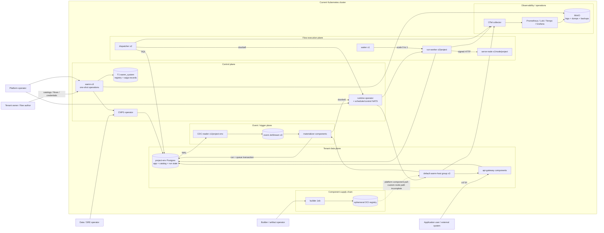
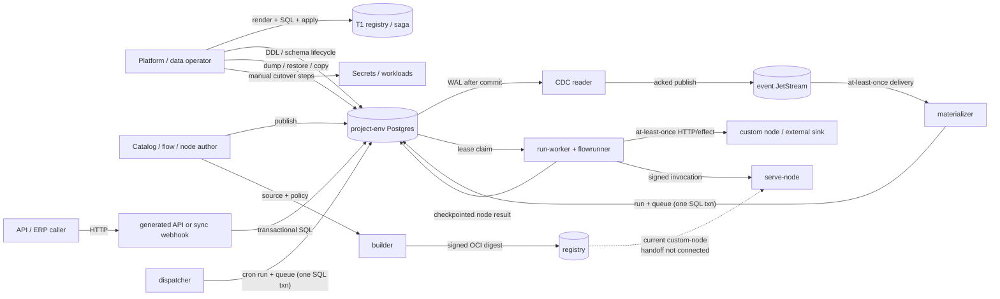

# wamn — Findings Ledger

**The single findings document.** Absorbs `review-findings.md` (R1–R9c) and
`structure-review.md` (SR1–SR7) from the repo, and **mints R10–R16, SR8–SR14,
and E1–E14 here** (from the 2026-07-18 review passes; none of those IDs existed
in the prior files). The prior ledgers fragmented the same question —
*what is open, how bad, what next* — across three files, three numbering
schemes, and three sequencing sections, requiring cross-references to be
readable. That was the problem, not the fix.

**Identifiers are preserved** (R/SR/E prefixes) so existing beads, commits, and
conversations keep resolving. They are now *sections of one ledger*, not
separate documents.

**Status rule (adopted, see R10):** *A finding closes on a commit that removes
or fixes code — never on a decision that plans to. Decisions change a finding's
**priority**; only commits change its **status**. Questions close on verified
evidence, cited to source.* Every `closed` row below carries its commit, bead,
or evidence citation.

**Sources merged:** internal architectural passes (2026-07-11 … 07-18, tips
`155ac4b` → `8f1b53d`), the pinned-fork audit (`dkkloimwieder/wasmCloud`
`d3d83f3`; `pg-walstream` `wamn/0.8.0`), and a second external static-read pass
(2026-07-18, tip `8f1b53d`).

---

## A — First-principles audit baseline (2026-07-23)

This section is the frozen input and decision rubric for
`wamn-4tob.7` (`AUDIT-B0`). It is not an architecture verdict and it closes no
finding. Later audit work may cite evidence pinned here, but a recommendation
does not alter the decision table or represent an implementation fix.

### A.1 Source and evidence snapshot

Snapshot time: **2026-07-23 07:56 EDT**.

| Evidence class | Frozen baseline | Qualification |
|---|---|---|
| Git source | local `HEAD`, local `origin/main`, and remote `refs/heads/main` all `1da2a10087ff3404f72983d139ddb5c8de07b6db`; tree `5fb399786ad2bbdee7df9871410fb7730e5e4fd0` | This commit is the tracked source baseline. |
| Dirty worktree | modified `.beads/interactions.jsonl` and `AGENTS.md`; untracked `docs/REVIEW-260723.md` | These were present before B0. They are not silently folded into the source baseline. `AGENTS.md` and the interactions log remain user-owned working state. |
| External review | `docs/REVIEW-260723.md`, SHA-256 `3fcb2d272dd2b5ea761da0aa2459a8627cd3da3405dc55b66a81652a8455dbc5` | Static review only: it says it inspected current `main`, did not compile or run the repository, and links mutable `/blob/main/` URLs rather than a commit. The exact revision seen by its author is therefore **not attestable** from the document. For this audit its claims are hypotheses against the frozen source above and receive credit only when re-checked there. |
| Root Rust workspace | 38 packages from root `cargo metadata --no-deps` | `Cargo.toml` has 38 explicit members, excludes `components`, and has no `default-members`. |
| Component workspace | 18 Rust component/fixture/sample packages from `components/Cargo.toml` | Built separately for `wasm32-wasip2`; non-Rust sample sources remain part of the repository surface even when absent from Cargo metadata. |
| Contracts | 65 `.wit` files including vendored component copies; 3 checked-in `*.schema.json` contracts | Canonical ownership and copy drift are questions for STR5/STR6, not assumptions in this count. |
| Deployment | 117 files: `platform` 22, `infra` 19, `gates` 56, `sql` 8, `poc` 9, `cred` 2, plus `deploy/README.md` | Files are inventory evidence, not proof that the same revision is deployed. |
| Design and measurements | 91 files under `docs/`: 45 top-level Markdown files, 36 ceiling-data CSVs, 4 archived Markdown files, and 6 top-level WIT/JSON contracts | `docs/README.md` is the navigation index; `docs/platform-plan.md` contains D1–D24; this file remains the sole findings ledger. |
| Beads | Dolt `main` commit `pjm30ol4ei704jlrsr4nbdgh5r5jfqs2`; 577 issues: 296 closed, 280 open, 1 in progress; 44 open audit records after B0 filed the three missing-requirement decisions | Canonicalized `bd list --all --json --limit 0` SHA-256: `440cb703eb692c3629ffb1b5c442a22cbdb2b0a570211ae198166994b6825c3b`. Beads are scope, ownership, and history evidence; a closed bead alone is not behavioral proof. |
| Live environment | kind context `kind-wamn`, cluster `wamn`, three Ready Kubernetes 1.36.1 nodes; inspected running workloads use local wamn `:dev` images | The wamn images have no source-revision label and no registry digest; Kubernetes reports kind-import content IDs only. They cannot be tied to `1da2a100…`. Live behavior is therefore **unavailable as baseline-matched evidence**, and no live audit gate may run or receive credit until source-to-artifact provenance is established. |

The reproducible inventory commands are:

```text
git rev-parse HEAD HEAD^{tree} origin/main
git ls-remote origin refs/heads/main
git status --porcelain=v1
cargo metadata --no-deps --format-version 1
cargo metadata --manifest-path components/Cargo.toml --no-deps --format-version 1
find deploy -type f
find docs -type f
find . \( -path './.git' -o -path './target' \) -prune -o \
  -type f \( -name '*.wit' -o -name '*.schema.json' \) -print
bd list --all --json --limit 0
bd vc status --json
kind get clusters; kubectl config current-context
kubectl get nodes; kubectl get pods -A
kubectl get deploy,statefulset,daemonset,job,cronjob -A
docker image inspect <wamn-image>:dev
```

### A.2 Scope and evidence rules

The audit covers the product architecture, all architectural planes and
canonical journeys, state authorities, trust and failure boundaries, service
and component placement, both Cargo workspaces, deployment/configuration/SQL
artifacts, public contracts, documentation, backlog, and the roadmap seams
named by the audit program. UI and edge features that are explicitly parked
are not current implementation debt; the architecture seams required to add
them remain in scope.

Implementation fixes, opportunistic refactors, canonical decision-table
rewrites, and a second review report are out of scope. Recommendations go into
this ledger and granular Beads records. Existing decisions are hypotheses to
classify `keep`, `amend`, `replace`, or `defer`, not constraints or sunk-cost
credit.

Evidence is ranked as follows:

1. Baseline-matched executable behavior with a named reproduction or gate and
   captured inputs/results.
2. Baseline-matched code, migrations, contracts, and generated-artifact drift
   guards that directly establish the claim.
3. Deployment manifests, runtime configuration, and operational records whose
   revision and environment are proven.
4. Canonical design/decision documents and measurement records, retaining
   their stated environment and limitations.
5. Beads history and external/static reviews as leads and rationale, never as
   sole proof of behavior.
6. Current official/primary platform sources for external capability claims;
   secondary commentary may identify a question but cannot settle it.

Every assertion is labeled **verified** (executable or direct source proof),
**observed** (inventory/current state), **measured** (reproducible result with
conditions), **claimed/hypothesis** (requires discrimination), or **unknown**
(a bead is required). Critical/high behavioral claims require a named
reproduction, discriminating test, or targeted gate. A live gate is admissible
only when its source revision, build inputs, immutable artifact identity,
deployment manifest, and observed workload identity form one provenance chain.

### A.3 Controlling fitness gates

An architecture option is eliminated, regardless of cost or delivery speed,
if it cannot credibly satisfy all of these:

| Gate | Minimum credible response |
|---|---|
| Tenant and secret isolation | Default-deny capabilities and credentials; tenant data, control-plane privilege, replication privilege, and artifact/build authority cannot cross tenant or plane boundaries through a shared role, process, broker identity, or operator convention. |
| No acknowledged-write loss or silent corruption | Each acknowledged mutation has an authoritative durable boundary, unambiguous recovery semantics, and detectable refusal; partial publish/materialization cannot silently lose, duplicate as a new logical effect, or corrupt state. |
| Deterministic, resumable flow execution | Persisted graph/version, occurrence, inputs, outcome, timers, and ordering information are sufficient to resume after interruption without depending on wall-clock timing, process memory, or a changed definition. |
| Idempotent recovery | Every retry, replay, redelivery, failover, restore, and reconciliation path has stable identity and either produces the same logical result or makes non-idempotent external effects explicit and bounded. |
| Bounded failure domains | A compromised credential/component or a failed tenant, database, broker partition, worker, migration, or operator action has an explicit containment boundary and cannot cause unbounded cross-tenant or cross-plane loss. |
| Safe schema, runtime, and deployment upgrades | Compatibility, quiescence/cutover, rollback/forward-fix, state migration, artifact provenance, and mixed-version behavior are defined; partial upgrades fail detectably and recoverably. |

Options surviving those gates are ranked, in order, by **operability,
evolvability, performance, infrastructure cost, then delivery speed**. Lower
criteria never compensate for failure of a higher criterion, and none can
rescue a correctness-gate failure.

### A.4 Scenario and journey evidence template

Every quality-attribute scenario and canonical journey uses the same record:

```text
actor / tenant / privilege:
stimulus:
environment and deployment class:
entry point and trust-boundary crossings:
authoritative state:
transaction, acknowledgement, and durability boundary:
ordering and delivery semantics:
partial-failure states and bounded blast radius:
required response and recovery owner:
measure (latency/throughput/RPO/RTO/error or isolation invariant):
baseline-matched evidence and provenance:
verdict / unknown bead:
```

Missing product targets are not guessed. Three granular owner decisions now
block ARC11's final target verdict:

- `wamn-4tob.1.12` — supported tenant and deployment cardinality envelopes.
- `wamn-4tob.1.13` — end-to-end latency, throughput, backlog, and catch-up
  service objectives.
- `wamn-4tob.1.14` — availability, durability, degradation, RPO, and RTO by
  plane and deployment class.

ARC1 may document conditional scenarios while these are open, but ARC11 cannot
present an unconditional target architecture without their resolution or an
explicit owner deferral.

### A.5 Authorization and external-review routing

Authorization is wave-specific and does not carry across a bead boundary.
Only the named issue is claimed; after it is closed, validated, committed, and
pushed, work stops until the owner authorizes the next issue or parallel wave.
Parallel evidence collection is capped by the audit plan and does not allow
parallel edits to this ledger.

The 2026-07-23 external review was routed as evidence, not accepted as a
verdict: its plane/process observations are attached to ARC2/ARC3; state,
runtime, topology, event, trust, operability, evolution, and synthesis claims
to ARC4–ARC11; and its package, deployment, hotspot, contract, drift,
build/test, and target-decomposition claims to STR1–STR7 and STR9. Corroborated
facts such as the 38-member workspace, `wamn-builder → wamn-host`, production
dependencies on `wamn-testkit`, the large `serve_node.rs` workload surface,
fork pins, and broad gate dependencies remain observations. Proposed crate
merges, package moves, process extraction, and infrastructure restraint remain
hypotheses until the owning audit task supplies dependency, co-change,
deployment, correctness, and operability evidence.

---

## B — Product forces and architecture fitness criteria (2026-07-23)

This section is the conditional requirements baseline for `wamn-4tob.1.1`
(`AUDIT-ARC1`). It asks what job the product architecture must do before judging
whether wasmCloud, native services, Postgres tiers, JetStream, or the current
repository decomposition are the right means. It reviews the frozen source from
§A; no live gate was run because §A found no source-to-running-artifact
provenance chain.

**ARC1 verdict:** the product job and its controlling correctness invariants are
clear enough to discriminate alternatives, but its supported scale, service
objectives, recovery contract, isolation/compliance contract, and upgrade
contract are not owner-set. Architecture assessments may therefore give
conditional verdicts against the scenarios below, but ARC11 must not present an
unconditional target until `wamn-4tob.1.12`–`.16` are decided or explicitly
deferred.

### B.1 Product job, actors, and trust assumptions

Wamn's documented product job is to let an organization define and promote a
versioned application catalog, expose the resulting tenant data through a
generated API, author and test flows, execute those flows synchronously or
durably from scheduled/database triggers, run sandboxed custom nodes, and
observe, copy, restore, and upgrade each project environment. The current
product is SaaS-first and HTTP/DB/webhook/cron-first; MQTT, industrial
connectors, edge execution, and on-prem/air-gapped distribution are roadmap
seams rather than shipped requirements (`docs/platform-plan.md:22-26`,
`docs/platform-plan.md:118-131`). The receiving POC is the concrete product
journey, while the newer pivot explicitly prioritizes correct flow execution
and API behavior and parks UI, auth, deep security, and IaC
(`docs/poc-material-receiving.md:1-12`, `docs/core-pivot-plan.md:7-21`).

| Actor | Authority and intended privilege boundary | Product action and current requirement status |
|---|---|---|
| Organization/project owner, platform builder, deployer, and viewer | Owns tenant definitions and deployments but not platform/T1 or another tenant. The `builder`/`admin`/`viewer`/`deployer` plane is specified, not yet a current authentication system. | Define catalogs and flows, manage credentials, run tests, and promote releases (`docs/platform-plan.md:133-141`, `docs/core-pivot-plan.md:167-173`). |
| Application user | Has an application role and server-established claims within one project environment. It must not choose its tenant identity or bypass RLS. | The POC's inspector is site-scoped and its quality manager spans sites; the app schema is substrate, not current JWT/session behavior (`docs/poc-material-receiving.md:8-20`, `docs/app-schema.md:1-7`, `docs/app-schema.md:39-54`). |
| External industrial/business system | Machine client with narrowly authorized API or callback access; v0 means ERP-like HTTP/DB integration, not native PLC protocols. | The POC ERP submits receipts and receives disposition callbacks with an API key (`docs/poc-material-receiving.md:8-9`, `docs/poc-material-receiving.md:44-50`). |
| Flow author | Chooses graph, ordering, retry, trigger, credential names, and allowed hosts, but must not mint host claims or broaden runtime grants. | Publishes immutable flow versions and expects in-flight runs to remain pinned to their version (`docs/flow-schema.md:1-15`, `docs/run-state.md:115-126`). |
| Custom-node author | Tenant code is untrusted by the intended boundary: build and execution must be credential-less and deny capabilities unless imports and policy grant them. | Author, test, sign, publish, and invoke a component. User-source ingestion, persistent registry state, and deploy-time signature verification remain incomplete (`docs/builder.md:1-36`, `docs/builder.md:194-204`). |
| Standard-node/runtime maintainer | Trusted platform-code author. Standard nodes share the flowrunner's union of capabilities; per-node restriction is logical dispatch policy, not a hostile-code sandbox. | Curates compiled-in nodes and the policy that maps each node to allowed effects (`docs/platform-plan.md:77-85`, `docs/node-library.md:111-123`). |
| Platform/control-plane operator | Privileged across T1, placement, schema/provisioning sagas, Kubernetes artifacts, and tenant database creation. T1 authority must not become a tenant request-path credential. | Provision, place, migrate, quiesce, copy, restore, cut over, and recover environments (`docs/system-cluster.md:18-29`, `docs/provisioning.md:359-371`). |
| Data-plane/SRE operator | Operates project runners/gateways, Postgres, CDC slots, JetStream, backups, and runtime forks. Replication authority can see cluster-wide WAL and is materially more privileged than an application credential. | Detect stalls, contain failures, restore service/data, and upgrade dependencies (`docs/event-plane-jetstream.md:425-466`, `docs/wash-runtime-fork.md:61-129`). A cross-plane incident RACI is not yet named. |
| Builder and artifact operator | Controls the source-to-component supply chain and registry/signing authority; this must be separate from tenant runtime credentials. | Compile, lint imports, test, attest, sign, publish, and deploy custom-node artifacts (`docs/builder.md:10-36`, `docs/builder.md:121-171`). |
| Auditor | Needs immutable, tenant-scoped evidence of acknowledged requests, run/effect outcomes, administrative actions, and recovery. No explicit auditor grant model is specified. | The POC requires an auditor to prove zero silent losses; the app schema supplies audit storage but not the reader's authorization contract (`docs/poc-material-receiving.md:44-50`, `docs/app-schema.md:72-82`). |

The labels `pooled`, `standard`, `dedicated`, and `regulated` do not themselves
establish an adversary model, compliance regime, residency promise, acceptable
operator access, secret boundary, or audit/retention policy. Those product
requirements are now owned by `wamn-4tob.1.15`; ARC6 and ARC8 must not infer
stronger isolation merely from a deployment-class name.

### B.2 Lifecycle and deployment classes

| Lifecycle stage | Required product invariant | Current authority or seam |
|---|---|---|
| Onboard and place | A stable `(org, project, env)` identity maps to exactly one intended policy and placement; retries cannot create a second authority. | T1 registry is the identity/placement source; provisioning creates the target database, role, rows, and Secret (`docs/registry-model.md:1-18`, `docs/provisioning.md:313-371`). |
| Design catalog | Draft edits are isolated from the applied application and have a stable base version. | Versioned catalog is the model source; draft is the only mutable lifecycle state (`docs/catalog-model.md:3-24`, `docs/schema-lifecycle.md:41-67`). |
| Stage, migrate, and promote | Stale-base and incompatible changes refuse; DDL and lifecycle movement are atomic; destructive promotion requires explicit evidence/authorization. | Applied catalog plus physical tenant schema; promotion remains within `(org, project)` (`docs/schema-lifecycle.md:94-126`, `docs/migration-engine.md:25-53`). |
| Publish API and flow | A request or run resolves one compatible, immutable catalog/flow contract; activation is atomic and old in-flight work remains interpretable. | Applied schema and active flow-version pointer; REST exists, while GraphQL, auth, hot reload, SDK generation, masks, and rate/cost limits are still excluded from the current gateway (`docs/api-gateway.md:107-115`). |
| Build and publish a custom node | Source is built without tenant/runtime credentials; disallowed imports or failing tests prevent publication; the invoked artifact is the reviewed artifact. | Builder pipeline, manifest, signature/SBOM, and OCI identity are the intended seams; the shipped deployment path is still partial (`docs/builder.md:10-36`, `docs/builder.md:173-204`). |
| Execute and recover a flow | Synchronous acknowledgement and asynchronous enqueue boundaries are explicit; crash, retry, park, wake, and replay use stable identities and the persisted version. | Postgres run/queue state is authoritative; NATS is a lossy hint; node effects are at least once unless the sink honors idempotency (`docs/run-queue.md:24-30`, `docs/run-state.md:87-126`). |
| Capture a database event | A committed write is not forgotten between WAL, broker, materializer, queue, and run creation; ordering and duplicate scope are explicit. | Confirmed LSN advances only after JetStream acknowledgement; deterministic run creation is narrower than exactly-once external effects (`docs/event-plane-jetstream.md:126-138`, `docs/event-plane-jetstream.md:191-229`). |
| Test, observe, audit, and replay | Evidence identifies tenant, version, node occurrence, cause, and outcome without leaking secrets; replay never disguises repeated external effects. | Test/replay is a product surface in the plan, but per-node observability, tenant isolation of logs, immutable audit export, and replay permissions remain incomplete (`docs/platform-plan.md:175-187`, `docs/run-state.md:147-179`, `docs/dashboards.md:88-106`). |
| Copy, back up, restore, and move | Quiesce, snapshot, restore, verify, and cutover are ordered and resumable; destructive restore is explicit; recovered point and audit rewind are reported. | Logical per-project dump and cluster PITR coexist; copy records durable steps, while the general compensating saga remains future work (`docs/postgres-topology.md:247-331`, `docs/provisioning.md:787-838`). |
| Upgrade | Schema, host, guest, service, WIT, event-wire, and deployment changes preserve acknowledged and persisted work or fail detectably with a recoverable prior artifact. | Subsystem lifecycle and fork gates exist, but fleet-wide mixed-version support, maintenance allowance, rollout order, and deployed artifact identity are not specified; `wamn-4tob.1.16` owns that product contract. |

The current deployment taxonomy is a design hypothesis:

| Class | Documented shape | Requirement status |
|---|---|---|
| Platform environment | One T1 HA control-plane database cluster per platform dev/staging/prod; tenant request paths should continue during T1 loss. | Specified qualitative failure boundary; numeric availability/durability is open (`docs/system-cluster.md:16-31`, `docs/system-cluster.md:47-57`). |
| Trials / T3 | Multiple organizations share the pool. | Pooled service is intended, but supported tenant count, noisy-neighbor envelope, acceptable shared privilege, and unit economics are open. |
| Standard / T2 | Organization-scoped prod/dev recovery domains; prod HA and backup-enabled, dev cheaper/hibernatable; canary may share prod. | Current placement policy, not a customer-certified SLO or isolation contract (`docs/provisioning.md:143-173`, `docs/deployment-model.md:351-367`). |
| Dedicated or regulated / T4 | Project environments, including canary, may receive their own recovery domain. | Product option is named, but regulatory controls, data residency, operator trust, RPO/RTO, and price/cardinality assumptions are not set (`docs/deployment-model.md:241-261`). |
| Edge/on-prem/air-gapped | Later distribution profile with MQTT first and OPC UA/Modbus/local HTTP at the edge. | Architectural seam only; supported topology, fleet count, offline duration, upgrade ownership, and recovery expectations remain unknown (`docs/platform-plan.md:118-131`). |

The topology note explicitly assumes organizations are few, paying, and able to
absorb instance cost (`docs/postgres-topology.md:1-20`). That is a design input,
not a product requirement. `wamn-4tob.1.12` must decide the supported
cardinalities before ARC6 or ARC11 credits either per-project deployments or the
four-tier topology for scale or cost.

### B.3 Requirements, measurements, and unsupported extrapolations

Historical gate and ceiling records are useful design evidence, but they are
not current baseline-matched behavioral proof under §A. The table preserves
workload, durability, and environment so development thresholds are not
silently promoted to product SLOs.

| Area | Recorded evidence | What it supports | What it does not support |
|---|---|---|---|
| Runtime/component substrate | S1 recorded 6.1/25.3 µs instantiate p50/p99, 46.7 MiB for 100 residents, an 80.5 ms workload start, and a trapped 256 MiB cap (`docs/p0-results.md:35-56`). | Feasibility at the measured local/in-cluster shape. | Project-fleet cardinality, cold end-to-end request latency, noisy-neighbor isolation, or production cost. |
| Postgres host path | The final durable-commit S2 record reports 13,804 qps, p99 3.59 ms; multiproject reports 14,162 qps, p99 3.06 ms, and 10,000/10,000 addressability (`docs/p0-results.md:187-198`). Security probes reported zero leakage/mismatch in their workloads (`docs/p0-results.md:200-221`). | A specific query shape, pool, and containment gate passed with `fsync` and synchronous commit enabled. | A production database durability/HA claim: the fixture is still one replica on `emptyDir` (`deploy/platform/postgres.yaml:1-3`, `deploy/platform/postgres.yaml:44-61`). Addressability is not supported active-project cardinality. |
| Reducer/resume and invocation | S3 recorded 0.83 µs dispatch p99, 428 µs worst reload, and 10/10 duplicate-absorbed resumes; S4 recorded 33/89 µs cross-pod p50/p99 (`docs/p0-results.md:291-321`, `docs/p0-results.md:378-402`). | Reducer and invocation overhead are small in the tested paths. | End-to-end durable-flow latency, failover RTO, arbitrary external-effect exactly-once, or a production workload mix. |
| Proposed dispatch SLO | D15 proposes write-ahead p99 `<15 ms`, fast path p99 `<10 ms`, async warm p50/p99 `<25/100 ms`, and async cold p99 `<250 ms` (`docs/platform-plan.md:105`). Durable re-gates recorded 6.94/6.06 ms and doorbell 6.3/9.46 ms (`docs/ceilings.md:12-20`). | The current development gates meet the proposed thresholds in their fixture. | Product sign-off, percentile windows/error budgets, payload/concurrency classes, or customer-facing SLOs. Those belong to `wamn-4tob.1.13`. |
| Queue capacity and recovery | The 60-second C7 ramp knee was about 2,000–2,500 transitions/s, but only 550/s was flat in the sustained run and 1,599/s oscillated; tenfold bursts recovered in 26–66 seconds (`docs/ceilings.md:70-127`). | A noisy, untuned saturation shape and concrete backpressure questions. | A 1–5k sustained production ceiling or SLO; C7 is explicitly measurement-only and production-grade remeasurement is deferred (`docs/ceilings.md:149-153`). |
| CDC and event path | Release C-E2E records commit-to-first-enqueue p50 around 157–184 ms and N=1/5/20 commit-to-last-run p50 166/166/185 ms; C-CDC drained narrow rows around 60k/s and wide rows around 13.4k/s (`docs/ceilings.md:513-556`, `docs/ceilings.md:587-607`). A local reader restart delivered 222/222 with a 2.17 s publish gap (`docs/ceilings.md:658-679`). | Path feasibility, payload sensitivity, and a local recovery mechanism. | Accepted event latency/catch-up SLO, a materializer ceiling, live primary-failover RTO, or slot-loss recovery. |
| Backup and restore | Policy examples use daily/six-hour/hourly logical dumps and 7/14/30-day PITR windows; an exact target-time restore was demonstrated (`docs/postgres-topology.md:253-267`, `docs/postgres-topology.md:292-314`). | Restore mechanisms and candidate tier knobs. | Contractual RPO/RTO, formal restore-drill cadence, immutable audit continuity, or named recovery ownership. |

Earlier S2 and dispatch latency figures used non-durable fixture settings and
are not comparable regressions to the durable-commit rows
(`docs/p0-results.md:5-7`, `docs/p0-results.md:167-198`). C-MAT local debug data
is a shape result rather than a ceiling, and the live CDC availability event was
not recorded (`docs/ceilings.md:357-372`, `docs/ceilings.md:658-679`). ARC1 gives
no architecture option credit for extrapolating any of these records beyond its
captured workload.

### B.4 Quality-attribute scenarios

The response measures below are the acceptance interface for later
architecture comparisons. **Required** marks a controlling invariant; cited
decision beads supply missing numeric or product boundaries and do not lower
the correctness gate while open.

| # | Actor, stimulus, and environment | Authority, boundary, and delivery semantics | Required response, blast radius, and recovery owner | Measure and evidence status |
|---|---|---|---|---|
| QA1 | A hostile or defective API client for tenant A supplies forged claims, unknown identifiers, injection values, or tenant B identifiers in pooled T3. | Tenant database plus applied catalog are authoritative; the gateway/plugin establishes claims and uses bound values; RLS is the last database boundary. | Refuse before unauthorized SQL/effect, reveal no victim existence or data, record an attributable denial, and contain impact to the caller/project. Platform security owns recovery from a boundary failure. | **Required:** zero cross-tenant reads/writes and zero claim override. Historical S2 probes are supporting evidence only (`docs/api-gateway.md:54-75`, `docs/p0-results.md:200-221`). Trust and permitted sharing: `.15`. |
| QA2 | A builder stages a destructive catalog change while another version is applied or a DDL statement fails in a live environment. | Applied catalog and tenant schema must advance in one migration transaction; staged base version controls ordering. | Refuse stale base, roll back all partial DDL/lifecycle/history, identify dependent API/flows/tests, and require destructive authorization plus backup evidence. Project operator owns correction. | **Required:** zero partial schema state and no history row for a failed migration (`docs/schema-lifecycle.md:94-126`, `docs/migration-engine.md:25-53`). Downtime/compatibility: `.16`; RPO/RTO: `.14`. |
| QA3 | An ERP client submits a synchronous write-ahead flow and a runner dies after an external effect but before checkpoint. | Run/node history and sink data are authoritative at their respective transactions; the persisted flow version and occurrence-derived idempotency key survive process loss. | Do not acknowledge before the promised durable boundary; reclaim and reconstruct on another worker; collapse an idempotent sink effect, and explicitly surface a possibly repeated non-idempotent effect. Blast radius is one run/project. | **Required:** zero acknowledged run loss or silent duplicate logical effect. POC proposes 20 receipts/zero silent loss and D15 proposes p99 `<15 ms`; neither is completed product proof (`docs/poc-material-receiving.md:44-47`, `docs/run-state.md:87-100`). Latency: `.13`; recovery: `.14`. |
| QA4 | An idle project's cron fires while its runner is at zero and the initial NATS doorbell is lost. | Postgres `runs` plus `run_queue` are atomic/authoritative; NATS is only a hint. | Reconciliation re-hints, the narrowly privileged waker scales 0→1, one worker leases and resumes the run, and unrelated projects continue. Dispatcher/data-plane operator owns a stalled backlog. | **Required:** zero lost enqueues; bounded wake/dispatch latency. Mechanism is documented (`docs/run-queue.md:47-98`, `docs/run-queue.md:582-615`); cold p99 target awaits `.13`, degraded RTO `.14`. |
| QA5 | Two runner replicas process a strict/partitioned flow whose head retries, parks, crashes, or becomes business-terminal. | Numeric stream sequence, stable ordering key, and Postgres leases govern delivery; retries share occurrence and attempt advances. | No transient head is overtaken in blocking mode; a business-terminal head dead-letters and releases atomically; crash-exhaustion remains visibly blocked until an authorized redrive/purge. | **Required:** zero per-key reorder and no concurrent lease owner (`docs/run-queue.md:149-237`). Operator authority and response time remain open under `.14`. |
| QA6 | A tenant transaction commits while JetStream is unavailable or the CDC reader restarts in standard dedicated prod. | WAL is the first committed event authority; confirmed LSN moves only after broker acknowledgement; deterministic materialization dedupes run creation. | Retain WAL, emit stall/headroom signals, retry without inventing a new logical run, and declare a capture-gap incident rather than silently recreating an invalid slot. Event/DB operator owns containment and backfill. | **Required:** zero silent committed-event gaps while the slot remains valid. Alert lead time, backlog/catch-up, failover, and gap RPO/RTO: `.13`/`.14` (`docs/event-plane-jetstream.md:126-138`, `docs/event-plane-jetstream.md:458-466`). |
| QA7 | A custom-node author submits source importing sockets/Postgres or a deployed node requests a credential/host outside its manifest and policy. | Builder artifact/manifest/signature and host-injected project/grant context form the boundary; tenant code cannot mint claims. | Reject before publish or effect, disclose no secret/existence oracle, and contain failure to the artifact/invocation. Builder/runtime security owns quarantine and revocation. | **Required:** zero unauthorized import, secret byte, DB access, or egress. Current lint/credential gates support the mechanism, while ingestion and deploy-time verification are partial (`docs/builder.md:10-36`, `docs/credential-vault.md:77-133`). Trust/rotation requirements: `.15`. |
| QA8 | A flow definition or dispatcher attempts to give standard node A a capability declared only for standard node B. | The current flowrunner owns the union of standard-node capabilities and applies logical dispatch checks. A malicious standard-node maintainer remains inside that trusted component boundary. | Under the present trust hypothesis, the double checks refuse the misdispatch; if standard-node authors/code are adversarial, the architecture must instead create a structural boundary. | **Required:** zero disallowed dispatch from untrusted flow input. Whether logical containment is acceptable by class is an owner decision in `.15` (`docs/platform-plan.md:81-85`, `docs/node-library.md:111-123`). |
| QA9 | T1 loses its primary or becomes unavailable while existing tenant APIs and flows are active. | T1 is authoritative for control-plane identity/saga state but excluded from tenant request paths; tenant databases/run state remain authoritative for live work. | Existing data-plane requests continue; provisioning, placement, and promotion fail closed/pause; acknowledged T1 mutations are either present after failover or a durability violation is declared and reconciled. Platform control-plane operator owns recovery. | **Required:** no tenant request-path dependency and no silent acknowledged registry loss. The qualitative boundary is specified; async-replication durability, availability, RPO, and RTO are `.14` (`docs/system-cluster.md:47-85`). |
| QA10 | An operator restores/copies a corrupted project environment in trials, standard, or dedicated service. | Backup artifact/PITR point, source registry identity, and durable copy saga steps govern restore and cutover. | Restore to scratch by default; require explicit in-place confirmation; quiesce→snapshot→restore→verify→cutover; report recovered point, missing interval, and audit rewind; never append stale rows. DB/control-plane operator owns the operation. | **Required:** verified data/identity integrity and no unannounced loss. Existing gates prove mechanisms; cadence, RPO/RTO, audit retention, and owner authority are `.14`/`.15` (`docs/provisioning.md:699-785`, `docs/postgres-topology.md:325-331`). |
| QA11 | Offered API, queue, or CDC load exceeds the supported sustained/burst envelope or a tenant creates a runaway backlog. | Each authoritative store must expose accepted work, backlog, age, and progress; lossy hints cannot become the authority. | Apply bounded backpressure or fail explicitly, preserve acknowledged work, contain noisy-neighbor impact to the promised class, alert before WAL/lease/retention safety is exhausted, and catch up within the contract. | **Required:** zero silent loss plus owner-set backlog age, drain time, throughput, and blast radius. C7/C-CDC only supply candidate shapes; `.12`–`.14` own the product envelope. |
| QA12 | Old and new host/guest/service/WIT/event-wire/SQL versions coexist or a rollout fails with active, parked, and scheduled runs. | Immutable artifact identity, persisted flow/catalog/event versions, and migration state must determine compatibility and rollback/forward-fix. | Detect incompatibility before destructive replacement, keep compatible old capacity or quiesce explicitly, preserve acknowledged/persisted work, and select a proven prior artifact or recover forward. Release/platform operator owns rollout. | **Required:** zero silent state reinterpretation or acknowledged-work loss. Subsystem pins/gates exist, but the mixed-version and maintenance contract is `.16`, with numeric outage/recovery in `.14` (`docs/wash-runtime-fork.md:61-129`, `docs/migration-engine.md:122-130`). |
| QA13 | A component, operator credential, broker identity, replication role, observability store, or cluster is compromised in a regulated/dedicated environment. | Product-defined trust zones, credential scopes, encryption/residency controls, and audit authorities—not tier names—must bound access. | Prevent cross-tenant/plane escalation; revoke and rotate within a defined interval; preserve/produce tamper-evident evidence; notify affected tenants; contain recovery to the promised domain. | **Required:** zero access outside the declared domain and an explicit maximum blast radius. The baseline has no certified regulated contract; `.15` owns it and `.14` owns recovery time. |

### B.5 How these criteria discriminate alternatives

Later architecture work must apply these rules before considering sunk cost or
delivery speed:

| Question | Eliminate an alternative when... | Primary downstream comparison |
|---|---|---|
| State authority and acknowledgement | A request can be acknowledged before its authoritative state is durable, or two authorities can diverge without an atomic handoff, stable identity, reconciliation, and visible gap. | Current distributed state vs Postgres-centered vs log-centered vs durable-workflow ownership (ARC4/ARC7). |
| Flow durability and determinism | Resume depends on process memory, current rather than persisted definitions, wall-clock coincidence, or unbounded duplicate external effects. | Custom runner vs a durable-workflow engine; native vs component execution (ARC4/ARC5). |
| Tenant, secret, artifact, and operator isolation | Default deny depends only on naming/list conventions, a shared credential crosses the accepted threat boundary, or a compromised component exceeds the deployment class's promised blast radius. | Pooled/per-org/per-env topology, runtime sandbox role, builder supply chain, and broker/account layout (ARC5/ARC6/ARC8). |
| Event/log necessity | A broker adds an acknowledged state authority without a required replay/ordering/fan-out property, or a queue-only alternative cannot meet a stated event-log requirement. | CDC→JetStream vs outbox/direct Postgres/log/workflow alternatives (ARC7). |
| Failure containment and recovery | A single tenant, slot, broker, primary, rollout, or operator mistake can create unbounded cross-tenant loss, or recovery requires undocumented expert repair beyond `.14`. | Topology, event plane, service placement, backup, and day-two design (ARC6/ARC7/ARC9). |
| Scale and operability | Per-project/per-environment objects, pools, subscriptions, metrics, cold starts, or upgrades cannot fit `.12` and `.13`, or the on-call burden violates `.14`. | Runtime deployment unit, Postgres tiering, and scale-to-zero claims (ARC5/ARC6/ARC9). |
| Evolution and upgrades | There is no compatible path for the version combinations, in-flight work, maintenance posture, rollback provenance, and state migration required by `.16`. | Runtime/fork role, contracts, roadmap seams, and target migration order (ARC5/ARC9/ARC10/STR5). |

These tests deliberately do not assume that wasmCloud is the platform, that
JetStream is necessary, that four Postgres tiers are correct, or that durable
orchestration should remain custom. They also prevent a cheaper/faster option
from surviving a correctness-gate failure.

### B.6 External review: accepted feedback, corrections, and routing

`docs/REVIEW-260723.md` is a static review that did not build or run the system
(`docs/REVIEW-260723.md:9-11`). ARC1 therefore used it as a hypothesis source:

- **Corroborated and adopted as an ARC1 requirement question:** the current
  event path can provide deterministic exactly-once *run-row creation* while
  node execution and nontransactional external effects remain at least once
  unless the sink honors idempotency. The review's narrower wording
  (`docs/REVIEW-260723.md:334-369`) agrees with the canonical state/event
  contracts (`docs/event-plane-jetstream.md:191-229`,
  `docs/run-state.md:87-113`). Later work must not market or reason from a
  broader end-to-end exactly-once claim.
- **Corroborated as unproven, not accepted as a negative verdict:** per-project
  workloads are not yet shown to be “nearly free” after CRDs, routes, secrets,
  pools, subscriptions, telemetry, reconciliation, cold starts, and upgrade
  fan-out. The proposed 100/1,000/10,000 campaign
  (`docs/REVIEW-260723.md:373-399`) is a useful input to `.12`; it is not a
  product scale requirement or completed measurement.
- **Corroborated and made explicit in QA8:** standard-node isolation is logical
  within a trusted component, unlike the custom-node sandbox
  (`docs/REVIEW-260723.md:403-415`). This is not a newly proven exploit; `.15`
  must decide whether that trust boundary is acceptable for each deployment
  class.
- **Correct direction, stale detail:** the two pinned forks are product
  subsystems with upgrade/on-call cost, but D23 already accepts runtime-fork
  maintainer status and the current wash-runtime ledger carries six rather than
  the review's five commits (`docs/REVIEW-260723.md:314-330`,
  `docs/wash-runtime-fork.md:120-140`). ARC5/ARC9 must compare that continuing
  cost; ARC1 does not reopen it solely from patch count.
- **Useful product-boundary observation:** the review argues that `testkit` and
  `flow-tests` may implement a customer-facing test/replay product rather than
  mere repository support (`docs/REVIEW-260723.md:216-241`). The platform plan
  independently specifies stored suites, replay, assertions, publish gates, and
  schema-impact analysis as product capabilities
  (`docs/platform-plan.md:175-187`). ARC1 therefore includes that lifecycle,
  while STR2/STR3/STR9 must decide its code and deployment ownership.
- **Retained only as later hypotheses:** “over-designed,” freeze-infrastructure,
  crate merges, process extraction, and broker/runtime replacement are
  architecture/structure verdicts rather than product forces. They remain
  routed to ARC4–ARC11 and STR1–STR9 and receive no ARC1 credit without the
  relevant state, dependency, failure-domain, and operability comparison
  (`docs/REVIEW-260723.md:5-11`, `docs/REVIEW-260723.md:516-518`).

The review also helped expose current-document drift that later tasks must not
mistake for product requirements: `platform-plan.md` still mentions dispatcher
outbox polling although D19 retired it (`docs/platform-plan.md:87`,
`docs/platform-plan.md:200-215`), and its REST+GraphQL target is wider than the
current REST-only gateway (`docs/platform-plan.md:63-73`,
`docs/api-gateway.md:107-115`). ARC2/ARC3 must model what runs now; ARC10/STR8
must distinguish roadmap intent from stale wording.

### B.7 Owner decisions and ARC1 hand-off

| Bead | Missing owner requirement | Why it blocks an unconditional target |
|---|---|---|
| `wamn-4tob.1.12` | Supported organizations, projects, environments, active workloads, regional/edge installations, and other cardinality envelopes by deployment class. | Current 10,000-project addressability and small benchmark shapes do not establish supported production scale or unit economics. |
| `wamn-4tob.1.13` | End-to-end latency, sustained/burst throughput, backlog, catch-up, backpressure, payload, percentile, and error-budget objectives. | Development gates and measurement knees cannot be ranked as customer SLOs. |
| `wamn-4tob.1.14` | Availability, acknowledged-write durability, degraded modes, RPO, RTO, manual-repair allowance, and recovery owner by plane/class. | Existing HA labels, backup cadences, and local recovery drills do not define a product recovery contract. |
| `wamn-4tob.1.15` | Adversary/trust model; permitted shared privilege and data boundaries; regulatory, residency, audit, retention, erasure, and operator-access promises. | `regulated` and `dedicated` are topology labels until the promised isolation outcome is stated. |
| `wamn-4tob.1.16` | Maintenance/degradation allowance, mixed-version support, rollout/rollback/forward-fix semantics, and artifact provenance across schemas, runtimes, contracts, and services. | Subsystem upgrade mechanisms do not define how the product preserves active and persisted work during a platform release. |

Technology choices already deferred in the roadmap—Timescale versus a separate
TSDB, hosted versus customer MQTT, and payload-store backend—are not additional
ARC1 requirement decisions. ARC7/ARC10 should evaluate them after `.12`–`.16`
bound the use case. Incident RACI and CDC-gap recovery are part of `.14`;
credential scope and rotation are part of `.15`; numeric upgrade outage is
shared by `.14` while compatibility semantics belong to `.16`.

ARC1 closes no implementation finding and ratifies no foundational decision.
It supplies actors, lifecycle, evidence classes, discriminating scenarios, and
explicit owner unknowns for the current-state and alternatives waves.

---

## C — Current system context and plane model (2026-07-23)

This section records the current architecture for `wamn-4tob.1.2`
(`AUDIT-ARC2`). It describes the source and desired deployments at
`ffdbd1e0b2ce6d1c7d1faca23d9efbfe48cebfee`; it is not evidence that those
artifacts are live. Section A's provenance restriction still applies.

**ARC2 verdict:** the control database and event broker are structurally
separate from tenant databases and scheduler NATS, and the native worker,
dispatcher, reader, waker, and node-host are separate processes. The seven
named planes are nevertheless **not seven trust or failure zones**. API and
materializer components share one host group and its plugins; nearly all
workloads share one namespace and cluster operators; several services reuse
broad database or broker identities; observability and recovery share an
object store; and human cluster administration crosses every plane. Later
alternatives must evaluate these real boundaries, not the plane labels.

### C.1 Current system context



The concrete runtime boundary is more important than the box containing it:
the API gateway and materializer are distinct component stores in the same
three host processes, while the runner directly embeds `flowrunner.wasm` in a
native image and the custom-node host is a separate Deployment using the
general `wamn-host` binary (`deploy/infra/values-wamn.yaml:14-50`,
`Dockerfile:57-66`, `deploy/platform/serve-node.yaml:79-138`).

### C.2 Plane ownership and boundary matrix

| Plane | Owner and authoritative state | Privileged identities | Runtime and deployment units | Scale / failure boundary | Cross-plane protocols |
|---|---|---|---|---|---|
| **Control** | Platform operator; T1 `wamn_system` is authoritative for the identity triple, placement, policies, CDC registrations, saga and dump metadata. It expressly excludes tenant data and request-path reads (`docs/system-cluster.md:16-57`, `docs/registry-model.md:1-48`). | T1 superuser or control role, Kubernetes/CNPG operator authority, and authority to render tenant roles and Secrets (`deploy/platform/wamn-sysdb.yaml:1-74`, `docs/provisioning.md:313-371`). | `wamn-ctl`, `wamn-registry`, `wamn-provision`, `wamn-migrate`; a three-instance T1 CNPG cluster. There is no current long-lived product control API (`crates/wamn-ctl/src/main.rs:32-98`). | T1 is a separate database cluster, but shares the Kubernetes environment and cluster-wide CNPG operator with tenant storage. Operations are CLI/render/apply driven. | T1 SQL; rendered Kubernetes CRs/Secrets; tenant SQL; object storage; readers select registrations from T1. |
| **Tenant data** | Data/SRE operator; each project-env PostgreSQL database is authoritative for generated entity data, applied catalog/serving snapshot, flow definitions, runs, node history, and queue rows (`docs/platform-plan.md:41-50`, `docs/run-state.md:18-57`). | `wamn_app` is `NOBYPASSRLS` but is a cluster-global role reused across rendered databases; pooled environments can therefore share principal and cluster blast radius (`crates/wamn-provision/src/database.rs:27-78`, `crates/wamn-provision/src/sql.rs:25-41`). | API-gateway component plus `wamn:postgres`; project-env databases rendered into pooled, per-org, or dedicated CNPG placement. | T1/data separation is physical. Within a project-env, app, catalog, run, and materialization state share one database. Pooled orgs share a cluster; schema/RLS separation is logical. | Incoming HTTP to WIT Postgres; SQL from gateway, worker, dispatcher, materializer, and control operations; WAL exits to the event plane. |
| **Flow execution** | Flow author plus runtime/data operator; Postgres `runs`, `node_runs`, `run_queue`, and persisted flow version are authoritative. External effects are at least once unless their sink honors the stable occurrence key (`docs/run-state.md:18-100`, `docs/run-state.md:115-126`). | Per-project DB and credential Secrets, optional invocation-signing key, and the shared broad runtime-NATS certificate (`deploy/platform/runner.yaml:40-44`, `deploy/platform/runner.yaml:89-106`, `deploy/platform/runner.yaml:118-186`). | Native `wamn-run-worker` with embedded `flowrunner.wasm`; two replicas per project. Custom nodes use separate `wamn-host serve-node` Deployments (`deploy/platform/runner.yaml:13-30`, `deploy/platform/serve-node.yaml:43-152`). | Queue leases and `SKIP LOCKED` bound a worker crash to leased work. Standard nodes share one component and a union capability set, so their separation is logical policy; custom-node execution is a separate workload (`docs/platform-plan.md:77-85`, `docs/node-library.md:111-123`). | Postgres queue, scheduler-NATS doorbells, WIT Postgres/HTTP/credential capabilities, signed in-cluster HTTP to custom nodes. |
| **Event / trigger** | Data/SRE operator; WAL and confirmed LSN own capture, JetStream owns durable delivery/replay, and the deterministic run-plus-queue transaction owns execution handoff (`docs/event-plane-jetstream.md:67-79`, `docs/event-plane-jetstream.md:181-229`). | Per-env replication and T1-read credentials; a current unauthenticated single event-NATS account; materializer host plugins also carry DB and scheduler-NATS authority (`deploy/platform/event-reader.example.yaml:17-44`, `deploy/infra/nats-jetstream.yaml:15-19`). | Native reader, three-node event JetStream, materializer Service component, native cron dispatcher, and native waker. | Current reader shape is one `Recreate` Deployment and slot session per project-env; the D22 lease-sharded fleet is target state, not current code. Materializers are per project-env/tenant but share the default host group (`deploy/platform/event-reader.example.yaml:1-15`, `deploy/platform/materializer.example.yaml:26-78`). | WAL to reader to event JetStream to materializer to Postgres queue to separate scheduler-NATS doorbell. Cron starts at dispatcher and bypasses the event log. |
| **Component build / supply chain** | Builder/artifact operator; intended authority is source, dependency/import policy, tested bytes, signed digest/SBOM, and OCI manifest. That chain does not yet reach the invoked custom-node bytes (`docs/builder.md:10-36`, `docs/builder.md:121-204`). | Builder signing key and registry write authority; the Job has no service-account token. Signing is optional if no key is supplied (`deploy/platform/builder-job.yaml:1-20`, `deploy/platform/builder-signing-key.yaml:1-25`). | One bounded `wamn-builder` Job, a separate component workspace, and a single plain-HTTP `registry:2` Deployment (`Cargo.toml:1-5`, `components/Cargo.toml:1-6`, `Dockerfile:136-168`). | Job resource/deadline boundaries exist, but its NetworkPolicy is explicitly inert in kind. Registry storage is `emptyDir`, so one pod restart loses the artifacts (`deploy/platform/builder-netpol.yaml:1-14`, `deploy/platform/registry.yaml:18-61`). | Source/toolchain to Wasm to signature/SBOM to OCI; current serve-node manifest instead permits ConfigMap-mounted bytes. |
| **Observability** | Data/SRE operator; process telemetry is exported through OTel to shared Prometheus, Loki, and Tempo stores. Execution truth remains in the source databases/queues, not dashboards (`docs/metrics.md:11-26`, `docs/metrics.md:77-98`). | Grafana admin Secret and a shared MinIO root credential used by Loki and operational storage consumers (`deploy/infra/grafana.yaml:1-37`, `deploy/infra/minio.yaml:1-35`). | Singleton OTel collector, Prometheus, Loki, Tempo, Grafana, and MinIO deployments (`deploy/infra/otel-collector.yaml:81-124`, `deploy/infra/loki.yaml:97-145`, `deploy/infra/tempo.yaml:46-92`). | Sinks are a shared cross-tenant failure and disclosure domain. Prometheus and Tempo use `emptyDir`; Loki is single-replica and uses shared MinIO. Tenant labels are filters, not structural isolation (`docs/dashboards.md:88-106`, `docs/dashboards.md:162-172`). | All instrumented planes to OTel; collector to shared stores; Grafana queries those stores; Loki and recovery data converge on MinIO. |
| **Operational** | Platform and data/SRE operators; Kubernetes desired/current objects, CNPG state, T1 saga records, and backup artifacts each own part of operations. Incident RACI and release authority are unresolved (`docs/findings.md:386-401`). | Human cluster-admin/Helm/kubectl authority, cluster-wide CNPG controller, T1 privilege, object-store credentials, and the waker's narrow namespace `deployments/scale` grant (`deploy/platform/waker.yaml:20-53`). | Runtime-operator chart, CNPG operator, `wamn-ctl`, waker, reconciliation Jobs/CronJobs, and backup/copy/restore runbooks. | Nearly every workload shares the cluster and `wamn-system`; CNPG's controller is in `cnpg-system` with cluster-wide authority. Operators intentionally bridge all other planes. | Kubernetes API/CRDs, Helm, SQL, NATS, OCI, object storage, and manual runbooks. |

### C.3 Structural separation versus shared authority

| Resource | What is actually separated | What remains shared and why it matters |
|---|---|---|
| **Processes** | Worker, dispatcher, reader, waker, builder, and node-host are separate OS processes. | Gateway and materializer stores share each host process and its Postgres, JetStream, logging, and node-control plugins (`crates/wamn-host/src/host.rs:102-164`). A host/plugin failure crosses the named API and event planes. |
| **Databases** | T1 has its own CNPG cluster; dedicated placement can isolate tenant recovery. | A project-env's app/catalog/run state shares one database, and pooled tenants share a cluster. The global `wamn_app` role and replication visibility are already tracked by `wamn-286` and R28/`wamn-2jkm.46`. |
| **Brokers** | Event JetStream is separate from runtime/scheduler NATS (`deploy/infra/nats-jetstream.yaml:1-19`). | Dispatcher, runner, waker, and host group reuse one allow-all runtime certificate; event NATS has one global account. Materializer bridges both inside a shared host. Existing seams are `wamn-ngb` and `wamn-4xw`. |
| **Kubernetes** | CNPG's operator namespace is separate and the waker has a deliberately narrow ServiceAccount. | Platform and tenant workloads otherwise share `wamn-system`; runtime and CNPG operators and human admins cross planes. The plan's namespace-per-tenant wording is not current manifest reality (`docs/platform-plan.md:22-25`). |
| **Images and forks** | Native services have distinct Docker targets. | `wamn-host:dev` is both shared runtime and custom-node host; the runtime fork is a common upgrade dependency across host, worker, builder conformance, and gates (`Cargo.toml:12-28`, `Dockerfile:34-168`). |
| **Object storage** | Buckets distinguish logs, dumps, and backups. | One MinIO service and root credential join observability and recovery into one outage/credential domain (`deploy/infra/minio.yaml:1-35`, `deploy/infra/minio.yaml:98-134`). |

### C.4 Current, target, and unknown must not be conflated

- The current CDC reader accepts one `(org, project, env)` and the manifest is
  one replica with no lease. D22's multi-tenant lease-sharded fleet remains a
  target; `.33`/`.34` are not present as executable fleet behavior
  (`crates/wamn-cdc-reader/src/lib.rs:86-157`,
  `deploy/platform/event-reader.example.yaml:1-34`).
- Run-worker is a native Deployment today. Its proposed wasmCloud `Service`
  placement is future work (`deploy/platform/runner.yaml:45-68`,
  `docs/findings.md:1011-1051`).
- Per-org event-NATS accounts, builder source ingestion, an enforcing build
  CNI, persistent registry storage, custom-node OCI fetch, and deploy-time
  signature verification are filed seams, not current guarantees
  (`deploy/infra/nats-jetstream.yaml:15-19`, `docs/builder.md:194-209`).
- The runtime-operator chart is remote rather than rendered or vendored here.
  Its exact ServiceAccounts, RBAC, NATS subject permissions, scheduling, and
  telemetry injection are therefore unknown from repository evidence
  (`deploy/infra/values-wamn.yaml:1-7`).
- Named incident ownership, recovery authority, trust promises, upgrade
  compatibility, supported scale, and SLOs remain the owner decisions in
  `wamn-4tob.1.12`–`.16`; no plane label answers them.

The external review's broad process map is therefore useful but incomplete.
Its event sketch correctly identifies the WAL-to-run chain, but collapses the
separate event and scheduler brokers and misses their materializer/host bridge
(`docs/REVIEW-260723.md:334-369`). Its node-host observation is confirmed by
deployment rather than accepted from package size
(`docs/REVIEW-260723.md:179-215`, `deploy/platform/serve-node.yaml:43-138`).
Its “per-project nearly free” challenge remains an unproven scale hypothesis,
owned by `.12`/`.13`, rather than either a fact or a refutation
(`docs/REVIEW-260723.md:373-399`).

ARC2 adds no duplicate security or topology finding: the shared database,
replication, broker, builder, and ownership gaps already have the Beads owners
named above or the ARC1 decision beads. ARC4–ARC9 must use this matrix to judge
whether each shared authority is compatible with the promised deployment
class; STR1 supplies the physical repository/deployable ownership map.

---

## D — End-to-end capability journeys (2026-07-23)

This section records `wamn-4tob.1.3` (`AUDIT-ARC3`) against source baseline
`ffdbd1e0b2ce6d1c7d1faca23d9efbfe48cebfee`. The paths below are static,
baseline-matched code/contract evidence. Historical live results are not
credited as behavior for this baseline because §A cannot tie the running
mutable `:dev` artifacts to the reviewed source.

**ARC3 verdict:** the asynchronous Postgres queue and CDC-to-materialization
path have the clearest authorities, stable identities, and recovery mechanics.
Provisioning, catalog publication, synchronous delivery, replay, custom-node
provenance, copy/cutover, and in-place restore are partial journeys composed
from useful primitives without one durable completion owner. Source inspection
establishes the failure windows below; the high-impact behavioral consequences
remain explicitly gated by `wamn-4tob.6.1`–`.7`.

### D.1 Journey boundary map



The solid event path does not imply end-to-end exactly once. WAL confirmation,
JetStream acknowledgement, run creation, queue claim, node checkpoint, and an
external sink are distinct durability/acknowledgement boundaries.

### D.2 Canonical journey matrix

| Journey | Actor, trust crossings, authority, and acknowledgement | Delivery, partial failure, recovery owner, and proof signals | Current verdict |
|---|---|---|---|
| **Provision org / project / environment** | A platform operator crosses T1-superuser, target-Postgres, Kubernetes, and Secret boundaries. `provision-org` records org/policies atomically and separately renders cluster objects. `provision-project-env` renders Database/role/privilege/Secret artifacts, then records registry intent (`crates/wamn-ctl/src/provision_org.rs:148-167`, `crates/wamn-ctl/src/provision_org.rs:223-245`, `crates/wamn-ctl/src/provision_project_env.rs:162-203`). T1 is the identity/placement authority, not proof of a ready database. | Project and project-env are two autocommit statements; emitted external resources have no durable step receipt or readiness reconciliation (`crates/wamn-ctl/src/provision_project_env.rs:290-321`). A crash can leave a project without its env or a resolvable env whose DB/role/Secret does not exist. The human operator is the only current recovery owner; required signals are step state, resource identity, readiness, and reconciliation result. | **Partial primitive, not a convergent journey.** Source-verified windows are R34/`wamn-2jkm.70`; crash proof is `wamn-4tob.6.1`; the durable orchestration owner remains `wamn-2ib`. |
| **Define, stage, migrate, and publish catalog** | The versioned catalog is the design authority; draft/staged/applied lifecycle and stale-base refusal are explicit (`docs/catalog-model.md:3-24`, `docs/schema-lifecycle.md:41-67`). Migration locks and commits DDL, lifecycle/history, and entity-map changes in one database transaction (`crates/wamn-ctl/src/migrate_catalog.rs:342-395`). The gateway instead reads the separate `wamn_catalog` serving snapshot. | `publish-catalog` performs setup, optional floor/run-state/seed/flow changes, then commits a snapshot `DELETE` and `INSERT` separately before entity-map and replica-identity reconciliation (`crates/wamn-ctl/src/publish_catalog.rs:149-301`). A crash can expose no snapshot or a snapshot ahead of mandatory follow-on state. Required proof compares applied catalog, physical schema, snapshot version, cache, entity map, and RI at every crash point. | **Migration core is coherent; publication is split-authority and non-atomic.** R35/`wamn-2jkm.71`; behavioral matrix `wamn-4tob.6.2`. Gateway invalidation remains `wamn-32n`, not a substitute for atomic publication. |
| **Serve generated API request** | An untrusted HTTP caller crosses Wasm to the host-owned `wamn:postgres` capability. Request identifiers/values are compiled to parameterized SQL; host-injected tenant claims and RLS bind the transaction, and mutation success returns after commit (`docs/api-gateway.md:54-75`, `crates/wamn-host/src/plugins/wamn_postgres/claims.rs:643-763`). The project DB and serving snapshot are the authorities. | The component memoizes its catalog once, so a new publish is not observed until instance restart; relation expansions are additional reads after the primary query (`components/api-gateway/src/lib.rs:50-62`, `components/api-gateway/src/lib.rs:103-220`). Authentication, masks, GraphQL, hot reload, and rate/cost controls are explicitly outside the current gateway (`docs/api-gateway.md:107-115`). SQL errors are request-visible; schema/snapshot mismatch lacks a version signal. | **REST CRUD primitive shipped, not an authenticated/hot-reloaded fleet API.** Missing roadmap features are not reminted as defects. R35 is the cross-journey correctness risk; `wamn-32n` owns reload. |
| **Start and complete a synchronous flow** | The concrete path is the F1 POC webhook: an ERP caller crosses HTTP to a tenant component, which reloads the active flow, writes a run before effects, marks it running, drives nodes, persists terminal state, and then answers (`components/poc-webhook-f1/src/lib.rs:67-140`). Each run-state call is a separate Postgres capability transaction. | Each POST mints a new server run ID and accepts no stable delivery identity. A host death can leave an unqueued run in `dispatched`/`running`; queue reconciliation cannot see it. Client retry creates a new run and may repeat an effect (`docs/poc-f1.md:158-170`). Recovery is currently delegated to a caller retry with no ownership of the orphan. Signals required: delivery key, run lineage/state, effect key/count, deadline, sweeper outcome, and HTTP retry result. | **POC-specific write-ahead path; deterministic recovery is incomplete.** R36/`wamn-2jkm.72` (delivery identity), R37/`.73` (orphan owner), combined proof `wamn-4tob.6.3`. |
| **Schedule, park, wake, resume, retry, and replay** | Dispatcher/worker identities operate on project DB state. `runs` plus `run_queue` are atomic authority; NATS is only a hint. Deterministic cron IDs/anchors, leases, `SKIP LOCKED`, re-hints, lease expiry, and transactional completion/dead-letter transitions support recovery (`docs/run-queue.md:24-98`, `docs/run-queue.md:191-315`, `docs/run-queue.md:432-616`). Resume loads the persisted flow version and retry state (`components/flowrunner/src/lib.rs:1318-1447`). | Node/effect execution is at least once: death after effect and before checkpoint re-executes it, so the sink must honor the occurrence idempotency key (`docs/run-state.md:87-100`). A crash-exhausted blocking head deliberately waits for authorized redrive (`wamn-umt4`). Replay/partial-rerun exists only as a pure planner with no production effect-shell caller (`crates/wamn-run-store/src/rerun.rs:1-13`, `crates/wamn-run-store/src/rerun.rs:83-133`). | **Async queue/park/wake/resume is the strongest execution path; replay is model-only.** R39/`wamn-2jkm.69`; latency/recovery objectives remain `.13`/`.14`. |
| **Database commit to CDC/event to run** | The tenant transaction commits to WAL first. Reader publication is transaction-framed; it waits for broker acknowledgements before advancing confirmed/applied LSN (`crates/wamn-cdc-reader/src/lib.rs:739-794`, `crates/wamn-cdc-reader/src/lib.rs:839-939`). JetStream is durable delivery authority. Materializer inserts deterministic run plus queue row in one transaction; only the insert winner enqueues (`components/materializer/src/main.rs:340-388`). | Reader/broker and broker/materializer delivery are at least once; deterministic run-row creation is exactly once for the `(flow,event)` identity. Fire failures NACK; a lost post-commit doorbell only delays. Deterministic refusals and malformed messages instead ACK/TERM after process-local counters/stderr and an optional local report (`components/materializer/src/main.rs:427-550`). Recovery owners are DB/event operators for slot/gap incidents and materializer operators for refusal/backlog; required signals include LSN, stream sequence, consumer state, registration, run ID, and durable refusal reason. | **Composed and resumable through run creation, not end-to-end exactly once.** Durable refusal provenance is R38/`wamn-2jkm.74`; proof `wamn-4tob.6.4`; slot-gap objectives remain `.14` and `wamn-l5i9.35`. |
| **Build, sign, publish, deploy, and invoke custom node** | Builder/artifact operator crosses source/toolchain, signing, OCI, deployment, then runtime grant boundaries. Intended authority is reviewed source → tested bytes → digest/signature/SBOM/manifest → OCI. Runner emits a stable per-occurrence signed invocation and host-injected grants (`docs/builder.md:1-55`, `docs/builder.md:121-171`, `components/flowrunner/src/lib.rs:606-697`). | Current ingestion is a baked fixture; the emitted serve-node path mounts component bytes from a ConfigMap and does not fetch/verify the OCI artifact. Host signing is optional and invocation can fall back to network trust (`docs/builder.md:173-209`, `deploy/platform/serve-node.yaml:43-138`, `crates/wamn-host/src/serve_node.rs:109-160`). A reviewed artifact and invoked artifact can therefore diverge. Required proof records every digest and substitutes bytes at each mutable handoff. | **Build/publish and invocation are useful but disconnected primitives.** R43 maps to existing `wamn-fqg.23` plus `wamn-0si.9`; no duplicate remediation bead. End-to-end proof is `wamn-4tob.6.7`. |
| **Copy, back up, restore, and upgrade environment** | DB/control operators own dump/PITR artifacts, T1 metadata, superuser restore, serving cutover, and release artifacts. Scratch restore is the default; copy quiesces the source and stages snapshot/restore/verification (`crates/wamn-ctl/src/restore_project_env.rs:260-314`, `crates/wamn-ctl/src/copy_project_env.rs:357-408`, `crates/wamn-ctl/src/copy_project_env.rs:892-1038`). | Copy external effects and saga advancement are separate; restart does not resume from durable per-step receipts. `exec_cutover` prints repoint instructions and succeeds, so the saga can complete before serving identity changes (`crates/wamn-ctl/src/copy_project_env.rs:268-343`, `crates/wamn-ctl/src/copy_project_env.rs:1041-1053`). In-place restore runs `pg_restore --clean` against the live DB after only a confirmation flag, without traffic fencing or post-restore verification (`crates/wamn-ctl/src/restore_project_env.rs:290-324`). Fleet mixed-version upgrade is still `.16`. | **Backup/copy/restore primitives exist; resumable cutover and safe destructive recovery do not.** R40/`wamn-2jkm.75`, R41/`.76`, proof `wamn-4tob.6.5`; orchestration coordinates with `wamn-2ib`. |

Runner rollout is a cross-cutting failure in the execution journey: there is
no readiness probe, while the worker treats drain/DB failure as nonfatal.
Kubernetes therefore marks the running container Ready and, after
`minReadySeconds`, can replace healthy capacity despite the manifest comment
claiming the opposite (`deploy/platform/runner.yaml:32-61`,
`crates/wamn-run-worker/src/lib.rs:591-648`). This is R42/`wamn-2jkm.77`;
the discriminating bad-database rollout is `wamn-4tob.6.6`.

### D.3 Delivery and “exactly once” precision

| Boundary | Stable identity / authority | Honest guarantee |
|---|---|---|
| Tenant DB commit → WAL | PostgreSQL transaction and LSN | One committed database history, subject to the product RPO contract. |
| WAL → event JetStream | transaction framing, stream subject, `Nats-Msg-Id`, confirmed LSN after ACK | At least once across reconnect/failover; no silent slot recreation. |
| Event → run/queue | deterministic `(flow,event)` run ID plus transactional run/queue insert | Exactly-once **run-row creation** for that identity; broker delivery remains at least once. |
| Queue → worker | queue row, numeric stream sequence, lease owner/expiry, occurrence | At-least-once claim/execution with deterministic resume and ordering policy. |
| Node checkpoint | `(run,node,occurrence)` history and idempotency key | Retry of one occurrence has a stable key; death before checkpoint can repeat the effect. |
| External sink | sink transaction and its enforcement of the supplied key | Exactly once only when the sink durably deduplicates; otherwise at least once or indeterminate after timeout. |
| Synchronous client retry | no current delivery key | A new run/effect attempt today; R36 is required before calling this a retry of one logical request. |

This accepts the external review's correction that deterministic materialization
must not be advertised as end-to-end exactly once
(`docs/REVIEW-260723.md:334-369`). It also adds the missing refusal,
synchronous-orphan, cutover, and second-broker boundaries found in source.

### D.4 New journey findings and proof owners

All findings below are **open**. A target design or audit recommendation does
not close them. “Source-verified” means the failure window follows directly
from baseline code; the named AUDIT-VERIFY task remains required before the
high-impact behavioral consequence receives executable credit.

| ID | Sev | Finding and direct evidence | Remediation owner | Executable proof |
|---|---:|---|---|---|
| **R34** | High | Provisioning records T1 intent independently of resource application and commits project/project-env separately (`provision_project_env.rs:162-203,290-321`). | `wamn-2jkm.70`, coordinated with `wamn-2ib` | `wamn-4tob.6.1` |
| **R35** | High | Catalog serving snapshot uses committed `DELETE` then `INSERT`, outside the migration transaction and before follow-on reconciliation (`publish_catalog.rs:149-301`). | `wamn-2jkm.71`; reload remains `wamn-32n` | `wamn-4tob.6.2` |
| **R36** | High | Sync webhook accepts no stable delivery identity; same client delivery can mint another run/effect (`docs/poc-f1.md:158-165`). | `wamn-2jkm.72` | `wamn-4tob.6.3` |
| **R37** | High | A dead sync host leaves an unqueued nonterminal run with no sweeper/recovery owner (`docs/poc-f1.md:166-170`). | `wamn-2jkm.73` | `wamn-4tob.6.3` |
| **R38** | High | Materializer ACK/TERM can advance after only ephemeral refusal evidence (`components/materializer/src/main.rs:427-550`). | `wamn-2jkm.74` | `wamn-4tob.6.4` |
| **R39** | Med | Flow rerun is a pure planner with no executable authorized persistence/queue path (`crates/wamn-run-store/src/rerun.rs:1-133`). | `wamn-2jkm.69` | Acceptance gate in that bead; reconcile `wamn-l5i9.26` |
| **R40** | High | Copy can advance through a print-only cutover and lacks durable per-effect resume (`copy_project_env.rs:268-343,1041-1053`). | `wamn-2jkm.75`, coordinated with `wamn-2ib` | `wamn-4tob.6.5` |
| **R41** | High | In-place restore runs destructive `pg_restore --clean` without quiescence or verified recovery state (`restore_project_env.rs:290-324`). | `wamn-2jkm.76` | `wamn-4tob.6.5` |
| **R42** | High | A DB-broken worker remains running and Kubernetes-ready, so rollout guards do not preserve working capacity (`runner.yaml:32-61`; `run-worker/lib.rs:591-648`). | `wamn-2jkm.77` | `wamn-4tob.6.6` |
| **R43** | High, latent | Signed/published OCI identity does not determine ConfigMap-mounted invoked bytes; fail-closed verification is not the default (`docs/builder.md:173-209`, `deploy/platform/serve-node.yaml:43-138`). | Existing `wamn-fqg.23` + `wamn-0si.9` | `wamn-4tob.6.7` |

Existing backlog owners were retained where they already matched the defect:
`wamn-32n` for gateway invalidation, `wamn-l5i9.35` for capture-gap response,
`wamn-umt4` for blocked-head redrive, `wamn-fqg.23`/`wamn-0si.9` for node
artifact loading/verification, and `wamn-2ib` for compensating orchestration.
The new Beads isolate defects those broader items did not already own.

### D.5 Recovery and observability hand-off

Every journey now names its current recovery owner, but several owners are
only “the human operator” because there is no machine-owned reconciler. ARC4
must decide whether T1, project Postgres, JetStream, and the run queue form a
coherent state model; ARC9 must turn the failure rows into detection,
containment, RPO/RTO, and runbooks. `.14` owns numeric recovery promises,
`.15` owns authority and trust, and `.16` owns mixed-version upgrades. The
proof tasks above block `AUDIT-X1`; no live audit gate may run until its
deployable has the provenance chain required by §A.

---

## E — Runtime-to-repository alignment (2026-07-23)

This section records `wamn-4tob.2.1` (`AUDIT-STR1`) at source baseline
`ffdbd1e0b2ce6d1c7d1faca23d9efbfe48cebfee`. It maps responsibility to code,
artifact, workload, state, and protocol. It does not infer a split or merge
from file size: new structural findings require a concrete release, isolation,
failure, provenance, or operational consequence.

**STR1 verdict:** the SR9 extraction gave most long-lived native services
coherent deployment artifacts, and pure domain/contract crates often support
multiple deliberate compile targets. Four material misalignments remain:
custom-node serving is independently deployed but hidden in the general host
binary/image; the builder depends inward on that production composition root;
Docker packages caller-built Wasm that its build graph did not produce; and the
ctl image advertises recovery verbs whose required PostgreSQL tools are absent.
The 38-package root workspace and 18-package component workspace are broad but
not, by count alone, evidence for consolidation.

### E.1 Responsibility-to-deployable matrix

| Runtime responsibility | Physical code owner and role | Artifact / workload | State and boundary protocols | Scale and failure unit | Alignment verdict |
|---|---|---|---|---|---|
| **wasmCloud host and host plugins** | `wamn-host::{host,engine,plugins}`; runtime composition root over the pinned `wash-runtime`/Wasmtime fork (`crates/wamn-host/src/host.rs:102-193`, `crates/wamn-host/Cargo.toml:8-23`). | `wamn-host` binary, Docker `host`, runtime-operator default host group, three manifest replicas (`deploy/infra/values-wamn.yaml:14-50`). | Scheduler NATS, OCI pull, HTTP, WIT Postgres/JetStream/logging/node-control. Project DB and event broker are external authorities. | One host pod is the failure/rollout unit; all gateway/materializer stores placed on that host group share it. | **Mostly aligned as a runtime**, but its binary also owns custom-node serving (SR15). |
| **Custom-node HTTP execution** | `wamn-host::serve_node`; security/effect adapter that loads one node, screens imports, verifies envelopes, installs grants, and serves `/run` (`crates/wamn-host/src/serve_node.rs:1-47`, `crates/wamn-host/src/serve_node.rs:109-172`). | The same `wamn-host:dev` image with `serve-node`; one Deployment/Service per node/project (`crates/wamn-host/src/main.rs:31-58`, `deploy/platform/serve-node.yaml:43-152`). | Signed HTTP/WIT node protocol, credential grants, permitted outbound HTTP; current component bytes may come from ConfigMap rather than OCI. | Independent workload, credential, scaling, and failure boundary; one warm server is currently sequential (`wamn-fqg.28`). | **Misaligned:** independent deployed responsibility shares binary, dependency closure, image, and release with the host group (SR15). |
| **Generated tenant API** | `components/api-gateway` effect shell over `wamn-api`; service component (`components/api-gateway/Cargo.toml:6-15`, `components/api-gateway/src/lib.rs:1-13`). | One WorkloadDeployment/Service per project on the default host group (`deploy/platform/api-gateway-workload.yaml:37-77`). | `wasi:http/incoming-handler` and frozen `wamn:postgres`; project DB/catalog snapshot is authority (`components/api-gateway/wit/world.wit:1-27`). | Component/store per workload, but shared host-process/plugin rollout and failure. | **Physically legible; deployment isolation is weaker than the service label.** |
| **Cron and parked-run dispatch** | Native `wamn-dispatcher` shell over `wamn-flow`, `wamn-run-queue`, and registry helpers (`crates/wamn-dispatcher/src/lib.rs:1-48`). | Docker `dispatcher`; shared two-replica Deployment/PDB (`deploy/platform/dispatcher.yaml:47-157`). | SQL to configured project DBs; optional scheduler-NATS doorbell. Postgres is authority. | One shared process/deployment spans its configured projects; deterministic run IDs make replica races safe. | **Artifact-aligned**, with a deliberate shared-fleet blast radius for ARC5/STR3 to judge. |
| **Durable flow execution** | Native `wamn-run-worker` shell, embedded `flowrunner` guest, and `wamn-runner`/`wamn-run-store`/`wamn-run-queue`/`wamn-nodes` cores (`crates/wamn-run-worker/src/lib.rs:1-35`, `components/flowrunner/Cargo.toml:10-39`). | Docker `run-worker` copies `flowrunner.wasm`; one two-replica Deployment per project (`Dockerfile:57-66`, `deploy/platform/runner.yaml:13-30`). | Postgres run/queue state, optional NATS hint, WIT DB/HTTP/credentials, signed node HTTP. | Project Deployment plus queue lease is the current scale/failure unit. Proposed wasmCloud `Service` placement is not current. | **Coherent hybrid deployable**, but its Wasm provenance is outside the Docker build (SR17). |
| **CDC capture** | Native `wamn-cdc-reader` adapter plus frozen `wamn-event-wire` and pinned `pg_walstream` fork (`crates/wamn-cdc-reader/src/lib.rs:1-48`). | Docker `cdc-reader`; current example is one `Recreate` Deployment per project-env (`deploy/platform/event-reader.example.yaml:1-15`, `deploy/platform/event-reader.example.yaml:45-88`). | PostgreSQL replication, T1 registration SQL, JetStream publish/ack. WAL/confirmed LSN is capture authority. | One replication session/slot per current deployment. Lease-sharded fleet is target, not implementation. | **Artifact-aligned native exception.** Placement and fleet shape remain architectural decisions. |
| **Event materialization** | Pure `wamn-materializer` core plus `components/materializer` effect shell (`components/materializer/Cargo.toml:6-23`). | wasmCloud `Service` component, one project-env/tenant example, scheduled on the default host group (`deploy/platform/materializer.example.yaml:26-78`). | Frozen `wamn:jetstream` consumer/ack and `wamn:postgres`; deterministic run+queue transaction. | Component failure/redelivery is local, but host rollout/plugin/broker credentials are shared. | **Source/deployable role is clear; host failure boundary is shared.** |
| **Scale-to-zero wake** | Native `wamn-waker` Kubernetes/NATS adapter (`crates/wamn-waker/src/lib.rs:1-24`). | Docker `waker`; one Deployment with the only namespace scale ServiceAccount (`deploy/platform/waker.yaml:20-75`). | Scheduler-NATS doorbell to Kubernetes `deployments/scale` get/patch. | Singleton idempotent actuator; dispatcher re-hints recover missed messages. | **Well aligned** to one narrow privileged responsibility. |
| **Custom-node build and publish** | `wamn-builder`; one-shot build/test/lint/sign/SBOM/OCI adapter (`crates/wamn-builder/src/lib.rs:1-35`). | Cargo-full Docker `builder-svc`; bounded Job without SA token (`Dockerfile:136-168`, `deploy/platform/builder-job.yaml:22-82`). | Toolchains, dependency/import policy, signing key, registry v2, emitted deployment metadata. | Job is an independent supply-chain trust/failure unit. | **Deployment-aligned, dependency-inverted:** it imports `wamn-host` policy and production engine (SR16). |
| **One-shot control operations** | `wamn-ctl`; operator composition root with 15 current commands (`crates/wamn-ctl/src/main.rs:32-98`). | Docker `ctl`; a subset of verbs has checked-in Job/CronJob examples. | Depending on verb: T1/tenant SQL, rendered Kubernetes YAML/JSON, object storage, `pg_dump`/`pg_restore`, or Grafana HTTP. | Per invocation; most lifecycle verbs remain runbook-owned rather than controller-owned. | **Source role is coherent; operational artifact is incomplete for direct dump/restore/copy paths** (SR18). |
| **System gates** | `wamn-gates` plus `wamn-gate-harness`; test composition root depending directly on service shells, domain cores, runtime fork, PG, and NATS (`crates/wamn-gates/Cargo.toml:8-95`, `crates/wamn-gates/src/main.rs:77-175`). | Docker `gates` is layered from `host`; Kubernetes Jobs and support fixtures (`Dockerfile:84-134`, `deploy/README.md:13-15`). | Direct library calls, in-process component instantiation, SQL/NATS, or deployed endpoint depending on gate. | One Job per gate; not a production service. | **Intentional broad test root**, but proof attribution must say whether it exercised a library, embedded Wasm, image, or deployed workload (STR7/SR10). |
| **Control and tenant storage** | T1 SQL plus `wamn-registry`/`wamn-provision`; tenant SQL plus catalog/migration/run cores. | CNPG T1 cluster and pooled/dedicated tenant clusters; legacy `postgres.yaml` is a benchmark fixture (`deploy/platform/wamn-sysdb.yaml:1-74`, `deploy/platform/postgres.yaml:1-14`). | SQL schemas, CNPG CRDs, Secrets, WAL. | Cluster/database/schema/RLS boundaries differ by tier; CNPG operator spans them. | **Runtime placement is visible; physical schema ownership remains plural under existing SR13/STR6.** |
| **Brokers, registry, observability, backup** | Third-party NATS, registry, OTel, Grafana stack, MinIO, CNPG/Barman; install-once infrastructure tier (`deploy/README.md:6-12`). | Separate StatefulSets/Deployments/operators rather than Rust packages. | NATS protocols, OCI registry v2, OTLP/Prometheus/LogQL/TraceQL, S3 and CNPG backup APIs. | Per infrastructure workload; several are singletons or share credentials/storage. | **Repository ownership is manifests/runbooks**, not a wamn crate. ARC7/ARC9 judge necessity and resilience. |

### E.2 Complete workspace role inventory

The root workspace has 38 explicit members, no `default-members`, and excludes
the separate component workspace (`Cargo.toml:1-5`). The role map is:

- **Service and operator adapters (7):** `wamn-host`, `wamn-ctl`,
  `wamn-dispatcher`, `wamn-run-worker`, `wamn-cdc-reader`, `wamn-waker`,
  `wamn-builder`.
- **System test and test support (2):** `wamn-gates`,
  `wamn-gate-harness`.
- **Published/data contracts (5):** `wamn-catalog`, `wamn-flow`,
  `wamn-node-sdk`, `wamn-node-guest`, `wamn-node-manifest`.
- **Frozen/internal wire contracts (2):** `wamn-event-wire`,
  `wamn-node-invoke`.
- **Stored product contracts (2):** `wamn-event-reg`, `wamn-flow-tests`.
  The latter's name is test-shaped, but its suites are tenant/catalog data.
- **Domain and decision cores (16):** `wamn-ddl`, `wamn-schema`, `wamn-rls`,
  `wamn-seed`, `wamn-migrate`, `wamn-api`, `wamn-runner`, `wamn-run-store`,
  `wamn-run-queue`, `wamn-nodes`, `wamn-materializer`, `wamn-impact`,
  `wamn-registry`, `wamn-provision`, `wamn-sysschema`, `wamn-sql`.
- **Ambiguously named product contract (1):** `wamn-testkit` supplies stored
  case/assertion and egress-observation types to production host/builder, not
  only internal test helpers (`crates/wamn-host/Cargo.toml:53-57`,
  `crates/wamn-builder/Cargo.toml:28-36`).
- **POC domain/integration packages (3):** package names `wamn-f1`,
  `wamn-dm1`, and `wamn-cdc1`, physically under `poc/`.

This inventory explains why “merge all execution crates” or “merge all schema
crates” is not yet a supported conclusion: guest compilation, published
contracts, frozen wire compatibility, and independent state ownership can
justify small packages. STR2 must add dependency direction and co-change/API
evidence before any merge or split.

The component workspace has 18 Rust packages plus the non-Cargo `node-ts`
sample:

- **Current product execution components (3):** `api-gateway`, `flowrunner`,
  and `materializer`. Only the first and third are normal runtime-operator
  workloads; `flowrunner` is embedded in the native worker image.
- **POC ingress (1):** `poc-webhook-f1`.
- **Benchmark driver at the root (1):** `flow-driver`; its WIT explicitly calls
  it a nodebench measurement artifact
  (`components/flow-driver/wit/world.wit:1-11`).
- **Fixtures (8):** `busyloop`, `cred-probe`, `hello`, `logspewer`, `memhog`,
  `pgprobe`, `sockprobe`, `trace-relay`. `trace-relay` has a platform-named
  manifest but describes itself as cross-pod proof support
  (`deploy/platform/trace-relay-workload.yaml:1-12`).
- **Samples/reference nodes (5):** `disposition-node`, `js-sample`,
  `node-cred`, `node-rs`, `sample-node`.

Accordingly, the blanket component-workspace comment “root is production” is
not true for `flow-driver`, and physical directory alone is not a deployability
contract (`components/Cargo.toml:3-6`). STR2/STR3 should make role and allowed
dependency metadata enforceable rather than infer it from path or crate name.

### E.3 State, schema, and contract ownership

| State or contract | Physical source of record | Code/effect owners and consumers | Structural qualification |
|---|---|---|---|
| T1 identity, placement, CDC registration, saga, dump metadata | `deploy/sql/system-schema.sql` (`registry.*`, `provisioning.*`) | `wamn-registry`, `wamn-provision`, `wamn-ctl`, CDC reader | Separate control database; shared operator authority. |
| Catalog lifecycle and registrations | `deploy/sql/catalog-schema.sql` | `wamn-catalog`, `wamn-schema`, `wamn-migrate`, `wamn-event-reg`, ctl | Versioned model plus SQL; STR6 must assign generation/drift policy. |
| Gateway serving snapshot | Inline `wamn_catalog` DDL/write in `publish_catalog.rs:170-190,263-301` | ctl writer, gateway reader/cache | Second catalog authority; R35 owns atomic/version coupling. |
| Run state | `deploy/sql/run-state.sql` | `wamn-run-store` builders; dispatcher/flowrunner/ctl/gates | Existing SR2 covers remaining guest SQL ownership. |
| Durable queue/dead letters | `deploy/sql/run-queue.sql` | `wamn-run-queue` + `wamn-sql`; dispatcher/materializer/flowrunner | Postgres authority; NATS is a hint. |
| Flows and stored suites | `deploy/sql/flows.sql`, `deploy/sql/flow-tests.sql` | `wamn-flow`, `wamn-flow-tests`, ctl/dispatcher/runner/gates | Product data despite test-shaped package naming. |
| App-system data | `deploy/sql/app-schema.sql` | `wamn-sysschema`, RLS/DDL cores, API/control paths | Shares the project-env DB with generated entities and run state. |
| Generated tenant entities | catalog model compiled by `wamn-ddl`/`wamn-rls`/`wamn-seed` | ctl applies; API/nodes consume | No static table list; catalog/version is the design input. |
| Event stream | JetStream `EVT_*` file/PVC state | frozen `wamn-event-wire`, reader publisher, materializer consumer | Broker delivery authority bridges WAL and Postgres queue. |
| Component artifact | Intended OCI manifest/blob/signature/SBOM; current node path may use ConfigMap | builder writes; host/node-host loads | R43 owns reviewed-to-invoked identity; SR17 owns embedded-image build provenance. |
| Secrets | Kubernetes Secrets; T1 stores references | provisioning/ctl render; reader/runner/node/builder consume | Secret name is not principal isolation; ARC8 owns trust analysis. |

Canonical WIT lives in `docs/wamn-postgres.wit`, `docs/wamn-jetstream.wit`,
and `docs/wamn-node.wit`; local bindgen copies are currently guarded by
coherence tests (`crates/wamn-host/tests/postgres_wit_coherence.rs:1-64`,
`crates/wamn-host/tests/jetstream_wit_coherence.rs:1-49`,
`crates/wamn-node-sdk/tests/wit_coherence.rs:1-95`). Checked-in catalog, flow,
and node-manifest JSON Schemas are likewise Rust-authoritative and drift-tested.
That is current ownership evidence, not yet STR5's compatibility policy or
STR6's complete duplication verdict.

### E.4 Structural findings and downstream routing

| ID | Sev | Finding and consequence | Bead / proof |
|---|---:|---|---|
| **SR15** | Med | `wamn-host` exposes both Host and ServeNode, while serve-node is independently deployed/scaled and handles a different untrusted-code/credential boundary (`crates/wamn-host/src/main.rs:31-58`, `deploy/platform/serve-node.yaml:43-152`). Shared binary/image/release is therefore real coupling, not a LOC preference. | `wamn-2jkm.78`; ARC5/STR3 decide target placement. |
| **SR16** | Med | The isolated, toolchain-bearing builder imports the production host composition root for policy and engine behavior (`crates/wamn-builder/Cargo.toml:20-36`). This reverses the intended policy/runtime dependency and couples supply-chain and runtime dependency closure. | `wamn-2jkm.79`; STR2 owns allowed direction. |
| **SR17** | High | Docker builds only root native packages, then copies `components/target/...` from the caller context into worker/gates; `.dockerignore` does not exclude it (`Dockerfile:19-32`, `Dockerfile:57-66`, `Dockerfile:84-134`, `.dockerignore:1-8`). An image can silently contain stale/substituted guest bytes not derived by its build. | `wamn-2jkm.80`; proof `wamn-4tob.6.8`; STR7 and `.16` own release provenance. |
| **SR18** | Med | `wamn-ctl` advertises direct dump/restore/copy paths but Docker `ctl` explicitly omits `pg_dump`/`pg_restore`, and no alternate production image owns those invocations (`crates/wamn-ctl/src/main.rs:42-49`, `crates/wamn-ctl/src/dump_project_env.rs:134-156`, `crates/wamn-ctl/src/restore_project_env.rs:316-323`, `crates/wamn-ctl/src/copy_project_env.rs:410-448,892-909`, `Dockerfile:41-48`). Recovery/copy fails mid-operation unless an undocumented environment supplies tools. | `wamn-2jkm.81`; exact-image round trip is its gate. |

R43 is not duplicated as an SR finding: it covers the separate signed-OCI to
invoked-bytes break and already maps to `wamn-fqg.23`, `wamn-0si.9`, and proof
`wamn-4tob.6.7`. Existing SR13 remains the platform-schema drift owner, SR2
owns residual flowrunner persistence duplication, and SR10/STR7 own gate
classification and test-versus-shipped-artifact attribution.

The external review's node-host boundary, builder-to-host dependency, and
customer-facing nature of stored test/replay contracts are corroborated
(`docs/REVIEW-260723.md:179-241`). Its proposed crate merges remain hypotheses:
STR1 found role ambiguity and deployment coupling, but did not collect the
co-change, dependency-direction, versioning, or build-cost evidence required
to justify those merges. Stale README/package descriptions and the old
dispatcher/outbox language route to STR8 and existing `wamn-cjv.25`; they do
not justify another structural split.

---

## F — State, consistency, and ownership model (2026-07-23)

This section is the ARC4 result for `wamn-4tob.1.4`, evaluated against baseline
`dddf80481bbe3a73ee2fc85094a1cd8b6dd5fc73`. It is a static source/schema
assessment: no live recovery result receives credit because §A still cannot tie
the running artifacts to that baseline.

**Verdict:** do not ratify the current distributed state model as the target.
Converge on a **Postgres-centered durable core with explicitly derived and
reconciled external state**. The current design already has strong local
transaction domains for catalog migration, run creation plus enqueue, queue
leases, cron anchors, and node checkpoints. Its correctness gaps occur where
those authorities are copied into serving snapshots, external effects,
JetStream consumers, prunable identities, artifacts, Kubernetes objects, and
best-effort telemetry without one generation/retention/recovery contract.

### F.1 Current authority topology

```text
                              desired references / commands
T1 registry + saga rows ------------------------------------------+
      |                                                           |
      | external effects are not co-transactional                 v
      +--> Postgres/CNPG + K8s Secrets + workloads + object/OCI stores
                         ^                         |
                         | observed state is       | bytes/configuration
                         | not reconciled into T1  | are separate authorities

tenant Postgres: catalog + physical schema + flows/tests + runs/queue
      | committed WAL                    ^               |
      v                                  | run+enqueue    | best-effort hint
replication slot --> CDC reader --> JetStream ----------> NATS doorbell
                                  | durable consumers
                                  v
                              materializer

logs / metrics / traces observe some transitions but are intentionally lossy
```

The named planes are therefore not independent state or failure domains. A
Postgres transaction can be authoritative inside one database, but no
transaction spans T1, a tenant database, Kubernetes, JetStream, OCI, Secrets,
or object storage. `provisioning.sagas` even claims each step and its effect
advance in one transaction, although its actual effects include those external
systems (`deploy/sql/system-schema.sql:264-275`). R34/R40 already own that
behavioral gap; the contradictory comment is not a second finding.

### F.2 State-transition and authority matrix

`Authority` below means the state that must win after disagreement. A
`projection` or `cache` receives no independent correctness credit.

| State and current role | Writers/readers and durability boundary | Identity, order, reconciliation, retention, and failure verdict |
|---|---|---|
| **T1 registry:** `registry.meta`, `orgs`, `env_policies`, `projects`, `project_envs`, and `event_readers` are the recorded identity, placement, policy, Secret-reference, and CDC-registration intent (`deploy/sql/system-schema.sql:82-261`). | `wamn-ctl`/`wamn-registry` write; control tools and the reader read. A T1 transaction protects these rows only. Provisioning creates external resources before recording T1 and records project/environment with separate statements (`crates/wamn-ctl/src/provision_project_env.rs:162-203,290-321`). | Stable keys are `(org, project, env)` plus registry schema version. There is no observed generation or active reconciler from T1 intent to DB/Kubernetes readiness. **Authoritative intent, not authoritative actuality; split after partial failure (R34).** |
| **Provisioning/copy saga state:** `provisioning.sagas` has a saga ID, status, and step; `provisioning.dumps` records object keys and sizes (`deploy/sql/system-schema.sql:264-321`). | Registry SQL builders can advance the row, while ctl performs DB, Kubernetes, object-store, dump, restore, and cutover effects. Those effects cannot share the T1 transaction. | Saga ID/step is a resume hint, not an effect receipt or compensation ledger. Dump metadata is not the bytes and current jobs do not make it a complete catalog. Recovery is operator/runbook-owned; R34, R40, R41, `wamn-i862`, and `wamn-hq0r` retain ownership. |
| **Catalog definitions:** `catalog.catalogs` stores versioned documents and lifecycle; normalized `entities`, `fields`, `relations`, `indexes`, and `constraints` encode the versioned model, while `rls_policies`, `seed_datasets`, and `event_registrations` attach to the live catalog (`deploy/sql/catalog-schema.sql:45-340`). | `wamn-catalog` defines document semantics; schema/migration/DDL/RLS/seed/event packages plan SQL; ctl writes. `migrate-catalog` locks the applied version and commits DDL, lifecycle/history, and the entity map together (`crates/wamn-ctl/src/migrate_catalog.rs:312-395`). | Catalog ID/version and stable entity/field IDs order model evolution. The migration transaction is a sound local boundary. Physical DDL plus hand-written deploy SQL and selective Rust reconstruction remain plural schema authorities (SR13); `wamn-sql` carries text plus placeholder arity only and explicitly cannot prove planning, isolation, locking, or RLS (`crates/wamn-sql/src/lib.rs:1-18,38-91`). |
| **Applied schema, serving snapshot, entity/OID map, and API cache:** these are behavior-bearing projections of the catalog. | `publish-catalog` replaces the serving snapshot, then updates other representations in separate work; API gateway caches for component lifetime (`crates/wamn-ctl/src/publish_catalog.rs:269-299`, `components/api-gateway/src/lib.rs:50-62,85-90`). The migration path is stronger, but publish is not one atomic served-version boundary. | Catalog version, relation OID, and physical identifiers are distinct keys. No generation proves that source document, applied DDL, `wamn_catalog`, entity map, and process cache agree. **Dual serving authority and stale-cache recovery remain R35/SR13.** |
| **Flows, suites, cases, and recordings:** `wamn_run.flows` owns versioned graph JSON; `test_suites`/`test_cases` pin a flow version and store case bodies as product data (`deploy/sql/flows.sql:24-52`, `deploy/sql/flow-tests.sql:28-58`). Pinned cases/recordings are derived from run history and capture policy. | Publish/copy/ctl and gates write or consume definitions; dispatcher, ingress, and runner read active/pinned flows. Foreign keys couple suites to a concrete flow version. | `(tenant, flow, version)` and suite/case IDs are stable. A recording is only replay-faithful while its required captured input/output exists; scrubbed data replays scrubbed values and preview/off is non-replayable (`docs/run-state.md:174-190`). These are product contracts, not disposable test state. |
| **Run and node state:** `runs` owns lifecycle, trigger input, pinned flow version, lineage, result, and optional idempotency key; `node_runs` owns occurrence-keyed checkpoints and captures (`deploy/sql/run-state.sql:38-90,121-169`). | Materializer/dispatcher/ingress open runs; flowrunner updates checkpoints/status through `wamn-run-store`; history, pin, and replay paths read. A node checkpoint commits after the node effect, so a crash in between repeats that effect. | Run key is `(tenant, run_id)`; node key adds `(node_id, occurrence)` and `seq`. Resume deterministically reconstructs completed occurrences against the persisted flow version. External effects remain at least once. Replay/partial-rerun code only produces a plan; another owner must execute and persist it (`crates/wamn-run-store/src/rerun.rs:1-13,83-133`; R39). |
| **Queue, timers, ordering, and failure ledgers:** `run_queue`, `partition_owner`, `run_dead_letters`, and `cron_anchor` are durable PostgreSQL coordination state (`deploy/sql/run-queue.sql:37-162`, `deploy/sql/run-state.sql:92-118`). | Dispatcher/materializer/ingress can create run plus queue/cron anchor in one tenant-DB transaction; workers claim/renew/park/dequeue; reconciliation re-hints rows. NATS is explicitly a latency hint, never queue authority. | Run ID, numeric `stream_seq`, partition key/policy, lease owner/expiry, attempts, and monotonic cron tick scope ordering. One valid lease owner is not one execution over the row's lifetime. Dead letters preserve one ordering-breach class. This is the strongest current durable-execution boundary, subject to R36/R37/R42 and sink idempotency. |
| **Cross-run throttle/concurrency:** `ThrottleTable` and `Scheduler` are in-memory `HashMap`s (`crates/wamn-runner/src/throttle.rs:42-127`). | Only a process can mutate/read them; production flowrunner persists a throttle key but does not consume a shared gate. | Keys are node type/credential/host, but there is no durable deadline, multi-replica authority, or restart recovery. Existing `wamn-ynwf` already owns production wiring; no duplicate finding is minted. |
| **WAL, publication, replication slot, and confirmed LSN:** committed Postgres WAL is the change authority; the slot is the reader's resume position. | Postgres writes WAL. The CDC reader buffers a whole transaction, waits for every JetStream server acknowledgement, and only then advances flushed/applied LSN (`crates/wamn-cdc-reader/src/lib.rs:739-939,1313-1475`). | Commit/row LSN establishes per-database commit order. JetStream loss holds the LSN and WAL rather than acknowledging loss, but WAL retention is bounded. Publication/slot existence is checked without full shape convergence and the replication role is cluster-wide (R28/R29). |
| **JetStream stream, message dedupe, and durable consumers:** stream bytes and consumer ack floors are durable transport/replay state, not business state. | CDC reader publishes; materializer binds/fetches/ACKs/NAKs/TERMs. `Nats-Msg-Id` dedupe is bounded by the configured duplicate window; stream config drift is read back and refused. | Event ID uses project-env plus LSN; stream order is commit order per source DB. The plugin binds consumers with `get_or_create_consumer` (`crates/wamn-host/src/plugins/wamn_jetstream.rs:357-388`), whose pinned async-nats 0.47 implementation explicitly returns an existing consumer without validating configuration beyond push/pull type. An edited filter/ack policy can therefore remain silently stale (**E18**). |
| **Materialization and refusals:** a deterministic decision either creates one run+queue transaction, skips, refuses, or retries. | The tenant DB transaction is committed before ACK; doorbell is post-commit/best-effort. Effect failure NAKs. Poison messages TERM and deterministic refusals ACK, while their reason exists only in counters/process output unless an optional report survives (`components/materializer/src/main.rs:427-550`). | Run ID `<flow>:evt:<stream_seq>` dedupes only while its row exists. R38 owns missing durable refusal evidence. No materializer state converts downstream node effects from at least once to exactly once. |
| **Credentials and grants:** flows/manifests carry names/import-derived grants; Kubernetes Secret-backed files carry bytes; hosts cache resolved values. | Provisioning/ctl render references and Secrets; host plugins/node-host read them. T1 stores no password/URL bytes (`deploy/sql/system-schema.sql:187-205,230-260`). | Secret name/project/grant is identity, but rotation/version and live reload are not shipped (`docs/credential-vault.md:135-157`). Logical lookup policy is not equivalent to a pod/process/Secret isolation boundary; ARC8 and decision `.1.15` own the required trust contract. |
| **Source, build, digest, signature, SBOM, OCI, and invoked bytes:** source and build inputs should derive an immutable artifact identity; builder can sign the exact Wasm digest and publish OCI metadata (`crates/wamn-builder/src/build.rs:343-405`, `crates/wamn-builder/src/sign.rs:70-91`). | Builder writes; registry stores; manifests annotate; node-host loads. Current deployment can invoke ConfigMap bytes rather than bytes fetched and verified from that OCI identity. | Digest is the only credible byte identity. R43 owns reviewed/published versus invoked identity; SR17 owns caller-built component bytes copied into images. An annotation or mutable tag is not reconciliation. |
| **Kubernetes desired and observed state:** checked-in/rendered manifests are desired inputs; API objects and controller status are derived operational state. | Humans/ctl/operators write desired objects; Kubernetes controllers schedule and report; services read endpoints. | Resource UID/generation and immutable image/artifact digests should relate desired to observed. Today T1 has no observed generation/readiness and mutable `:dev` images lack source provenance. API acceptance can coexist with a broken-ready worker (R42). |
| **Observability and audit evidence:** logs, metrics, and traces are derived signals, not a source of truth. | Services/plugins emit; OTel/Prometheus/Loki/Tempo ingest. Logging deliberately drops rather than trapping a workload, and checked-in stores include singleton/ephemeral development shapes (`crates/wamn-host/src/plugins/wamn_logging.rs:13-20,353-388`, `deploy/infra/prometheus.yaml:38-71`, `deploy/infra/tempo.yaml:37-81`). | Trace/run/tenant labels correlate evidence but do not make it durable. Correctness, refusal, security, and recovery receipts cannot exist only here. Retention/isolation/audit promises remain `.1.14`, `.1.15`, ARC8, and ARC9 inputs. |
| **Backups and restores:** CNPG/PITR or logical object bytes are recovery authorities; T1 dump rows are metadata. | CNPG/object-store jobs write bytes; ctl lists/selects/restores; T1 may record an object key. | A backup needs immutable identity, completeness marker, checkpoint, catalog, retention, and verified restore. Existing `wamn-i862`/`wamn-hq0r` own missing completion/catalog wiring; R40/R41 own cutover/quiescence. Production RPO/RTO and storage durability are undecidable until `.1.14`. |

The external review's two ARC4 hypotheses are therefore accepted with
qualification. Physical schema ownership is still split between hand-written
DDL and partial Rust models/builders; selective drift guards and `wamn-sql`
reduce individual defects but do not establish one authority
(`docs/REVIEW-260723.md:277-310`). And deterministic run creation is much
narrower than exactly-once effects (`docs/REVIEW-260723.md:334-369`).

### F.3 Delivery, ordering, and idempotency claims

| Boundary | Defensible guarantee | Identity/order and expiry | Recovery consequence |
|---|---|---|---|
| Tenant transaction → WAL | Atomic commit in one Postgres database. | Transaction/LSN; commit order per database, not a platform-global order. | Primary/failover and retained WAL determine recovery. |
| WAL → JetStream | **At least once**, with confirmed LSN held until every publish ack. | `Nats-Msg-Id` dedupe only within the stream duplicate window. | Broker loss delays and retains WAL until the bounded slot horizon; slot loss is a capture-gap incident. |
| JetStream → run+queue row | One **retained** row per deterministic `(tenant, flow, stream_seq)` identity through `ON CONFLICT`. | Stream order reaches numeric `stream_seq`; independent consumers/flows/databases do not form a total order. | ACK after the DB commit makes redelivery safe only while the identity row or another tombstone survives. |
| Run history retention → old event redelivery | **Not unbounded dedupe.** The prune statement deletes terminal `runs` and cascading history (`crates/wamn-run-store/src/sql.rs:215-239`) while retained stream bytes/consumer rewind can outlive it. | The primary key that absorbed redelivery expires with run retention. Existing matbench only proves collisions while rows remain (`docs/event-plane-jetstream.md:216-219`). | A recreated/rewound consumer can insert/enqueue the same event again: **R44**, proof `wamn-4tob.6.9`. |
| Queue → worker/node | At least once under lease expiry/reclaim. | `(run,node,occurrence)` is the stable checkpoint/idempotency key. | Death after external effect and before checkpoint repeats the occurrence; sinks must dedupe or expose ambiguity. |
| Explicit replay | Intentionally re-executes effects. | Replay-namespaced run ID and audit/authorization must distinguish it from accidental redelivery (`docs/event-plane-jetstream.md:227-229`). | Never market replay or a durable workflow engine as exactly-once external effects. |

“Exactly once” is acceptable only with all three qualifiers: **which identity,
which commit/effect boundary, and which retention horizon**. The current
documentation's “unbounded guarantee” (`docs/event-plane-jetstream.md:126-138`)
fails the third qualifier. A durable workflow engine would not change the last
row: representative engines replay orchestration, while external activities
can execute again until completion is recorded.

### F.4 Alternative state models

Correctness gates eliminate an option before secondary ranking.

| Model | Correctness and recovery | Secondary tradeoffs | Verdict |
|---|---|---|---|
| **Current distributed model unchanged** | Fails ratification while external intent lacks convergence, catalog representations can tear, event identity expires before all replay horizons, consumer drift is silent, refusals lack durable evidence, and artifact/deployment identity is split. | Lowest migration cost, but worst ambiguity, manual repair, and proof burden. | **Replace as a target; tolerate only as transitional state.** |
| **Postgres-centered durable core** | Preserves the strongest existing transactions. T1 owns desired external state plus observed generations; tenant Postgres owns catalog/flow/test/run/queue/idempotency; WAL is commit history; broker, Kubernetes, caches, and telemetry are derived. Requires durable event tombstones/retention coupling and explicit reconcilers. | Best operability and delivery speed; least state migration; good evolvability. Performance and cost remain topology questions for ARC6/ARC7. | **Recommended survivor and ARC11 default hypothesis.** |
| **Platform-wide log-centered/event-sourced** | Could own ordered facts only by moving catalog/control/run mutations behind append-first commands and making every projection, dedupe tombstone, schema migration, and side effect replay-safe. It does not make external effects atomic. | Largest rewrite, more projections and retention/compaction machinery, harder erasure and schema evolution, another critical operational store. | **Reject as the general state model.** Keep logs where replay/fan-out is a real requirement. |
| **Durable-workflow-owned orchestration** | Credible for timers, retries, history replay, and external sagas only if its journal is the single orchestration authority and Postgres run/queue state is a projection/domain record. A co-equal workflow log plus `runs`/`run_queue` fails through dual acknowledgement authority. | Better execution diagnostics and less custom orchestration machinery, but adds a stateful platform, deterministic-code/version constraints, migration of active runs, payload/privacy concerns, and new operations. | **Conditional adjunct/survivor, not a universal state authority.** Discriminate in ARC5; use one authority or reject. |

Within the surviving Postgres-centered hypothesis:

1. Registry Postgres owns desired external generation and durable operation
   receipts; reconcilers write observed generation/status.
2. Project/environment Postgres owns catalog lifecycle, applied-version intent,
   flows/tests, run history, queue, timers, leases, and durable idempotency.
3. Physical schema and serving snapshots are versioned projections that must
   atomically attest to their catalog generation or refuse.
4. WAL is authoritative committed change history; JetStream is a bounded,
   replayable transport projection, never the business-state authority.
5. OCI/object-store bytes are authoritative only by immutable digest plus a
   completeness marker; Kubernetes reconciles that exact identity.
6. Secret stores own credential bytes; business state carries scoped references
   and versions. Logs/metrics/traces never serve as the sole durable receipt.

This is a recommendation recorded for decision
`wamn-4tob.1.17`; it does not rewrite D6/D18/D19 or any canonical D-row.

### F.5 New findings, proof, and routed ownership

| ID | Sev | Finding and consequence | Bead / proof |
|---|---:|---|---|
| **R44** | High | The event path calls the deterministic run-row conflict an unbounded dedupe guarantee, but normal run-history retention deletes that identity. A retained/redelivered event can then create a second queue row and external effect. | `wamn-2jkm.82`; proof `wamn-4tob.6.9`. |
| **E18** | High | Materializer bind uses async-nats `get_or_create_consumer`, which explicitly does not validate an existing consumer's requested configuration. A stable durable name can silently retain an old entity filter, ack wait, or max-deliver policy, causing missed/wrong delivery. | `wamn-l5i9.69`; proof `wamn-4tob.6.10`. |

Existing owners are deliberately retained: R34/R40 for external saga/cutover
effects, R35/SR13 for catalog/schema plural authority, R36/R37/R42 for
run-delivery/recovery, R38 for refusal evidence, R39 for replay execution,
R41 for restore safety, R43/SR17 for artifact provenance, R28/R29 for
replication scope/shape, `wamn-ynwf` for shared throttling,
`wamn-i862`/`wamn-hq0r` for logical-backup completeness/catalog wiring, and
`.1.14`/`.1.15` for owner-set recovery and isolation requirements. No finding is
represented as fixed by the target model.

---

## G — Compute and flow-runtime alternatives (2026-07-23)

This section is the ARC5 result for `wamn-4tob.1.5` at baseline
`dddf80481bbe3a73ee2fc85094a1cd8b6dd5fc73`. Repository behavior is verified
from source; platform capability claims use current official documentation.
The ranking remains conditional on the cardinality, SLO, recovery, isolation,
and upgrade contracts in `.1.12`–`.1.16`.

**Provisional ranking after correctness gates:**

1. **Kubernetes-native Rust services, with upstream Wasmtime/WASI only for
   untrusted tenant code.**
2. **A durable workflow engine as the single orchestration authority, paired
   with the same narrow tenant-code sandbox.**
3. **Component-first wasmCloud while PostgreSQL remains the durable flow
   authority.**
4. **The current hybrid unchanged — rejected as a target.**

Option 1 is the least-risk survivor because it preserves the strongest current
PostgreSQL durability protocol while removing the broad runtime/operator/fork
from trusted service execution. Option 2 has the greatest machinery-reduction
and history/replay upside, but fails if its journal and `runs`/`run_queue`
become co-equal authorities. Option 3 changes scheduling and density, not
durable orchestration. The current option fails safe-upgrade/provenance gates
through R42, R43, and SR17.

### G.1 What the current runtime actually is

The system is hybrid, not component-first:

| Responsibility | Current compute/runtime | Consequence |
|---|---|---|
| Gateway and materializer | Components on the shared three-pod washlet host group, with Postgres, JetStream, logging, HTTP, and control-NATS facilities composed in the host (`deploy/infra/values-wamn.yaml:14-50`, `crates/wamn-host/src/host.rs:102-164`). | Component memory/import isolation exists inside a shared process and plugin/credential/failure boundary. |
| Durable flow execution | Native `wamn-run-worker` embeds `flowrunner.wasm`, `wash-runtime`, Wasmtime, and host plugins (`crates/wamn-run-worker/src/lib.rs:1-35,47-68,500-656`). | PostgreSQL—not wasmCloud—owns resume/retry state. Native deployment and embedded guest have a coupled rollout. |
| Custom nodes | Independently deployed/scaled node workload, but the same `wamn-host` binary/image serves it (`crates/wamn-host/src/main.rs:31-58`, `deploy/platform/serve-node.yaml:43-152`). | The real security/scale boundary is already separate; the artifact/release boundary is hidden (SR15). |
| Dispatcher, CDC reader, waker, ctl, builder | Conventional native Rust processes/Jobs. | Runtime choice already varies by responsibility; no uniform platform semantics exist. |
| Component artifact build | Native Docker build copies caller-produced component outputs instead of building them from the image source state (`Dockerfile:19-32,57-66,84-134`). | SR17 blocks safe rollout independent of runtime choice. |

The root pins a `wash-runtime` fork plus Wasmtime, and the run worker, host, and
gates consume it (`Cargo.toml:12-28`). D23 still says five carried commits
(`docs/platform-plan.md:219`), while the maintained fork ledger now lists six
(`docs/wash-runtime-fork.md:120-140`). That is stale decision metadata routed
to STR8, not evidence that the sixth patch is itself defective.

wasmCloud's current role is therefore **partial platform runtime and scheduling
layer plus an embedded implementation library**. It is not the flow-state
authority and not merely the custom-node sandbox.

### G.2 Controlling correctness gates

`Pass` means the architecture supplies a credible mechanism. `Conditional`
names work the option must own. `Fail as-is` eliminates the exact current
implementation, not every possible design in that family.

| Gate | Current hybrid | Component-first wasmCloud | K8s Rust + narrow Wasmtime | Durable-workflow owner |
|---|---|---|---|---|
| **Tenant/secret isolation** | **Conditional.** WIT/import checks help, but shared host processes, plugins, broker identities, Secrets, and the fork cross named planes (§C). | **Conditional.** Wasmtime isolates component memory and implicit system access, while declared imports plus bound host interfaces control capabilities. Upstream defaults still require hardening: an omitted/empty HTTP `allowedHosts` permits all HTTP destinations ([workload security](https://wasmcloud.com/docs/kubernetes-operator/workload-security/)). Host-group, namespace, plugin, raw-socket, Secret, and broker sharing must match `.1.15`. | **Conditional, smallest trusted surface.** Native services use explicit Kubernetes/DB identities; a dedicated node host builds a deny-by-default WASI context and links only approved WIT imports. Wasmtime defaults to no env/args/preopens and denies socket addresses/name lookup until granted ([WasiCtxBuilder](https://docs.wasmtime.dev/api/wasmtime_wasi/struct.WasiCtxBuilder.html)). | **Conditional.** The engine is not a sandbox. Namespace/task-queue/history encryption and payload redaction must satisfy `.1.15`; hostile code still runs in the narrow node host and Secret bytes must not enter workflow history. |
| **No acknowledged-write loss/corruption** | **Pass locally for async run+queue; conditional end to end.** Other journeys retain R34–R44. | **Same durable boundary.** Moving a worker into a Service does not change its transaction protocol. | **Can preserve the same PostgreSQL transaction exactly.** | **Pass only with one authority.** The engine append/history must own start, timer, retry, and completion acknowledgement; PostgreSQL orchestration rows must be projections/domain records, never peers. |
| **Deterministic resumability** | **Pass for async resume.** Persisted flow version, occurrences, attempts, timers, leases, and queue policy reconstruct the run. Rerun remains planner-only. | **Same custom mechanism.** wasmCloud Services are long-running/stateful components, not a durable event history ([Services](https://wasmcloud.com/docs/overview/workloads/services/)). | **Same mechanism with fewer runtime layers.** | **Strong native fit.** Workflow replay and durable timers reconstruct execution, but workflow code must remain deterministic and version-compatible; external I/O belongs in retryable activities ([Temporal workflow determinism](https://docs.temporal.io/workflow-definition)). |
| **Idempotent recovery** | **Conditional.** Stable occurrence keys exist; death after effect/before checkpoint repeats the effect. | **Same.** Component restart does not make external effects atomic. | **Same.** | **Conditional.** Even a durable engine retries an activity that performed an effect but did not report completion; the official guidance still requires idempotent activities ([Temporal activity idempotency](https://docs.temporal.io/activity-definition)). |
| **Bounded failure/backpressure** | **Conditional.** Queue leases and project Deployments help, while shared runtime/plugin/broker scope and R42 weaken containment. | **Conditional.** The operator supplies workload reconciliation, `/scale`, EndpointSlices, and host pools ([operator overview](https://wasmcloud.com/docs/kubernetes-operator/operator-manual/overview/)); shared-host failure and per-tenant placement remain explicit choices. | **Best conventional containment.** Pod/service/node-host boundaries are visible; readiness removes unhealthy endpoints ([Kubernetes readiness](https://kubernetes.io/docs/concepts/workloads/pods/pod-lifecycle/#container-probes)). Backlog metrics/scaling still depend on `.1.12`/`.1.13`. | **Potentially strongest orchestration backpressure**, but adds another stateful service and tenant-partitioning/failure domain. Domain ordering still needs an explicit mapping. |
| **Safe upgrades/state migration** | **Fail as-is.** A DB-broken worker stays Ready, reviewed bytes do not identify invoked bytes, and Docker can package stale guest output (R42/R43/SR17). | **Conditional/unproven.** CRD status and restart do not prove lease drain, parked work, mixed host/guest compatibility, or old-capacity preservation. The fork remains if custom runtime behavior remains. | **Conditional.** Kubernetes supplies readiness and rollout mechanics, while wamn still owns WIT/SQL/IR compatibility and artifact pinning. It can remove `wash-runtime` from trusted service execution. | **Conditional with stronger primitives.** History/version routing can retain old code, but long-lived deterministic code, active-run migration, payload schemas, and engine upgrades become explicit contracts rather than disappearing. |

Component-first wasmCloud cannot receive durable-execution credit merely by
moving the worker: the official runtime supplies Wasmtime, host/plugin/workload
abstractions and NATS-based lifecycle control
([runtime](https://wasmcloud.com/docs/runtime/)); the operator schedules and
reconciles workloads. Neither source makes it a workflow history or
transactional side-effect authority.

### G.3 Secondary comparison of survivors

| Criterion | Component-first | K8s Rust + Wasmtime | Durable-workflow owner |
|---|---|---|---|
| Capability enforcement | Strong structural imports and good component density; host-interface and placement defaults need explicit denial policy. | Direct linker/WASI policy with the fewest platform layers around hostile code; trusted services remain ordinary processes. | Orthogonal: reuse the same node sandbox; engine controls orchestration, not capabilities. |
| Scheduling/cold start/scale | Host pools and standard `/scale` are the best stated density mechanism, but wamn has no baseline-matched cold-start/cardinality evidence. | Conventional pods/HPA; likely lower density per resident service, but clearer process readiness and failure ownership. | Task queues schedule work while Kubernetes schedules workers; can remove one-process-per-flow pressure, but adds engine capacity planning. |
| Diagnostics | Operator status/events plus current DB history; host/guest/plugin layering complicates root cause. | Conventional logs/probes/DB/queue inspection with no operator indirection for trusted services. | Workflow history/UI is a major advantage if correlated to wamn IDs and safely redacted. |
| Upgrade/evolution | Host/operator/guest/fork/WIT/DB compatibility remains coupled. | Explicit Kubernetes, WIT, SQL, and artifact contracts; upstream Wasmtime is the remaining sandbox subsystem. | Versioned histories improve in-flight routing; determinism and engine/state migrations impose a new long-lived contract. |
| Infrastructure and delivery | Reuses current platform but retains runtime-operator and control NATS. | Smallest conventional deployment graph; preserves existing Postgres execution machinery. | Highest initial integration/migration and a new critical store; potentially lowest steady-state custom orchestration code. |
| Custom distributed machinery | High: queue, leases, timers, re-hints, replay, and event handoffs remain wamn-owned. | High for workflow durability; lower for runtime hosting. | Lowest only after a safe single-authority cutover deletes or demotes the old machinery. |

The log-first architecture of a representative engine such as Restate makes
the quorum-committed log its durability layer
([Restate architecture](https://docs.restate.dev/references/architecture));
Temporal reconstructs commands from event history and requires version-safe
determinism. Those are credible mechanisms, not a vendor selection. They also
demonstrate the migration rule: adding an engine while retaining PostgreSQL as
a second scheduler is worse than either model alone.

### G.4 Representative failure journeys

**Park/retry/resume.** Today the dispatcher writes run plus queue, a worker
leases the row, flowrunner loads the recorded flow version and completed
occurrences, a park advances `available_at` and releases the lease, and
reconciliation re-hints lost doorbells. Death after an external effect but
before its checkpoint repeats the same occurrence. Component-first placement
keeps this algorithm unchanged. A native Rust runner can keep the SQL protocol
unchanged while surfacing DB/schema health through readiness. A workflow-engine
variant replaces the timer/retry history only if the engine owns the run
transition and `(run,node,occurrence)` remains the external idempotency identity.

**Custom-node failure.** Today builder review/sign/publish identity does not
determine the ConfigMap bytes served (R43); node-host is independently deployed
but shares the host artifact (SR15), and builder imports the host composition
root (SR16). A component-first workload could use OCI identity and declarative
interfaces, but must still verify the exact digest and isolate the host. The
narrow native target is:

```text
node/WIT contracts + component policy
          |                         |
          v                         v
builder conformance             node-host
                                  |
                          upstream Wasmtime/WASI
```

The policy owner classifies imports and derives grants; a runtime adapter exists
only for engine behavior that genuinely must match; node-host owns fetch,
signature/digest verification, Store/WASI construction, invocation auth,
credentials, egress, limits, and telemetry. This supports the external review's
decomposition as a hypothesis (`docs/REVIEW-260723.md:15-47,245-273`), but
SR15/`wamn-2jkm.78` and SR16/`wamn-2jkm.79` already own the decision and
implementation work.

### G.5 Runtime role verdict and remaining proof

**Target hypothesis:** wasmCloud should become an **implementation detail
during transition**, not the defining platform architecture. WASI/Wasmtime is
the tenant-code sandbox. If the native option wins, the runtime operator and
washlet control plane are unnecessary for trusted platform services; if
measured density or deployment requirements later select component-first,
wasmCloud remains a placement/capability platform while PostgreSQL (or one
workflow engine) still owns durability.

No canonical D-row is changed here. ARC11 must issue the final
keep/amend/replace verdict for D17/D21/D23 after `.1.12`–`.1.16`:

- `wamn-4tob.6.11` is the only new spike: one representative durable engine
  versus the PostgreSQL runner, including timer restart, effect/checkpoint
  ambiguity, version coexistence, projection rebuild, Secret-history exclusion,
  and forced dual-authority divergence.
- Existing `wamn-l5i9.49`/`.50` own component-Service placement and
  operator-restart proof; extend them with DB readiness, scheduler-NATS loss,
  lease/park behavior, mixed versions, restart exhaustion, and preservation of
  old working capacity.
- Existing SR15/SR16, R42/R43, and SR17 owners remain prerequisites. The
  wasmCloud default-sharing/HTTP posture routes to `.1.15`; D23 count drift and
  current-versus-target labeling route to STR8.

No new implementation finding is minted from an alternative's upstream default
or an unmeasured cost. The architecture issue is the current combination of
already-open correctness findings, not the mere use of components, native
services, or a fork.

---

## H — Crate layering and dependency direction (2026-07-23)

This section is the STR2 result for `wamn-4tob.2.2` at baseline
`dddf80481bbe3a73ee2fc85094a1cd8b6dd5fc73`. It applies
`M-SMALLER-CRATES`, `M-DONT-LEAK-TYPES`, `M-CARGO-WORKSPACE`, and
`M-CRATES-IN-WORKSPACE` as structural heuristics, subordinate to the
repository's deliberate WIT-shaped enums and guest/host boundaries. Evidence is
source, locked Cargo metadata, and commit history; package count and LOC are not
split/merge criteria.

### H.1 Complete local dependency graph

`cargo metadata --no-deps --format-version 1` reports:

| Workspace | Packages/members/default members | Local edges | Kinds and qualifiers |
|---|---:|---:|---|
| Root | 38 / 38 / 38 | 99 | 90 normal, 9 dev; no local build, optional, or target-specific edges |
| `components/` | 18 / 18 / 18 | 22 | all normal; no local dev, build, optional, or target-specific edges |

Both workspaces therefore default to every member because neither declares
`default-members` (`Cargo.toml:1-5`, `components/Cargo.toml:1-7`). In the graph
below, root-workspace package names omit the common `wamn-` prefix, `[dev]`
marks a development dependency, and `[no-default]` records an explicit
`default-features = false`. Every local edge appears once.

```text
api            -> catalog, ddl, event-reg
builder        -> host, node-invoke, node-manifest, testkit
catalog        -> -
cdc-reader     -> event-wire, registry | [dev] ctl, provision
cdc1           -> -
ctl            -> catalog, ddl, flow, impact, migrate, provision, registry,
                  rls, run-store, seed, testkit
ddl            -> catalog
dispatcher     -> flow, registry, run-queue
dm1            -> catalog, migrate, rls, seed | [dev] sysschema
event-reg      -> catalog, event-wire
event-wire     -> -
f1             -> [dev] flow
flow           -> -
flow-tests     -> testkit
gate-harness   -> -
gates          -> builder, catalog, cdc-reader, ctl, ddl, dispatcher,
                  event-reg, event-wire, flow, flow-tests, gate-harness, host,
                  node-invoke, node-manifest, provision, registry, run-queue,
                  run-store, run-worker, runner, testkit, waker | [dev] seed
host           -> event-wire, node-invoke, registry, testkit
impact         -> catalog, ddl, flow
materializer   -> event-reg, event-wire, flow, run-queue[no-default]
migrate        -> catalog, ddl, event-reg, schema
node-guest     -> node-sdk
node-invoke    -> -
node-manifest  -> -
node-sdk       -> -
nodes          -> api, node-sdk
provision      -> registry | [dev] ddl
registry       -> -
rls            -> catalog, ddl
run-queue      -> run-store, sql
run-store      -> flow, runner, sql
run-worker     -> host, run-queue
runner         -> flow, node-sdk
schema         -> catalog, ddl, registry
seed           -> catalog, ddl
sql            -> -
sysschema      -> [dev] catalog, ddl, rls
testkit        -> node-invoke, run-store
waker          -> -
```

```text
components/api-gateway         -> wamn-api
components/fixtures/busyloop   -> -
components/fixtures/cred-probe -> -
components/samples/disposition-node
                               -> wamn-node-guest, wamn-node-sdk
components/flow-driver         -> -
components/flowrunner          -> wamn-flow, wamn-node-guest[caps],
                                  wamn-node-invoke, wamn-node-sdk, wamn-nodes,
                                  wamn-run-queue[no-default], wamn-run-store,
                                  wamn-runner
components/fixtures/hello      -> -
components/samples/js-sample  -> -
components/fixtures/logspewer  -> -
components/materializer       -> wamn-event-reg, wamn-event-wire, wamn-flow,
                                  wamn-materializer,
                                  wamn-run-queue[no-default]
components/fixtures/memhog     -> -
components/samples/node-cred   -> -
components/samples/node-rs     -> -
components/fixtures/pgprobe    -> -
components/poc-webhook-f1      -> wamn-f1, wamn-flow, wamn-run-store,
                                  wamn-runner
components/samples/sample-node -> wamn-node-guest, wamn-node-sdk
components/fixtures/sockprobe  -> -
components/fixtures/trace-relay
                               -> -
```

The explicit no-default edges are sound: the two production guests receive
the queue model and SQL builders without the dispatcher-only
`serde_json`/`croner`/`chrono` feature (`crates/wamn-run-queue/Cargo.toml:15-43`,
`components/flowrunner/Cargo.toml:17-23`,
`components/materializer/Cargo.toml:16-20`). Metadata contains no local optional
edge whose correctness currently depends on incidental feature unification.
STR7 should nevertheless turn the resolved guest closures into an assertion;
the manifest comments are not a build gate.

### H.2 Allowed layers and direction

The current and target designs need an enforceable dependency policy:

| Layer | Responsibility | Allowed direction |
|---|---|---|
| 1. Boundary/domain contracts | Catalog and flow models; WIT-facing node SDK/invoke types; event envelope; manifest; stored suite/case contracts after STR5 assigns them | May depend only on smaller contract/value crates. Must not import persistence, effects, deployables, POCs, or test harnesses. |
| 2. Pure decisions | DDL/schema/RLS/seed/impact; runner and standard-node decisions; registration/materialization/provision/migration decisions | May consume layer 1 and lower-level pure utilities. No database client, clock, runtime host, or deployable root. |
| 3. Persistence/query decisions | `wamn-sql`, run store/queue, system-schema builders | May consume layers 1–2 and compose typed query builders. They do not become owners of product wire contracts merely because they persist them. |
| 4. Effect/runtime adapters | Database/broker/runtime/WASI/Kubernetes adapters and deliberately narrow reusable host policy | May depend downward. They must not depend on deployable composition roots or export third-party control types without an explicit boundary reason. |
| 5. Deployable roots | Native binaries/Jobs and component guests | Compose lower layers. A deployable must not import a peer deployable merely to reuse policy; shared behavior first gets a narrow owner. Component roots may use only guest-safe contracts/decisions. |
| 6. Gates and fixtures | Gate binary, harness, doubles, fixtures | May consume broadly to test production paths, but production code must not depend upward on gate-only support. |
| 7. POCs | `poc/` packages and POC components | May consume production contracts/cores; no production package may depend on a POC. |

`wamn-gates` is an intentional broad fan-in, not evidence that its 22 normal
local dependencies should merge. `wamn-run-worker -> wamn-host` is an explicit
current-hybrid exception because the worker embeds the host runtime library;
ARC5/STR3/STR9 decide whether that adapter is retained or narrowed.
`wamn-builder -> wamn-host` is not the same exception: a supply-chain Job
imports the production composition root to reuse import/grant policy and the
engine (`crates/wamn-builder/Cargo.toml:20-36`). STR2 therefore confirms SR16
and its existing owner `wamn-2jkm.79`.

The component workspace obeys the guest-safe direction. In particular,
flowrunner and materializer reach pure state/query builders rather than native
service crates. The root has no production-to-POC edge. WIT-shaped error enums
remain project-owned contract variants; this review does not convert them to
generic errors merely to satisfy a heuristic.

### H.3 Boundary and workspace findings

**SR19 — product test contract points toward persistence (Med).**
`wamn-testkit` is a versioned serialized case/assertion/evaluation contract
used by stored suites, pin/replay, builder publication, and ctl—not merely test
support. It depends on `wamn-run-store` and publicly re-exports
`RunStatus`/`FailKind`/`NodeErrorKind`
(`crates/wamn-testkit/Cargo.toml:1-19`,
`crates/wamn-testkit/src/lib.rs:54-70`). Consequently the production host's one
`EgressRecord` dependency and the builder's node-case evaluator both acquire
the `run-store -> runner/flow/sql` closure
(`crates/wamn-host/Cargo.toml:53-57`,
`crates/wamn-builder/Cargo.toml:28-36`). Reusing one taxonomy prevents drift,
but its current owner reverses the product-contract-to-persistence direction
and ties case-schema evolution to storage/engine internals. STR5 must choose
the canonical vocabulary and translation boundary before implementation;
`wamn-2jkm.83` owns remediation after STR5/STR9.

**SR20 — one type universe, three copied source pins (Low).** The host,
run-worker, and gates each repeat the exact `wasmtime-wasi` and
`wasmtime-wasi-http` git revision
(`crates/wamn-host/Cargo.toml:42-47`,
`crates/wamn-run-worker/Cargo.toml:13-18`,
`crates/wamn-gates/Cargo.toml:21-26`), while only `wash-runtime` is
workspace-owned (`Cargo.toml:12-22`). Locked metadata currently resolves one
source/revision for each Wasmtime package, so there is no present split. The
comments themselves explain that one type identity is load-bearing; a partial
upgrade can introduce incompatible linker/store types. `wamn-2jkm.84` owns a
single workspace declaration plus a resolved-source guard after STR7/STR9.

Two lower-impact observations are routed without inflating the finding count:

- `wamn-cdc-reader::run_with_token` exposes the fork's
  `pg_walstream::CancellationToken`, so gates import the fork solely to drive
  the service shutdown seam (`crates/wamn-cdc-reader/src/lib.rs:563-581`,
  `crates/wamn-gates/src/f4proof.rs:47-60`). That is an external-type leak under
  `M-DONT-LEAK-TYPES`, but only an internal test consumer is demonstrated.
  STR5 must decide whether an opaque/local cancellation boundary is warranted.
- Both workspaces default to gates, fixtures, samples, and POCs. This is not a
  correctness defect by itself, and no compile-time measurement was taken.
  STR7 owns the default-member, CI-tier, and rebuilt-artifact verdict.

No blanket ban on re-exports follows. `wamn-api`'s facade, frozen wire types,
and deliberate guest-facing exports are useful boundaries when their owner and
compatibility policy are explicit.

### H.4 Change topology and split/merge verdicts

Repository history is young, so co-change is corroborating evidence rather than
a forecast. Counts below are commits touching the path; pair counts are commits
touching both paths:

| Area | Path counts | Selected pair counts | STR2 verdict |
|---|---|---|---|
| Schema/catalog | catalog 6; ddl 16; schema 4; rls 5; seed 5; migrate 14 | catalog+ddl 5; ddl+rls 5; ddl+seed 4; ddl+migrate 2 | RLS/seed commonly change with DDL, but separate consumers and dependency closures remain. Do not merge on co-change alone; STR4/STR9 may consider filesystem grouping or a deliberate facade. |
| Execution state | flow 9; runner 10; run-store 14; run-queue 33 | store+queue 8; store+runner 3; flow+queue 3 | Store/queue grouping is coherent, but distinct tables, guest feature closure, and the unresolved ARC4 target state argue against a pre-verdict merge. Retain. |
| Runtime deployables | host 94; run-worker 7; builder 8 | host+worker 4; builder+host 1 | Host/worker co-change supports a narrow shared runtime adapter, not one deployable. Rare builder/host co-change reinforces SR16. |
| Test product | testkit 3; flow-tests 3 | testkit+flow-tests 1 | Too little evidence for a merge. First assign contract ownership and compatibility under STR5/SR19. |

The external review correctly highlighted the builder inversion and the
customer-facing nature of test/replay (`docs/REVIEW-260723.md:179-241`).
Its suggested broad execution/schema consolidation is not yet supported:
catalog/flow/event/node leaves have real serialization, WIT, guest-target, or
compatibility consumers, while the measured pairs do not show a single change
unit. The target is not a package-count quota.

Immediate structural verdicts are therefore:

- **Retain:** catalog, flow, event-wire, node-sdk/node-guest/node-invoke,
  node-manifest, SQL composition, run-store/run-queue, gates, and POC boundaries
  until their owning target/contract reviews say otherwise.
- **Amend:** extract builder-consumed policy from the host composition root
  (SR16); give test/replay vocabulary a downward product-contract boundary
  (SR19); centralize the load-bearing Wasmtime source identity (SR20).
- **Defer exact split/merge shape:** node-host/runtime extraction (SR15/ARC5),
  schema grouping, testkit versus flow-tests packaging, and host/worker adapter
  placement require STR3–STR5 and ARC11/STR9 evidence.

### H.5 Enforcement and downstream routing

STR7/STR9 should encode, not merely document:

1. a Cargo-metadata architecture assertion for the layer rules and named
   exceptions;
2. a guest-closure assertion proving flowrunner/materializer do not resolve
   dispatcher-only queue features;
3. one resolved Wasmtime source identity for every shipped runtime and its
   gate artifact; and
4. explicit workspace default members/CI tiers after measured build and
   artifact-fidelity analysis.

STR5 owns the case/status/error/capture contract and CDC cancellation-boundary
decisions. STR3/STR9 own deployable-versus-library exceptions. Existing SR16
and new SR19/SR20 are open; no proposed boundary is represented as fixed.

---

## I — Assessment of `RESTRUCTURE-260723` (2026-07-23)

This section is the result of `wamn-4tob.9`. The submitted proposal is frozen
at SHA-256
`4c3271711767378887685cf04c0f310e7a290ca579ecb170ee2b0f3cd73e90dd`.
It identifies source baseline `1da2a10` and evidence snapshot `ffdbd1e`
(`docs/RESTRUCTURE-260723.md:9-17`). Git history reconciles those claims:
`1da2a10..ffdbd1e` changes only `docs/REVIEW-260723.md` and this ledger, and
`ffdbd1e..1069a76` changes only this ledger. The source-bearing structural facts
therefore still apply at issue baseline `1069a76`, although calling `ffdbd1e`
current is stale. The proposal is explicitly static and did not compile, deploy,
or exercise the repository (`docs/RESTRUCTURE-260723.md:916-918`); it receives
source-evidence credit, not behavioral or live-artifact credit.

**Executive verdict: amend; do not approve wholesale.** The proposal is a
valuable synthesis of the external review and sections E–H. Keep its
role-visible layering, narrow contract ownership, builder-policy inversion,
node-host boundary, product-scenario classification, thin-ingress invariant,
and executable architecture checks. Amend its diagnosis where a pure shared
crate is described as a service dependency, replace its technology-preserving
scope fence with the first-principles ARC5 comparison, and defer its exact
packages, service topology, transport, authentication provider, state merges,
scenario artifact split, and phase order until their existing ARC/STR owners
decide them. A target diagram is not evidence that a finding is fixed.

The proposal's local **D1–D9 labels are not canonical decision IDs**. Canonical
D1–D9 already mean flow execution, generated API, run queue, DB events,
pooling, Postgres hosting, custom-node invocation, raw SQL, and ordering
(`docs/platform-plan.md:195-205`). Reusing those identifiers would recreate the
decision-identity ambiguity class previously tracked by SR14. This section
therefore calls them **RP-D1–RP-D9**. If any are accepted, ARC11/STR9 must assign
non-colliding decision records; neither the proposal nor the canonical table is
silently rewritten here.

Risk order for consuming the proposal is:

1. **Correctness blockers:** do not freeze the current runtime/event choices or
   move durable state while authority, cross-store reconciliation, acknowledged
   sync recovery, readiness, provenance, and mixed-version behavior remain open
   (R36/R37/R42/SR17, `.1.14`, `.1.16`, `.1.17`).
2. **Trust blockers:** do not expose ingress until route-derived tenancy,
   external/internal credential separation, replay/key-version state, and
   compromise radius are decided by ARC8/`.1.15`.
3. **Structural defects:** remove or explicitly retain SR15/SR16/SR19/SR20
   through their existing owners; package names do not close them.
4. **Change-cost hypotheses:** directory grouping, default members, crate
   consolidation, and gate movement follow measured STR evidence and are never
   correctness substitutes.

### I.1 Diagnosis and principles

| Proposal claim | Evidence verdict | Audit consequence and owner |
|---|---|---|
| Flat peer workspaces obscure package roles and target classes (`docs/RESTRUCTURE-260723.md:66-83`). | **Keep, qualified.** The root has 38 packages and the component workspace 18, with all members in their default sets. That supports explicit roles and measured default-member/CI tiers, not a package-count or directory-depth verdict (`docs/findings.md:721-729,1330-1332`). | RP-D1/P2/P9/P10 reinforce H.2 and route to STR7/STR9. Preserve the separate component workspace and lockfile as a real target boundary. |
| Builder and run-worker are equally wrong for depending on `wamn-host` (`docs/RESTRUCTURE-260723.md:69-70,305-328`). | **Amend.** Builder imports a peer composition root for policy, engine, credentials, and conformance behavior, confirming SR16. Run-worker embeds the current hybrid runtime library and is an explicit transition exception, not the same inversion (`docs/findings.md:1277-1284`). | SR16/`wamn-2jkm.79` owns builder remediation. ARC5/STR3/STR9 decide whether the worker's runtime adapter is retained, narrowed, or removed. |
| Queue state and scheduler dependencies are mixed (`docs/RESTRUCTURE-260723.md:71`). | **Keep observation; defer split.** `wamn-run-queue` feature-gates dispatcher cadence/cron, while production guests currently resolve the intended no-default closure (`docs/findings.md:1254-1261`). | STR3/STR7/STR9 must show a correctness, scaling, or change-coupling benefit before creating a scheduler package. |
| Standard nodes depend on a data-API context because the shared entity kernel is missing (`docs/RESTRUCTURE-260723.md:72,377-404`). | **Amend.** `wamn-api` is already a guest-safe pure crate, not the deployable API component or HTTP shell. It deliberately supplies the single audited catalog-derived SQL planner to `wamn-nodes`. The real seam is narrower: standard Postgres nodes manufacture API `Method`/route/plan vocabulary (`crates/wamn-api/Cargo.toml:8-20`, `crates/wamn-nodes/src/postgres.rs:18,157-181`). | Keep one semantic implementation. STR5/STR9 decide whether transport-neutral operations justify a module/crate and compatibility facade; no service-to-service defect or mandatory `entity-access` package is established. |
| SQL primitives have incidental owners and duplicated quoting is a vulnerability surface (`docs/RESTRUCTURE-260723.md:73,359-375`). | **Amend.** Canonical quoting is in `wamn-ddl`; provisioning intentionally avoids its larger production closure and has byte/adversarial drift comparison under closed `wamn-7nd.1`. `wamn-sql` is already a zero-dependency guest-safe composition leaf. There is no known exploit or current divergence. | STR6/STR9 may select one smaller canonical primitive owner, generation, or continued structural comparison. Do not preselect `pg-core` or merge `wamn-sql` on naming alone. |
| Stored suites, cases, replay vocabulary, deterministic capabilities, and captured egress are product scenario state (`docs/RESTRUCTURE-260723.md:74,661-675`). | **Keep category; amend packaging.** Checked-in suites/cases pin flow versions and are product data; SR19 proves the current contract points upward into persistence (`docs/findings.md:913-915,1294-1308`). | STR5 assigns the contract/status/capture vocabulary; SR19/`wamn-2jkm.83` owns the dependency correction; STR9 decides package names and count. |
| The table/schema layout lacks enforceable state ownership (`docs/RESTRUCTURE-260723.md:75,420-473`). | **Keep need; amend model.** The proposal's table list matches the named non-fixture platform tables in `deploy/sql`, but its owners are target roles, not current evidence, and Postgres is only one authority class. | ARC4 decision `wamn-4tob.1.17`, STR6, and STR9 own the complete current/target authority model. |
| `wamn-gates` is a white-box second composition root (`docs/RESTRUCTURE-260723.md:76,696-715`). | **Keep observation; amend remedy.** Its broad fan-in is intentional for several exact-path proofs and is not merge evidence (`docs/findings.md:1277-1280`). | STR4/STR7 must classify each proof as package, embedded-component, image, or deployed-system evidence before moving or deleting it. |
| Production has no generic authenticated HTTP flow ingress or complete invocation contract (`docs/RESTRUCTURE-260723.md:77-79`). | **Keep capability gap.** The only concrete synchronous HTTP path is the F1 POC, which owns route handling, run SQL, graph drive, and F1 dispatch; the current flowrunner WIT is an execution interface, not this application/wire contract (`docs/findings.md:643-644`, `components/flowrunner/wit/world.wit:69-127`). | New P3 feature `wamn-fqg.39` owns a non-POC thin ingress plus canonical invocation boundary. ARC8/ARC10/ARC11 and STR5/STR9 decide trust, priority, transport, and placement. |

Principles P2, P3, P5, P7–P10 and the package-boundary test are retained as
structural heuristics (`docs/RESTRUCTURE-260723.md:92-118`). Three need explicit
limits:

1. **P1 deployable leaves:** forbid dependency on a *peer composition root* to
   reuse policy. A Rust package may deliberately contain reusable library and
   binary targets, and the current worker/runtime edge remains a named
   transition exception until ARC5/STR3/STR9 decide it.
2. **P4 durable ownership:** one semantic authority does not imply one crate.
   Record current authority, proposed authority, physical migration owner,
   authorized writers/readers, stable identity/version, retention, and
   reconciliation. Splitting semantic and physical ownership—as the proposal
   itself does for `app_system`—requires a versioned contract, not merely labels.
3. **P6 shared kernels:** extract only when a single lower owner removes a
   demonstrated correctness, isolation, dependency-closure, or change-coupling
   problem. Reuse of a pure crate by two contexts is not itself an inversion.

### I.2 RP-D1–RP-D9 decision crosswalk

| Proposal decision | Verdict | Controlling evidence, amendment, and destination |
|---|---|---|
| **RP-D1 — explicit layered package architecture** | **Keep direction; amend encoding.** | H.2 already defines contract, pure-decision, persistence, adapter, deployable, gate, and POC direction (`docs/findings.md:1263-1275`). Role metadata, filesystem grouping, graph deltas, and explicit exceptions are useful enforcement. Exact paths, names, and `default-members` wait for measured STR7 and target STR9 evidence. |
| **RP-D2 — split host into policy/runtime/node-runtime/host/node-host** | **Amend.** | Pure component policy and independently deployable node-host outcomes are supported by SR15/SR16 (`docs/findings.md:829-846`). The exact `runtime`, `node-runtime`, and executor adapter graph presupposes a surviving hybrid. ARC5 ranks native Rust plus narrow Wasmtime first and rejects the current hybrid unchanged (`docs/findings.md:1006-1022`). ARC11/STR3/STR9 choose the shape; do not authorize package creation yet. |
| **RP-D3 — shared Postgres/entity-access seams** | **Amend.** | Keep one audited entity-operation implementation and one canonical SQL-safety policy. Correct the claim that standard nodes depend on a deployable data API; decide transport-neutral operation types under STR5. Existing quote drift protection and `wamn-sql` mean neither `pg-core` nor absorption is an urgent defect fix. STR5/STR6/STR9 own the shape. |
| **RP-D4 — consolidate schema and execution contexts** | **Defer exact merges; keep ownership goal.** | Co-change supports grouping, not one release unit. Catalog/flow contracts, guest closures, and distinct state tables remain justified; H retains them pending target evidence (`docs/findings.md:1338-1368`). A Postgres-centered authority is the recommended hypothesis, not an accepted decision (`docs/findings.md:951-978`). `.1.16`, `.1.17`, STR5/STR6, ARC11, and STR9 precede state moves. |
| **RP-D5 — explicit product scenario subsystem** | **Keep category; amend/defer topology.** | Product scenario contracts and the SR19 downward-direction correction are supported. A separate model/catalog/runtime/worker quartet is not yet supported by rollout, trust, or change evidence. More importantly, closed `wamn-t92` deliberately chose the same runner binary with `--test-doubles`, while production source exposes that switch (`crates/wamn-run-worker/src/lib.rs:62,174-188,729-739`). STR3/ARC8/STR9 must explicitly retain or overturn that choice; the proposal cannot represent separate images as decided. |
| **RP-D6 — versioned flow-invocation boundary** | **Keep principle; amend transport and defer topology.** | A stable application contract plus versioned wire adapters is required if ingress and execution are separate workloads. The proposed signed cluster-local HTTP, fields, executor service, and signing domain are hypotheses. They depend on R36/R37 delivery semantics, `.1.15` isolation, `.1.16` mixed-version policy, STR5 ownership, ARC11 runtime choice, and route-authority design. A Rust trait alone is insufficient, but HTTP is not preselected. |
| **RP-D7 — generic authenticated HTTP ingress in Phase 2** | **Keep capability; defer sequencing.** | `wamn-fqg.39` owns the missing production journey and forbids a second executor. Calling it Phase 2/product-blocking is unsupported by the current roadmap: the pivot parks user/API AuthN/AuthZ and IdP work, but does not decide machine-ingress authentication (`docs/core-pivot-plan.md:15-21,167-173`); API v1 separately excludes authentication (`docs/api-gateway.md:107-115`). ARC10/owner priority must decide it. The feature cannot close without delivery identity, orphan recovery, readiness, artifact provenance, and mixed-version evidence. |
| **RP-D8 — replace the gate sink with test levels and CI enforcement** | **Amend.** | Keep role/edge, guest-closure, source-identity, compatibility, and architecture-delta checks. Do not dismantle gates or ban all private constructors by directory: first name what each proof exercises and retain equivalent evidence. System tests should be black-box by default; package/conformance/integration tests may intentionally use internals. STR4/STR7/STR9 own classification and migration. |
| **RP-D9 — inbound identity/authentication** | **Keep trust invariant; defer provider and priority.** | Tenant/project/environment/flow binding must come from trusted route/deployment state, and external caller auth must not share a credential/signature domain with ingress-to-executor auth (`docs/RESTRUCTURE-260723.md:580-643`). Per-route HMAC, nonce storage, replay windows, and rotation overlap are unselected and the proposed state matrix names no nonce/key-version authority. ARC8, `.1.15`, existing `wamn-0xd`/`wamn-sbh`, and ARC10 own the choice; custom-node auth `wamn-fqg.22` is a different trust boundary. |

### I.3 Target graph, state, and contract corrections

The proposal's technology non-goal
(`docs/RESTRUCTURE-260723.md:54-60`) is **replace as an audit constraint**.
wasmCloud, Wasmtime, Postgres, NATS, Kubernetes, and the event model are
migration inputs, not protected conclusions. This issue performs no technology
replacement, but ARC11 must remain free to accept ARC5's native-service or
single-authority workflow alternatives.

The proposal's target tree is useful as **role vocabulary**, not a committed
filesystem. Preserve the separate component target boundary and the contract,
event, node, flow, SQL, and queue leaves identified in H; defer exact schema,
runtime, and scenario grouping to STR9. Four target-model corrections are
required before ARC11 can reuse its diagrams:

1. The graph draws `flow-engine -> run-state`
   (`docs/RESTRUCTURE-260723.md:162-180`), while the responsibility table calls
   the engine pure and run-state persistent (`docs/RESTRUCTURE-260723.md:477-486`).
   That edge is **replace**: the executor composes both, or both consume a
   lower contract; pure graph decisions must not depend on persistence.
2. `flow-http` is drawn with only an invocation-contract dependency, yet must
   resolve an active trusted route (`docs/RESTRUCTURE-260723.md:625-634`).
   Flow registry is assigned to run-state, while ingress-to-run-state is
   forbidden (`docs/RESTRUCTURE-260723.md:432-435,779-781`). STR5 must add an
   authoritative route-registry/query contract or adapter; ingress must not
   gain private run-state SQL.
3. The target tree defines caller/auth/project-state roles but the state matrix
   assigns semantics to undefined authorization, project-config, and audit
   services (`docs/RESTRUCTURE-260723.md:247-255,439-443`). ARC11/STR9 must
   either define those owners or mark them roadmap placeholders.
4. “No deployable depends on a deployable” must be checked against package
   targets/composition roots, not path names. The supported invariant is no
   peer service root imported merely for reuse; shared adapter libraries need
   an explicit owner and bounded public surface.

The populated Postgres matrix is a strong start and its table inventory is
complete for the checked-in platform SQL it claims
(`docs/RESTRUCTURE-260723.md:420-446`). It is not a current-state inventory:
several “application service”
writers and semantic owners do not exist. Mark every entry
`current / target / unknown`, and do not equate a proposed owner name with an
authority decision.

More importantly, delaying non-Postgres resources until after the table
manifest (`docs/RESTRUCTURE-260723.md:448-473`) is **replace** for correctness
work. ARC4 found the main gaps at cross-store boundaries
(`docs/findings.md:862-869,902-924`). Before any state-affecting move, the
manifest or linked authority model must also cover:

- JetStream stream/consumer configuration, acknowledgement floor, replay and
  dedupe horizons;
- WAL publication/slot identity, confirmed LSN, retention, and failover;
- immutable OCI/object digests, completeness/signature identity, and the bytes
  actually invoked;
- Kubernetes desired/observed generations, readiness, workload identity, and
  rollback image identity;
- Secret reference/version/rotation and cached-value invalidation; and
- backup/object bytes, completion markers, retention, and verified restore.

That expanded model is evidence for `wamn-4tob.1.17`; it does not itself ratify
the Postgres-centered recommendation or rewrite D6/D18/D19.

The invocation proposal correctly separates application semantics from wire
transport and prohibits ingress from walking graphs or writing run SQL
(`docs/RESTRUCTURE-260723.md:520-563,572-659`). Its concrete contract still
needs:

- the authoritative route/binding version and lookup failure semantics;
- a stable client delivery/idempotency identity and its retention horizon;
- precise sync/async acknowledgement, deadline, cancellation, timeout, and
  terminal-response rules;
- flow-version **and execution-artifact** identity for active-run compatibility;
- external versus internal authentication policy and replay/key-version state;
  and
- old/new wire compatibility and drain/resume behavior during rollout.

Current resume pins the persisted flow version
(`docs/run-state.md:115-126`), not the execution artifact. R36/R37,
`wamn-4tob.6.3`, `.1.15`, `.1.16`, STR5, and SR17 therefore control the
contract. `wamn-fqg.39` owns eventual product delivery without preselecting
HTTP/HMAC/runtime internals.

### I.4 Migration-program verdict

| Proposed phase | Verdict and corrected exit order |
|---|---|
| **Phase 0 — baseline and guardrails** | **Amend.** Keep provenance reconciliation, role/target metadata, graph deltas, repeated source-pin centralization (SR20), explicit full-workspace CI, and state inventory. Do not move code/SQL, freeze all new peer packages, or select `default-members` before STR7 measures impact. Add SR17's hermetic source→Wasm→image proof, R42 readiness, current/target cross-store authority, and the `.1.12`–`.1.17` decisions before moving traffic or state. |
| **Phase 1 — stable seams** | **Amend/defer exact packages.** Removing builder→host through a narrow component-policy/runtime boundary is evidence-backed and should not wait until Phase 3 if accepted. `pg-core`, `entity-access`, caller model, invoke package, and adapter APIs require STR5/STR6/ARC11/STR9 decisions; creation is not an exit criterion by name. Preserve compatibility fixtures and old/new differential behavior. |
| **Phase 2 — generic HTTP slice** | **Defer sequence and transport.** Keep the thin-ingress journey in `wamn-fqg.39`, at the owner-set priority. Do not first add signed HTTP to today's queue-only worker and then move the execution endpoint in Phase 3. The target runtime, route authority, delivery/orphan semantics, readiness, provenance, authentication, and mixed-version contract must be selected/proven before production traffic. |
| **Phase 3 — runtime/service decomposition** | **Keep node-host and builder outcomes; defer exact split.** SR15/SR16 justify independent node serving and removing builder's host-root dependency. ARC11/STR3/STR9 decide whether native services, component-first runtime, or a workflow authority survives and therefore what `runtime`, `node-runtime`, host, and executor mean. |
| **Phase 4 — bounded-context consolidation** | **Defer.** Require accepted state authority, contract ownership, generated/schema drift policy, and additive/mixed-version migration fixtures first. Retain catalog/flow/event/node/SQL/run-store/run-queue leaves unless STR4/STR5/STR6/STR9 produce a concrete benefit and compatibility plan. “One owner” does not require one crate. |
| **Phase 5 — scenario/test topology** | **Amend.** Begin proof classification and attribution in Phase 0 and migrate each proof with the boundary it validates. Never delete a gate before equivalent evidence exists. Product scenario ownership is retained; a separate scenario-worker artifact and removal of the accepted same-binary doubles seam remain explicit STR3/ARC8/STR9 choices. |

The proposal's compatibility rules—temporary facades with owners/expiry,
move-before-rewrite, explicit contract versioning, no ownership-hiding feature
flags, and proof equivalence—are **keep** (`docs/RESTRUCTURE-260723.md:742-749`).
They are incomplete without active-run quiesce/resume policy, additive and
round-trip stored-state migrations, immutable artifact provenance, readiness
before cutover, and a tested rollback/forward-fix path owned by `.1.16`.

### I.5 Fitness functions, governance, and backlog routing

| Fitness area | Verdict |
|---|---|
| Package classification, architecture deltas, guest closure, compatibility fixtures, and repeated runtime-source identity | **Keep.** Encode the H.2 layers and named exceptions through Cargo metadata/target builds; SR20 owns the load-bearing Wasmtime source guard. |
| Service-leaf rule | **Amend.** Reject peer composition-root imports for reuse; inspect Cargo targets and declared exceptions rather than assuming every package containing a binary is unusable as a library. |
| Entity/SQL ownership | **Amend.** Check one canonical semantic owner and differential/adversarial behavior, not the provisional names `entity-access`/`pg-core`. Source grep alone cannot see all generated/dynamic writer paths. |
| State-owner check | **Amend.** Require current/target status, stable identity/version/retention, generated-schema authority, and all cross-store resource classes above. A complete table list is not a complete state model. |
| Ingress/auth and scenario isolation | **Defer conditionally.** The thin-shell and trusted-binding invariants stand. Exact allowed edges, auth mode, and image separation activate only after ARC8/ARC11/STR9 accept those target units. |
| Test boundary | **Amend.** Public-surface enforcement applies to tests classified as system tests. Package, conformance, and integration tests may deliberately use owners' internal APIs when that is the property under test. |

Add three missing cross-cutting checks to the proposal's list:

1. hermetic source→component→image→deployment provenance (SR17);
2. readiness and preservation of old working capacity during rollout (R42); and
3. active-run/stored-contract compatibility with pinned execution-artifact
   identity (`wamn-4tob.1.16`).

Governance clauses that keep the program interruptible, preserve behavior,
require evidence-equivalent gate migration, and close findings only on fixing
commits are retained (`docs/RESTRUCTURE-260723.md:810-816`). Replace the
requested wholesale approval of RP-D1–RP-D9 and Phases 0–2
(`docs/RESTRUCTURE-260723.md:836-848`) with input to ARC11/STR9. The proposal's
E1–E24 sources are static repository evidence; E25's current official
wasmCloud capabilities show what the platform can do, not that it is the best
target. ARC5's first-principles ranking remains controlling
(`docs/findings.md:1006-1022,1123-1151`).

Deduplication leaves one new product backlog owner:
`wamn-fqg.39` (P3), generic non-POC HTTP flow ingress over a canonical
invocation boundary. It intentionally has no speculative implementation
dependencies; its acceptance criteria consume the decisions/proofs that
actually become hard blockers. Existing owners remain:

- SR15–SR20: `wamn-2jkm.78`, `.79`, `.80`, `.81`, `.83`, `.84`;
- sync identity/orphan/readiness/provenance: `wamn-2jkm.72`, `.73`, `.77`,
  `.80` and proofs `wamn-4tob.6.3`, `wamn-4tob.6.6`,
  `wamn-4tob.6.8`;
- state, isolation, and upgrade decisions: `wamn-4tob.1.17`, `.1.15`, `.1.16`;
- runtime/trust/roadmap/contract/build/target verdicts: ARC8, ARC10, ARC11,
  STR3, STR5–STR9; and
- user/API authentication and authorization: `wamn-0xd`, `wamn-sbh`,
  `wamn-117`, subject to the active pivot.

The entity-operation seam, scenario-serving artifact conflict, route-registry
contract, proposed owner roles, and package names are routed unknowns within
those open decision tasks, not duplicate implementation findings. No R/E/SR
row is added or closed merely because the proposal describes a target.

---

## J — Postgres and tenancy topology alternatives (2026-07-23)

This section is the ARC6 result for `wamn-4tob.1.6` at baseline
`f10a008bd6dd466c8c98d5f45a10b2274876885d`. Repository claims are checked
against source and current official PostgreSQL/CloudNativePG documentation.
The repository has no fleet-scale or regional measurement, so the target below
is a conditional architecture direction rather than a ratified capacity plan.

**Executive verdict: replace the four-tier topology as the target; amend D6
and D18.** Retain a separate control-plane store, PostgreSQL as the durable
core, CNPG as one revisitable deployment adapter, and policy-driven placement.
Treat `trials`, `standard`, and `dedicated` as product presets, not physical
tiers. The preferred default is a bounded tenant-data **cell** containing
per-project databases and credentials; per-org and per-environment clusters are
explicit isolation, recovery, residency, or change-window exceptions. T1 is a
control plane, not a tenant tier.

This direction is not final until `.1.12`–`.1.16` set cardinality, SLO/backlog,
recovery, isolation, and mixed-version requirements. ARC11—not this section—
will issue the canonical decision reset. Existing D6/D18 rows are not rewritten.

### J.1 Current topology and authority

| Area | What the repository actually expresses | Correctness and operating consequence |
|---|---|---|
| **T1 control store** | `wamn-sysdb` is a distinct three-instance CNPG cluster and is deliberately absent from tenant request paths (`deploy/platform/wamn-sysdb.yaml:1-36`). It uses best-effort pod spreading, asynchronous replication, unsupervised updates, and has no ObjectStore, WAL archiver, or ScheduledBackup (`deploy/platform/wamn-sysdb.yaml:37-74`). | The control/data plane split is sound. “HA” does not yet mean zero acknowledged-write loss or recoverable PITR. |
| **T3 pooled data** | One single-instance cluster holds a database per project-env. It omits connection limits and backup resources and uses one cluster-global `wamn_app` principal (`deploy/infra/cnpg-cluster.yaml:1-21,22-67`). | One pod, credential, upgrade, WAL, storage, and noisy-neighbor domain grows without an admission bound. |
| **T2/T4 rendered data** | `standard` renders separate dev/prod recovery domains; `dedicated` adds a canary domain (`crates/wamn-registry/src/template.rs:8-22,63-80`). Multi-instance renderers configure asynchronous logical-slot synchronization, not synchronous commit or failover quorum (`crates/wamn-provision/src/org.rs:145-169,182-227`). | Per-org/per-env clusters reduce tenant blast radius but multiply cluster, replica, PVC, backup, upgrade, and reconciliation cardinality. They still permit acknowledged-write loss on automatic failover. |
| **Placement authority** | Registry placement is only `Pooled { pool }` or `Dedicated`; physical cluster names are derived from org and environment policy (`crates/wamn-registry/src/types.rs:243-305`). Policy has replicas/storage/image/backup cadence, but no stable cell identity, region, durability mode, credential mode, placement generation, or observed readiness (`crates/wamn-registry/src/types.rs:123-161`). | A name-derived route is not a versioned placement receipt. R34 remains the owner for desired intent published without observed convergence. |
| **Database credential** | Every database is owned by `wamn_app`; every per-env Secret names that same role, and `ensure_app_role_sql` preserves the password of the first-created cluster-global role (`crates/wamn-provision/src/database.rs:27-78`, `crates/wamn-provision/src/secret.rs:62-90`, `crates/wamn-provision/src/sql.rs:25-41`, `crates/wamn-ctl/src/provision_project_env.rs:86-89,149-166`). PostgreSQL roles are cluster-wide, not database-local ([PostgreSQL roles](https://www.postgresql.org/docs/current/database-roles.html)). | Distinct Secret names do not create distinct principals. A leaked project Secret can authenticate as the owner of every project database on that cluster: R45. RLS is defence in depth, not an authentication boundary. |
| **Object-store authority** | Each rendered cluster ObjectStore, logical-dump job, MinIO server, bucket bootstrap, and Loki deployment consumes `wamn-object-store`; in the checked-in MinIO manifest it is the server root credential (`crates/wamn-provision/src/backup.rs:36-42,66-96`, `deploy/infra/minio.yaml:1-35,98-134`, `deploy/infra/loki.yaml:110-124`). | Per-cluster prefixes are names, not authorization boundaries. One credential spans WAL, dumps, observability, and every recovery domain: R47. |
| **Recovery coverage** | The topology promises T1 always and T3 cluster-wide WAL/PITR, but the standing manifests contain no backup plugin or CRs; the documentation defers them to a later reprovision (`docs/postgres-topology.md:247-254,292-316`). CNPG PITR requires a valid WAL archive and bootstraps a new cluster rather than repairing in place ([CNPG recovery](https://cloudnative-pg.io/docs/1.29/recovery/)). | The source/deployed contract reports recovery capability that its standing resources do not express: R48. R40/R41 still own copy cutover and in-place restore safety. |

The current pool path also has no enforced connection budget. A host creates a
lazy pool per touched project with default maximum 16
(`crates/wamn-host/src/plugins/wamn_postgres/pool.rs:13-42`,
`crates/wamn-host/src/plugins/wamn_postgres/claims.rs:297-353`), while the
Database CR omits `connectionLimit` unless supplied
(`crates/wamn-provision/src/database.rs:27-62`). PostgreSQL documents a default
`max_connections` of typically 100 and notes that increasing it consumes more
resources, including shared memory
([PostgreSQL connections](https://www.postgresql.org/docs/current/runtime-config-connection.html)).
Pooling is an adapter, not a substitute for cell admission control.

### J.2 Topology alternatives

Correctness eliminates a topology before cost or delivery speed ranks it.

| Alternative | Isolation, recovery, and blast radius | Operations, movement, and cost | Verdict |
|---|---|---|---|
| **Current unbounded shared T3** | Shared login, one instance, no standing PITR, one upgrade/storage/WAL domain, and no maximum tenant or connection count. | Lowest nominal footprint; failure and contention radius grows without a capacity invariant. | **Replace.** |
| **Bounded shared cells with per-project credentials** | Bounds a database, credential, backup, upgrade, and noisy-neighbor incident to an admitted cell of at most `K` active project-envs. Requires explicit connection/storage/WAL/restore limits and a durability policy. | Best default for operability, evolvability, infrastructure cost, and movement. A cell can drain/canary independently without one cluster per customer. | **Preferred conditional default.** |
| **Per-org clusters** | Bounds data, upgrades, credentials, and recovery to an org; useful for contractual noisy-neighbor and shared-org recovery windows. | Cluster/replica/backup/reconciliation fan-out grows with org count. Moving one env still requires a data and authority cutover. | **Retain as an explicit placement class.** |
| **Per-environment clusters** | Smallest data/recovery/change boundary and clearest regulated separation when backup, network, keys, and operators are also isolated. | Highest fleet and infrastructure cardinality; universal use would multiply pods/PVCs and upgrade work by environment count. | **Retain only for requirement-driven dedicated placement.** |
| **Separate control and tenant stores** | Prevents a T1 incident or credential from entering tenant request paths and keeps tenant bytes out of the registry. | Requires stable cross-store identity, desired/observed generations, and reconciled operations. It does not choose tenant cluster size. | **Keep.** |
| **Managed PostgreSQL instead of CNPG** | Can supply stronger managed failure/backup operations, but does not itself solve role, cell, placement, or cross-store identity defects. | Trades Kubernetes/operator work for provider APIs, regional constraints, cost, and migration adapters. No repository evidence currently selects a provider. | **Keep as a revisitable adapter, not a target conclusion.** |

CloudNativePG states that asynchronous failover expects some loss and that even
synchronous replication can promote the wrong replica unless failover quorum
prevents it
([CNPG failover](https://cloudnative-pg.io/docs/1.29/failover/)).
The current multi-instance manifests configure neither mechanism. Under this
audit's zero-acknowledged-write-loss fitness criterion, that is R46; a
requirement to prefer availability and accept non-zero RPO must be an explicit
placement contract, never an implicit default.

### J.3 Cardinality and connection sensitivity

No 100/1,000/10,000-project workload has been measured. The current deployment
shape yields this **configured upper bound**, not predicted steady state:

- two dispatcher replicas pin one connection per configured project
  (`deploy/platform/dispatcher.yaml:17-20,47-55`,
  `crates/wamn-dispatcher/src/lib.rs:346-386`) → `2P`;
- two per-project runner replicas can each fill the default 16-connection pool
  (`deploy/platform/runner.yaml:13-24,45-53`,
  `crates/wamn-host/src/plugins/wamn_postgres/pool.rs:26-42`) → `32P`; and
- one reader per project-env adds one logical-replication connection → `E`.

For one environment per project, the upper bound is therefore `34P` without
CDC and `35P` with CDC:

| Projects | Dispatcher + runner | Plus one CDC reader/project-env |
|---:|---:|---:|
| 100 | 3,400 | 3,500 |
| 1,000 | 34,000 | 35,000 |
| 10,000 | 340,000 | 350,000 |

This excludes gateways, ctl Jobs, generic hosts, surge replicas, and operator
connections; it also assumes every lazy pool is saturated. The only relevant
checked-in measurement is one 16-connection host pool at 20,427 qps/p99
1.98 ms (`docs/p0-results.md:169-174,250-251`), which does not prove fleet
capacity.

Physical cluster count is likewise a requirement function, not a project-count
constant: bounded cells need `ceil(E/K)` clusters; per-org placement needs
`O × R` recovery domains (current standard `R=2`, dedicated `R=3`); universal
per-env placement needs `E`. `.1.12` must set `O`, `E`, and permissible `K`;
`.1.13` must set connection, backlog, and throughput budgets. Until then, no
tier receives a supported-scale claim.

### J.4 Target placement and safe movement

The target hypothesis has these load-bearing rules:

1. T1 owns semantic `(org, project, env)` identity, placement intent, policy,
   generation, and reconciliation receipts—not tenant bytes, tenant
   credentials, or request-path reads.
2. Physical `placement_id`, cell/cluster identity, region, durability mode,
   credential mode, and desired/observed generation are stored values. They are
   not reconstructed from mutable names.
3. The default is one database and one runtime login per project-env in a
   bounded cell. Migration/ownership, dispatcher, CDC, and maintenance roles
   are separately scoped.
4. Cell admission is limited by measured active connections, storage/WAL,
   backup/restore duration, failover, and active-tenant load. Noisy tenants move
   before a bound is breached.
5. Per-org placement is selected for contractual isolation, recovery,
   residency, performance, or change windows. Per-env placement additionally
   requires independent recovery/key/network/operator boundaries.
6. A dedicated/regulated promise covers object storage, broker identities,
   Secrets, operators, and recovery—not only Postgres pods.
7. Routing changes only after the target resource reports the expected applied
   and observed generation; CNPG exposes this status for declaratively managed
   databases
   ([CNPG database management](https://cloudnative-pg.io/docs/1.29/declarative_database_management/)).

Migration must preserve one write authority:

1. Inventory and attest databases, roles, Secrets, backups, routes, catalog/run
   versions, and observed CNPG generations.
2. Add placement identity/generation fields and per-project credentials
   additively; dual-read and compare while the old placement remains
   authoritative.
3. Create the destination cell with backup and failover policy active, then
   apply expand-compatible schema.
4. Seed by logical dump and, if required, use a proven one-way catch-up. The
   destination remains shadow/read-only; never introduce bidirectional tenant
   dual writes without a conflict model.
5. Quiesce or fence the source, verify row/checksum, schema/catalog, run/queue,
   CDC position, backup identity, and observed readiness, then atomically
   advance placement generation and credentials.
6. Keep the source read-only through the rollback window. Before destination
   writes, rollback can repoint; after writes, use a fenced reverse migration
   or forward fix.
7. Upgrade cells through expand → dual-read/backfill → switch → drain →
   contract. Restore into a new cluster, validate it, and cut over.

R40/R41 prove that today's copy and in-place restore commands cannot yet own
this cutover. R34 owns placement convergence. `.1.16` owns mixed-version
application/schema behavior.

### J.5 Findings and proof

| ID | Sev | Finding and consequence | Bead / proof |
|---|---:|---|---|
| **R45** | Critical | Per-project-env Secrets all authenticate as the same cluster-global database owner. Compromise of one pooled-project Secret crosses the tenant authentication boundary. | `wamn-2jkm.85`; proof `wamn-4tob.6.12`. |
| **R46** | Critical | Every rendered multi-instance cluster uses asynchronous failover. Automatic promotion can omit an acknowledged commit, violating the audit's durability gate. | `wamn-2jkm.86`; proof `wamn-4tob.6.13`; recovery contract `.1.14`. |
| **R47** | High | One MinIO root credential is used by every WAL archive, logical dump, and Loki workload. A single compromise spans recovery and observability domains. | `wamn-2jkm.87`; proof `wamn-4tob.6.14`; isolation contract `.1.15`. |
| **R48** | High | Standing T1/T3 manifests have no WAL/PITR resources despite documentation calling that recovery path shipped. | `wamn-2jkm.88`; proof `wamn-4tob.6.15`. |

Existing R28 remains the cluster-wide CDC credential owner; R34, R40, and R41
retain convergence, copy, and restore ownership. `wamn-q3n.12` is only the
pool-pressure metric/escalation seam. None of these findings closes because a
target topology is proposed.

---

## K — Event and trigger architecture alternatives (2026-07-23)

This section is the ARC7 result for `wamn-4tob.1.7` at baseline
`f10a008bd6dd466c8c98d5f45a10b2274876885d`. It rechecks D19 against source,
the recorded event campaigns, and current official PostgreSQL, NATS, Kafka,
Redpanda, and workflow-engine material.

**Executive verdict: amend D19.** The durable Postgres run queue is the default
trigger plane. A retained event log is an optional distribution capability for
independent replay, late-bound fan-out, or ingestion capacity isolated from the
tenant database—not a prerequisite for cron, timers, API starts, retry, wake,
or every row trigger.

The preferred hypothesis is direct materialization for executable row changes:
decode a committed source transaction, commit a source-derived receipt plus run
and queue rows in the project database, then advance the logical slot.
Transactional outbox remains the best fit when the source application can name
an intentional domain/integration event in its own transaction. A Postgres raw
inbox or broker survives only where a product requirement needs raw history,
historical re-evaluation, independent consumers, or a measured outage/burst
buffer. ARC11—not this section—will amend the canonical D19 row.

### K.1 Current chain and defensible guarantees

| Boundary | Current transaction/durability fact | Defensible guarantee and recovery |
|---|---|---|
| **Tenant mutation → WAL** | PostgreSQL commits the application transaction before logical decoding. The reader buffers every row between Begin and Commit (`crates/wamn-cdc-reader/src/lib.rs:839-899`). | Atomic source commit and source-database commit order. |
| **WAL → reader** | One durable logical slot streams one database. PostgreSQL warns that a crash can rewind the slot and resend changes, and the client must prevent ill effects ([logical-decoding slots](https://www.postgresql.org/docs/current/logicaldecoding-explanation.html)). | At least once while required WAL and catalog state survive. A missing/invalid slot is a capture-gap incident. |
| **Reader → JetStream** | Every row is published with `Nats-Msg-Id=<project-env>:<row-lsn>`; every server ACK settles before the commit `end_lsn` becomes flushed/applied (`crates/wamn-cdc-reader/src/lib.rs:839-938`). | At least once. JetStream publication dedupe is bounded by the configured duplicate window, not the source-history lifetime ([JetStream model](https://docs.nats.io/using-nats/developer/develop_jetstream/model_deep_dive)). |
| **Stream → materializer** | One explicit-ACK durable consumer per derived registration name; current bind does not prove existing configuration (E18) (`components/materializer/src/main.rs:390-425`, `crates/wamn-host/src/plugins/wamn_jetstream.rs:357-388`). | At least once under ACK loss, `AckWait`, or consumer recovery. Current name derivation can collapse distinct registrations (E19). |
| **Delivery → run/queue** | Run write-ahead and queue insert share one Postgres transaction; only the run-insert winner enqueues (`components/materializer/src/main.rs:340-387`). | One retained run/queue result per current `(tenant, flow, stream_seq)` identity. It is not a source-event or unbounded guarantee. |
| **Run commit → consumer ACK** | Materializer ACKs after the database transaction, but discards ACK/NACK/TERM results (`components/materializer/src/main.rs:427-543`). | Redelivery is harmless only while a durable source receipt survives and maps to the same identity. R38 owns durable refusal; R44 owns identity retention/source stability. |
| **Queue → worker** | Claim, lease, checkpoint, park, reclaim, and completion are separate durable transitions (`docs/run-queue.md:47-98,239-430`). | At least once after worker loss. NATS doorbells are optional hints. |
| **Worker → external effect** | An effect may complete before its node checkpoint; HTTP idempotency is opt-in and defaults off (`components/flowrunner/src/lib.rs:29-42,998-1004`, `crates/wamn-nodes/src/http.rs:1-28,63-68`). | Effects can repeat unless the sink durably enforces the occurrence key. No broker or workflow engine makes an uncooperative sink exactly once. |

“Exactly once” is therefore limited to a named retained receipt and database
transaction. WAL-to-transport, transport-to-materializer, queue-to-worker, and
worker-to-external delivery remain at least once. Intentional replay must use a
distinct auditable namespace and may re-execute effects.

### K.2 Which work needs a retained log?

| Capability | Default authority | Retained integration log? |
|---|---|---|
| Current CDC row change immediately invoking current registrations | Direct CDC → source-derived receipt + run queue | **No.** WAL supplies catch-up until feedback advances. |
| Historical re-evaluation after registration/condition changes | Raw event inbox or retained broker log | **Yes.** Direct materialization forgets skipped/unsubscribed raw events. |
| Independent subscribers, connector ecosystem, or tenant-DB-independent burst absorption | Retained broker/log | **Yes, once measured requirements exist.** |
| Cron and timers | `cron_anchor`, run state, and queue | No. |
| API async/manual/test start | Run state and queue | No. |
| API sync | Stable write-ahead/direct execution contract | No. |
| Retry, lease recovery, park, and wake | Run history, queue, and timer state | No. |
| Operator retry of a known run | Checkpoints plus a new audit/replay namespace | No raw event log. |
| Intentional application domain event | Transactional outbox, then queue or subscribers | Often yes for integration consumers; it is application-named, not generic table CDC. |
| Long-lived orchestration/human wait/compensation | Existing durable run authority or one workflow engine | Requires workflow history, not necessarily an integration-event log. |

The recorded campaign does not demonstrate a present broker requirement. On a
release fixture with durability disabled for measurement, the CDC/JetStream
path reached run start at roughly 157–184 ms p50 versus 25–27 ms for the old
outbox; a 10× spike produced no sampled broker pending count, while the old
Postgres backlog peaked at 12 and drained in 268 ms
(`docs/ceilings.md:513-556`). The reader drained about 60k narrow events/s and
showed no lag knee through roughly 3.2k writes/s
(`docs/ceilings.md:566-626`). These results prove feasibility and relative
shape, not required replay, fleet scale, or production durability.

### K.3 Alternatives

| Option | Commit coupling, ordering, and partial failure | Correctness/operations verdict |
|---|---|---|
| **Transactional outbox** | Source mutation and event intent share one transaction. Relay failure leaves a durable row; publish-after-commit is at least once. Identity and GC must survive every relay/replay horizon. | **Preferred for deliberate domain events.** Generic row triggers impose application-transaction/WAL/storage tax without adding semantic intent. |
| **Direct CDC → Postgres receipt/run/queue** | Decode committed source data; commit receipt, run, and queue in one target transaction; advance `end_lsn` only afterward. Crash before commit replays; crash after commit/before feedback conflicts on the receipt. | **Preferred for current executable row triggers.** Fewest authorities and best operability. Queue/schema outage holds the slot and grows WAL, so the allowable outage buffer must be measured. |
| **Postgres raw-event inbox** | Decoder stores an envelope and advances the slot; a poller materializes independently. It can make offsets/receipts/run state co-transactional in one database. | **Conditional.** Buys raw replay, late-bound fan-out, and decoupling from materializer health, but recreates retention/cursor/refusal/ordering machinery and adds DB WAL, backup, indexes, and storage. |
| **Current CDC → JetStream → materializer** | Broker ACK lets WAL advance while queue/materializer is unavailable, but adds stream position, dedupe window, consumer configuration/ACK floor, database receipt, account security, backup, and cross-store reconciliation. | **Eliminated as built for production correctness.** It may survive after identity, isolation, drift, retention, recovery, and measured buffer requirements are fixed. |
| **Kafka/Redpanda-class log** | Mature retained partition log and consumers, but source Postgres commit, log transaction, and sink Postgres transaction remain separate. Kafka EOS covers Kafka transactions, not an arbitrary external database/effect ([Kafka design](https://kafka.apache.org/41/design/design/)). | **Reject as the default today.** Reconsider only for measured scale, retention, ecosystem, or regional log requirements; otherwise it adds more operations without removing source/sink receipts. |
| **Durable workflow engine** | Can own retries, timers, signals, and workflow history. Starting after an external DB commit still needs CDC/outbox or an idempotent start, and activities can repeat effects. | **Conditional orchestration replacement, not CDC capture.** Never add it as a co-equal scheduler beside authoritative Postgres run/queue state. |

Secondary ranking for current evidence is direct materialization, transactional
outbox for intentional events, Postgres inbox if raw replay is selected,
amended JetStream for demonstrated fan-out/replay/isolation, then a Kafka-class
log after a scale/ecosystem threshold. `wamn-4tob.6.18` must compare the first
three/current paths with identical source writes before ARC11 makes D19 final.

### K.4 Direct-Postgres protocol and identity

The alternative is concrete enough to test:

1. Decode one committed source transaction in commit order.
2. Resolve current tenant-scoped registrations.
3. On a separately authenticated normal SQL connection to the same project
   database, begin one transaction.
4. For each matching `(registration, source event)`, insert a compact durable
   receipt, deterministic run, and queue row; only the receipt/run winner
   enqueues.
5. Commit, then advance flushed/applied feedback to source `end_lsn`.

The receipt key must include a **source database/capture epoch**, source row LSN
or event ordinal, and registration identity. Project-env plus JetStream
`stream_seq` is insufficient across broker recreation, source restore/timeline
change, or republish. The epoch changes when destructive restore creates a new
source history; its authority belongs in `.1.17`.

Failure ownership is explicit:

- before target commit, feedback stays behind and the source transaction
  replays;
- after target commit but before feedback, the retained source receipt absorbs
  replay;
- worker outage does not block feedback because durable queue insertion still
  succeeds;
- target DB/schema contention holds feedback and consumes bounded source WAL;
- no current registration or a false condition forgets raw history unless an
  inbox/log is deliberately retained; and
- the decoder must not reuse its cluster-wide replication credential for
  normal writes. Separate, narrowly granted credentials prevent one compromise
  from combining capture and mutation authority.

A full raw-event inbox is not automatically part of this design. A compact
receipt is required for dedupe; raw payload retention is justified only by an
accepted replay/fan-out requirement.

### K.5 Failure journeys and routed work

| Failure | Current consequence | Owner / proof |
|---|---|---|
| Broker stores a publish but reader feedback is lost; retry occurs after the duplicate window | The same source LSN can receive a new stream sequence. Current run identity is transport-sequence-derived, so a second run/effect is plausible even while the first run remains. | R44/`wamn-2jkm.82`; proof `wamn-4tob.6.17`. |
| Materializer commits, then dies before ACK | Same-sequence redelivery collapses while the run row survives; pruning then consumer rewind can recreate it. | R44; existing proof `.6.9`. |
| Two valid registration identities sanitize to one durable name | Both loops share one cursor while applying different flow/condition state, permitting missed, stolen, or misrouted events. | E19/`wamn-l5i9.70`; proof `.6.16`. |
| Existing consumer configuration differs from the requested filter/ACK policy | Bind can report success while the server retains stale behavior. | E18/`wamn-l5i9.69`; proof `.6.10`. |
| JetStream unavailable/full | Reader holds feedback; WAL grows until the configured slot bound can invalidate capture. | Existing R29/slot-loss work plus ARC9; compare `.6.18`. |
| Logical-slot state is not ready on the promoted primary | Logical replication cannot safely resume merely because a database replica was promoted. PostgreSQL says slot synchronization is asynchronous and readiness must be verified ([logical-replication failover](https://www.postgresql.org/docs/17/logical-replication-failover.html)). | R29 and ARC9; do not recreate a missing slot silently. |
| Worker dies after an external effect | Queue reclaim repeats the occurrence. | Existing sink-idempotency/flow recovery owners; unaffected by broker choice. |

The deployed event NATS uses the unauthenticated default global account
(`deploy/infra/nats-jetstream.yaml:15-19,32-45`). Subject prefixes are not
authorization. Existing `wamn-4xw` is therefore P1 while JetStream is a
production path; removing that path is also a valid closure. R28/
`wamn-2jkm.46` is likewise raised to P1 for shared-pool CDC because PostgreSQL
`LOGIN REPLICATION` is cluster-wide. E18 remains unchanged; R44 expands rather
than duplicating the source-identity defect.

| ID | Sev | Finding and consequence | Bead / proof |
|---|---:|---|---|
| **E19** | High | `durable_name` maps every disallowed character to `_`, while valid catalog and registration IDs need only be non-empty. Distinct registrations such as `a.b` and `a_b` can share a consumer cursor and silently miss or misroute runs (`components/materializer/src/main.rs:228-249`, `crates/wamn-catalog/src/validate.rs:477-485`, `crates/wamn-event-reg/src/validate.rs:45-61`). | `wamn-l5i9.70`; proof `wamn-4tob.6.16`. |

No Kafka or workflow-engine spike is added from technology interest alone.
`.6.18` compares only the alternatives that current evidence cannot
discriminate. No finding is fixed by the queue-first target proposal.

---

## L — Deployment-unit cohesion (2026-07-23)

This section is the STR3 result for `wamn-4tob.2.3` at source baseline
`f10a008bd6dd466c8c98d5f45a10b2274876885d`. It applies the Rust structural
guidelines as heuristics beneath runtime responsibility, privilege, state,
scaling, failure, rollout, and target-architecture evidence. LOC, package
count, or a shared language do not establish a service or crate boundary.

**Executive verdict:** most post-SR9 native deployment boundaries are
cohesive. Retain dispatcher, run worker, CDC reader, waker, builder, ctl, state
stores, and privileged one-shot workloads as separate units. Split custom-node
serving into an independent binary/image/release; keep one ctl source binary but
make every advertised verb runnable; remove builder's dependency on the host
composition root; and treat the general wash host, trusted guests, runtime
control NATS, and embedded trusted flowrunner as transition topology subject to
ARC11. No new finding is required: SR15–SR18 already own every
confirmed defect.

### L.1 Runtime and infrastructure units

| Unit | Authority, reason to change, and independent failure/scale | Rebuild/rollout consequence | STR3 verdict |
|---|---|---|---|
| **General `wamn-host host`** | Shared wash runtime/plugin/placement process for trusted components; not durable run authority (`crates/wamn-host/src/main.rs:31-58`, `crates/wamn-host/src/host.rs:102-202`, `deploy/infra/values-wamn.yaml:14-50`). | Host/runtime/plugin/guest-placement and shared credentials roll together; a process failure affects co-located workloads. | **Transition only.** Retain while required by the current hybrid. Preferred native target retires it for trusted API/materializer/executor work and keeps only a narrow tenant-Wasm sandbox. |
| **Custom-node host** | Already has its own Deployment/Service, project identity, signing key, credential vault, egress policy, and untrusted-Wasm boundary (`crates/wamn-host/src/serve_node.rs:1-47,49-160`, `deploy/platform/serve-node.yaml:43-152`). | Sharing `wamn-host` binary/image couples unrelated host and node CVEs, rebuilds, rollback, and release timing. | **Split binary, image, and release (SR15).** Exact shared library shape waits for ARC11/STR9. |
| **API gateway** | Project request ingress with Postgres capability; scales by request rate/project and should fail independently of materialization/node execution (`components/api-gateway/wit/world.wit:19-26`, `deploy/platform/api-gateway-workload.yaml:1-77`). | Independently published mutable component, but placed on the shared host and not proven byte-identical to its gates. | **Retain semantic service; amend placement/artifact path.** Native target converts it; component-first isolates its host group according to trust/cardinality. |
| **Dispatcher** | Native cron/run-queue composition root with per-project SQL and optional NATS hinting; two replicas and no Kubernetes authority (`crates/wamn-dispatcher/src/lib.rs:1-49`, `deploy/platform/dispatcher.yaml:1-157`). | Scheduling/claim changes roll without executor/runtime. Failure delays new/woken work but does not corrupt execution. | **Retain.** If a workflow engine becomes sole authority, retire/demote its timer role rather than run dual schedulers. |
| **Run worker** | Per-project DB, credentials, effects, queue leases, and embedded flowrunner; two replicas/project (`crates/wamn-run-worker/src/lib.rs:1-68,94-188`, `deploy/platform/runner.yaml:45-203`). | Scales with backlog and contains project failures. Flowrunner and worker intentionally release together; direct `wamn-host` imports expose a transition adapter. | **Retain independent worker; narrow the host dependency.** Do not merge with host/dispatcher. Native target makes trusted execution native; workflow target makes it an engine worker. |
| **CDC reader** | Owns one logical replication session, slot, confirmed LSN, T1 registration, and event-NATS publishing (`crates/wamn-cdc-reader/src/lib.rs:68-157`, `deploy/platform/event-reader.example.yaml:1-88`). | Singleton/Recreate per slot today; capture failure is separate from projection/materialization serving. | **Retain native boundary.** Fleet cardinality waits for ARC11; never merge replication privilege into materializer. |
| **Materializer** | Event consumer plus project DB write capability, without replication privilege (`components/materializer/wit/world.wit:22-27`, `deploy/platform/materializer.example.yaml:1-78`). | One tenant/project-env guest on the shared host; scale and failure differ from capture. | **Retain event-adapter responsibility.** Native target converts it; component-first may retain an isolated guest. |
| **Waker** | Sole narrow Kubernetes `get/patch deployments/scale` actuator driven by backlog hints; no run-state authority (`crates/wamn-waker/src/lib.rs:1-24,44-220`, `deploy/platform/waker.yaml:1-123`). | Singleton and independently auditable. Merging would grant dispatcher/executor code Kubernetes mutation authority. | **Retain while backlog scale-to-zero exists.** May retire if the selected engine supplies equivalent worker scaling. |
| **Builder Job** | Ephemeral source/build/network, signing-key, SBOM, and registry-push authority; no runtime state (`crates/wamn-builder/src/main.rs:1-46`, `deploy/platform/builder-job.yaml:1-82`, `deploy/platform/builder-netpol.yaml:1-43`). | Should roll with toolchain/policy, but imports the host composition root and inherits the monolithic root build context. | **Retain one-shot boundary; amend dependency/build closure (SR16).** |
| **`wamn-ctl`** | One operator composition root for 15 related one-shot verbs with invocation-specific DB/T1/object/Grafana privilege (`crates/wamn-ctl/src/main.rs:32-98`). | Source split would add little. The current image omits PostgreSQL clients needed by recovery/copy paths. | **Retain one source binary; amend runnable image (SR18).** Split a recovery artifact only if credential/version/minimal-image policy proves a separate boundary. |
| **Gates** | Intentional white-box/system-test composition root; 48 independent Jobs isolate runtime failures, while the image spans most platform crates and product/fixture guests (`crates/wamn-gates/src/main.rs:77-241`, `crates/wamn-gates/Cargo.toml:8-95`, `Dockerfile:84-134`). | One broad artifact rebuilds and rolls many proofs; exact test/deploy byte identity is incomplete. | **Retain root now; amend proof classification and provenance.** Split only where STR7 measures a useful build/runtime-closure benefit. |
| **T1 and tenant Postgres** | Separate control authority and per-placement tenant data/run/queue authority (`deploy/platform/wamn-sysdb.yaml:1-74`, section J). | Independent backup, failover, migration, and blast-radius lifecycles. | **Retain state boundaries.** A schema/table or Rust-package grouping does not imply one deployable. |
| **Runtime-control and event NATS** | Runtime-control bus serves wash placement; event NATS is a distinct retained transport. Neither is business-state authority. | Different protocols and outages. | **Keep event transport only where ARC7 requires it; retire runtime-control NATS if ARC11 removes the general wash plane.** |
| **Registry, object store, and observability** | Separate artifact, backup, and telemetry authorities with third-party lifecycles. The checked-in registry is proof-ephemeral (`deploy/platform/registry.yaml:18-19`). | Independent availability, upgrade, and retention needs. | **Leave separate.** Production durability belongs to ARC9/STR7, not a source merge. |
| **POC/fixture infrastructure** | Throwaway databases, echo/trace services, and POC components hold proof-specific credentials/state. | Failure should remain proof-local. | **Leave isolated.** Never infer a product service from a fixture path. |

### L.2 Control operations and runnable surface

All 15 ctl verbs have one coherent reason to share an operator composition
root, but not one credential:

| Verb group | Effects and deployment consequence |
|---|---|
| `publish-catalog`, `migrate-catalog`, `impact-report`, `pin-run` | Project schema/catalog/run/test reads or writes; remain one-shot operator actions. |
| `provision-project`, `provision-org`, `provision-project-env`, `enable-cdc-project-env` | Cluster/T1 administration plus rendered Database, Cluster, Secret, ObjectStore, slot/publication, and role effects. They must not move into always-on request services. |
| `reconcile-replica-identity`, `reconcile-run-plane`, `prune-run-history` | Checked Job/CronJob execution with distinct superuser/app-role schedules. Keep separate from dispatcher so scheduling code does not inherit repair privilege. |
| `provision-dashboards` | T1 registry plus Grafana administration, or render-only output. |
| `dump-project-env`, `restore-project-env`, `copy-project-env` | Recovery/export/copy authority plus external PostgreSQL clients and object bytes. Rendered dump workloads choose their own PostgreSQL/MinIO images, but direct ctl execution must also be honest. |

The `ctl` image explicitly omits `pg_dump`/`pg_restore`
(`Dockerfile:41-48`). `dump-project-env --run-now` shells the tools
(`crates/wamn-ctl/src/dump_project_env.rs:134-156`), restore shells
`pg_restore` (`crates/wamn-ctl/src/restore_project_env.rs:316-323`), and copy
uses them on data/both/cutover paths
(`crates/wamn-ctl/src/copy_project_env.rs:1-29,410-448,892-909`).
STR3 therefore expands SR18 beyond its original wording: every direct dump,
restore, and copy path must have a version-matched runnable artifact and
exact-image round-trip. This is one existing defect, not three new findings.

### L.3 Guest/component disposition

The separate component workspace and lockfile are a real target/toolchain
boundary and remain. Every member has an explicit role:

| Component | Role | Disposition |
|---|---|---|
| `api-gateway` | Trusted production ingress | Retain service semantics; native target converts it, component-first isolates it. |
| `flowrunner` | Trusted production execution guest embedded in worker and gates | Retain contract during transition; release with worker; native/workflow targets absorb it into their worker. |
| `materializer` | Trusted production event adapter | Retain responsibility; native target converts it. |
| `poc-webhook-f1` | POC ingress/executor | POC only. |
| `flow-driver` | Composed gate driver | Gate fixture only. |
| `hello` | Basic component fixture | Retain in gates. |
| `busyloop` | CPU limiter fixture | Retain in gates. |
| `memhog` | Memory limiter fixture | Retain in gates. |
| `pgprobe` | Postgres capability fixture | Retain in gates. |
| `sockprobe` | Socket/egress fixture | Retain in gates. |
| `logspewer` | Logging-pressure fixture | Retain in gates. |
| `cred-probe` | Credential capability fixture | Retain in gates. |
| `trace-relay` | Trace proof support | Retain as proof support, not target product service. |
| `node-rs` | Reference custom-node input | Retain contract/proof role. |
| `node-cred` | Credential-node fixture | Retain contract/proof role. |
| `sample-node` | Sample custom node | Retain sample role. |
| `disposition-node` | Node-behavior fixture | Retain gate role. |
| `js-sample` | JavaScript adopter template/input | Retain sample/gate role. |

Flowrunner's release coupling to run-worker is deliberate; its provenance is
not. Docker copies caller-built Wasm into both runner and gates, while
API/materializer are separately pushed mutable OCI artifacts
(`Dockerfile:57-66,84-134`). SR17 owns hermetic source→component→image identity
and proof that tests exercise shipped bytes. Guest packaging is not a reason to
merge the component and native workspaces.

### L.4 Build and rollout topology

The current Docker graph has one broad build root:

```text
root manifests + crates + POCs + deploy
    -> one cargo build of eight native artifacts
       -> host -> gates + product/fixture Wasm
       -> ctl | dispatcher | run-worker + flowrunner | cdc-reader | waker
       -> builder-svc + toolchains + component sources

components workspace + separate lock/target
    -> caller-built Wasm
       -> runner/gates copies
       -> manual mutable OCI publication for hosted guests
```

One builder invocation compiles all eight root artifacts
(`Dockerfile:14-32`); final stages select host, ctl, dispatcher, worker, CDC,
waker, gates, and builder (`Dockerfile:34-168`). Consequently:

- host changes can roll both default host groups and node hosts despite
  different trust/failure boundaries;
- flowrunner changes require runner and gate rebuilds;
- API/materializer publication and gate packaging follow separate paths;
- builder-svc inherits the full root build stage and component source tree;
- the gates image affects 48 Jobs plus support Deployments; and
- a native leaf still makes the common Cargo step evaluate all eight binaries.

These are STR7 measurement inputs, not automatic package/image findings. Build
time, cache misses, shipped dependency closure, and artifact identity must show
material correctness or delivery benefit before splitting the builder or gate
images.

### L.5 Structural choices and target alignment

Confirmed choices:

- **Builder versus worker:** `wamn-builder -> wamn-host` is a forbidden peer
  composition-root import for reusable engine/capability/credential policy
  (`crates/wamn-builder/Cargo.toml:20-36`), confirming SR16.
  `wamn-run-worker -> wamn-host` is the explicit hybrid adapter exception
  because the worker embeds the actual runtime/plugin implementation. Narrow
  it after ARC11; do not call the two edges equivalent.
- **Node host:** its separate credentials, untrusted code, scale, failure, CVE,
  and rollback boundary justify an independent deployable now (SR15).
- **Scheduler package:** do not split. `wamn-run-queue` already feature-gates
  dispatcher-only cron dependencies (`crates/wamn-run-queue/Cargo.toml:38-47`);
  no independent state/clock/broker authority or measured coupling requires
  another package.
- **Test doubles:** no new boundary. `TestDoubles` is off by default and the
  production runner does not enable it
  (`crates/wamn-run-worker/src/lib.rs:174-188,723-743`,
  `deploy/platform/runner.yaml:90-186`). A deployment operator who can enable
  it already controls the pod and its DB/vault/NATS credentials. Require a
  separate scenario image only if ARC8 establishes different trust, state,
  credentials, untrusted initiation, or independent scale.
- **Gates and ctl:** retain one composition root for each; fix runnable/artifact
  fidelity instead of splitting by file or verb count.

Under the preferred Kubernetes-native ARC5 target, ingress/API, materializer,
dispatcher, and executor become native services; the general wash host,
runtime-control NATS, and trusted flowrunner guest retire, while node-host keeps
upstream Wasmtime/WASI as the narrow tenant-code sandbox. Under a durable
workflow target, the engine becomes the sole timer/retry/orchestration
authority and dispatcher/queue/waker responsibilities are retired or demoted.
Under component-first, host groups remain but their privilege and failure
partition follows ARC8/ARC11 requirements, not component names. PostgreSQL or
one workflow engine remains the single durability authority in every case.

**Leave alone:** separate native/component workspaces and lockfiles; WIT-shaped
errors; node/event/WIT contract leaves; run-store/run-queue semantics; separate
CDC reader, builder, waker, ctl, stateful infrastructure, reconcilers,
fixtures/samples/POCs, and current same-runner test doubles. SR15–SR20, R42,
R43, ARC8/ARC11, STR4/STR7/STR9, and `.1.15`–`.1.17` retain their existing
ownership. No split or merge is represented as complete.

---

## M — Security and trust architecture (2026-07-23)

This section is the ARC8 result for `wamn-4tob.1.8` at baseline
`fda533a1a36aee6c29b22205caa021185eff7ba1`. It tests the trust hypotheses in
`docs/REVIEW-260723.md` and `docs/RESTRUCTURE-260723.md` against repository
source and current official security contracts. `Proven` means the boundary is
enforced by the checked source or an upstream guarantee; `contradicted` means
an asserted boundary is disproved by the implementation; `inferred` still needs
an adversarial reproduction; `unknown` has no represented contract.

**Executive verdict: amend the trust architecture.** The custom-node Wasmtime
import boundary is the strongest default-deny boundary in the system. Process
separation, zero-token ServiceAccounts, transaction-scoped Postgres claims, and
some Kubernetes RBAC also provide real containment. Tenant and plane names,
however, do not form end-to-end trust zones: pooled database roles, event and
runtime NATS identities, object-store credentials, runtime host groups, builder
authority, cluster-wide operators, and human administration cross them.
“Dedicated” currently means a separate PostgreSQL recovery domain, not a
dedicated security domain.

### M.1 Current trust zones and data flow

```text
external caller [no caller identity represented]
  -> API gateway workload claims
  -> shared host/plugin process
  -> shared wamn_app login -> project PostgreSQL

flow author/catalog
  -> runner + trusted flowrunner guest/capability union
     -> standard nodes in-process
     -> shared runtime-NATS identity
     -> custom-node HTTP
        -> separate node-host process
        -> minimal Wasm imports + invocation-scoped credential handles

PostgreSQL WAL
  -> per-env reader / cluster-wide REPLICATION login
  -> unauthenticated global event JetStream
  -> shared-host materializer / guest-selected stream and filter
  -> project run + queue transaction

tenant source [future; fixture only today]
  -> build toolchain executing package code
     -> signing key + registry publisher in the same container
     -> unauthenticated, ephemeral OCI registry
     -/-> ConfigMap-mounted bytes invoked by node-host

cluster administrators + CNPG/Barman operators
  -> cluster-wide Secrets and database resources
  -> pooled and dedicated clusters in shared namespaces
  -> one MinIO root spanning WAL, dumps, and Loki
```

The planes are architectural responsibilities, not independently protected
zones. This confirms the earlier plane-sharing result in F.3/F.5: a boundary
receives isolation credit only when identity, credential, state, runtime,
network, operator, backup, and recovery authority are bounded together.

### M.2 Principals, credentials, and artifacts

| Principal or artifact | Identity, authority, and lifecycle evidence | Maximum credible compromise radius | Enforcement verdict |
|---|---|---|---|
| **External API caller** | No caller identity enters the gateway; the component uses static deployment claims (`deploy/platform/api-gateway-workload.yaml:18-21,37-77`, `components/api-gateway/src/lib.rs:41-100`). Authentication remains explicitly out of scope (`docs/api-gateway.md:107-115`). | Every caller reaching one deployment collapses into its platform workload identity. | **Unknown product boundary.** Existing owners are `wamn-0xd`, `wamn-sbh`, and `wamn-fqg.39`; external authentication must remain separate from internal invocation identity. |
| **API gateway and default host group** | The host injects tenant/project/schema claims, one static database URL, and one host-wide event-NATS URL (`deploy/infra/values-wamn.yaml:14-50`). | A host/plugin compromise reaches every component and project authorized by those shared connections. | Plugin exposure is structural; tenant meaning still depends on configuration and shared authorities. |
| **Project database login** | Per-project Secret names carry the same cluster-global `wamn_app` owner/login (`crates/wamn-provision/src/database.rs:27-78`, `crates/wamn-provision/src/sql.rs:25-41,88-105`). | Every project database in the same cluster. | **Contradicted:** R45/`wamn-2jkm.85`, proof `.6.12`. A Secret name is not a distinct principal. |
| **Standard-node author/code** | Dispatch policy narrows honest SDK calls, but one flowrunner world imports the union used by all standard nodes (`crates/wamn-nodes/src/policy.rs:5-14,39-117`, `components/flowrunner/wit/world.wit:25-67`). | The runner component's complete imported capability set and project credentials. | **Logical defence in depth, not hostile-code isolation.** Standard nodes are trusted platform code. |
| **Custom-node guest** | The guest world imports no capabilities; the node host rejects Postgres, raw sockets, runner/self-grant and supplies only the selected HTTP/credential/control adapters (`crates/wamn-node-guest/wit/world.wit:1-10`, `crates/wamn-host/src/serve_node.rs:326-353,402-413,535-548`). | Host-exposed imports, allowed destinations, and invocation-scoped credential handles. | **Proven structural sandbox.** Wasmtime confines a guest to explicit host imports ([Wasmtime security](https://docs.wasmtime.dev/security.html)). |
| **Node host** | A separate pod/process owns compilation, invocation auth, grants, egress, and node execution, but uses the general `wamn-host:dev` artifact and mounts a whole project credential document (`deploy/platform/serve-node.yaml:43-83,127-131`). | One node-host project, its mounted credentials, and allowed egress; a shared image defect can affect general and node hosts. | Process split proven; independent artifact/operator domain absent. Existing SR15 owns extraction. |
| **Runner-to-node caller** | Current/previous HMAC keys and freshness checks exist, but the production manifest leaves fail-closed authentication disabled (`deploy/platform/serve-node.yaml:104-111`, `crates/wamn-host/src/serve_node.rs:383-400,429-480`). | Any network-reachable unauthenticated caller when the key is absent. | **Contradicted default-deny posture.** Existing `wamn-fqg.22/.31/.32` own the optional mechanism and deployment decision. |
| **Runner test doubles** | The production worker binary can switch clock/random/egress doubles, default off; the production manifest does not enable them (`crates/wamn-run-worker/src/lib.rs:62-87,174-188,723-760`, `deploy/platform/runner.yaml:158-186`). | Equal to an operator already able to mutate the runner pod and its mounted authorities. | Convention rather than artifact isolation; no separate-image finding without a distinct caller, credential, state, or scale boundary. |
| **Build toolchain** | `cargo`/`jco` execute inside a zero-token pod, but tenant package code runs before artifact lint and tests (`deploy/platform/builder-job.yaml:3-14,35-77`, `crates/wamn-builder/src/build.rs:194-217,439-489`). | Everything mounted or reachable by the builder process. | Host process isolation is structural; package-code hostility is latent until `wamn-0si.7` ingests user source. Cargo build scripts can execute arbitrary build-time tasks ([Cargo build scripts](https://doc.rust-lang.org/stable/cargo/reference/build-scripts.html)). |
| **Builder signer/publisher** | The same container that executes package code mounts `/etc/wamn/signing`, loads the private key, and receives the registry destination (`deploy/platform/builder-job.yaml:39-77`, `crates/wamn-builder/src/build.rs:474-489`). | Artifact signing, release publication, and any reusable private key material. | **Contradicted:** new R49. A dependency-name allowlist does not constrain the root package's own build script (`crates/wamn-builder/src/allowlist.rs:1-11,29-56`). |
| **OCI artifact and registry** | One unauthenticated plain-HTTP `registry:2` replica uses `emptyDir`; mutable tags and local ConfigMap node bytes are not tied to the reviewed digest (`deploy/platform/registry.yaml:1-19,24-73`). | Every mutable/rebuilt custom-node artifact and all bytes lost on restart. | Existing R43, SR17, `wamn-0si.9/.10/.13`, `wamn-fqg.23`, and proof `.6.7`; no duplicate finding. |
| **Dispatcher** | A zero-token native service holds all configured project URLs and the shared runtime TLS identity although it only publishes doorbells (`deploy/platform/dispatcher.yaml:41-46,69-71,94-126`). | All configured projects plus every subject allowed to the shared runtime identity. | Process/Kubernetes boundary proven; NATS least privilege contradicted and already owned by `wamn-ngb` and `wamn-286`. |
| **Waker** | A namespace Role allows `get/patch` on Deployments and scale; the pod also reuses runtime TLS (`deploy/platform/waker.yaml:20-53,71-95`). | Scaling every Deployment in `wamn-system` plus the subjects allowed to the shared runtime identity. | Kubernetes scope structural; broker scope remains `wamn-fqg.37`. |
| **Runtime/scheduler NATS identity** | Host group, runner, dispatcher, and waker reuse `wasmcloud-runtime-tls`; server ACLs live in a remote chart, not this repository. | At least the shared identity family; exact server privilege is unproven. | Shared credential is proven; precise ACL is **unknown**. Do not infer more than manifest comments until a live/config proof. |
| **CDC reader/login** | Per-env names mask a `LOGIN REPLICATION` role whose PostgreSQL authority is cluster-wide; the CLI also carries a static default password (`crates/wamn-provision/src/sql.rs:115-143`, `crates/wamn-provision/src/secret.rs:93-127`, `crates/wamn-ctl/src/enable_cdc_project_env.rs:80-83,150-172`). | Every database/WAL stream reachable on the cluster; cross-cluster radius depends on actual default reuse. | **Contradicted registration isolation:** existing R28; proof `.6.21`. PostgreSQL describes `REPLICATION` as highly privileged ([role attributes](https://www.postgresql.org/docs/17/role-attributes.html)). |
| **Event NATS identity** | The event cluster listens on all interfaces with JetStream in the unauthenticated default global account (`deploy/infra/nats-jetstream.yaml:15-19,32-57`). | Every reachable stream, subject, message, and consumer on that server. | **Contradicted tenant isolation:** existing `wamn-4xw`; NATS accounts and subject permissions are the structural isolation mechanisms ([NATS accounts](https://docs.nats.io/running-a-nats-service/configuration/securing_nats/accounts), [authorization](https://docs.nats.io/running-a-nats-service/configuration/securing_nats/authorization)). |
| **Materializer broker client** | One host-wide unauthenticated connection is memoized; the guest supplies stream/filter values and the plugin performs no workload-claim authorization (`deploy/infra/values-wamn.yaml:34-38`, `deploy/platform/materializer.example.yaml:67-78`, `crates/wamn-host/src/plugins/wamn_jetstream.rs:357-387`). | Any stream/subject reachable by the shared host connection; persistent consumer state can cross registrations through E19. | **Contradicted per-workload authorization:** `wamn-4xw`, E19, and proof `.6.20`; account creation alone is insufficient while the plugin shares one connection. |
| **CNPG manager and Barman plugin** | ClusterRoleBindings grant cluster-wide Secret access; CNPG can create/delete/list/update Secrets and ConfigMaps, while Barman can manage Secrets and RBAC objects (`deploy/infra/cnpg-operator.yaml:19226-19243,19559-19569`, `deploy/infra/barman-cloud-plugin.yaml:848-915,947-960`). | Every namespace and every database, CDC, HMAC, registry, application, and recovery Secret the cluster role permits. | **Proven super-principals.** A ClusterRoleBinding applies its role cluster-wide ([Kubernetes RBAC](https://kubernetes.io/docs/reference/access-authn-authz/rbac/)). |
| **Runtime operator and human cluster admin** | The runtime chart/RBAC is remote; cluster administrators necessarily cross namespaces, operators, Secrets, runtime, database, and storage. No break-glass or lifecycle contract is represented. | Platform-wide. | Trusted super-principal; product promise **unknown**, owned by `.1.15`. |
| **Object store identity** | `wamn-object-store` is one MinIO root used by WAL archives, logical dumps, and Loki (`crates/wamn-provision/src/backup.rs:29-44,66-97`, `deploy/infra/minio.yaml:1-35,98-134`). | Recovery confidentiality/integrity and observability across every represented domain. | **Contradicted recovery isolation:** existing R47 and proof `.6.14`. |
| **Dedicated org placement** | It creates separate database clusters but retains shared namespace, Secret-capable operators, broker/runtime identities, object-store root, runtime host group, and administrators (`crates/wamn-provision/src/org.rs:30-31,58-79,115-123,177-203`). | PostgreSQL pod/storage incidents are bounded; operator/credential/broker/backup/runtime incidents are not. | Dedicated database placement is proven; a dedicated trust zone is **contradicted unless the product contract explicitly permits all sharing**. `.1.15` must decide the promise before a separate finding is minted. |

Kubernetes Secret volumes expose data as files to every container that mounts
them, and ServiceAccount tokens are pod credentials that must be explicitly
bounded or disabled
([Secrets](https://kubernetes.io/docs/concepts/configuration/secret/),
[ServiceAccounts](https://kubernetes.io/docs/concepts/security/service-accounts/)).
Those mechanics make credential placement and controller RBAC part of the
product trust boundary, not an infrastructure footnote.

### M.3 Boundary tests

- **Standard versus custom nodes:** standard nodes are trusted code sharing one
  runner capability union. Custom nodes receive a genuinely narrower Wasm
  world, host-selected link surface, per-invocation handles, and outbound-host
  policy. The remaining custom boundary defects are caller authentication,
  signer separation, artifact identity, and node-host credential/artifact
  radius—not absence of a Wasm sandbox.
- **Host versus node host:** separate pods and credentials justify SR15. A
  shared binary, base image, runtime engine, operator, and release train mean
  the split is not yet a distinct supply-chain or CVE boundary.
- **Builder supply chain:** source→compiler is hostile execution;
  compiler→signer is currently the same process (R49); signer→registry is
  unauthenticated; registry/signature→invoked bytes is missing (R43). Passing
  the current lint/test/sign steps therefore does not prove end-to-end supply
  chain integrity.
- **Test doubles:** an operator who can alter runner arguments already controls
  its database, vault, NATS, and pod configuration. Keep the same-runner seam
  until a less-trusted initiator or independently scoped state/credential is
  selected; then reevaluate a separate scenario worker/image.
- **External and internal identity:** caller authentication, route-derived
  tenant/project/environment/flow identity, and ingress-to-executor
  authentication are separate contracts. Do not collapse them into one HMAC or
  accept deployment claims as caller identity.
- **Dedicated placement:** database pods alone do not bound Secrets,
  controllers, brokers, backups, telemetry, runtime hosts, registries, or human
  operators. A regulated profile must name every intentionally shared
  super-principal and prove every promised denial.

### M.4 Target structural default-deny rules

1. A supported deployment profile declares mutually hostile actors and the
   maximum database, broker, backup, Secret, runtime, telemetry, registry,
   operator, and regional radius. `.1.15` remains the owner; names such as
   pooled, standard, dedicated, and regulated confer no unstated isolation.
2. Trusted routing/deployment state—not caller-controlled payloads—binds org,
   project, environment, flow, catalog generation, placement generation, and
   workload identity. External user auth and internal service auth use separate
   principals and rotation lifecycles.
3. Each project runtime uses a non-owner database login that cannot connect to
   another project database. Migration, dispatcher, CDC, restore, and
   maintenance authority are separate.
4. If JetStream survives ARC11, the broker enforces account/subject/consumer
   permissions and the host uses workload-scoped credentials/connections.
   Stream names and guest filters are never authorization.
5. Compilation and testing receive no signing, registry-write, Kubernetes, or
   deploy authority. A separate signer verifies policy/provenance and signs an
   immutable digest; a separately authorized publisher/deployer accepts only
   that digest.
6. Custom-node invocation fails closed on caller identity/freshness and invokes
   only bytes tied to the reviewed OCI digest and trusted signature. Guest
   capabilities stay import- and host-policy-bound.
7. Secret references are versioned. Rotation, revocation, cache convergence,
   break-glass use, and audit are executable operations with bounded time and
   no period of broader dual authority.
8. Cluster-wide controllers and human administrators are explicit trusted
   computing base. A profile promising protection from either needs a separate
   cluster/operator/key/recovery domain, not only a namespace or database.

### M.5 Findings and proof routing

| ID | Sev | Finding and consequence | Bead / proof |
|---|---:|---|---|
| **R49** | High (latent) | The future tenant-controlled toolchain runs in the same container that mounts the artifact-signing key and publishes to the registry. A root package build script can steal signing authority or publish substituted bytes before lint/test completes. | `wamn-2jkm.89`; proof `wamn-4tob.6.19`; blocks user-source ingestion `wamn-0si.7`. |

No duplicate finding is created for shared `wamn_app` (R45), shared object-store
root (R47), cluster-wide CDC (R28), unsigned/unverified node bytes (R43), broker
identity (`wamn-4xw`), consumer collisions (E19), runtime doorbell credentials
(`wamn-ngb`/`wamn-fqg.37`), or dedicated-profile ambiguity (`.1.15`).
`wamn-4tob.6.20` proves broker/materializer authorization, and `.6.21` proves
CDC credential scope and rotation. The current dedicated-placement gap is
recorded as a contract input, not R50: if `.1.15` promises operator or
credential containment beyond a separate database cluster, ARC11 must turn that
contradiction into a remediation finding and proof.

No live probe was run: the repository does not prove that deployed artifacts
match this baseline. Every High/Critical behavioral claim is routed to an
existing or newly named proof bead instead of receiving credit from source
inspection alone.

---

## N — Resilience, operability, and upgrade architecture (2026-07-23)

This section is the ARC9 result for `wamn-4tob.1.9` at baseline
`fda533a1a36aee6c29b22205caa021185eff7ba1`. `P` is source- or
contract-proven, `C` is contradicted, `I` is a source-supported inference that
still needs live reproduction, and `U` is unknown. Product RPO/RTO values are
not invented: `.1.14` owns availability/recovery targets, `.1.16` owns
mixed-version and rollback guarantees, and `.1.12/.1.13` own cardinality and
capacity.

**Executive verdict: amend; day-two architecture is incomplete.** PostgreSQL
transactions, queue leases, idempotent dispatcher writes, reader refusal on a
lost slot, and Kubernetes process restart provide useful local recovery.
System-wide recovery still depends on undocumented expert reconciliation among
Postgres, logical slots/WAL, JetStream, target receipts, OCI/component bytes,
Kubernetes generations, Secrets, and object storage. Several manifests provide
redundancy without a zero-loss contract, standing restore path, trustworthy
readiness, or immutable release identity. A target is not operable until a
non-expert can detect, contain, recover, and prove every supported failure
within owner-selected bounds.

### N.1 Failure and recovery matrix

| Scenario | Detection and containment | Recovery owner and procedure | RPO / RTO, mode, and verdict |
|---|---|---|---|
| **T1 service outage** | CNPG/Kubernetes status detects loss. Tenant request and run paths exclude T1, so provisioning, placement, promotion, and audit freeze while existing tenant planes can continue (`docs/system-cluster.md:47-78`). | Platform database/operator; CNPG handles an eligible primary failure, otherwise an operator restores service and reconciles pending control operations. | RPO/RTO **U**; qualitative plane containment **P**. No outage-timing proof. |
| **T1 primary failure** | CNPG instance/replica state. Three instances use asynchronous replication and best-effort spread (`deploy/platform/wamn-sysdb.yaml:35-45`). | CNPG automatically promotes; operator then reconciles registry/saga intent, for which no observed-generation reconciler exists (R34). | Acknowledged-write RPO is non-zero/**U** (R46, proof `.6.13`); RTO **U**. CNPG documents that asynchronous failover can lose writes and that failover quorum trades availability for safe promotion ([CNPG failover](https://cloudnative-pg.io/documentation/current/failover/)). |
| **Total T1 loss** | Cluster/PVC absence and failed control verbs. | Database expert. The standing manifest has no ObjectStore/ScheduledBackup; the documented PITR path is deferred to reprovision (`docs/postgres-topology.md:292-316`). | RPO/RTO **U**, expert/manual, **C** to a credible standing restore path: R48/proof `.6.15`. |
| **T2/T4 primary failure** | CNPG status plus reader disconnect/preflight. Separate org/env clusters bound the database incident, but every renderer uses asynchronous failover (`crates/wamn-provision/src/org.rs:144-169,182-227`). | Database operator; automatic promotion followed by explicit logical-slot readiness verification before CDC resumes. | Acknowledged-write RPO non-zero/**U** (R46); RTO **U**. |
| **T3 primary, node, or PVC loss** | Pod/CNPG/connection failure. One instance and one PVC serve all admitted pooled trials (`deploy/infra/cnpg-cluster.yaml:22-48`). | Kubernetes can restart against a surviving PVC; node/PVC loss needs a restore/rebuild that is not standing. | No HA and no standing PITR: R48. RPO/RTO **U**, manual/expert. |
| **Logical slot after promotion** | Reader preflight checks existence, active state, confirmed position, and `wal_status`; missing/lost refuses rather than silently recreating (`crates/wamn-cdc-reader/src/lib.rs:35-48,461-490,650-705`). | Database/event operator verifies the synchronized slot and standby position; otherwise re-enables capture and explicitly assesses the gap/backfill. | RPO can be zero only for a ready slot with retained WAL; otherwise gap **U**. RTO **U**. PostgreSQL says slot synchronization is asynchronous and readiness must be verified ([logical replication failover](https://www.postgresql.org/docs/current/logical-replication-failover.html)). Existing R29 owns reconciliation. |
| **One JetStream node lost** | NATS health, leader/quorum advisories, and stream state. The R3 three-node cluster has preferred anti-affinity; the gate proves one node deletion only (`deploy/infra/nats-jetstream.yaml:21-22,105-196`). | RAFT elects with intact quorum; event operator replaces the peer if needed. | Product RPO/RTO **U**. A three-replica group needs two available replicas ([JetStream clustering](https://docs.nats.io/running-a-nats-service/configuration/clustering/jetstream_clustering)). |
| **JetStream quorum unavailable** | Publish retries/stall records and quorum-lost advisory. The reader withholds source feedback, so source WAL grows; the blast crosses broker and source database. | Event operator restores quorum without dropping the logical slot. | Zero event RPO only while the slot remains valid; configured WAL buffer is 1 GiB (`deploy/infra/cnpg-cluster.yaml:54-63`). RPO/RTO **U**; `.6.18` compares fewer-authority alternatives. |
| **JetStream storage full** | `CDC_PUBLISH_STALLED`, broker errors/advisories, filesystem/PVC metrics, and reader slot-headroom records. Each server advertises 3 GB file store on a 1 GiB PVC, while Limits streams omit `max_bytes` and `max_age` (`deploy/infra/nats-jetstream.yaml:39-45,189-196`, `crates/wamn-cdc-reader/src/lib.rs:603-612`). | Manual event/storage expansion or retention repair while preserving the slot. No compatible capacity invariant or runbook exists. | **I, High:** physical disk can fail before the declared broker limit; continued stall can invalidate the bounded source slot. RPO zero until invalidation, then gap **U**; RTO **U**. R50/proof `.6.22`. NATS exposes server/account resource limits and streams otherwise permit unbounded limits ([resource management](https://docs.nats.io/running-a-nats-service/configuration/resource_management), [streams](https://docs.nats.io/nats-concepts/jetstream/streams)). |
| **All JetStream PVCs lost** | Stream/consumer absence. Repository search finds no stream/account snapshot, restore implementation, or runbook. The reader has already advanced source feedback after every publish ACK (`crates/wamn-cdc-reader/src/lib.rs:900-938`). | Event/recovery expert; proactive external snapshots could restore broker state, or the selected state model can remove the broker as authority. Neither is implemented. | **I, High:** broker-only acknowledged events may be beyond recyclable source WAL and unrecoverable. RPO can include all unmaterialized broker events; RTO unbounded/**U**. R51/proof `.6.23`. NATS DR requires proactive backups when storage/quorum cannot be recovered ([JetStream disaster recovery](https://docs.nats.io/running-a-nats-service/nats_admin/jetstream_admin/disaster_recovery)). |
| **CDC transient sever or stall** | Structured `CDC_PUBLISH_STALLED`, preflight/reopen ladder, and slot-headroom logs; the important slot fields are not all exported metrics (`crates/wamn-cdc-reader/src/lib.rs:49-60,1134-1273`). | Reader automatically backs off/reopens while productive; Kubernetes restarts after a fatal cap; permanent broker/slot faults require event operator action. | RPO zero while the slot remains valid. Recorded 2.17 s local recovery is not a product RTO; `.1.14` owns the target and `wamn-2jkm.54/.55` own metrics/proof. |
| **Slot WAL exhaustion/invalidation** | `CDC_SLOT_WAL_LOW/EXTENDED/UNRESERVED/INVALIDATED`, lag, and safe-byte records (`crates/wamn-cdc-reader/src/lib.rs:1200-1271`). | Fix downstream before invalidation; afterward an expert must re-enable and assess replay/backfill. Shared T3 WAL pressure affects co-tenants. | Explicit capture gap after invalidation; RPO/RTO **U**. Existing R29/`wamn-l5i9.35/.55`; no duplicate. |
| **Materializer stale config or identity collision** | E18 accepts stale durable configuration silently; E19 collides valid registration names. Process health is not detection. | Event operator repairs deterministic identity/config, recreates the consumer, and assesses stolen/missed delivery. | RPO/RTO **U**; E18/proof `.6.10`, E19/proof `.6.16`. |
| **Source republish or consumer rewind** | A duplicate may surface only as another run/effect; retention deletes the dedupe row. | Reconcile with stable source database/capture epoch/event/registration identity; no safe automatic inference exists. | Duplicate horizon **U**, R44/proofs `.6.9/.6.17`. |
| **Dispatcher duplication** | Database conflicts and queue state. Write-ahead/enqueue use conflict-safe deterministic keys; cron tick identity is deterministic (`docs/run-queue.md:521-533`). | Automatic; duplicate dispatchers and doorbells collapse at the Postgres authority. | RPO zero at the run/queue transaction; **P**. No product RTO claim. |
| **Dispatcher disappearance or NATS hint loss** | Pod status and queue depth; the dispatcher itself emits claimable-depth, so total disappearance lacks an independent freshness/progress signal (`docs/metrics.md:37-64`). | Two replicas/Kubernetes restart; workers poll every 250 ms–30 s, so doorbell loss is recoverable. Total dispatcher loss needs platform response. | Committed queue rows RPO zero; cron intentionally collapses intermediate missed ticks. RTO **U**; route observability to `wamn-0vz`/`wamn-coo`. |
| **Runner duplication or death** | Lease owner/expiry, run records, queue depth, and logs. Two replicas claim distinct rows; an expired lease is reclaimed/reconstructed (`deploy/platform/runner.yaml:20-30`). | Automatic queue reclaim. External effects require sink idempotency or explicit ambiguous outcome because crash can occur before checkpoint. | Persisted run RPO zero; effects remain at least once. RTO is lease/poll delay but product value **U**. |
| **Database-broken runner rollout** | **C:** the manifest has no readiness probe; the process continues backing off, so Kubernetes Ready is not database-serving readiness (`deploy/platform/runner.yaml:32-61`, `crates/wamn-run-worker/src/lib.rs:591-655`). | A bad rollout can displace working capacity; release operator must undo or forward-fix. | R42/proof `.6.6`; RTO **U**. This blocks safe rolling upgrade credit. |
| **Catalog DDL fails in transaction** | Command failure/transaction abort. Current DDL, history, entity map, demote, and promote changes share one transaction (`docs/migration-engine.md:25-53,83-96`, `crates/wamn-ctl/src/migrate_catalog.rs:390-395`). | Automatic rollback; project operator corrects the plan and reapplies. | RPO zero; near-immediate transaction rollback, **P** for current transactional steps. |
| **Post-commit replica-identity reconcile fails** | Command failure after migration commit; no automatic gap accounting (`crates/wamn-ctl/src/migrate_catalog.rs:247-256`). | Retry idempotent reconcile and assess old-image capture during the interval. | Old-image gap/RTO **U**; existing `wamn-l5i9.65`/RI owners. |
| **Stale or torn serving schema** | No served-generation attestation; request errors or behavioral drift. Publish performs multiple catalog/OID/RI stages and gateway snapshot reload is unwired (`crates/wamn-ctl/src/publish_catalog.rs:263-299`, `components/api-gateway/src/lib.rs:50-62,198-204`). | Manual republish/restart; future atomic version/hot reload. | R35/proof `.6.2`; RTO **U**, `wamn-32n` owns reload. |
| **Provisioning partial failure** | Command/resource failure; no reconciler compares T1 intent to observed generation. | External resources and T1 rows cannot share a transaction. Human cleanup/retry; durable effect receipts/compensation absent. | R34/proof `.6.1`; RPO/RTO **U**, `wamn-2ib` owns saga execution. |
| **System/run-schema partial fleet upgrade** | Per-database reconcile output; no fleet generation/release attestation. | One project database can differ from the rest; retry manually with `wamn-6eb`. | Mixed-version semantics and RTO **U** under `.1.16`. |
| **Runtime/component rolling upgrade** | Kubernetes rollout status, which R42 makes insufficient. Runs pin `flow_version`, not executor/component/image identity; flowrunner bytes sit in mutable `wamn-run-worker:dev` (`deploy/sql/run-state.sql:50-70`, `Dockerfile:57-66`, `deploy/platform/runner.yaml:107-110`). | Release operator must retain compatible old capacity, quiesce/drain, or route by execution artifact; current rollback is template/rebuild only. | Exact contract `.1.16`; SR17/R42 proofs `.6.8/.6.6`. Kubernetes RollingUpdate can co-run old and new versions ([Deployments](https://kubernetes.io/docs/concepts/workloads/controllers/deployment/)). |
| **Runtime or WAL-reader fork upgrade** | Pin/build failure and selected gates. `wash-runtime` carries six patches; `pg_walstream` carries one (`docs/wash-runtime-fork.md:34-47`, `docs/pg-walstream-fork.md:23-32`). | Fork maintainer rebases/cherry-picks/drops patches and rebuilds; rollback repoints the prior revision, but does not identify live prior image bytes or active-run compatibility. | RPO/RTO/mixed-version proof **U**; `.1.16`, SR17/SR20. |
| **OCI/component registry loss** | Registry readiness/image pulls. One replica uses `emptyDir`; mutable `:dev` artifacts can disappear/change (`deploy/platform/registry.yaml:18-19,24-61`). | Existing processes may continue; restart requires manual reproducible rebuild/re-push, which is not proven. | Artifact RPO/RTO **U**. R43/SR17/STR7 own provenance/recovery. |
| **Backup store loss** | MinIO readiness and failed backup/archive jobs. The checked-in store is explicitly development-only, single-replica, Recreate, and `emptyDir` (`deploy/infra/minio.yaml:1-14,37-81,98-134`). | Development bytes are unrecoverable; production recovery domain is unspecified. | Product RPO/RTO **U**; R47/R48 and `.1.14`. Do not mislabel this dev manifest as production DR. |
| **Regional/Kubernetes-cluster loss** | External cluster monitoring; no regional drill. Region is explicitly design-only (`docs/deployment-model.md:369-375`). | Expert rebuild; etcd/Secret, OCI, backup, placement, and cross-store recovery are unspecified. Kubernetes requires periodic etcd backup for total control-plane loss ([etcd backup](https://kubernetes.io/docs/tasks/administer-cluster/configure-upgrade-etcd/)). | RPO/RTO **U**; `.1.14/.1.15/.1.17`. |
| **Copy/move crash or operator error** | Saga log only; no per-effect durable receipt. R40 can report completion without serving cutover. | Expert inspects source/destination/T1/Secrets, compensates, or forward-fixes. Target move must fence source, attest destination, atomically advance placement generation/credentials, and keep a read-only rollback window. | R40/proof `.6.5`; RPO/RTO **U**, `wamn-2ib` owns orchestration. |
| **In-place restore error** | CLI/`pg_restore` failure; no traffic fence or readiness attestation. | Restore to scratch, validate, then controlled cutover. Current confirmed `--clean` against a live DB remains unsafe. | R41/proof `.6.5`; chosen restore-point RPO and RTO **U**. |
| **Destructive catalog migration with asserted backup** | The CLI converts `--confirm-with-backup` directly to a boolean confirmation and checks no backup ID, scope, completion, integrity, or restore health (`crates/wamn-ctl/src/migrate_catalog.rs:68-71,97-107,400-406`). | Project database operator restores from an actually valid checkpoint or forward-fixes; the command cannot currently name one. | **I, High:** irreversible drops/retypes can commit without usable recovery evidence. R52/proof `.6.24`; owner target `.1.14`. |
| **Bounded-cell failure/movement** | Target cell admission, placement generation, and recovery metrics do not yet exist. | Placement/control and database operators follow the fenced movement protocol in J.4 after cell bounds are selected. | Entire RPO/RTO/admission envelope **U** under `.1.12`–`.1.17`; target design receives no shipped credit. |

The direct CDC→Postgres alternative in K.4 reduces this matrix: a source-derived
receipt, run, and queue commit in one project database transaction before source
feedback removes broker/consumer recovery from the executable trigger path.
It remains a hypothesis until `.6.18` drives identical writes, stalls, crashes,
replay, and restore. A durable workflow engine would similarly make
code-version routing explicit rather than eliminate it; workflow replay still
requires deterministic/version-compatible code
([Temporal workflow definitions](https://docs.temporal.io/workflow-definition),
[Worker Versioning](https://docs.temporal.io/production-deployment/worker-deployments/worker-versioning)).

### N.2 Cross-store recovery ledger

| Store or authority | Present identity and recovery fact | Required convergence |
|---|---|---|
| **T1 Postgres** | Owns org/project/env placement and saga intent; async acknowledgement loss R46, no standing PITR R48, no observed-resource generation R34. | Restore T1 without reassigning semantic/placement identity; reconcile every desired resource to observed generation before publishing readiness. |
| **Tenant Postgres/run queue** | Strongest local atomic boundary: `(tenant, run_id)`, pinned flow version, queue lease, and target receipts. T3 has one instance/no standing PITR; T2/T4 failover is async. | Selected durability class, standing restore, placement identity, effect ambiguity, and compatible executor artifact. |
| **WAL/publication/slot** | Source LSN/order; feedback waits for broker ACK; retention is bounded and failover synchronization asynchronous. | Capture epoch/timeline, verified slot readiness, explicit gap/backfill outcome, and safe feedback relation to the next authority. |
| **JetStream** | Stream bytes/sequence, consumer ACK floor, bounded message-id window. R3 handles one node; E18/E19/R44 plus new capacity and DR gaps remain. | If retained: bounded capacity, external snapshots, restored consumer/epoch reconciliation, and target-receipt comparison. If removed: no correctness authority remains here. |
| **OCI/component bytes** | Digest should be identity; proof registry is ephemeral, tags mutable, invoked ConfigMap bytes can diverge (R43), and images package caller-built Wasm (SR17). | Immutable source→component→image→deployment receipt and recoverable registry, including the exact executor for active/parked runs. |
| **Kubernetes desired/observed state** | Resource UID/generation/status should relate T1 intent to reality; R34 lacks that receipt and R42 makes Ready false evidence. | Versioned desired/observed generation, workload-specific readiness, and external etcd/cluster recovery. |
| **Secrets** | Names/references are stored; secret version, rotation convergence, live reload, and external recovery source are absent. | Versioned secret authority, recoverable external source, bounded rotation/revocation, and proof that stale holders lose authority. |
| **Backup/object bytes** | Logical-dump and rendered CNPG mechanisms exist; standing T1/T3 coverage is absent. Metadata, completion, byte integrity, and restorability have separate owners. | Immutable checkpoint ID tying scope, catalog, bytes, completion, integrity, retention, restore proof, and migration/cutover history. |

These stores cannot be restored independently. In particular, restoring a
source database or broker without capture epoch and target-receipt
reconciliation can reuse event identity; restoring T1 without observed
Kubernetes state can publish stale placement; and restoring catalog/data
without the compatible executor can strand active runs. `.1.17` remains the
canonical state-authority decision rather than duplicating these requirements.

### N.3 Upgrade and fork ownership

- **Carried patches:** `wash-runtime` has six recorded patches and
  `pg_walstream` one. The wash summary at `docs/wash-runtime-fork.md:10-13`
  describes only a subset, while the authoritative ledger is at lines 34-47.
  The oldest carried patch is eleven days old at this audit; that is an age
  observation, not evidence of future upgrade safety.
- **Upstream disposition:** every patch has an exit condition, but no upstream
  issue/PR is recorded. D23 explicitly makes upstreaming opportunistic and
  removed a hard patch-count ceiling (`docs/wash-runtime-fork.md:120-129`).
  This contradicts the external review's preferred governance but is a known
  decision, not an accidental unknown. ARC11 may amend it; ARC9 does not
  silently rewrite D23.
- **Conformance:** epoch/memory/trace and the WAL-reader patch have recorded
  evidence; TCP/UDP negative runtime and the metrics patch still ride a later
  deployed rebake (`docs/wash-runtime-fork.md:131-140`). Therefore not every
  carried behavior has a baseline-matched deployed negative gate.
- **Continuous upgrades:** the runbook names immediate security, quarterly
  minor, and weekly advisory review until CI exists
  (`docs/wash-runtime-fork.md:61-70`). Current entries are feature-driven pin
  changes on one v2.5.2 base, not a continuous base-upgrade campaign.
- **Provenance and rollback:** immutable Cargo revisions identify build input,
  but mutable image tags, SR17 packaging, absent deployed receipts, R42
  readiness, and missing execution-artifact identity prevent proof of what is
  live or which old capacity can safely resume a run. Repointing a revision and
  rebuilding is not a production rollback contract.
- **Cardinality:** no 100/1,000/10,000-project measurement exists for
  reconciliation time, Kubernetes/etcd objects, NATS consumers, rollout
  duration, cold-start tail, or idle cost. Route those unknowns to
  `.1.12/.1.13` and STR7; do not infer a fleet limit from local gates.

Runtime forks are therefore owned product subsystems while they remain. Safe
upgrade requires per-patch negative conformance, immutable deployed provenance,
old/new WIT/HTTP/NATS/SQL compatibility, active-run artifact routing,
quiesce/drain/resume, preserved old capacity, and tested rollback/forward-fix.
`.1.16`, SR17, SR20, STR7, ARC11, and STR9 own the target; no duplicate finding
is created here.

### N.4 New findings and proof

| ID | Sev | Finding and consequence | Bead / proof |
|---|---:|---|---|
| **R50** | High | JetStream advertises 3 GB file capacity per server on a 1 GiB PVC, while event streams have no byte/time growth bound. Physical fill can stall publication, exhaust source WAL, and invalidate capture before the declared broker limit. | `wamn-2jkm.90`; proof `wamn-4tob.6.22`; requirements `.1.12`–`.1.14`. |
| **R51** | High | No event-plane snapshot/restore path exists after PostgreSQL feedback advances on broker ACK. Total broker-PVC loss can permanently lose acknowledged but unmaterialized events that source WAL no longer retains. | `wamn-2jkm.91`; proof `wamn-4tob.6.23`; authority `.1.17`; alternative `.6.18`. |
| **R52** | High | Destructive migration authorizes drops/retypes from an unaudited boolean backup assertion. No checkpoint identity, scope, completion, integrity, health, or restore evidence is verified before commit. | `wamn-2jkm.92`; proof `wamn-4tob.6.24`; recovery contract `.1.14`. |

No new finding is minted for active-run artifact identity (`.1.16`), regional
DR/Secret/etcd authority (`.1.14/.1.15/.1.17`), dispatcher progress metrics
(`wamn-0vz`/`wamn-coo`), slot invalidation/failover (R29 and reader owners),
or existing R34/R40/R41/R42/R44/R46/R48/E18/E19/SR17. None is closed by this
assessment.

### N.5 Target recovery and operations invariants

1. Every placement class has owner-set RPO/RTO, outage buffer, capacity margin,
   maximum tenant radius, and automatic/manual recovery classification.
2. Acknowledgement is released only when the next durable authority can
   reconstruct all accepted work after its largest supported failure.
3. Every store carries immutable generation/epoch/checkpoint identity and a
   reconciler compares it with adjacent authorities after restore.
4. Readiness proves the workload's real serving dependencies and compatibility;
   rollout preserves old working capacity until new capacity passes it.
5. Active and parked runs retain the exact executor/component/config contract
   required to resume, with tested mixed-version and rollback behavior.
6. Backup is an externally durable, integrity-checked, attributable recovery
   checkpoint with a measured restore—not a resource name or operator boolean.
7. Operator procedures refuse unsafe ambiguity, identify the recovery owner,
   and report the exact recovered point, missing interval, duplicate interval,
   and forward-fix/rollback choice.
8. Architecture spikes use artifacts proven to match the pinned baseline.
   Source inspection can establish contradictions but cannot claim live RPO,
   RTO, failover, or restore success.

No live failure campaign ran because deployed artifact provenance was not proven
to match the baseline. R50–R52 and every inherited High/Critical claim retain
named executable evidence rather than being represented as repaired.

---

## O — Module cohesion and change topology (2026-07-23)

This section is the STR4 result for `wamn-4tob.2.4` at baseline
`fda533a1a36aee6c29b22205caa021185eff7ba1`. The Rust guidelines are used as
structural heuristics, with repository WIT/error conventions taking priority.
Classification is based on responsibility, dependency closure, fan-in/out,
test ownership, runtime state, deploy/rollout ownership, and commit co-change.
Line count is not a split criterion.

The categories are:

1. **large but cohesive** at the current unit;
2. **internal module split** while retaining one crate/artifact;
3. **independently reusable behavior** that belongs behind a lower crate or
   separate deployable boundary;
4. **duplication caused by a wrong architectural/contract boundary**; and
5. **intentionally colocated gate/test composition**.

**Executive verdict: retain most current boundaries.** The CDC reader, API
router/gateway, ctl composition root, run worker, run queue, schema packages,
execution packages, and gate composition root have coherent state, dependency,
or deployment ownership. Flowrunner has one valid guest/release reason but
needs internal responsibility boundaries if that executor survives ARC11.
Only one new structural defect is minted: the stored-suite executor duplicates
an incomplete production built-in dispatch contract. No scheduler crate,
gate-package fleet, per-verb ctl crates, schema/execution megacrate,
entity-access service, or scenario-worker image is justified.

### O.1 Complete hotspot classification

| Hotspot | Responsibility, dependency, and change topology | Test/build/runtime ownership | Classification and action |
|---|---|---|---|
| **Runner guest (`flowrunner`)** | One guest owns WIT conversion, catalog/run persistence (`components/flowrunner/src/lib.rs:213-528`), HTTP/custom-node transport/signing (`:559-864`), dispatch/grants/observability (`:881-1303`), execution (`:1305-1449`), and queue claim/settlement (`:1450-2088`). It depends on eight component-workspace crates and has no component consumer. | Pure policies are tested in their owner crates; deployed behavior is exercised by flow, failover, runner, F4, metric, testkit, and suite gates. The same Wasm deliberately ships with run-worker and gates (`Dockerfile:57-66,84-134`). | **2.** Keep one guest, WIT surface, image/release with run-worker, and pure-core ownership. Partition guest-private WIT/value conversion, durable repository, node transport, execution/observability, and queue adapter modules. Existing SR2/`wamn-cjv.11` owns this; discard its old LOC target and revalidate stale move-to-gates claims. |
| **Built-in stored-suite drivability** | `testkitbench` repeats the built-in list and refuses types outside its union (`crates/wamn-gates/src/testkitbench.rs:574-622`); production dispatch arms live in flowrunner (`components/flowrunner/src/lib.rs:1005-1135`). The guard checks only that every existing test string appears somewhere in private source (`crates/wamn-gates/src/testkitbench.rs:1450-1473`). | An added production arm is invisible to the guard and can be rejected by stored-suite execution. The standard-node guard has an addition/length check; the built-in guard does not (`crates/wamn-gates/src/testkitbench.rs:1475-1495`). | **4, Medium:** new SR21. Give both consumers one exhaustive guest-safe descriptor contract; private-source scanning is not contract ownership. |
| **CDC reader** | One logical-replication lifecycle owns session fate/reopen (`crates/wamn-cdc-reader/src/lib.rs:161-225`), registration/preflight (`:414-581`), transaction decode (`:749-1057`), publication/ACK, and slot health (`:1058-1467`). Its production dependencies are event wire and registry. | Unit tests begin at `:1478`; `tests/event_reader_live.rs` plus CDC/F4 gates exercise the same lifecycle. One Recreate Deployment/image owns one slot and credential (`deploy/platform/event-reader.example.yaml:45-88`, `Dockerfile:68-73`). | **1.** Large but cohesive. Keep the separate service/crate; STR5 still owns its external cancellation/contract types. |
| **Gates and gate harness** | The gate binary deliberately composes 22 production crates and many proof entrypoints (`crates/wamn-gates/src/main.rs:1-60,193-241`, `crates/wamn-gates/Cargo.toml:8-95`). The harness is already the dependency-light shared measurement owner (`crates/wamn-gate-harness/src/lib.rs:1-8`). | One gates image packages the production host and product/fixture Wasm; 48 Jobs isolate execution (`Dockerfile:84-134`). | **5.** Keep one test composition root. SR10 may reorganize internals only with measured duplication/change benefit and proof equivalence; size does not justify package/image splits. |
| **API router and gateway** | `wamn-api` is a modular pure facade (`crates/wamn-api/src/lib.rs:53-72`); the component is a thin WIT/Postgres effect shell (`components/api-gateway/src/lib.rs:1-13,65-183`). | API owns compiler/integration/live registration tests; gateway owns component and deployed API proofs. Request-serving remains an independent runtime reason. | **1.** Keep both roles and their dependency direction. |
| **`wamn-ctl` commands** | One operator root exposes fifteen command modules and maps subcommands directly to them (`crates/wamn-ctl/src/lib.rs:1-28`, `crates/wamn-ctl/src/main.rs:82-98`). Shared source does not imply shared transaction or credential context. | One-shot Jobs use invocation-specific credentials. One image remains appropriate; SR18 separately fixes missing tools for advertised verbs (`Dockerfile:41-48`). | **1.** Keep one source binary/image; no per-verb crate fleet. |
| **`serve_node`** | Untrusted component loading, invocation authentication/grants, egress, HTTP server, wire mapping, and node execution form one custom-code boundary (`crates/wamn-host/src/serve_node.rs:1-47,604-843`). | Unit tests begin at `:893`; nodebench exercises the real cross-pod path. A separate Service/Deployment exists but rolls the shared host artifact (`deploy/platform/serve-node.yaml:44-138`). | **3, existing SR15.** Keep the process boundary and extract its deployable artifact; decide shared lower runtime library after ARC11/STR9. |
| **General host versus node host** | `wamn-host` exports general runtime/plugins plus `serve_node`; builder, gates, and worker import different portions (`crates/wamn-host/src/lib.rs:1-22`). | General and node hosts have different credentials, untrusted-code exposure, scale, CVE, failure, and rollback lifecycles. | **3, existing SR15.** Shared image is wrong; no second finding. |
| **Run-worker adapter** | The worker owns project queue drain, DB/vault/logging/egress, and instantiation of the same flowrunner (`crates/wamn-run-worker/src/lib.rs:1-35,668-755`). | Worker unit tests and runner/F3/F4/ladder gates; an independent two-replica Deployment owns project leases (`deploy/platform/runner.yaml:45-192`). | **1.** Retain the independent worker and coupled flowrunner release. Narrow its host dependency only after target-runtime selection. |
| **Builder policy** | Builder imports host engine, egress/grant, and node-host conformance policy rather than a lower reusable owner. | Independent supply-chain Job/image, toolchain, credentials, buildproof, and release lifecycle. | **3, existing SR16.** Invert policy ownership; ARC8 R49 separately owns signer isolation. |
| **Run queue and proposed scheduler** | Queue owns pure claim/lease/janitor/reconciliation SQL; dispatcher-only cron/cadence dependencies are already feature-gated (`crates/wamn-run-queue/Cargo.toml:38-47`). | Queue, dispatcher, worker, and materializer have distinct tests/deployments, but no independent scheduler state, clock, broker authority, or rollout boundary exists. | **1.** Keep the queue crate; a separate scheduler crate is contradicted by current ownership. |
| **Schema contexts** | Catalog, DDL, schema, RLS, seed, and migrate have distinct dependency closures and consumers; DDL is the shared lower policy owner (H.2/H.3). | Their tests and rollout callers differ across provision, migration, API, and gates. | **3 for the existing splits.** A schema megacrate is contradicted. STR9 may add filesystem grouping/facades without merging compatibility authorities. |
| **Execution contexts** | Flow is the serialized model; runner is pure reduction; run-store persists/reconstructs; run-queue owns leases/tables. Direction remains `runner -> flow`, `store -> flow/runner/sql`, `queue -> store/sql` (H.3). | Each owns focused package tests; guest/native consumers deliberately take different closures/features. | **3 for the existing splits.** Keep them separate; do not consolidate from co-change alone. |
| **Transport-neutral entity-operation seam** | Standard Postgres nodes construct `Method` plus REST-shaped paths before calling the same `Router`; gateway calls that planner directly (`crates/wamn-nodes/src/postgres.rs:133-200`, `components/api-gateway/src/lib.rs:85-104`). No duplicate SQL planner or service hop exists. | API tests own semantics; two consumers roll independently. | **3 as an inferred reuse hypothesis only.** STR5 may identify a stable operation vocabulary; an `entity-access` package/service is not yet proven. |
| **`wamn-testkit` and flow suites** | The serialized product contract depends upward on run-store and node-invoke; flow-tests is a separate versioned suite envelope (`crates/wamn-testkit/Cargo.toml:1-19`, `crates/wamn-flow-tests/src/lib.rs:1-18`). | Pure evaluation plus suite/testkit/pin/impact proofs; builder, ctl, gates, host, and flow-tests consume it. | **3, existing SR19.** STR5 decides a lower contract owner; no duplicate finding. |
| **Current scenario execution / proposed worker image** | Doubles are capability-boundary test machinery; the production worker exposes them default-off and the production manifest leaves them off (`crates/wamn-host/src/doubles/mod.rs:1-31`, `crates/wamn-run-worker/src/lib.rs:76-87,174-188`, `deploy/platform/runner.yaml:158-186`). | Stored-suite execution is gate-owned and drives the same worker/guest proof path. | **5 for current colocation.** A separate worker/image remains unknown until ARC8/STR9 identifies a less-trusted caller, different credentials/state, or independent scale. |

### O.2 History and coupling evidence

The repository history is young. Counts below are supporting evidence only,
computed from unique commits touching a path at the pinned baseline; an
intersection counts commits touching both paths.

```text
path commits
  flowrunner 32       cdc-reader 7      gates 105       gate-harness 8
  api 14              api-gateway 4     nodes 10        ctl 19
  serve_node 11       host 94           run-worker 7    builder 8
  run-queue 33        dispatcher 9      catalog 6       ddl 16
  schema 4            rls 5             seed 5          migrate 14
  flow 9              runner 10         run-store 14    testkit 3
  flow-tests 3        host/doubles 2

selected intersections
  flowrunner+runner 7    flowrunner+store 8    flowrunner+queue 10
  flowrunner+gates 23    cdc+gates 2           gates+harness 7
  api+gateway 3          api+nodes 3           ctl+gates 10
  serve+builder 0        serve+worker 0        host+worker 4
  host+builder 1         queue+dispatcher 5    queue+worker 2
  catalog+ddl 5          ddl+schema 1          ddl+rls 5
  ddl+seed 4             ddl+migrate 2         flow+runner 0
  runner+store 3         store+queue 8         testkit+flow-tests 1
  testkit+gates 3        testkit+doubles 1
```

The 23/32 flowrunner–gates intersection corroborates its current proof/build
coupling, not a deployment split. The zero serve-node intersections with
builder/worker support independent lifecycle ownership. Store/queue and
schema/DDL intersections support their deliberate dependency edges rather than
mergers. No count overrides state, trust, contract, or rollout evidence.

### O.3 Flowrunner internal target

If ARC11 retains the current guest long enough to justify work, the minimum
target is one component with unchanged WIT/export surface and guest-safe
dependency closure:

```text
bindings/value translation
    -> durable repository adapter
    -> node + custom transport adapter
    -> execution/observability coordinator
    -> queue claim/settlement adapter
         -> existing pure runner/store/queue/nodes crates
```

This is an internal module boundary, not a new crate, service, image, or runtime
authority. Existing flow/resume/failover/queue/custom-node/observability gates
must remain byte- or behavior-equivalent, and adapter-focused tests should be
added where a live host is unnecessary. `wamn-cjv.11` is amended to this
evidence-led scope; its former `<=400` line target and assumptions about moving
exports to a gates-only component receive no architectural weight. If ARC11
selects a native or workflow worker, apply the responsibility partition to that
executor instead of refactoring a retiring guest.

### O.4 Contract duplication finding

**SR21 — stored-suite drivability duplicates an incomplete production dispatch
contract (Medium).** `BUILTIN_NODE_TYPES` is a second product vocabulary inside
the gate composition root. The guard's one-way “each known test string appears
in private guest source” assertion cannot detect an added production dispatch
arm. That arm can ship while the stored-suite executor rejects its flows as
undrivable.

The owner may be an existing guest-safe contract crate, generated descriptor,
or non-runnable descriptor API; STR5 decides. The invariant is exhaustive
two-consumer ownership: add/remove/rename must fail until production execution
and scenario support are intentionally classified. Unknown types stay
fail-closed, and production code must not depend on `wamn-gates`.
`wamn-2jkm.93` owns remediation and the discriminating regression.

### O.5 Retain, defer, and downstream routing

- Retain SR15 node-host extraction, SR16 builder-policy inversion, SR18 ctl
  runnable-image correction, SR19 test-contract direction, and SR20 source-pin
  guard. STR4 adds no duplicate owners.
- Keep the gate and ctl composition roots, run queue/store split,
  schema/execution splits, CDC service, run worker, and current same-runner test
  doubles.
- Hold SR10's size-driven gate reorganization until concrete helper
  duplication/change coupling and proof-equivalence evidence exists. Moving a
  gate cannot reduce the evidence exercised.
- Defer the entity-operation shape to STR5/STR9 and a scenario image to
  ARC8/STR9. No scheduler, per-verb ctl, gate-package, schema megacrate, or
  scenario-worker bead is created.
- STR5 owns the built-in descriptor and public contract; STR6 owns duplicated
  SQL/state artifacts; STR7 owns measured build/rebuild/provenance benefit;
  ARC11/STR9 own the surviving executor and final package/deploy topology.

No implementation change or live gate ran. The source contract defect is
recorded as open, the flowrunner split remains open under its existing owner,
and every “leave alone” verdict is an audit conclusion rather than a closure.

---

## P — Roadmap and evolution fitness (2026-07-23)

This section is the ARC10 result for `wamn-4tob.1.10` at baseline
`c433a31d6f21c0f4e2bcdf421712dabd358d5c9a`. It tests future capabilities
against the current hybrid, component-first wasmCloud, conventional Kubernetes
services with a narrow Wasmtime sandbox, and durable-workflow alternatives.
Parked implementation is not counted as present debt; only a seam whose absence
would make a safe future change materially harder is required now.

**Executive verdict: amend, do not restart.** The catalog, flow, node, event,
and placement models provide useful extension seams, but the current system
cannot safely claim hot reload, production ingress, custom-node evolution, or
mixed-version operation until authority and compatibility are explicit. UI,
edge, regional, human-auth, and billing implementations remain legitimately
deferred. No roadmap feature rescues a design that loses acknowledged work,
crosses a tenant boundary, resumes against different bytes, or cannot bound its
failure and object cardinality.

### P.1 Controlling evolution invariants

Every retained alternative must provide:

1. trusted tenant and route binding, with external caller identity distinct
   from internal workload identity;
2. acknowledgement only after the next durable authority can reconstruct the
   accepted operation;
3. deterministic resume from pinned flow, executor, component, configuration,
   and contract identities;
4. stable idempotency identity across retry, replay, failover, and restore;
5. separately bounded component, pod, route, resident-object, database, and
   broker cardinalities; and
6. readiness-gated mixed-version upgrades that retain old working capacity
   through cutover and rollback.

These are runtime-neutral product constraints. A component scheduler, native
service, broker, or workflow engine can change their implementation, but none
removes them.

### P.2 Capability fitness matrix

`H`, `C`, `K`, and `W` below mean the current hybrid, component-first
wasmCloud, Kubernetes-native services plus narrow Wasmtime, and one durable
workflow authority respectively.

| Capability | Current owner, boundary, and state | Verdict and required seam | Failure that must be refused | Alternative and existing owner |
|---|---|---|---|---|
| **Hot catalog reload** | The versioned catalog and applied physical schema should be authoritative, but the gateway serves a separate cached snapshot. `replace_catalog` is an unwired local swap (`components/api-gateway/src/lib.rs:50-62,185-219`); publication rewrites that snapshot non-atomically (`crates/wamn-ctl/src/publish_catalog.rs:263-299`). | **Obstructed, active.** Publish one version-addressed serving generation atomically, pin each request to it, and use any notification only as a hint followed by authoritative reconciliation. | Snapshot delete commits and insert fails, or old/new replicas serve different columns while route/entity-map/replica-identity state is between generations. | Required by H/C/K/W. `wamn-32n`, R35/`wamn-2jkm.71`, proof `wamn-4tob.6.2`, authority `wamn-4tob.1.17`. |
| **OpenAPI and GraphQL** | The catalog is a language-neutral schema and `wamn-api` is the existing pure REST planner. OpenAPI/SDL/SDK output does not exist and must remain derived rather than become another authority (`docs/api-gateway.md:93-115`; `crates/wamn-catalog/src/lib.rs:1-21`). | **Supported conditionally, active.** Bind generated specs and clients to the exact applied/served generation. Reuse one catalog-derived operation planner; GraphQL adds explicit depth, cost, and pagination limits. | A client generated from N reaches N+1, or a second GraphQL planner admits an operation the REST/SQL policy rejects. | Runtime-neutral. `wamn-tsn`, `wamn-2e3`, R35, `wamn-4tob.1.16`, STR5. |
| **External authentication and authorization** | `app_system` user/role/permission/API-key tables are substrate, not an identity provider. The Postgres plugin injects trusted claims, while the gateway has no caller identity (`deploy/sql/app-schema.sql:1-46,57-139,185-213`; `docs/api-gateway.md:107-115`). | **Deferred implementation; seam required now.** Tenant/project/environment comes from trusted route/deployment state, caller identity from an authenticated provider, and RLS remains the final boundary. External and internal credentials, signatures, revocation, and rotation are separate contracts. | Caller-controlled headers select a victim tenant, or stale cached authorization survives revocation. | Required by H/C/K/W. `wamn-0xd`, `wamn-sbh`, `wamn-117`, isolation `wamn-4tob.1.15`, upgrade `.1.16`. Custom-node HMAC is not caller authentication. |
| **Machine flow ingress** | There is no production owner for route-to-tenant/flow resolution or a versioned invocation contract. The F1 POC combines route lookup, run SQL, graph walking, and dispatch (`components/poc-webhook-f1/src/lib.rs:1-26,67-110`). | **Obstructed for production; owner priority undecided.** Keep ingress thin and one canonical executor. Define trusted route binding, stable delivery identity, sync/async acknowledgement, deadline/cancellation, independently authenticated ingress-to-executor traffic, and retention. | Host dies after effect or write-ahead; retry creates a second run while the first unqueued run has no recovery owner. | H/C may use component ingress, K native ingress, W its single workflow authority; transport is intentionally undecided. `wamn-fqg.39`, R36/R37, proof `.6.3`, `.1.15`–`.1.17`, STR5. |
| **Saga control-plane API** | `provisioning.sagas` stores one saga status/step while ctl commands mutate Postgres, Kubernetes, Secrets, object storage, dumps, and cutover state (`deploy/sql/system-schema.sql:263-293`; `docs/provisioning.md:824-838`). | **Obstructed, active.** Add immutable effect identities, write-ahead receipts, desired/observed generations, idempotent apply, readiness observation, and explicit compensate/forward-fix semantics under one cutover authority. | A resource is created and the process dies before step advancement; retry conflicts, skips work, or records success before serving readiness. | H/C/K may retain Postgres saga authority. W may replace it only if the Postgres row becomes a projection, never a peer authority. `wamn-2ib`, R34/R40/R41, proofs `.6.1/.6.5`, `.1.14/.1.16/.1.17`. |
| **Multi-region placement** | Registry policy has pooled/dedicated placement but no stable cell/region, placement generation, durability mode, or observed readiness (`crates/wamn-registry/src/types.rs:123-161,243-305`). | **Deferred implementation; incomplete seam.** Preserve a data-driven placement axis, then require one write authority, source fencing, desired/observed generations, readiness-gated route cutover, capture timeline/epoch, and rollback window. | Source and destination both accept writes, routes disagree, or restored CDC history reuses identity during a move/failover. | D17 can reopen component posture for a demonstrated regional/edge need; K uses conventional cells; W does not solve data placement. `.1.12`–`.1.17`, R34/R40/R41, ARC11. |
| **Metering and billing** | OTel/Prometheus metrics are derived observability; there is no billing-event authority or durable usage ledger (`docs/metrics.md:28-48`; `docs/dashboards.md:88-120`). | **Deferred.** Preserve resource and tenant identity now. Billing later needs a durable append-only usage identity, idempotent aggregation, correction/reversal audit, and retention; metrics remain projections. | Restarts reset counters, scrape loss undercounts, replay double-counts, or tenant/project identifiers are mapped to the wrong billable org. | Runtime-neutral. `wamn-7r2`, `wamn-ax7`, `.1.12/.1.13/.1.15/.1.17`. Prometheus itself says it is unsuitable when per-request billing requires complete accuracy ([official overview](https://prometheus.io/docs/introduction/overview/#when-does-it-not-fit)). |
| **Industrial connectors and edge execution** | Nothing is deployed. Useful existing seams are the frozen node WIT, bounded payload-reference direction, stable idempotency keys, and partition ordering (`docs/wamn-node.wit:1-23,39-87`; `docs/platform-plan.md:118-131`). | **Deferred; no current implementation debt.** Preserve bounded, watermark-resumable segment identity, one local/cloud owner for each cursor, conflict policy, credential rotation, storage limits, and offline upgrade/recovery contracts. | Offline backlog is unbounded, a mid-upload crash loses/repeats an interval, or cloud and edge independently advance one cursor. | Choose C/K/W only from future requirements. `wamn-4ry`, `wamn-dns`, `wamn-02q`, `wamn-6mg`, `wamn-hlf`, `wamn-zbt`, `.1.12`–`.1.16`. |
| **UI, schema, and flow designers** | Versioned catalog, flow, test-suite, and manifest contracts already own the domain state; no UI deployable exists (`crates/wamn-catalog/src/lib.rs:1-21`; `docs/flow-schema.md:125-159`; `crates/wamn-node-manifest/src/lib.rs:60-103`). | **Deferred; directionally supported.** A UI is a replaceable client: server-side canonical validation/diff, immutable versions, optimistic base-version refusal, and an explicit unknown-field round-trip policy are the seam. | Two stale editors overwrite one applied version, or an older client silently drops additive fields. | Runtime-neutral. `wamn-ivi`, `wamn-8wg`, `wamn-ma5`, `wamn-srz`, `.1.16`, STR5. No UI debt is created. |
| **Third-party and custom nodes** | Intended authority is an OCI digest/signature/SBOM plus `wamn.node.manifest`; execution currently mounts unrelated ConfigMap bytes into a native `serve-node` Deployment/Service. `wamn:node@0.1.0` is frozen (`deploy/platform/serve-node.yaml:1-27,43-152`; `docs/wamn-node.wit:1-23`). | **Obstructed for production-grade claims.** Pin digest and contract version in flow/run identity; verify signature at load; derive capabilities from imports; scope credentials and routes; validate config; bound pool/object cardinality. | A resumed run invokes replacement bytes or a different WIT, reviewed and invoked artifacts diverge, or node endpoints collide. | All alternatives retain a narrow untrusted-code sandbox. `wamn-fqg.21/.23/.27/.28`, R43, SR15–SR17, proofs `.6.7/.6.8`, `.1.12/.1.15/.1.16`. |
| **Long-term contract versioning** | Catalog, flow, event, and WIT contracts have local rules and drift tests, but there is no system-wide producer/consumer or stored-state compatibility contract. Node manifest claims current-plus-previous-major support although runtime does not read its `contract`; runs do not pin executor/component identity (`docs/flow-schema.md:133-141`; `docs/event-plane-jetstream.md:67-79`; `crates/wamn-node-manifest/src/lib.rs:73-80`). | **Obstructed; foundational seam now.** Assign every contract an owner, compatibility matrix, stored-state migration, immutable artifact identity, old/new fixture, drain/resume rule, readiness cutover, preserved old capacity, and rollback/forward-fix policy. | An old worker consumes a new event/flow shape, or a parked run resumes on incompatible bytes after rollout or rollback. | Mandatory for H/C/K/W. `.1.16`, `.1.17`, STR5, SR17, R42, SR20, ARC11. |

### P.3 Cardinality is six separate questions

The external review correctly challenges the idea that a per-project component
is free, but component count must not be substituted for every other resource
count. Current [wasmCloud operator documentation](https://wasmcloud.com/docs/kubernetes-operator/)
states that an HTTP workload uses a `WorkloadDeployment` and Kubernetes
`Service`, with the operator managing an `EndpointSlice`; multiple workloads
may still share host pods.

Let `P` be project-environments, `T` tenant scopes per environment, `N`
custom-node/project pairs, `R` event registrations, `F` public flow routes, and
`Q` saga operations:

| Shape | Component instances | Pods/hosts | Services/routes | Resident objects | Durable database/event objects |
|---|---:|---:|---:|---:|---:|
| API gateway | `P` configured replicas | shared three-host group today | `P` Services/routes today | `P` cached catalogs plus lazy pools | serving/catalog generations and future auth records |
| Async executor | flowrunner per worker pod | current manifest is `2P` native pods | no executor Service | `2P` warm stores | runs, node-runs, queue leases, dead letters |
| Machine ingress | zero production | undecided | routes trend toward `F`; Service count need not equal `F` or `P` | undecided | route bindings and delivery receipts |
| Custom nodes | `N` Wasm instances | current shape `N` native pods | `N` Services/endpoints | `N` warm instances/config caches | OCI versions plus pinned flow/run references |
| CDC/materialization | current materializer tends toward `P×T` | shared hosts; reader MVP `P` pods, target leased fleet | no per-registration Service | `P×T` loops in the current shape | `P` publications/slots, org×env streams, `R` consumers |
| Saga/control | zero resident components | transient ctl/Job per operation | zero API routes today | none | `Q` saga rows plus cross-store effects |
| Metering, region, edge, UI | zero new components | zero current feature pods | zero current feature routes | zero current feature state | requirement-dependent and not yet selected |

Thus “one component per project” does not mean one pod, but today's design
independently adds a workload object, Service/route, cached catalog/pool,
runner Deployment, database, and event-plane objects. No 100/1,000/10,000
fleet campaign establishes their ceilings. `wamn-4tob.1.12` must bound each
axis independently.

The proposed infrastructure freeze is retained only as an **admission rule**:
each new durable authority, protocol, fork patch, or project-scoped
Kubernetes/broker/database object must name its owner, cardinality, correctness
proof, and removal or simplification path. A blanket freeze would pre-decide
legitimate ingress, regional, billing, and edge requirements.

### P.4 Routing and decision result

- Hot reload remains with `wamn-32n` plus R35 and its proof; generic ingress
  remains with `wamn-fqg.39` plus R36/R37 and their proof.
- The owner decisions `wamn-4tob.1.12` through `.1.17` remain the requirement
  boundary for cardinality, SLOs, recovery, trust, mixed-version compatibility,
  and state authority. ARC10 does not silently decide them.
- OpenAPI/GraphQL, saga control, metering/billing, and custom-node work retain
  their existing owners. UI, edge, human-auth, and multi-region implementation
  stay parked; no speculative delivery beads are created.
- Candidate generated-spec skew, billing undercount, node-version mismatch,
  regional split brain, offline-edge replay, and ingress duplicate/orphan
  cases deduplicate to R34–R43, SR17, `.1.12`–`.1.17`, and existing proof
  issues. ARC10 therefore mints no new finding.

No implementation or live gate ran. This is a source and contract assessment;
it neither proves deployed artifact provenance nor represents any open
correctness finding as fixed.

---

## Q — Contract and interface ownership (2026-07-23)

This section is the STR5 result for `wamn-4tob.2.5` at baseline
`c433a31d6f21c0f4e2bcdf421712dabd358d5c9a`. The Rust API guidance is applied
at translation boundaries, while the repository's WIT-shaped error enums and
frozen wire literals remain the controlling project convention.

**Executive verdict: retain the deliberate leaf contracts and amend four
unowned boundaries.** Node SDK/guest/invocation/manifest, event wire, the
native and component workspaces, and distinct deployables express real trust
or compatibility boundaries. The API planner remains the single entity
operation owner; no entity-access service or second SQL planner is warranted.
The product scenario contract must stop depending upward on persistence, and
the production/scenario built-in vocabulary needs one exhaustive descriptor.
Four newly recorded structural findings cover the remaining unowned or leaked
contracts: SR22–SR25.

### Q.1 Contract owner and compatibility matrix

| Contract | Canonical owner and crossing | Compatibility and translation policy | Executable evidence or gap |
|---|---|---|---|
| **`wamn:node@0.1.0`** (`types`, `handler`, `payloads`, `credentials`, `control`; three worlds) | `docs/wamn-node.wit`; custom guest ↔ host. `wamn-node-sdk` is the minimal authoring leaf, `wamn-node-guest` owns bindgen conversion, `wamn-node-invoke` owns host/guest HTTP representation, and node manifest owns discovery metadata (`docs/wamn-node.wit:1-23,90-235`). | Retain these four boundaries. Optional capabilities remain explicit WIT imports; the host owns sockets, credentials, limits, and grants. Additive/clarifying `0.1.x`; breaking `0.2`. WIT error/status variants and exact kebab-case literals remain canonical. Previous-major execution is only a policy claim until mixed-version proof exists. | `crates/wamn-node-sdk/tests/wit_coherence.rs:26-168` pins known subsets and Rust mirrors. STR6 identifies an incomplete inventory, routed to SR7/C3-6 rather than a second contract taxonomy. |
| **`wamn:postgres@0.1.0`** | `docs/wamn-postgres.wit`; host plugin ↔ gateway, flowrunner, materializer, POCs, probes, and authorized node worlds (`docs/wamn-postgres.wit:1-102`). | Retain doc-of-record and explicit shell translations. Host owns claims, schema choice, sockets, and resource limits. Additive/clarifying `0.1.x`; breaking `0.2`; unknown enum variants are not guessed. | Discovery proves exactly seven copies plus semantic/code equality (`crates/wamn-host/tests/postgres_wit_coherence.rs:53-216`). |
| **`wamn:jetstream@0.1.0`** | `docs/wamn-jetstream.wit`; host plugin ↔ materializer/sample guest. The host owns broker identity, stream provisioning, sockets, and tenant-derived doorbell (`docs/wamn-jetstream.wit:15-160`). | Retain as a narrow durable-event transport contract unless an upstream interface can express its headers, pull consumer, and acknowledgement semantics. Same `0.1.x`/`0.2` rule. | All three copies are byte-compared and MVP functions are pinned (`crates/wamn-host/tests/jetstream_wit_coherence.rs:15-66`). E18 separately owns live durable-consumer configuration drift. |
| **`wamn:runner@0.1.0`** | Intended execution-contract owner; currently two peer vendored copies under host and flowrunner. This trusted host ↔ resident-runner ABI mutates credentials, egress grants, and causation state (`crates/wamn-host/wit/deps/wamn-runner/package.wit:1-53`). | Assign one canonical source. A same-release-only host/runner policy is acceptable if stated, discovered, byte-guarded, and rolled atomically; mixed versions otherwise require an explicit matrix. | The copies are currently byte-identical but have no canonical source or discovery guard: SR23/`wamn-2jkm.95`. |
| **Deployable, fixture, and sample WIT worlds** | Each component shell owns its world: host, API gateway, flowrunner, materializer, POC, probe, gate fixture, and sample. `wamn:nodebench@0.1.0` is gate-fixture-owned; WASI package/version pins are upstream contracts. | A shell world has no separate customer compatibility promise beyond the public packages it imports. Do not promote operational flowrunner exports into an application invocation protocol. Upstream WASI copies may evolve deliberately per component, subject to build/link compatibility. | Component builds and product gates cover imports. STR6 routes uncovered node/nodebench sample-copy discovery to SR7/C3-6. |
| **Generated REST API v1** | `wamn-api` owns route/entity semantics, parameterized SQL, response shape, and stable 4xx codes; `api-gateway` translates WASI HTTP and Postgres (`crates/wamn-api/src/lib.rs:1-72`; `crates/wamn-api/src/router.rs:21-78`; `crates/wamn-api/src/error.rs:14-68`). | Retain one planner. A transport-neutral `EntityOperation` vocabulary may live inside this existing owner so HTTP and standard Postgres nodes construct the same plan. It does not justify a new service/package or duplicate SQL planner. Auth and generated specs are distinct shells. | API compiler tests own semantics; gateway and deployed API gates own translation. OpenAPI remains with `wamn-tsn`. |
| **Custom-node invocation HTTP v0** | `wamn-node-invoke`; flowrunner guest ↔ independently deployed `serve-node`. It mirrors WIT context, payload, emission, and node-error shapes and owns internal HMAC/timestamp headers (`crates/wamn-node-invoke/src/lib.rs:1-198`). | Retain the boundary, but add an explicit wire identity and old/new compatibility matrix. Public ingress authentication must never reuse its keys, signature domain, replay window, or rotation policy. | Current same-crate round-trips/signing do not exercise mixed deployments. Strict `deny_unknown_fields` makes an additive request field fail on an old receiver: SR22/`wamn-2jkm.94`. |
| **Generic flow invocation and route binding** | Not yet implemented. Registry/control owns trusted host/path → org/project/environment/trigger/flow lookup; the selected execution owner defines invocation semantics. F1 is a POC, and flowrunner WIT is an operational control surface. | Versioned adapters carry stable delivery/run identity, route-derived tenancy, pinned flow/execution artifacts, sync/async acknowledgement, deadlines/timeouts/cancellation, and orphan recovery. Ingress remains a thin shell with no graph walker, dispatch policy, or private run-state SQL. External caller, ingress-to-executor, and executor-to-node authentication are three trust domains. | Existing owners are `wamn-fqg.39`, R36/R37, `.1.15`–`.1.17`, and proof `.6.3`; no duplicate finding. |
| **Catalog and flow JSON Schemas** | Rust types in `wamn-catalog` and `wamn-flow`; checked schemas are generated published artifacts. Schema-format version and catalog/flow instance version are independent (`crates/wamn-catalog/src/lib.rs:1-47`; `crates/wamn-flow/src/lib.rs:1-40`). | Keep separate contracts, strict object validation, and explicit storage translations. Additive/clarifying schema `0.1.x`; breaking `0.2`; an applied instance remains pinned independently. | Fixture parse/validate/round-trip and exact generated-schema drift tests exist in each owner crate. |
| **Node manifest and embedded schemas** | `wamn-node-manifest`; builder writes OCI annotation JSON, registry/editor reads discovery metadata, and runner/host consumes execution/config data (`crates/wamn-node-manifest/src/lib.rs:1-103,299-310`). | Keep artifact version, manifest schema version, and WIT contract version distinct. Unknown manifest fields fail closed. WIT owns execution ABI; JSON owns discovery/config metadata. | Round-trip, negative, schema, drift, and annotation-key tests exist. C3-7/`wamn-fqg.27` own the gap between generated structural schema and stronger procedural validation. |
| **Event envelope** | `wamn-event-wire`; CDC reader produces, materializer consumes, gates import the same leaf (`crates/wamn-event-wire/src/lib.rs:1-13,39-111`). | Retain frozen `0.1.0` wire and exact subject/message identity rules. Because readers are strict, an “additive” field is deployable only if old readers explicitly accept it or a new envelope version is selected. | Golden JSON, omission, causation, unknown-field, and round-trip tests live in the owner; `.1.16` owns cross-release policy. |
| **Registration expression context and persisted event-run input** | `wamn-event-reg` owns declaration/version/JMESPath grammar, but materializer currently owns the frozen `{"op","old","new"}` context and persisted trigger-input grammar (`crates/wamn-event-reg/src/model.rs:25-36`; `crates/wamn-materializer/src/context.rs:1-88`; `crates/wamn-materializer/src/input.rs:1-94`). | Target logical ownership of expression vocabulary is the registration/event contract; materializer translates envelope → context. Persisted run input remains a replayed execution-trigger contract. This is a STR9 placement decision, not a second taxonomy or present correctness finding. | Registration validation and exact context/input goldens already freeze behavior. |
| **SQL schema and query contracts** | Table semantics are owned per file/crate: registry/system, app-system, catalog/migrate/event registration, flow registry, run store, run queue, and flow suites. `wamn-sql` owns only arity-carrying composition (`deploy/sql/*.sql`; `crates/wamn-sql/src/lib.rs:1-15`). | Preserve semantic owner per table. Storage translates from canonical product execution/event/scenario types; persistence does not own them merely because it stores them. Physical source/generation and stand-in policy are STR6/SR13. Ingress may not bypass an owner with private SQL. | Selective DDL/query/live guards exist; SR13 and `wamn-v1pp` own uncovered drift. |
| **CLI and deployment configuration** | Each binary owns its Clap surface. Kubernetes built-ins and external CRD `apiVersion`s own schema; repository manifests own desired instances. Builder owns generated serve-node YAML (`crates/wamn-host/src/main.rs:20-49`; `crates/wamn-builder/src/main.rs:11-39`; `crates/wamn-ctl/src/main.rs:21-98`). | CLI compatibility follows artifact version. Do not claim runtime-operator compatibility without pinned/rendered external schema evidence. Generated manifests must be structurally compatible with the deployable they claim to emit. | Parser/unit tests and builder goldens exist; STR6 routes the serve-node divergence to `wamn-fqg.21/.23` and R43. |
| **Mounted JSON configuration** | Dispatcher owns `projects.json`; Postgres plugin owns its project/pool map; credentials plugin owns its vault map (`crates/wamn-dispatcher/src/lib.rs:100-166`; `crates/wamn-host/src/plugins/wamn_postgres/pool.rs:111-170`; `crates/wamn-host/src/plugins/wamn_credentials.rs:128-183`). | Each independently mutable image/config pair needs a format version or an explicit atomic-rollout rule, plus one unknown/missing/wrong-type policy. Confidential values and structural config remain separate. | Current parsers differ and no old/new fixtures or schemas exist: SR24/`wamn-2jkm.96`. |
| **Product scenarios, suites, capture, status, and error** | `wamn-testkit` owns serialized cases/assertions/captures/evaluation, but currently imports and re-exports persistence-owned run/failure/node status enums. `wamn-flow-tests` owns suite envelope/storage (`crates/wamn-testkit/src/lib.rs:1-181`; `crates/wamn-flow-tests/src/lib.rs:1-125`). | Put `RunStatus`, `FailKind`, `NodeRunStatus`, and node-error classification in one lower guest-safe execution vocabulary. Runner/store/queue/scenario consume it; run-store alone translates to SQL. Scenario owns `TestCase`, `Assertion`, normalization, captured facts, outcome, and egress observation. No parallel taxonomy. | SR19/`wamn-2jkm.83`; existing serde, suite, pin/replay, and gate evidence must remain compatible. |
| **Service shutdown control** | `wamn-cdc-reader` should own a local shutdown boundary; it currently exports the fork's `pg_walstream::CancellationToken` to gates and live tests (`crates/wamn-cdc-reader/src/lib.rs:533-581`; `crates/wamn-gates/src/cdcbench.rs:63-77`). | Fork control types remain inside the adapter. A local opaque handle, owned receiver, or cancellation future must define cancellation ownership, completion, repeated stop, and cleanup without leaking the dependency. | No local boundary exists and gates declare the fork solely for this type: SR25/`wamn-2jkm.97`. |

### Q.2 Structural adjudications

- **SR19:** lifecycle/status vocabulary moves below persistence; product
  scenario types consume it. Preserve WIT-shaped variants and serialized
  literals. Persistence and host are not product-contract owners.
- **SR21:** one exhaustive guest-safe descriptor classifies every flow node
  type and scenario-support level. Standard descriptors may remain in
  `wamn-nodes`; engine intrinsic/custom/legacy classes belong to the execution
  contract; both are composed once for flowrunner and suite drivability.
  Add/remove/rename fails until both execution and scenario support are
  classified. Unknown types stay fail-closed.
- The entity-operation proposal is accepted only as a vocabulary inside the
  existing `wamn-api` planner. No `entity-access` service/package is authorized
  without a second stable serialized consumer and independent deploy reason.
- `node-sdk`, `node-guest`, `node-invoke`, node manifest, event wire, native
  and component workspaces, and separate deployables are retained. Their small
  boundaries encode trust, guest safety, wire ownership, or release lifecycle,
  rather than stylistic crate splitting.

### Q.3 New structural findings

**SR22 — custom-node invocation wire lacks a version and mixed-version
contract (Medium).** Flowrunner and `serve-node` roll independently, but their
strict JSON envelope has no version identity. A newly added optional request
field is rejected by an older receiver before any negotiated outcome, and no
old/new response, error, key-rotation, drain, or rollback matrix exists.
`wamn-2jkm.94` owns the concrete protocol and fixtures; `.1.16` owns the
product-wide compatibility promise.

**SR23 — `wamn:runner` WIT has no canonical source or coherence guard
(Low).** Its host and flowrunner files are byte-identical today, but neither is
authoritative and no discovery test prevents a one-sided edit to the trusted
credentials/egress/causation control ABI. `wamn-2jkm.95` owns one canonical
source, exhaustive copy discovery, mutation guard, and explicit same-release
or mixed-version rule.

**SR24 — mounted runtime configuration contracts are unversioned and
inconsistent (Low).** Dispatcher, Postgres-plugin, and credential JSON are
independently mutable deployment inputs but lack format versions or atomic
image/config rules. Their parsers do not share an explicit unknown, missing,
wrong-type, or invalid-optional-value policy. `wamn-2jkm.96` owns per-format
owners and old/new fixtures; it must not merge confidential values with
structural configuration merely to share a schema.

**SR25 — CDC reader public API leaks the `pg_walstream` cancellation type
(Low).** `run_with_token` exposes a fork control primitive, making gates depend
on the fork solely to stop the production reader. This is not a behavior defect
in the current demonstrated callers, but it reverses adapter ownership and
makes a fork API part of the service contract. `wamn-2jkm.97` owns a local
shutdown contract and deterministic cancellation/cleanup tests.

No Critical/High behavioral finding is introduced, so STR5 creates no
additional `AUDIT-VERIFY` issue. No implementation or live gate ran.

---

## R — Source-of-truth and drift structure (2026-07-23)

This section is the STR6 result for `wamn-4tob.2.6` at baseline
`c433a31d6f21c0f4e2bcdf421712dabd358d5c9a`. Every verified duplicate or
generated family receives exactly one target policy:

- **generate** from one authoritative input;
- **byte-compare** when exact representation is the contract;
- **structurally compare** when names, ordering, comments, environment, or a
  deliberate subset may differ but semantics must agree; or
- **deliberately version separately** when two authorities legitimately evolve
  on independent horizons.

**Executive verdict: amend the guards, not the crate map.** Most public
contracts already have credible authority and validation. The remaining
unprotected residue is real but deduplicates to existing owners: incomplete
WIT discovery, gate stand-ins outside the platform-DDL guard, and builder YAML
that is self-consistent but not structurally runnable. The audit does not
preselect a `pg-core` crate, merge `wamn-sql`, or erase deliberately separate
state stores.

### R.1 Artifact policy matrix

| Artifact family | Current authority, consumers, and guard | Compatibility horizon and consequence | Target policy and owner |
|---|---|---|---|
| **Seven platform DDL files ↔ partial Rust schema models** | Checked `deploy/sql/{system-schema,catalog-schema,app-schema,run-state,run-queue,flows,flow-tests}.sql` is current physical authority. Registry, sysschema, migrate, run-store, run-queue, and flow-tests have selective structural guards; `wamn-sysschema` explicitly describes its Rust manifest as curated rather than exhaustive (`crates/wamn-sysschema/src/lib.rs:4-11,94-103`). | Installed-database and mixed-fleet lifetime. Drift can break queries or omit RLS/CHECK constraints. The old SR13 claim that nothing is checked is overstated, but coverage remains incomplete. | **Generate** checked deploy SQL from owning Rust schema/migration descriptions; SQL remains authoritative until that migration lands. SR13/`wamn-2jkm.24`. |
| **Platform DDL ↔ runtime query builders** | Physical DDL owns columns/constraints; store, queue, registry, migrate, and schema crates own statements. Existing tests pin selected tables, columns, and literals, not the whole contract. | Same platform-schema major and migration horizon; drift produces undefined columns or weaker tenant rules. | **Structurally compare** every owning query surface to the installed schema. SR13. |
| **Platform DDL ↔ run-plane reconciler** | Reconciler embeds the checked files directly as the declared schema of record (`crates/wamn-migrate/src/run_plane.rs:17-21,61-73`), so there is no independent DDL definition. | Every platform-schema revision. | **Generate** applied plans directly from the checked authoritative files; retain parser and throwaway-Postgres tests. |
| **Platform DDL ↔ gate stand-ins** | Production DDL is authoritative. Gates intentionally rename schemas and omit unused objects (`crates/wamn-gates/src/schema_drift.rs:1-24`), but the uniform guard covers only `run-queue.sql`; runner, dispatcher, and test-host repeat `flows`, `runs`, and `node_runs` outside it. | Same release as tested artifacts. Drift can make a gate fail for fixture-only reasons or pass against a shape production no longer has. | **Structurally compare** every stand-in table/column/constraint actually exercised. Extend SR13. |
| **Catalog model ↔ generated tenant DDL/RLS/seed** | Versioned catalog is semantic authority; `wamn-ddl`, RLS, and seed compile plans and ctl applies them. | One catalog version and migration transaction. | **Generate**; retain compiler, adversarial quoting, and live-apply evidence. |
| **`wamn:postgres` doc ↔ seven vendored WIT copies** | `docs/wamn-postgres.wit`; discovery plus comment-stripped semantic/code comparison and byte-identical comment clusters (`crates/wamn-host/tests/postgres_wit_coherence.rs:53-216`). | Frozen `0.1.x`; one-sided changes can prevent instantiation or alter host/guest meaning. | **Structurally compare** because documented comments/subsets may differ while code must agree. |
| **`wamn:jetstream` doc ↔ host/materializer/sample copies** | `docs/wamn-jetstream.wit`; all copies are exact-pinned (`crates/wamn-host/tests/jetstream_wit_coherence.rs:15-49`). | Frozen `0.1.x`; host/guest linking and acknowledgement semantics. | **Byte-compare**. |
| **`wamn:node` doc ↔ full and trimmed copies** | `docs/wamn-node.wit`; hard-coded handler/credential subset groups and SDK pins (`crates/wamn-node-sdk/tests/wit_coherence.rs:26-168`). The `node-cred` sample claims coverage but is absent from the inventory. | Frozen `0.1.x`; deliberate guest subsets may omit interfaces but cannot redefine them. | **Structurally compare** through exhaustive package discovery. SR7/`wamn-2jkm.27` and C3-6/`wamn-cjv.28`. |
| **`wamn:runner` host ↔ flowrunner copies** | No canonical source or guard; the two production control-ABI copies are currently byte-identical. | Coupled host/runner release unless the upgrade decision requires mixed versions. | **Byte-compare** against one canonical source. SR23/`wamn-2jkm.95`. |
| **`wamn:nodebench` and sample worlds** | Gate-fixture ownership; three nodebench packages and the Rust/TypeScript sample worlds are presently byte-identical but unguarded. | Same-release fixture horizon, not a customer protocol. | **Byte-compare** through the existing C3-6/SR7 inventory owner. |
| **Vendored upstream WASI WIT** | The upstream package/version is authoritative; each component owns its dependency tree. | Component target dependencies may move independently. | **Deliberately version separately**, with package/lock/build compatibility rather than a repository canonical copy. |
| **Rust catalog/flow/node-manifest types ↔ checked JSON Schemas** | Rust types declare single-source authority; owner tests compare exact generated bytes (`crates/wamn-catalog/tests/catalog.rs:74-86`; `crates/wamn-flow/tests/flows.rs:78-90`; `crates/wamn-node-manifest/tests/manifest.rs:123-131`). | Published schema-format lifetime. | **Generate** checked schemas from Rust. |
| **Node-manifest generated schema ↔ procedural Rust validation** | Generated schema proves type shape; the Rust validator has stronger semantic rules. | Non-Rust builders otherwise accept documents Rust later rejects. | **Structurally compare** semantic constraints. C3-7/`wamn-cjv.28` and `wamn-fqg.27`. |
| **Rust event-wire types ↔ golden JSON** | `wamn-event-wire` is authority; publisher/consumer import it and owner tests freeze serializer output (`crates/wamn-event-wire/src/lib.rs:1-13,299-330`). | Frozen `0.1.x` wire. | **Byte-compare** exact JSON plus round-trip/unknown-field behavior. |
| **Canonical catalog fixture ↔ promoted POC copy** | Crate fixture is canonical; the POC deploy copy is currently byte-identical and parsed as the same `Catalog` (`poc/dm1/tests/dm1.rs:18-34`). Other POC/gate JSON files are independent scenarios, not copies. | Same scenario/catalog version. | **Structurally compare** parsed catalog/flow behavior. |
| **Builder renderer ↔ builder golden YAML** | Renderer is authority; goldens snapshot its exact output (`crates/wamn-builder/tests/golden_deploy.rs:39-52`). | Same builder artifact. | **Byte-compare**. |
| **Builder renderer ↔ shipped `serve-node` manifest** | Both claim the serve-node deploy shape, but the platform manifest supplies node and credential volumes/mounts absent from renderer output (`crates/wamn-builder/src/deploy_emit.rs:73-125`; `deploy/platform/serve-node.yaml:64-78,112-124`). | Generated YAML can start a pod without either required path and does not identify invoked bytes. | **Structurally compare** normalized required arguments, source, volumes, mounts, identity, and readiness. `wamn-fqg.21/.23`, R43/`wamn-0si.9`. |
| **Dashboard renderer ↔ checked Grafana JSON** | `render_sre_dashboard()` is authority; checked JSON is mounted by infra and parsed equality is tested (`crates/wamn-ctl/src/provision_dashboards.rs:762-778`). | Same platform observability release. | **Generate** checked JSON. |
| **Environment-specific infra configuration** | Each environment legitimately owns URLs, storage, and retention values. | Per deployment/profile. | **Deliberately version separately**; compare only required schema/invariants. |
| **Component source/toolchain ↔ Wasm copied into images** | Source and pinned toolchain should own bytes; Docker currently accepts caller-built `components/target` artifacts (`Dockerfile:14-32,57-66,84-133`; `.dockerignore:1-8`). | Every image release. | **Generate** inside the attributable image build. SR17/`wamn-2jkm.80`, proof `.6.8`. |
| **Built Wasm ↔ OCI digest/published/invoked bytes** | Immutable built-byte digest is authority. Registry and buildproof verify published blob identity, but current ConfigMap invocation is disconnected. | Artifact lifetime and rollback horizon. | **Byte-compare** source output, signed OCI blob, fetched bytes, and invoked bytes. R43, `wamn-fqg.23`, `wamn-0si.9`, proof `.6.7`. |
| **Checked source ↔ ConfigMap data** | Named source file is authority, such as `deploy/sql/postgres-init.sql`; applied ConfigMaps are projections. | Until each refresh/reconcile. | **Generate** manifests/data from source and prove applied digest. `wamn-v1pp`. |
| **Canonical SQL quoting ↔ provision's dependency-light copy** | `wamn-ddl::sql` is canonical; provision intentionally avoids the larger dependency closure. Exhaustive ASCII/adversarial equality protects it (`crates/wamn-provision/src/sql.rs:467-505`). | Every quoting primitive change. | **Byte-compare** behavior; retain the justified duplicate and do not merge `wamn-sql`. |

### R.2 Durable-state identity policy

These are not always duplicate files; they are two representations of one
logical authority boundary and therefore require the same explicit policy.

| State identity | Authority and present evidence/gap | Horizon and failure | Target policy and existing owner |
|---|---|---|---|
| **Committed WAL ↔ JetStream bytes/message IDs/ack floor** | WAL plus slot LSN is source authority; CDC advances confirmed LSN only after broker acknowledgement (`crates/wamn-cdc-reader/src/lib.rs:14-22`). Broker dedupe/replay is bounded. | WAL, dedupe, and replay retention; exhaustion creates a capture gap. | **Structurally compare** source position, capture epoch, published receipt, and target floor. R44/R50/R51 and `.1.17`. |
| **Desired ↔ observed JetStream stream configuration** | Registration and reader request subjects/storage/replicas/dedupe; reader verifies some fields but not every correctness-relevant subject/retention field (`crates/wamn-cdc-reader/src/lib.rs:494-530,603-633`). | Stream lifetime; drift changes durability and replay. | **Structurally compare** all relevant fields and refuse or migrate explicitly. Existing event-plane owners. |
| **Requested ↔ observed durable-consumer configuration** | Materializer/plugin requests durable, filter, ack policy/wait, and max delivery but accepts an existing consumer without reading them back (`crates/wamn-host/src/plugins/wamn_jetstream.rs:357-388`). | Consumer lifetime; stale filter silently omits/misroutes work. | **Structurally compare** and fail closed or migrate. E18/`wamn-l5i9.69`, proof `.6.10`. |
| **CDC registration ↔ publication/slot live shape** | T1 names publication/slot; provision creates them and tests initial shape, while reader preflight checks existence/health/LSN rather than complete drift (`crates/wamn-provision/src/sql.rs:115-193`; `crates/wamn-provision/tests/cdc.rs:81-118`). | Slot lifetime, failover, and WAL retention. | **Structurally compare** all publication/slot invariants. R28/R29. |
| **OCI/object artifact ↔ deployed bytes** | Signed digest is immutable byte authority; Kubernetes annotation/ConfigMap and running host are observations. | Artifact and rollback lifetime. | **Byte-compare** end to end. R43 and its existing handoff/proof owners. |
| **Kubernetes desired ↔ observed generation/readiness/image** | Registry/manifests express intent; Kubernetes generation/status and dependency-aware readiness are operational observation. There is no convergent observed-generation owner. | Every rollout and placement cutover. | **Structurally compare** desired identity/generation to observed ready bytes before cutover. R34/R42 and `.1.17`. |
| **Secret reference ↔ Secret bytes/version/cache** | Kubernetes Secret bytes are confidential authority; T1 deliberately stores only reference name/namespace. No immutable version, rotation receipt, or cache-invalidation contract exists. | Credential rotation and process cache lifetime. | **Deliberately version separately**, joined by an immutable reference/version and explicit rotation reconciliation. `.1.15`/`.1.17`. |
| **Backup bytes/checkpoint ↔ T1 dump metadata/restore record** | Complete immutable backup bytes and checkpoint are recovery authority; T1 metadata is a projection. Current rows lack checksum/completion/checkpoint and `--run-now` may record a key without upload (`crates/wamn-ctl/src/dump_project_env.rs:134-170`; `deploy/sql/system-schema.sql:295-321`). | Backup retention, PITR, restore epoch. | **Structurally compare** object checksum/completion/checkpoint to registry and measured restore evidence. R40/R41/R48/R52 and existing dump/restore owners. |

### R.3 Verified unprotected residue and routing

1. **WIT discovery is incomplete.** The node coherence inventory omits at
   least the `node-cred` sample; nodebench/sample exact copies are unguarded;
   and production `wamn:runner` lacked a canonical owner. SR7/C3-6 now own
   exhaustive node/fixture discovery, while SR23 separately owns the trusted
   runner ABI. A one-sided mutation must fail the named guard.
2. **Gate run-state/flow stand-ins evade the uniform guard.**
   `runner_ddl`, `dispatch_ddl`, and test-host copies of `flows`, `runs`, and
   `node_runs` are outside `schema_drift`, which currently classifies queue
   tables only (`crates/wamn-gates/src/runnerbench.rs:177-230,976-993`;
   `crates/wamn-gates/src/dispatchbench.rs:122-170,1324-1340`;
   `crates/wamn-gates/src/testhostbench.rs:317-384`). SR13 now owns structural
   comparison of every exercised stand-in, rather than its former overbroad
   “nothing checks agreement” claim.
3. **Generated serve-node YAML is frozen against itself, not the runnable
   deployment.** It names `/components/node.wasm` and a credential path without
   volumes or mounts; applying it before a future OCI operator mutation yields
   an unusable pod. `wamn-fqg.21/.23` own runnable generation/fetch, while
   R43/`wamn-0si.9` owns signed byte identity. This remains a High latent
   artifact handoff already backed by proof `.6.7`, not a new SR finding.

No new finding or proof issue is minted: every uncovered case has a granular
existing owner, including newly created SR23 from STR5. No implementation or
live gate ran, and the policy matrix does not claim that present deployed
artifacts match source.

---

## S — Build, test, and deployment topology (2026-07-23)

This section is the STR7 result for `wamn-4tob.2.7` at source baseline
`d3532b6dcef334de0befeeb124fa1e5c4376d328`. It traces source through both
Cargo workspaces, Docker, component publication, gate packaging, Kubernetes
objects, and the gate runbook.

**Executive verdict: fail artifact parity.** The repository has substantial
package, contract, embedded-component, image, and deployed-system evidence,
but those classes are not distinguished consistently and none currently binds
a fresh gate execution to an immutable source-derived release. SR17 already
owns the caller-built Wasm defect. New **SR26** owns the independent failure
where mutable image identities and reusable completed Jobs can receive
gate-of-record credit. No live gate was run: the standing baseline rule
correctly excludes the current cluster because its artifacts cannot be tied to
this source revision.

### S.1 Measured build and artifact graph

| Boundary | Current graph and evidence | Coupling / verdict |
|---|---|---|
| **Root Cargo workspace** | 38 packages, all 38 default members, 87 targets, and 543 resolved metadata nodes. There is no explicit `default-members` policy (`Cargo.toml:1-5`). | A bare build/test includes product libraries, deployable services, gates, builder, three POCs, and support packages. Explicit developer/full-CI tiers are warranted, but selecting defaults without timing and coverage evidence is deferred to STR9. |
| **Component Cargo workspace** | 18 packages, all 18 default members and 112 resolved metadata nodes; production guests, flow driver, POC, fixtures, and samples share one default build (`components/Cargo.toml:1-7`). | The workspace boundary is legitimate. Product, proof, sample, and POC outputs need explicit release/test sets, not necessarily another workspace or filesystem move. |
| **Common native Docker build** | One `rust:1.97-trixie` stage copies root manifests, all `crates/`, `poc/`, and `deploy/`, then builds eight release roots in one invocation: host, ctl, dispatcher, run-worker, CDC reader, waker, gates, and builder (`Dockerfile:14-32`). Only Cargo registry and git caches persist. | Any change under those copied trees invalidates the common compile step. The prior `wamn-m52` measurement still took 1,171 seconds after a crate-only change because compiled targets are not cached. This is delivery coupling routed to `wamn-68r3`, not evidence for crate splits. |
| **Native final images** | Host, ctl, dispatcher, CDC reader, and waker copy one native binary from the common stage; run-worker also copies `flowrunner.wasm` from the caller context (`Dockerfile:34-82`). | Native artifact boundaries mostly match deployments. Run-worker-to-flowrunner is an intentional release unit; the problem is that its guest byte is not built by the attributable graph. |
| **Gates image** | `FROM host`, adds the separately linked `wamn-gates` binary, 14 Wasm/component artifacts, and JSON fixtures from caller context (`Dockerfile:84-134`). Its entrypoint is `wamn-gates`, not the copied `wamn-host`. | A Job proves the gates image and code linked into `wamn-gates`; derivation from the host layer does not prove execution of the exact host binary. The broad composition root is retained pending a concrete independent rollout or rebuild benefit. |
| **Builder service image** | `FROM builder` retains the full native source/release build, then adds the component workspace and Rust/JS component toolchains (`Dockerfile:136-168`). The observed local image was about 4.6 GiB. | This confirms the SR16 builder-to-host inversion and its rebuild/supply-chain blast radius. `wamn-2jkm.79` remains the single owner. |
| **Registry-published components** | API gateway and materializer are built outside Docker and manually pushed from `components/target` to mutable `:dev` OCI references (`docs/build-and-test.md:2578-2605`). Their workloads explicitly use mutable tags with `Always` (`deploy/platform/api-gateway-workload.yaml:67-72`; `deploy/platform/materializer.example.yaml:58-62`). | Gate-embedded bytes and deployed registry bytes are independently published projections. A matching name or readiness state does not establish byte equality, source revision, or test/deploy parity. |
| **Deployment/gate surface** | `deploy/` contains 17 Deployments, one StatefulSet, five WorkloadDeployments, 18 Services, seven ConfigMaps, two CronJobs, and 52 Job documents overall. Under `deploy/gates`, 48 Job objects comprise 45 `wamn-gates:dev` executions and three `wamn-builder:dev` executions; two additional gate-support Deployments also use the gates image. | The test topology is materially larger than “host plus gates.” Native workloads generally combine mutable `:dev` with `IfNotPresent`; registry components use mutable `:dev` with `Always`. Neither posture is an immutable release identity. |
| **Automation and provenance** | The audited tree has no CI workflow, release script/xtask, OCI source/revision/version labels, digest-pinned project workload references, or native source-to-image attestation. Build, `wash push`, load, apply, wait, and log steps are manual README/runbook commands. `.git` is excluded from the Docker context (`.dockerignore:1-8`). | A source commit cannot be recovered from an image, and an observed pod `imageID` cannot be joined to reviewed source without an out-of-band assertion. `wamn-6s1` owns pipeline delivery; SR26 owns correctness of the receipt rather than mere automation. |

The common build's eight artifacts do not imply eight services should share a
rollout. The manifests already scale and fail most native units independently;
the disproportionate cost is rebuild invalidation and provenance, not runtime
placement. Likewise, flowrunner's high co-change with gates is expected for a
guest exercised by that suite. Neither count justifies splitting a cohesive
guest or gate composition root.

### S.2 Source-to-live traces

The current graph has three materially different paths:

1. **Native services:** pinned root source and lockfile → common Cargo release
   invocation → one final image → mutable local `:dev` tag → kind image import
   or manifest → Pod. The build has no revision label or release receipt.
2. **Embedded guests:** component source/lock/toolchain → a prior caller
   workspace build → `components/target/.../*.wasm` → run-worker or gates image
   → in-process instantiation. Docker neither produces nor attests those Wasm
   bytes. This is SR17/`wamn-2jkm.80`, with discriminating clean/poisoned proof
   `wamn-4tob.6.8`.
3. **Registry guests:** component source → prior local component build →
   manual `wash push ...:dev` → registry blob → WorkloadDeployment/Service
   mutable tag → runtime pull. The gates image separately copies a local build
   of the same nominal component. No checked receipt proves the two projections
   equal.

The gate run adds a fourth break. Thirty-nine documented recipes use
`kubectl apply`, while only three documented Job deletions were found. Applying
an unchanged already-completed Job does not create another execution; reading
`logs job/<name>` can therefore credit an older run. Mutable `:dev` references
and `IfNotPresent` add a second ambiguity even when a new Pod exists. A
discriminating live reproduction is required because this is a High claim;
`wamn-4tob.6.25` owns it and blocks AUDIT-X1.

### S.3 Proof taxonomy

| Proof class | What current evidence can establish | What it does **not** establish |
|---|---|---|
| **Package** | Unit/integration behavior of the compiled owner crate and its resolved dependency graph. | Image composition, deployment configuration, component bytes, or a running workload. |
| **Contract / conformance** | WIT/schema/wire/golden/SQL agreement, parser behavior, or capability refusal at a named boundary. | That the agreeing artifact was packaged, published, or invoked. |
| **Embedded component** | `wamn-gates` instantiates a particular `/bench/*.wasm` baked into its image against linked host/runtime code. | Equality with caller source, a separately published OCI component, the exact `wamn-host` binary, or a product deployment. |
| **Image** | A fresh Job can execute the `wamn-gates` or builder image and inspect its packaged files/behavior. | Source revision or deployed-system parity without immutable digest and build receipts. `FROM host` is shared-layer evidence, not exact-host-binary execution. |
| **Deployed system** | A gate reaches the actual Service, WorkloadDeployment, database, broker, and observable failure/recovery boundary. | Baseline credit unless the gate receipt names the exact immutable image/component digests and proves the execution is fresh. |

`wamn-2jkm.28` now owns re-keying the runbook by stable subsystem/gate family
and adding this proof class plus exact source/artifact/deployment and receipt
columns. Passing a lower tier must never be promoted silently to a higher-tier
claim.

### S.4 Foundational adjudication

- **SR17 stays High.** Docker accepts caller-built Wasm for run-worker and
  gates; API/materializer use a parallel manual OCI path. Preserve the
  component workspace and the intentional flowrunner release boundary, but
  generate all release bytes inside one attributable graph.
- **SR26 is new and High.** Gate-of-record receipts do not prove a fresh
  immutable baseline artifact. `wamn-2jkm.98` owns remediation and targeted
  proof `wamn-4tob.6.25` owns the completed-Job/mutable-image reproducer.
- **SR20 stays Low and latent.** Host, worker, and gates copy the same direct
  Wasmtime git revision today, and the locked graph resolves one source
  identity. `wamn-2jkm.84` owns one workspace declaration plus a resolved-source
  assertion; there is no present split-runtime finding.
- **SR16 remains the builder owner.** Builder service inheritance of the full
  runtime composition/build tree confirms the inversion; no duplicate finding
  or speculative “builder megacrate” split is created.
- **Guest feature resolution is presently sound.** Flowrunner and materializer
  resolve `wamn-run-queue` without its default/`croner` edge. A future check
  must assert that specific feature/source edge, not incorrectly ban all
  transitive `chrono`.
- **Default members are a measured design input, not a defect.** STR9 must
  define fast developer, complete CI, component release, and live-system tiers
  after timing them. It must also add Cargo-metadata layer assertions, including
  builder-not-host and one Wasmtime source identity.

### S.5 Target build/deploy constraints

Without pre-empting STR9's package design, any acceptable target must:

1. build every native binary and component from pinned source, locks,
   toolchains, features, and declared inputs inside an attributable graph;
2. publish a release manifest joining source revision, native binary, Wasm,
   OCI/image, SBOM/signature, and deployment digests;
3. use immutable identities for tested and deployed artifacts, while treating
   mutable aliases as human convenience only;
4. make every gate execution unique and emit a fail-closed receipt containing
   source, artifact, observed `imageID`, embedded-component digests, proof
   class, and timestamps;
5. separate cache/rebuild boundaries where measurement shows material benefit,
   without allowing cached or caller-provided bytes to bypass provenance;
6. keep package/contract/embedded/image/system proof claims distinct; and
7. prove architecture direction and release-set membership mechanically.

No implementation fix, component rebuild, image build, registry push, Job
deletion, or live gate occurred in STR7.

---

## 0 — Status board

Priority is (impact ÷ cost), not severity. **§1 comes first**: it is the
prerequisite that makes everything else findable.

| # | Finding | Sev | Status | Do when |
|---|---|---|---|---|
| R34 | Provisioning publishes T1 intent without convergent runtime readiness | High | open | wamn-2jkm.70; proof wamn-4tob.6.1; coordinate wamn-2ib |
| R35 | Catalog publish can tear serving snapshot from applied state | High | open | wamn-2jkm.71; proof wamn-4tob.6.2 |
| R36 | Sync retries have no stable delivery identity | High | open | wamn-2jkm.72; proof wamn-4tob.6.3 |
| R37 | Unqueued synchronous runs have no orphan recovery owner | High | open | wamn-2jkm.73; proof wamn-4tob.6.3 |
| R38 | Materializer ACK/TERM lacks durable refusal evidence | High | open | wamn-2jkm.74; proof wamn-4tob.6.4 |
| R39 | Flow rerun is planner-only, without an executable effect shell | Med | open | wamn-2jkm.69 |
| R40 | Copy can record completion without applying serving cutover | High | open | wamn-2jkm.75; proof wamn-4tob.6.5 |
| R41 | In-place restore lacks quiescence and verified recovery | High | open | wamn-2jkm.76; proof wamn-4tob.6.5 |
| R42 | DB-broken runner can become Ready and displace healthy capacity | High | open | wamn-2jkm.77; proof wamn-4tob.6.6 |
| R43 | Reviewed custom-node OCI identity does not determine invoked bytes | High (latent) | open | wamn-fqg.23 + wamn-0si.9; proof wamn-4tob.6.7 |
| R44 | Event dedupe identity expires or changes across pruning and source republish | High | open | wamn-2jkm.82; proofs wamn-4tob.6.9/.6.17 |
| R45 | Shared project database login crosses tenant boundaries | Critical | open | wamn-2jkm.85; proof wamn-4tob.6.12 |
| R46 | Automatic Postgres failover can lose acknowledged writes | Critical | open | wamn-2jkm.86; proof wamn-4tob.6.13 |
| R47 | One object-store root credential spans recovery and observability domains | High | open | wamn-2jkm.87; proof wamn-4tob.6.14 |
| R48 | Standing T1 and T3 clusters lack the promised PITR path | High | open | wamn-2jkm.88; proof wamn-4tob.6.15 |
| R49 | Untrusted custom-node build shares artifact-signing authority | High (latent) | open | wamn-2jkm.89; proof wamn-4tob.6.19; blocks wamn-0si.7 |
| R50 | JetStream capacity is incompatible with physical storage and source-WAL safety | High | open | wamn-2jkm.90; proof wamn-4tob.6.22 |
| R51 | Event-plane disaster recovery is absent after source feedback advances | High | open | wamn-2jkm.91; proof wamn-4tob.6.23 |
| R52 | Destructive migration trusts an unverified backup assertion | High | open | wamn-2jkm.92; proof wamn-4tob.6.24 |
| E18 | Materializer silently accepts stale durable-consumer configuration | High | open | wamn-l5i9.69; proof wamn-4tob.6.10 |
| E19 | Materializer durable-consumer identity collides across valid registrations | High | open | wamn-l5i9.70; proof wamn-4tob.6.16 |
| SR15 | Custom-node host is hidden inside the general runtime artifact | Med | open | wamn-2jkm.78 |
| SR16 | Builder depends on the production runtime composition root | Med | open | wamn-2jkm.79 |
| SR17 | Docker images package caller-built component bytes | High | open | wamn-2jkm.80; proof wamn-4tob.6.8 |
| SR18 | Control-plane image cannot execute advertised dump/restore/copy paths | Med | open | wamn-2jkm.81 |
| SR19 | Product test-case contract depends on run-state persistence | Med | open | wamn-2jkm.83; STR5 set vocabulary direction, STR9 packages it |
| SR20 | Load-bearing Wasmtime source pin is duplicated across manifests | Low | open | wamn-2jkm.84; STR7/STR9 own guard/target |
| SR21 | Stored-suite drivability duplicates an incomplete production dispatch contract | Med | open | wamn-2jkm.93; STR5 set composed descriptor, STR9 packages it |
| SR22 | Custom-node invocation wire lacks a version and mixed-version contract | Med | open | wamn-2jkm.94; coordinate wamn-4tob.1.16 |
| SR23 | `wamn:runner` WIT has no canonical source or coherence guard | Low | open | wamn-2jkm.95 |
| SR24 | Mounted runtime configuration contracts are unversioned and inconsistent | Low | open | wamn-2jkm.96; coordinate wamn-4tob.1.16 |
| SR25 | CDC reader public API leaks the `pg_walstream` cancellation type | Low | open | wamn-2jkm.97 |
| SR26 | Gate-of-record receipts do not prove a fresh immutable baseline artifact | High | open | wamn-2jkm.98; proof wamn-4tob.6.25 |
| **§1** | **Docs consolidation + archive (single source of truth)** | — | **closed** | `b7fa9af`…`6ac07d9` (2026-07-19, wamn-2jkm.1–.6); residuals as beads: §1.5=wamn-2jkm.28, §1.9a=wamn-2jkm.10, in-cluster deploy verify=wamn-2jkm.41 |
| SR14 | D4/D19 contradiction unmarked in the decision table (§1.2) | High | **closed** | `b7fa9af` (wamn-2jkm.1; table sweep found no other same-shape row) |
| §1.9a | Amendment-density audit (verdict per file) | Med | **closed** | `3a3bb34` (wamn-2jkm.10; 15 stamped — 13 additive, 2 contradict → rewrites wamn-2jkm.59/.60; platform-plan re-audit wamn-2jkm.63) |
| R10 | R8c closed against code that ships; adopt the closure rule | High | **closed** | `c6f2f54` (wamn-2jkm.5; rule in AGENTS/CLAUDE; audit: 8 closures PASS, R8c reopened=wamn-2jkm.31, SR5 corrected the other way) |
| R13 | `next_interval` panics on `min > max` (unvalidated CLI) | Med | **closed** | `6b22e84` (wamn-2jkm.7; `Cadence::new → Result`, silent `.max()` coercion removed) |
| R11 | Reader reopen: no backoff, no cap, budget reset on *open* | High | **closed** | `d41e682` (wamn-l5i9.39; one ladder both arms, productivity reset, rate cap) |
| E2 | Reader stall: no alarm, no attempt metric, no slot headroom gauge | High | **closed** | `7147f07` (wamn-l5i9.40; `CDC_PUBLISH_STALLED` + slot-headroom monitor; exporter follow-up wamn-2jkm.54) |
| E13 | `wasi:sockets` unconditional; `TcpConnect` ignores `allowedHosts` | **Crit** | **closed** | build `845d023` (wamn-2jkm.8) + fork `8b76869`/pin `627a108` (wamn-7j0.1); UDP arms → E15 (wamn-7j0.2); runtime gate rides wamn-2jkm.41 |
| E4 | `run_id` lexical vs numeric `stream_seq` | High | **closed** | `709d2cf` (wamn-l5i9.43; `stream_seq BIGINT` ahead of `run_id` in every claim key; zero-pad mint + pure-model field ride l5i9.17) |
| E1 | Sequential publish caps capture at ~1/RTT | High | **closed** | `35a8bff` (wamn-l5i9.42; acks settle at Commit, in-flight 256, retry from first unacked; readerbench rides wamn-2jkm.41) |
| E10 | `wasmcloud:messaging@0.2.0` cannot carry the materializer (verified) | High | **closed** | `f8f7abd` (wamn-l5i9.44; `wamn:jetstream@0.1.0` + host plugin); e2e rider delivered `89ffce3` (wamn-l5i9.57 — js-sample first producer importer, samplebench 17/17 in-cluster vs evt-nats) |
| E11 | Native-service drift; adopt the default rule | High | **closed** | `cb86099` (wamn-l5i9.45; **D21**) |
| E12 | `Service` workloads exist in 2.5.2 — corrects E11's run-worker verdict | High | **closed** | recorded in D21 (`cb86099`); implementation = wamn-l5i9.17 then .49/.50 |
| SR11 | Positional SQL params compose across crates with no type | High | **closed** | `7b4671f` (wamn-2jkm.19; `wamn-sql` leaf — `Sql{text,arity}.param()`; three call sites renumber against head arity) |
| R16 | R2 propagated (`app.runner`); duplicated, diverged validators | Med | **closed** | `f7652c6` + `e235abb` (wamn-5x0.2/wamn-2jkm.20; all four claims bound; one validator owner `identifiers.rs`) |
| R2 | Claim interpolation → `set_config` binds | Med | **closed** | `f7652c6` (wamn-5x0.2; bound `CLAIM_SQL`, template deleted; S2 re-gate rides wamn-2jkm.41) |
| R12 | Stream config drift: `get_or_create_stream` never asserts | High→Med | **closed** | `e350524` (wamn-l5i9.41; REFUSE posture; E1 unblocked) |
| R14 | Held outbox rows head-of-line-block the poll window | Med | **closed** | `cebd722` (wamn-2jkm.18; `held_since` exclusion + backlog age; dispatchbench scenario rides wamn-2jkm.41) |
| R1 | Park/wake consumes the redelivery budget | High | **closed** | `9de70c2` (wamn-fqg.5) |
| R3 | Per-component memory limits | Med-High | **closed** | `c3356ea` (wamn-bp4.1) + fork ResourceLimiter commit |
| R4 | Fork-based upstream management | — | **closed** | `dd0d60d` (wamn-bp4.2) |
| R6 | `partitioned(key)` ordering under retry/park | High | **closed** | `84233fa` (policy materialized on the row; D20 is the decision, not the evidence) |
| R8c | Outbox amplification + GC | Med | **closed** | `f0cebca` (wamn-l5i9.19 teardown removed the subject — the outbox + its GC are deleted; wamn-2jkm.31) |
| SR1/SR3/SR6 | Gates split, repo tiering, conventions written down | — | **closed** | `3dfee03` / `4a637e2` / `d8e1366` |
| E14 | Q1: `ev.lsn` is per-message — dedupe design sound | — | **closed** | evidence: `pg-walstream stream.rs:1093,1066` (question-class closure); standing guard shipped `7440d33` (wamn-l5i9.55) |
| SR12 | Pure/effect split can't test statement-level bugs | High | **closed** | live-test half `c705c9e` (wamn-2jkm.23); header qualification + composed-statement convention `0d7231f` (wamn-2jkm.17) |
| SR9 | `wamn-host` is three programs in one crate | Med | **closed** | `d4fe3aa`+`7262679`+`157b61b`+`685a7fc` (wamn-2jkm.22) — wamn-ctl / wamn-dispatcher / wamn-run-worker / wamn-cdc-reader split; washlet strings-clean; in-cluster rollout rides wamn-2jkm.41 |
| E7/E8 | Reader as a service: extraction + placement/ownership | Med/High | **closed** | E7 `f044b5f` (wamn-l5i9.48; extraction = SR9 `d4fe3aa`/`157b61b`/`685a7fc`, remainder = zero-grant ServiceAccount + credential scope; in-cluster apply rides wamn-2jkm.41) · E8 = **D22** `055dfe6` (wamn-l5i9.46 ratified; lease-sharded fleet, per-org escape hatch; `.33`/`.34` implement) |
| SR8 | `deploy/` 68 flat files — canonical: §1.6 | — | **closed** | `8123046`…`6ac07d9` (wamn-2jkm.6; local gates only — in-cluster run rides wamn-2jkm.41) |
| SR13 | Platform DDL and gate stand-ins have incomplete drift coverage | Med | open | wamn-2jkm.24; next platform-schema change |
| SR4 | `wamn_postgres.rs` split (grew 18% since filing) | Med | **closed** | `7f91e3a` (wamn-cjv.18; `{mod,types,pool,claims,resources}.rs`; claims.rs = the claim boundary as one unit) |
| SR10 | `wamn-gates` flat at 18.8k lines | Med | open | next bench |
| SR2 | flowrunner re-implements run-state SQL | Med | open | before F3/F4 |
| R17 | `NAMEDATALEN` truncation: `wamn_mig_drop_` + long entity collides; `TempNameCollision` compares untruncated | Med | **closed** | `df9fc38` (wamn-2jkm.30) — aside derivation truncates + stable hash-suffix at 63 bytes, `TempNameCollision` compares PG-visible names; the schema-wide truncation-aware catalog guard landed alongside (`dbe0026`, C1-2/wamn-cjv.9) |
| R18 | `standard_conforming_strings` assumed, never asserted | Med | **closed** | `d770302` (wamn-2jkm.21; `post_create` SHOW assert per physical connection, fail closed) |
| R19 | `row_to_map` lossy on non-UTF-8 (`from_utf8_lossy`) | Low | **closed** | `1f21432` (wamn-2jkm.35) — fallible `row_to_map`, non-UTF-8 refuses `Config`→`Fatal` (loud exit, slot holds WAL) instead of `U+FFFD` corruption |
| R20 | Author-supplied retry `cap-ms` unbounded | Low | **closed** | `225dfec` (wamn-2jkm.36) — parse-time clamp to `CAP_MS_CEILING` 1 h (the janitor reap grace); default untouched |
| R21 | `classify` matches `Display` text; PG17+ floor unstated | Low | open | with reader work |
| R22 | `subject_token` collisions (`a.b` ≡ `a_b`) | Low | **closed** | `fa79b79` (wamn-2jkm.38) — stable FNV-1a hash-suffix when sanitization changed the string; clean tokens byte-identical (freeze held); E3 (cross-schema) stays open, decoupled — post-freeze it is a 0.2 wire change; residual: wamn-iaq9 |
| R23 | Unbounded `OFFSET` in the API gateway | Low | open | with keyset pagination |
| R24 | Merge/loop flows unresumable (occurrence collapse) | Med | **closed** | `6edd545` (wamn-03m+cjv.10+2jkm.42) — engine-computed per-visit occurrence end-to-end (builders bind `$3`, never literal 0); visit-by-visit replay; legacy collapsed history fails LOUD (Mismatch); standing guard = runnerbench merge-resume phase (park-mid-merge reconstruction, 7 per-visit rows); in-cluster failoverbench/ladderproof re-run PASS on the rolled runner |
| R25 | `idempotency_key` collides across visits | Low | **closed** | `6b525e7` (wamn-2jkm.43) — `run:node:occurrence`; retries keep their key, distinct visits differ, resumed visits reconstruct the same key |
| R26 | `resume` folds error-routes as Success (`step_seq`/`result` drift) | Low | **closed** | `4918df7` (wamn-2jkm.44) — replay routes ERROR_PORT records via the helper shared with live `error_or_fail`: step_seq/result untouched, occurrence still advances |
| R27 | Slug `--` separator not injective — cross-tenant name collision on the shared pool | High | **closed** | `0d560b6` (wamn-2jkm.45) — both validators + SQL CHECK reject `--` runs; injectivity test; live PG gate |
| R28 | CDC replication credential blast radius is cluster-wide, not "one registration" | High (ARC7) | open | wamn-2jkm.46 P1, with the l5i9.32 knobs |
| R29 | Replication-slot shape never reconciled (R12 class) | Low | open | wamn-2jkm.47 |
| R30 | Vault secrets plaintext-resident, no zeroization | Low | open | wamn-2jkm.48 |
| R31 | Plugin claim/grant registries never cleared on unbind | Low | **closed** | `f072590`+`fa96675` (wamn-2jkm.49) — `on_workload_unbind` reaps both plugins' per-component registries (fork builtin convention); serve-node per-invocation grant revoked by Drop-guard; nodeinvoke GRANT-REVOKED witness |
| R32 | `Retryable` node errors abort the invocation and hold the lease (prod dispatch path) | High | **closed** | `a59619d` (wamn-2jkm.50) — Step::Wait → park in BOTH drivers, attempt persists across reclaim; in-cluster verify rides wamn-2jkm.41 |
| R33 | Delay wake key is global per run — second delay never delays | Low | **closed** | `579bb05` (wamn-2jkm.51, 2026-07-20 cleanup wave) — wake keyed by node id, cleared on emit; legacy bare wake = ignore-and-clear (row swept late: the fix predates this sweep) |
| E15/E16 | UDP egress allow-all; `UdpBind` all-interfaces (the arms E13's fix left) | High/Med | **closed** | fork `eef76cd8`/pin `4e82c8f` (wamn-7j0.2) — same opt-in as E13, UdpBind = TcpBind posture; runtime gate rides wamn-2jkm.41; **5 carried commits = past the fork escalation threshold** |
| E17 | `egressbench` would PASS a tenant `wamn:postgres` importer | Med (latent) | **closed** | `91659ff` (wamn-2jkm.52) — tenant positive allowlist single-sourced in `egress_guard`; unblocks wamn-bd5; builder interface lint = wamn-2jkm.68 |
| R8b-b | Tenant predicate on the four RLS-only queue statements | Low | **closed** | `79e414b` (wamn-2jkm.53; four builders carry the predicate; R8b-a stays wamn-286) |
| Q1 (§5.1) | `--features caps` not tenant-reachable; `wamn-1nd` stays future conditioning | — | **closed** | evidence in §5.1 (wamn-2jkm.15; minted E17) |
| Q2 (§5.1) | REPLICA IDENTITY de-facto contract = DEFAULT, key-only; `l5i9.31` is non-retroactive | — | **closed** | evidence in §5.1 (wamn-l5i9.56; design para → l5i9.17) |
| Q3 (§5.1) | No `wamn_dispatch` role exists; `wamn_app` verified `NOBYPASSRLS` non-owner FORCE-RLS, live | — | **closed** | evidence in §5.1 (wamn-2jkm.16; R8b split → wamn-286 / wamn-2jkm.53) |
| R5, R7, R9a–c, R15, E3, E5, SR7 | see sections below | Low–Med | open | opportunistic (E6 closed `9ea8da0`; E9 closed `db4d891`; R9a closed — shipped `30be826`, coverage verified wamn-2jkm.32) |

**Deferred by owner decision:** CI/LICENSE (§5.4 records the evidence-based
re-open argument, unactioned); TRUNCATE handling (E5 — the prior question is
undecided, see §5.3).

---

## 1 — Reorganization (do first)

The single source of truth is currently 39 docs, no index, with the entry path
in the root README failing on its first hop and a decision table that
contradicts itself. Everything else in this ledger is harder to action until
this is fixed.

### 1.1 `docs/README.md` — the index that does not exist

`docs/` is 39 `.md` files / ~735 KB / ~10,840 lines with **no index** (the
full directory incl. schemas, WIT, and ceiling CSVs is 65 files / ~796 KB; an
earlier draft's "868 KB" was an `ls` block-count artifact). The root README
says *"start with `docs/platform-plan.md` and the decision table"* — and there
is no file or heading called "the decision table"; it is a section titled
**"Decision Boundaries & Alternatives (denoted)"**. For a repo whose stated
principle is AI-legibility, whose `AGENTS.md`/`CLAUDE.md` point agents at
`docs/` as authoritative, the single documented entry path does not resolve.

**Write `docs/README.md`** with four sections, in this order: **Start here**
(platform-plan → decision table anchor → core-pivot-plan → this ledger);
**Current by subsystem** (the table in §1.4); **Results & measurements**
(p0-results, ceilings — with their provenance caveats named); **Archive**
(what moved and why). Link the decision-table *anchor*, not the file.

### 1.2 (SR14) D4 vs D19 — the table contradicts itself, unmarked

`platform-plan.md:200` carries D4 (*outbox + dispatcher poller; LISTEN/NOTIFY
removed entirely;* **Locked for correctness**; *CDC is the scale-up path*) and
`:215` carries D19 (*CDC via logical decoding → JetStream; retires the outbox
trigger path entirely;* **Decided**). Same table, same subject, opposite
answers, neither row referencing the other — and D4 sorts first, is still
marked **Locked**, and still lists CDC as its *rejected alternative*. Anyone
resolving "how does this platform capture DB events" from the decision table
gets the retired answer.

**Fix:** one line in D4's status cell — `**Superseded by D19** (2026-07-18)`.
Cheapest high-value edit in the repo. Then sweep the table for the same shape
(any row whose alternative column names something a later row adopted).

### 1.3 Archive: what moves, what stays

Convention: superseded material moves to **`docs/archive/`** with a version in
the filename, keeping a one-line pointer at the top of the archived file
(`superseded by <current> on <date> — retained for <reason>`).

| File | Verdict | Reason |
|---|---|---|
| `event-plane-jetstream-outbox.md` (442 ln) | **archive** → `archive/event-plane-v2-outbox.md` | v2, superseded by v3. Today the dead doc is *larger, more specific, and sorts first* — filename, size, and `ls` order all select it. Retain: the outbox-era rationale and the teardown list's provenance |
| `p0-exit-criteria.md` (46 ln) | **archive** → `archive/p0-exit-criteria.md` | P0 closed; results live in `p0-results.md`. Retain: the go/no-go thresholds that gate re-measurement |
| `poc-material-receiving.md` (73 ln) | **keep** | still the acceptance spec for P1/P2 and reference solution #1 |
| `poc-f1.md`, `poc-dm1.md` | **keep** | shipped POC slices, current |
| `p0-results.md` (707 ln), `ceilings.md` (334 ln) | **keep**, banner | measurement records. **Add the `fsync=off` banner** (E6): shape-only, not citable externally |
| `review-findings.md`, `structure-review.md` | **archive** → `archive/` | absorbed by this ledger; keep for commit-message resolution |
| `core-pivot-plan.md` | **keep** | live status ledger, correctly marked suspended by event-plane Phase 0 |
| `build-and-test.md` (1,643 ln) | **keep**, restructure | see §1.5 |
| everything else (subsystem docs-of-record) | **keep** | one per subsystem, current, well-named |

**No other file is superseded.** In-place amendment density is unaudited —
supersession/amendment language appears in ~20 of the 39 files
(`deployment-model`, `provisioning`, `postgres-topology`, `schema-lifecycle`,
`registry-model` lead), which is probably legitimate in-place amendment but has
not been checked file-by-file. The subsystem docs remain the corpus's real
strength — each a doc-of-record with a predictable name. The problem was never
volume; it was the absence of an index and two unmarked supersessions.

### 1.4 Subsystem doc map (for `docs/README.md`)

Catalog/schema: `catalog-model`, `app-schema`, `schema-lifecycle`,
`ddl-compiler`, `migration-engine`, `rls-builder`, `seed-data`.
Execution: `flow-schema`, `flow-runner`, `node-library`, `exec-ladder`,
`run-queue`, `run-state`, `wamn-node-design-notes`, `wamn-node.wit`.
Data path: `security-db-path`, `wamn-postgres.wit`, `credential-vault`.
Event plane: `event-plane-jetstream` (v3, current), `pg-walstream-fork`.
Platform/infra: `platform-plan`, `deployment-model`, `postgres-topology`,
`system-cluster`, `registry-model`, `provisioning`, `wasmcloud-utilization`,
`wash-runtime-fork`, `api-gateway`, `tracing`.
POC: `poc-material-receiving`, `poc-f1`, `poc-dm1`.
Process: `core-pivot-plan`, `findings.md` (this), `build-and-test`,
`p0-results`, `ceilings`.

### 1.5 `build-and-test.md`: 96 KB, two headings, keyed by bead id

1,643 lines with exactly **two** `##` headings ("Build environment", "Gates by
bead") and 57 `###` under the second — indexed by **bead id**, the most
perishable identifier in the system (meaningless once a ticket closes), and it
is the *only* place gate invocations exist. **Fix:** re-key by
crate/subsystem, one section per gate family, bead ids demoted to a
cross-reference column. Split per subsystem if it stays unwieldy.

### 1.6 (SR8) `deploy/` — 68 flat files, five lifecycles

Install-once infra (`cnpg-*`, `nats-jetstream`, `loki*`, `tempo*`, `minio`,
`otel*`, `barman-cloud-plugin`, `kind-config`, `values-wamn`) · production
manifests (`dispatcher`, `runner`, `registry`, `wamn-sysdb`,
`api-gateway-workload`, `event-reader.example`, `trace-relay-workload`,
`*-credentials.example`) · ~25 gate Jobs (`*-job.yaml`) · POC assets
(`f1-*`, `poc-material-receiving.*`, `proof-catalog.json`) · raw SQL
(`app/catalog/system-schema`, `run-queue`, `run-state`, `flows`,
`postgres-init`).

**Fix (pure `git mv`, five batches for readable history):**
`deploy/{infra,platform,gates,poc,sql}/`, `cred/` unchanged. Then grep-fix
`Dockerfile`, `AGENTS.md`/`CLAUDE.md` snippets, `build-and-test.md`, and the
Jobs' own volume paths; add `deploy/README.md` naming what belongs in each
tier (the rule that stops it re-flattening). **Verification:** a full
in-cluster gate run from the moved paths.

### 1.7 Code: what is obsolete vs what needs reorganizing

**Nothing is dead code today.** The distinction that matters:

**(a) Scheduled for deletion, still live — do not treat as gone (R10).** The
outbox capture path: `wamn-ddl/src/outbox.rs`, `wamn-run-queue/src/outbox.rs`,
`outbox_{poll,ack,insert,prune}_sql`, ~40 references in
`wamn-host/src/dispatch.rs`, `outboxbench`, `ddl/examples/emit-outbox.rs`,
plus references in `wamn-api`, `wamn-flow`, `wamn-catalog`, `wamn-provision`
(26 files). D19 Phase 2 deletes it **after** the materializer ships and the
cutover passes. Until then it is the **only working capture path in
production**, and R14 is a live liveness bug in it.

**(b) Needs reorganization, not deletion:**
- `wamn-host` (10,015 ln / 24 files) — three programs in one crate: the
  washlet (`engine`, `host`, `plugins/`), ten one-shot control-plane verbs
  (`provision*`, `dump/restore/copy_project_env`, `migrate_catalog`,
  `publish_catalog`, `enable_cdc_project_env`, `env_policies`), and three
  long-lived services (`dispatch`, `run_worker`, `event_reader`). → **SR9**,
  and E12 changes the destination for two of the three. *(Done — SR9 closed
  2026-07-19, `d4fe3aa`+`7262679`+`157b61b`+`685a7fc`: split into `wamn-ctl` /
  `wamn-dispatcher` / `wamn-run-worker` / `wamn-cdc-reader`; `wamn-host` is the
  washlet only.)*
- `wamn-gates` (18,803 ln / 29 flat modules, 27.8% of all Rust) → **SR10**.
- `wamn_postgres.rs` (1,788 ln, **+18% since SR4 was filed**) → **SR4**.
- `flowrunner` re-implements run-state SQL that `wamn-run-store` owns → **SR2**.

**(c) Genuinely fine, leave alone:** the 22-crate pure/effect split for
everything except the two above; `components/` tiering (`fixtures/`,
`samples/`, `poc-` prefix) — SR3 shipped and *held*, which is evidence the SR6
conventions write-down works; `poc/` as a top tier; the fork ledgers.

### 1.8 Adopt: the closure rule and one index per ledger

The status rule at the head of this document, plus: **this ledger is the only
findings file.** Reviews produce sections, not documents. **Growth rule** (so
§1.5 is never written about this file): every finding with a proposed fix gets
an ID and its own board row — no catch-all rows minting untracked prose (the
R17–R23 correction is the precedent); observations without an action live in §5
notes, un-IDed; grouped board rows are permitted only for **listed** IDs that
each have a section anchor; when a finding closes, its full narrative moves to
`docs/archive/findings-closed.md` leaving the board row + a one-line summary;
if any single section exceeds ~150 lines it is a sign the finding is really a
design doc — write the doc, leave a pointer. Bound: when the open board exceeds
~40 rows, the oldest opportunistic tier gets a scheduling decision or an
explicit `wont-fix`, not silence.

### 1.9 Ongoing docs policy: audit, amend-vs-rewrite, consolidate

§1.3 ruled on the four files that are superseded *today*; this section is the
policy for the other 35 over time — the piece the feedback's item 7 exposed as
missing (the "nothing else is stale" claim was backed by an audit of two
files).

**(a) Amendment-density audit — a tracked work item, not a claim.**
Supersession/amendment language appears in ~20 of the 39 docs. Audit
file-by-file, starting with the five densest: `deployment-model` (8 hits),
`provisioning` (7), `postgres-topology` (6), `schema-lifecycle` (5),
`registry-model` (5). Each file gets one of two verdicts, recorded at its top:
**amendments are additive, base is sound** (no action) or **amendments
contradict the base** (schedule a rewrite). Until audited, a doc's currency is
*unknown*, not presumed.

**(b) The amend-vs-rewrite rule.** In-place amendment is fine while additive.
The moment an amendment *contradicts* base text rather than extending it, the
doc gets rewritten to say what is true now, and the prior version moves to
`docs/archive/<name>-vN.md`. Amendment stacking is exactly how the D4/D19
contradiction happened (§1.2) — a Locked decision amended around instead of
superseded in place. Contradiction, not age or size, is the trigger.

**(c) Archive, never delete.** Commit messages, beads, and this ledger cite
docs by path; deletion breaks resolution, archiving does not. `docs/archive/`
entries keep a one-line header: superseded by what, when, retained for what.

**(d) Consolidation candidates come out of the audit, not intuition.** Likely
merges the audit should confirm or refute: `run-state.md` → `run-queue.md`
(one subsystem, two files); `seed-data.md` → `schema-lifecycle.md`;
`poc-dm1.md`/`poc-f1.md` → sections of `poc-material-receiving.md` once the
POC epic closes. Asserting these now without the audit would repeat the
"nothing else is stale" mistake — the audit produces the verdicts, this
ledger tracks them.

---

## 2 — Correctness (R-series)

*Full narratives for R1–R9c are preserved from the prior ledger; condensed here
to problem → fix → status. Closed items retain their evidence for commit
resolution.*

### R10 — R8c was closed against code that ships *(High, process)*
`review-findings.md` recorded R8c as *"Closed — D19 v3 retires the outbox
capture path; amplification is moot."* The outbox ships in 26 files and is the
only working capture path (§1.7a); the materializer that replaces it is not
built. A scale finding was closed on the grounds that its subject does not
exist. **This closure was mine.** The structural cause: `docs/` is the source
of truth, `docs/` describes the intended future, so findings close against
systems that have not shipped.
**Fix:** reopen R8c (or reclassify *deferred pending D19 Phase 2*) with the
deletion beads named; adopt the closure rule (head of this doc + AGENTS.md);
audit the other 2026-07-18 closures against it.

### R11 — Reader reopen loop: no backoff, no cap *(High, liveness)*
`event_reader.rs`: the **open** path (`:340-348`) counts failures, bails at 10,
sleeps 2 s. The **drain** path (`:370-374`) does `reopens += 1; warn!` and falls
straight back round the loop — no sleep, no cap. `:351` resets
`consecutive_failures` on *open* success, before `drain` runs. A session that
opens cleanly and severs immediately hot-loops `preflight` → connect → sever as
fast as Postgres answers, and the cap can never trip. `Protocol` is reachable
from ordinary code (`:459`) and falls to `_ => Reopen`.
**Fix:** one backoff/cap ladder shared by both arms; `drain` returns
`DrainSummary { commits }` and the counter resets only when `commits > 0`
(measure *productivity*, not open success); cap reopens **per unit time** so a
slow flap is caught too. **Verify:** stubbed stream that opens-then-errs
terminates within the cap; live walsender that accepts-and-drops shows bounded
attempts and a nonzero exit. Add the contract to the module header's
load-bearing list.

### R12 — Stream config drift *(High until the materializer ships, then Med)*
`get_or_create_stream` (`:310`) never reconciles; the CLI help says plainly
that an existing stream keeps its config — so `--dup-window-secs` (120) and
`--stream-replicas` (3) are **inert** against a pre-existing `EVT_` stream,
including one silently at R1.
**Framing (corrected per feedback 2026-07-19):** an earlier draft downgraded
this to Medium on the grounds that the materializer's `run_id` + `ON CONFLICT`
is the plane's real guarantee — **while noting the materializer does not
exist**. Rating a live gap against an unshipped absorber is R10 with the sign
flipped: don't *close* against the future, and don't *downgrade* against it
either. **High until the absorber ships**, Med after; and E1 *depends* on this
finding (E1 widens the crash-republish exposure from 1 in-flight message to
~256, and its recovery argument leans on exactly the dedupe-window and
`ON CONFLICT` properties this finding says are unverified). **R12 lands before
E1.**
**Fix:** read back `StreamInfo` after get-or-create and hard-fail on
`duplicate_window` / `num_replicas` / `storage` mismatch, reporting both
values; decide and record whether the reader may `update_stream` or must
**refuse** (refusing matches the "the reader NEVER creates the slot" posture);
amend the `:20` module doc and `event-plane-jetstream.md` §4 to say
"exactly-once *within the duplicate window*, with `ON CONFLICT` as the
unbounded guarantee."

### R13 — `next_interval` panics on `min > max` *(Med, production panic)*
`run-queue/src/dispatch.rs`: `current.saturating_mul(2).clamp(min, max)` —
`Ord::clamp` panics when `min > max`; the args are unvalidated CLI/env
(`dispatch.rs:111,116`; `run_worker.rs:127,132`). `--min-interval-ms 5000
--max-interval-ms 1000` starts cleanly, serves traffic, and panics on the first
**idle** sweep — it survives every smoke test that has work to do.
**Fix:** per M-PANIC-ON-BUG this is user input, not a broken invariant —
`bail!` at config construction naming both values; better, `Cadence::new(min,
max) -> Result<_,_>` so the check happens once at the boundary
(M-STRONG-TYPES-GUARD).

### R14 — Held outbox rows block the poll window *(Med, liveness — live per R10)*
`outbox_poll_sql` is `WHERE dispatched_at IS NULL ORDER BY seq … LIMIT n`;
`plan_ack` correctly refuses to ack **held** rows (an active-but-unparseable
flow), so they stay `NULL` forever and, being oldest, permanently occupy the
lowest `seq` slots. Once `--batch` (64) held rows accumulate, row-event
dispatch **stops project-wide for every flow** because of one broken flow.
**Fix:** (A, no schema change) pass the held `(table, event)` set into the poll
and exclude it — the dispatcher already reads the registry inside the
transaction, so reorder rather than add a round trip; (B, preferred) a
`held_since timestamptz` the poll filters on, which also gives the backlog an
**age** to alert on. Either way bound the backlog and escalate past it.
**Verify:** pure-layer poll-window model; `dispatchbench` with an invalid flow
generating `batch + 1` events plus one healthy event.

### R15 — Wake scan pins the cadence at min behind a wedged partition *(Med)*
`parked_due_sql` lacks the `partition_key IS NULL` guard both claim paths carry,
so partitioned followers enter `report.woken` every sweep, `found_work()` is
true, and `next_interval` returns `min`. Behind a D20 `blocking` wedge this is
permanent (the janitor is exempt from reaping a blocking head by design): one
wedged key holds the whole project's dispatcher at the 250 ms floor and defeats
"zero continuous polling."
**Fix:** add the guard, or exclude partitioned wakes from `found_work()` —
cadence must reflect *actionable* work.

### R16 — R2 propagated; validators duplicated and diverged *(Med)*
`wamn_postgres.rs:749` still interpolates the claim preamble; since R2 was filed
a **third** interpolated claim landed (`:772`, `app.runner`) with a **third**
validator (`:350`). R2's gate was *"before the `format!` pattern propagates."*
It propagated. `valid_tenant` now exists twice with different rules
(`wamn_postgres.rs:329` bounds length at 64; `dispatch.rs:143` does not).
**Fix:** land R2's `set_config(name, value, is_local := true)` rewrite
**extended to `app.runner`** (one more column in the same bound `SELECT` —
which is the argument for now rather than after a fourth claim); one crate owns
the identity-format validators, both sides import them; keep the grep-gate (no
`format!` containing `SET LOCAL` in the plugin). **Verify:** R2's gate set plus
a test that plugin and dispatcher agree on a 65-character tenant.

### R1–R9c (prior pass) — status
**R1** park/wake budget *(closed, `wamn-fqg.5`)* · **R2** claim interpolation
*(open — see R16)* · **R3** per-component memory limits *(closed, fork commit
#2)* · **R4** fork-based upstream management *(closed)* · **R5a/b** RLS
claim-shape `NULLIF` + S2 scope honesty *(open, low)* · **R6** partition
ordering policy *(closed, D20)* · **R7a/b** failover status-flip alerting +
two-lease latency *(open, low)* · **R8a** cron anchor vs retention *(open —
decide before 9.6 retention)* · **R8b** dispatcher DB role scoping *(split 2026-07-19 by the Q3 answer —
no `wamn_dispatch` role has ever existed; the dispatcher runs as `wamn_app`,
verified `NOBYPASSRLS` non-owner under FORCE RLS, statically and live.
**R8b-a** narrow dedicated role stays open = wamn-286; **R8b-b** explicit
tenant predicate on the four RLS-only statements = wamn-2jkm.53)* ·
**R8c** outbox amplification/GC *(**closed** at `f0cebca` — the l5i9.19 teardown removed the subject; wamn-2jkm.31)* · **R8d** cron misfire
collapse *(open, doc)* · **R9a** reserve the `wamn_` identifier prefix at
catalog validation *(**closed** — already shipped at `30be826` (wamn-66x);
coverage over all four author-identifier classes verified complete and
pinned, wamn-2jkm.32 — synthesized/enum/relation/seed identifiers confirmed
non-gaps)* · **R9b** rename × row-event registration
*(closed at `wamn-l5i9.17` — the decode half landed at l5i9.11 (OID→entity-id
keying, rename drill live) and the registration-continuity half now rides the
materializer's id-keyed match: `catalog.event_registrations.entity_id` ==
`envelope.entity`, both the STABLE catalog id, so a table rename orphans
nothing (matbench + the `wamn-materializer` entity-guard units); the
schema-qualifier residual is E3 = `wamn-l5i9.52`)* · **R9c** one-transaction apply
expiry (`CREATE INDEX CONCURRENTLY`) *(open, doc)*.

### R17–R23 — lower-severity, each with an ID and a board row
**R17 (Med)** `NAMEDATALEN` bound on derived identifiers — and the path is
worse than "collisions after truncation": `wamn_mig_drop_` + a ~50-char entity
name truncates at 63 bytes, the aside-rename is followed by a `DROP`, and
`TempNameCollision` compares **untruncated** names — so the collision the
check exists for is exactly the one it cannot see. Fix at the identifier-derivation
seam (length-check + hash-suffix), with the migration engine's next touch. ·
**R18 (Med)** quoting assumes `standard_conforming_strings = on` — assert via
`SHOW` at connect; **do with R16/R2** (same file, same injection surface; the
only cheap moment is while that file is open). ·
**R19 (Low)** `row_to_map` lossy on non-UTF-8 (`from_utf8_lossy`). ·
**R20 (Low)** author-supplied retry `cap-ms` unbounded. ·
**R21 (Low)** `classify` matches `Display` text — mitigated by preflight (the
string match is an optimization, not the boundary; say so in `classify` so
nobody "simplifies" the preflight away), and `invalidation_reason` is **PG17+**
so the version floor needs stating somewhere enforceable. ·
**R22 (Low)** `subject_token` collisions (`a.b` ≡ `a_b`): reject or hash-suffix
when sanitization changed the string, rather than map; do with E3. ·
**R23 (Low)** unbounded `OFFSET` in the API gateway — bounded in practice by
`statement_timeout`; keyset pagination is the end state, C5-1's stable
tiebreaker its prerequisite.

### R24–R33 — Wave-1 review pass (2026-07-19)
The §5.2 fleet's verified findings, integrated by the single integration pass;
each has a board row and a bead (wamn-2jkm.42–.51). ·
**R24 (Med)** Merge/loop flows are unresumable: the walk dispatches once per
edge (`engine.rs:438–446`; merges/cycles are stated v1 features) but
`record_node_run` writes `occurrence = 0` (`flowrunner/lib.rs:234–237`) into a
PK that collapses repeats, while `Plan::resume` (`engine.rs:529–557`) demands
one record per dispatch — a resumed merge/loop run dies with a spurious
`Mismatch`/`Overrun`. Latent (shipped fixtures acyclic); escalates to High when
a multi-visit flow needs resume. Occurrence end-to-end + visit-aware match
(wamn-2jkm.42). **Shipped `6edd545`** (with wamn-03m + wamn-cjv.10, one fix):
the engine computes `Dispatch::occurrence` from completed visits, both guests
bind it (the store builders take it as `$3` — never a literal 0 again), replay
walks the history visit-by-visit, and a legacy collapsed history now fails a
LOUD `Mismatch` instead of silently re-running recorded effects. Standing
guard: the runnerbench merge-resume phase (a delay-merge diamond parks between
merge visits; the production claim path reconstructs a partially-recorded
merge — 7 per-visit rows or the gate fails). ·
**R25 (Low)** `idempotency_key = run_id:node` is identical across visits — an
external dedupe drops a legitimate second merge arrival re-dispatched on
resume; include the occurrence (wamn-2jkm.43, with R24). **Shipped `6b525e7`**:
`run:node:occurrence` — retries keep their key, visits differ, a resumed visit
reconstructs the key it would have carried live. ·
**R26 (Low)** `resume` folds error-routed records through the Success arm
(`engine.rs:541–549`), bumping `step_seq` and `result` where live routing
touches neither (wamn-2jkm.44). **Shipped `4918df7`**: replay routes an
ERROR_PORT record through the same helper live `error_or_fail` uses —
`step_seq`/`result` untouched, occurrence still advances. ·
**R27 (High, isolation)** The slug validators permit interior `--`
(`name.rs:86–88` — test `:235` asserts `a--b` valid; registry
`validate.rs:76–82`; the DB CHECK) while `--`/`__` are the derived-name
separators: `(a, x--p, dev)` and `(a--x, p, dev)` collide on the same database
**and the same cluster-global CDC role/slot/publication** — one tenant's
reader streams the other's WAL on a shared pool. `validate_project_env` also
never slug-validates org/env. Reject `--`, validate all three components,
injectivity test (wamn-2jkm.45). ·
**R28 (High; raised from Med by ARC7)** The CDC credential's true blast radius is **cluster-wide WAL**
(REPLICATION has no per-database scope); the "one registration" comment
self-contradicts (`sql.rs:125–131`). Fix the claim; decide shared-pool CDC
posture (wamn-2jkm.46). ·
**R29 (Low)** `create_failover_slot_sql` guards on existence only — a
pre-existing `failover=false` slot is silently kept; apply R12's read-back
pattern (wamn-2jkm.47). ·
**R30 (Low)** The vault keeps every project's secrets as plain `String` for
the process lifetime and clones on resolve — no zeroization; log hygiene
verified clean (wamn-2jkm.48). ·
**R31 (Low)** Neither `wamn_credentials` nor `wamn_postgres` implements
`on_workload_unbind` — claims/grants survive unbind, maps grow unbounded;
must fix before wamn-bd5's per-invocation grants (wamn-2jkm.49). ·
**R32 (High)** Both flowrunner drivers advance the engine with a hardcoded
clock of 0 and turn `Step::Wait` into `Err("unexpected retry wait")`
(`lib.rs:682/731/987/1032` and `:703/:1005`): a standard http/postgres node's
`Retryable` on the production `run_next→execute_claimed` path aborts the
invocation, holds the lease to expiry, and resets `attempt` on every
reconstruction — the retry budget never advances and the error edge never
fires. The stated design (retries park via the queue layer) is unimplemented.
`Step::Wait` → park (wamn-2jkm.50). ·
**R33 (Low)** The delay node's wake is one global `state_json` key — a
two-delay flow never delays the second, and the stale wake is never cleared
(wamn-2jkm.51).

---

## 3 — Event plane (E-series)

### E13 — Egress bypass *(Critical — a claimed security property is unenforced)*
Verified in the pinned fork: `engine/mod.rs` adds `sockets::{tcp,udp,
tcp_create_socket,udp_create_socket,instance_network,network,ip_name_lookup}`
and `add_p3_to_linker` **unconditionally** — not gated by `hostInterfaces` —
and the policy closure in `engine/linked_call.rs` returns `true` for
`SocketAddrUse::TcpConnect` with no reference to `allowed_hosts`, which is
consulted only on the HTTP path. So wamn's per-flow egress allowlists
(deny-all default, `wamn:runner/egress`, the credproof gate) govern
`wasi:http/outgoing-handler` **only**: a component importing `wasi:sockets`
opens arbitrary outbound TCP, with DNS (`ip_name_lookup` is linked too).
**Fix, both layers.** *Build-time:* the builder derives grants from declared
WIT imports — add an **import denylist** rejecting `wasi:sockets*` at publish,
plus a credproof-style gate asserting refusal. *Runtime (fork commit,
adaptation class):* tighten the `TcpConnect` arm — prefer a **binary** policy
(deny unless the workload opts in via config) over allowlist matching, because
`allowed_hosts` is name-shaped while `TcpConnect` sees a post-DNS `SocketAddr`;
matching properly would also require hooking `ip_name_lookup`, and name→IP
allowlists are fragile (rebinding, shared IPs).
**Scope note:** audit the other unconditionally-linked WASI interfaces
(`wasi:filesystem` especially — volume mounts are the only bound today) against
the platform's stated sandbox claims.
**Closed 2026-07-19, both halves.** Build: `845d023` —
`wamn_host::egress_guard` (package-keyed `wasi:sockets` denylist,
`screen_component`) + the hermetic `socketguard` refusal gate, negative and
positive PASS (wamn-2jkm.8). Runtime: fork `8b76869` consumed at `627a108` —
`TcpConnect` denied unless the workload opts in (`wamn.allow-raw-sockets`
config, then `WAMN_ALLOW_RAW_SOCKETS`, else deny; unparseable denies;
warn-once per component); the fork's 4th carried commit — **at the escalation
threshold** (wamn-7j0.1). The negative runtime gate rides the wamn-2jkm.41
rebake; the deliberately-excluded UDP arms are E15/E16 (wamn-7j0.2); the
scope-note audit ran → E15–E17 below.

### E4 — `run_id` lexical vs numeric `stream_seq` *(High — before the materializer)*
D19 §5 specifies `run_id = <flow>:evt:<stream_seq>`; the queue claims on
`(available_at, run_id)` with `run_id` **text**, so `f1:evt:10` sorts before
`f1:evt:9` and per-key claim order silently interleaves — the corruption class
R6/D20 exists to prevent, arriving through a string comparison.
**Fix:** carry `stream_seq` as a `BIGINT` column ahead of `run_id` in the
ordering key (numeric semantics, indexable, no width ceiling); zero-pad to
fixed width as the belt. **Verify:** enqueue seq 8/9/10/11 on one partition key,
assert claim order is numeric — the test that fails before the fix. Free today,
a data migration later.

### E1 — Sequential publish caps capture at ~1/RTT *(High)*
`drain()` awaits each row's JetStream ack before reading the next, capping the
platform's entire capture path at one round trip per row. **Sequential-ack buys
no ordering**: NATS is ordered per connection and assigns `stream_seq` on
arrival, so pipelined publishes land in publish order regardless of ack timing
— ordering is broken by *parallel connections*, not pipelining.
**Fix:** publish without awaiting, hold the ack futures, settle them **at the
`Commit` frame** before advancing the LSN — the v3 §4 invariant is preserved
exactly, because it was always per-transaction. Bound the in-flight set (e.g.
256) and drain mid-transaction when hit (safe; the LSN still holds). On failure,
retry the transaction's publishes from the first unacked row; the dedupe window
absorbs the landed prefix and `ON CONFLICT` absorbs what it misses.
**If insufficient** (C-CDC decides): shard across M connections **hashed on
partition key** — per-key order preserved, cross-key parallel. **Never**
unordered publish with consumer-side reordering: it needs a watermark/gap
protocol and destroys the monotonic-`stream_seq`-vs-WAL property the queue
depends on.
**Dependency: R12 first.** Pipelining raises in-flight unacked from 1 to ~256,
so a crash republishes a longer prefix more often — the recovery story is the
dedupe window plus the materializer's `ON CONFLICT`, and R12 is what makes the
window's configuration *asserted* rather than hoped. Do not land this ahead of
R12's stream-config assertion.

### E2 — Reader stall is silent *(High — safety interlock, not metrics)*
`publish_acked` retries forever with 10 s cap, emitting identical warns —
nothing distinguishes two retries from six hours. Meanwhile the LSN is held
**by design**, so an unreachable JetStream silently freezes WAL retention on the
customer's database until `max_slot_wal_keep_size` invalidates the slot, which
is a **capture gap** — the worst incident in this architecture. "Delayed never
lost" is correct and only *safe* if someone is told early.
**Fix:** (1) metrics per project-env — `publish_retries`,
`publish_stall_seconds` (age of oldest unacked), `confirmed_lsn_age_seconds`,
`events_published`, `reopens`; (2) escalating levels + a distinct
`CDC_PUBLISH_STALLED` event past a threshold (default 30 s) for alerts to bind
to; (3) **the real backstop** — poll `pg_replication_slots.safe_wal_size` and
publish `slot_safe_wal_bytes`, alerting *before* `wal_status` leaves
`reserved`. Runbook line: on sustained stall, fix JetStream — **do not drop the
slot** (that "fixes" the disk by creating the gap).

### E10 — `wasmcloud:messaging@0.2.0` cannot carry the materializer *(High, verified)*
The only messaging interface in the pinned fork is
`wasmcloud-messaging-0.2.0` (`wasi:messaging` is **not** implemented — it
appears once, as a test string in `wit.rs`). Its whole surface:
`broker-message { subject, body, reply-to }`, `handler.handle-message`,
`consumer.{request, publish}`. Absent: ack/nack, ack floor, durable-consumer
config, pull consumers, redelivery count, `stream_seq` — **and headers**, so a
component cannot set `Nats-Msg-Id` and therefore cannot participate in
JetStream dedupe *on either side*. The implementation matches
(`plugin/wasmcloud_messaging/nats.rs` is core NATS; zero JetStream). There is a
backend-extension seam, but **the WIT is the binding constraint**.
**Fix:** define **`wamn:jetstream@0.1.0`** — a *new* package (never a forked
`wasmcloud:messaging@0.2.0`; namespace collisions are worse than new
namespaces), host plugin over the async-nats JetStream client in the
`wamn:postgres` shape, carrying durable-consumer binding, pull/fetch with
bounded batch, ack/nack/term, redelivery count, `stream_seq`, and headers both
directions. This is a genuine D17 bar-clearing case with a verified citation.
**Ledger exit condition:** upstream `wasmcloud:nats` (#5065) landing with
durable-consumer + header semantics.

### E11 — Native-service drift; adopt the default rule *(High, posture)*
The event pipeline runs entirely outside the model sold to tenants: dispatcher
(justified — multi-org credentials), CDC reader (justified — see E12),
run-worker (*was* "pending #5336"; **corrected by E12** — fixable now),
materializer (**no constraint at all**). Tenant-facing pieces are properly
components. The line — *components for tenant execution, native for platform
machinery* — is defensible and maps onto wasmCloud's own control/data-plane
doctrine, but nobody decided it; it accreted.
**Not drift, for the record:** NATS/JetStream are wasmCloud's own substrate
(the Helm chart supports separate control/data URLs; 2.0 removed JetStream from
*scheduling state*, never messaging), per-org streams are the Posture-C
on-ramp, and CDC is orthogonal. Infrastructure is aligned; *service topology*
drifted.
**Rule (D-row):** *New platform services are components — as `Service`
workloads (E12) — unless a recorded exception names the constraint. Two classes
qualify: no wasm32 client library exists for a required protocol (the reader),
and multi-org credential scope (the dispatcher). Interface absence is not a
constraint — it is an argument for a `wamn:*` WIT (E10). Deployment-shape doubt
is not a constraint — `Service` workloads express long-lived loops today.*

### E12 — `Service` workloads already exist in 2.5.2 *(High — corrects E11)*
`wash-runtime/src/types.rs`: `Workload { service: Option<Service>, components:
Vec<Component>, host_interfaces, … }`, `Service { bytes, digest,
local_resources, max_restarts }`, exposed in the `Workload` CRD
(`spec.service`). The CRD's own words: *"A Service differs from a Component in
that it is long-running… Services export a single WIT interface, shaped as
`wasi:cli/run`. Services can import interfaces from any Component within the
same workload, or from the Host."* Port policy (`linked_call.rs`):
`TcpBind if is_service => is_loopback`, `TcpBind => false`, `TcpConnect =>
true`. *(Two `service` fields exist in the CRD — one references a K8s Service
for EndpointSlice/DNS; don't conflate.)*
**Shapes available today, no upstream dependency:** **run-worker → `Service`**
in a Workload whose `components` include the **flowrunner** — the CRD's
documented pattern — which also frees the flowrunner from the host image and
restores independent rollout; **materializer → `Service`** importing
`wamn:jetstream`; **dispatcher →** re-examine (a `Service` per org is now
expressible, and per-org credentials is the R8b direction anyway).
**Reader — why it stays native, stated correctly after two wrong attempts.**
*Retracted:* ~~"no `wasi:sockets` plugin"~~ (sockets are not a plugin;
`src/sockets/` implements p2 **and** p3 and is linked unconditionally) and
~~"just a transport rewrite"~~. The `--no-default-features` build of
`pg-walstream` exports `protocol::{LogicalReplicationParser, …}` plus encoder
and LSN types — a **byte decoder**; everything the reader calls
(`EventStream`, `LogicalReplicationStream`, `ReplicationStreamConfig`,
`StreamingMode`, `WalRouter`, `RawXLogData`) is behind
`#[cfg(any(feature = "libpq", feature = "rustls-tls"))]`, and all of
`src/connection/` is feature-gated. A component reader means writing the
Postgres startup packet, **SCRAM-SHA-256**, **TLS** (rustls+aws-lc-rs needs
cmake/gcc and won't cross-compile; it would need `wasi:tls`, a wash-runtime
feature this fork does not enable), `IDENTIFY_SYSTEM`/`START_REPLICATION`,
CopyBoth, and the **standby-status feedback loop** — i.e. owning a hand-rolled
protocol client on the most security-critical path, for nothing gained.
**Exception wording:** *native because no wasm32 Postgres replication client
exists.* **Exit:** such a client, or `pg-walstream` gaining a `wasi:sockets`
transport.
**Implementation:** build each as `wasi:cli/run`; declare host imports in
`host_interfaces`; set `max_restarts`, limits, `allowedHosts` in the CRD;
delete the hand-rolled Deployment YAML. **Materializer first** (greenfield —
costs nothing to start correct, validates the shape before the run-worker
migration touches working code). `failoverbench` must then re-run under
**operator**-initiated restarts, not just pod kills.

### E14 — Q1 resolved: `ev.lsn` is per-message *(closed)*
If `pg-walstream` returned the *transaction* LSN, every row after the first in
a multi-row txn would share a `msg_id` and JetStream would dedupe them away —
silent loss, invisible in every metric. **It does not:** `stream.rs:1093` calls
`convert_to_change_event(msg, raw.wal_start.value())` and `wal_start` is parsed
from the **XLogData frame header** (`:1066`), so per-event LSNs are distinct by
construction; `StreamingMode::Off` rules out the v2+ streaming edge.
**Standing guard:** a `streambench` assertion that published-event count ==
distinct `Nats-Msg-Id` count over a run containing a large multi-row
transaction. `poc/cdc1` establishes *monotonicity*; this establishes
*distinctness*, which is what `msg_id` depends on. **Shipped** `7440d33`
(wamn-l5i9.55): txn-shaped 200-row batch (dense per-event LSNs, one XID),
client-side pairwise-distinct msg-ids + server-side stream-delta == N with
JetStream dedupe as the silent-drop detector; runs under `--mode publish`/`all`.

### E3, E5–E9 — remainder
**E3** `entity` is an unqualified table name (publication is single-schema
today, so names are unique — but carry `schema` in the envelope now, before
`l5i9.11` makes catalog-entity id the subject token and registration key) ·
**E5** TRUNCATE — **deferred**, see §5.3 · **E6** `ceilings.md` banner (**closed** `9ea8da0`, wamn-2jkm.3)
(`fsync=off` figures are shape-only; C7 measured the run queue, which survives
the CDC pivot, so the number stays live — C2 is the one whose subject
disappears) · **E7** the reader is a long-lived service living as a CLI
subcommand → extract with **E8** reader placement/ownership (slot exclusivity
means one session per project-env; today one hand-launched process each;
recommend a multi-tenant reader sharded by a system-DB lease — the dispatcher's
proven model — with a per-org isolated reader as the escape hatch, and a
**"registered but not running" alarm**, because that state is invisible in
every other metric) — **E7 closed** `f044b5f` (wamn-l5i9.48; extraction shipped
with SR9, remainder = `event-reader-rbac.yaml` zero-grant identity + credential
scope on the example) · **E8 closed as D22** `055dfe6` (wamn-l5i9.46 ratified
2026-07-19; the alarm stays open as E8b/wamn-l5i9.47) · **E9** — **canonical home is §1.3** (archive moves; **closed** `db4d891`, wamn-2jkm.2).

### E15–E17 — Wave-1 audit additions (2026-07-19)
**E15 (High, wamn-7j0.2)** Raw **UDP** egress is allow-all:
`UdpConnect`/`UdpOutgoingDatagram` return `true` unconditionally
(`linked_call.rs`; enforced call sites `host_udp.rs:136,533`) — the E13 bypass
on UDP, deliberately left by the E13 fork commit (TcpConnect only). Deny by
default behind the same opt-in. ·
**E16 (Med, wamn-7j0.2)** `UdpBind` allows loopback **or unspecified** for
every component — an all-interfaces inbound UDP listener its TCP sibling
forbids (`TcpBind => false` for non-services). Align the arms. ·
**E17 (Med, latent — wamn-2jkm.52, hard precondition of wamn-bd5)**
`egressbench`'s classifier allowlists `wamn:postgres` and asserts custom-node
shapes with `require_postgres=false` (`egressbench.rs:53,158–161`) — a tenant
node importing `wamn:postgres/client` would PASS the named publish-gate
backstop and receive the raw DB surface (and the DO/EXECUTE claim-mutation
bypass). Enforce the positive allowlist; wire `screen_component` (E13a) into
the same chokepoint. ·
**E13 precision (from the audit):** `ip_name_lookup` is linked but
**default-denied** (`allowed_network_uses.ip_name_lookup = false`, enforced at
`host_ip_name_lookup.rs:38`), so E13's "with DNS" overstated — the raw-IP
connect path needs no DNS. Verified consistent elsewhere: filesystem preopens
= validated volume mounts only; env from `local_resources.environment` only;
stdin empty; `proc_exit` traps the component, not the host.

---

## 4 — Structure & quality (SR-series)

### SR11 — Positional SQL parameters compose across crates with no type *(High)*
`run-queue/src/sql.rs:214` hardcodes `$7`/`$8` on the assumption that
`wamn_run_store::sql::insert_node_run_success_sql()` — **a different crate** —
uses exactly `$1..$6`. Same shape at `record_error_and_renew_sql` and
`complete_dequeue_sql`. Add one parameter upstream and this **misbinds
silently**: lease TTL and owner guard shift by one, on the per-node checkpoint
path every run executes. The type system cannot see it; no test in
`wamn-run-queue` can, because the coupling is to a string produced elsewhere.
The only guard is a comment. This is the bill for "pure crates emit SQL
strings": the strings compose, their **contracts** do not.
**Fix:** `struct Sql { text: String, arity: u16 }` with `append(tail,
tail_arity)` renumbering the tail against the head's arity (safer), or exposing
`base.arity` so callers write `${base.arity + 1}` (one afternoon). Put it in
`wamn-ddl` or a new `wamn-sql` leaf; convert the three composing call sites
first; leaves may keep returning `String`. **Verify:** assert `arity` per
composed statement against a pinned constant.

### SR12 — The pure/effect split cannot test the bug class that bites *(High)*
Pure crates emit SQL as `String`, which makes the **decision** testable and
leaves the **statement** untested — the model has no planner, isolation level,
lock manager, or RLS. **Proof from this tree:** `plan_claim` modelled the batch
claim correctly and passed while the real `claim_batch_sql` over-claimed on a
`LIMIT 1` (plan-dependent `SKIP LOCKED` re-scan); the fix (`AS MATERIALIZED`)
is a property of the emitted SQL no pure test can observe, and it surfaced only
through the plugin's cached prepared-statement path. Same blind spot covers
isolation assumptions (the dispatcher's in-transaction registry re-read is
reasoned about in a comment, not tested), lock ordering, RLS, `ON CONFLICT`
races, index selection.
**Not an argument against the split** — it is what makes `wamn-runner`,
`wamn-catalog`, `wamn-ddl` tractable. It is an argument for: **(1)** qualify
the crate headers — *"decisions are unit-testable; statements are not"*
(cheap, do now); **(2)** extend the existing `WAMN_*_PG_URL`-gated live tests
from DDL apply to the **claim/queue SQL**, where plan-sensitivity actually
bites — *not* a second harness, `wamn-gates` already covers this ground and the
gap is the trigger; **(3)** annotate every composed or plan-sensitive statement
with what the pure test does not cover, the way `claim_batch_sql` now does —
make that comment the convention.

### SR13 — Two sources of truth for schema *(Med)*
Tenant tables compile from the catalog via `wamn-ddl`; platform tables are
**hand-written SQL** in `deploy/` (~1,425 lines across seven files). Pure crates
emit SQL naming those tables and nothing checks agreement — the symptom is
already visible in `PartitionPolicy::as_sql`'s comment that its literals are
"drift-guarded against the `deploy/sql/run-queue.sql` CHECK", a bespoke manual
guard for one enum patching a hole that exists for every column.
**Fix — the repo already applies the right pattern elsewhere:**
`catalog-model.schema.json` and `flow-schema.schema.json` are *generated* from
Rust with a drift test. Either compile `deploy/*.sql` through `wamn-ddl`
(stronger, larger decision) or generate them from Rust and check the artifact
in with a drift test (less invasive, buys column-existence for free).

### SR9 — `wamn-host` is three programs in one crate *(Med)*
See §1.7b. Split by **deployment artifact**: `wamn-host` (runtime: engine,
host, plugins — lib + thin bin), `wamn-ctl` (the ten one-shot verbs, subcommand
surface unchanged so Job manifests are a `command:` swap), and **per-service
binaries** — `wamn-dispatcher`, `wamn-run-worker`, `wamn-cdc-reader` — each with
its own image target, Deployment, RBAC, and credential scope. That last part is
exactly what E7/E8 need for the reader, so do it as one change; and note E12
changes the *destination* for run-worker (a `Service` workload) and materializer
(likewise), so only the dispatcher and reader remain native binaries.
Image targets follow SR1's pattern (one Dockerfile, `--target` per artifact);
the washlet image must stop carrying provisioning and replication-credential
code (`strings` spot-check, per SR1's precedent).

**Closed 2026-07-19** (wamn-2jkm.22, solo main-loop): `d4fe3aa` identifiers →
`wamn-registry::identifiers` (the R16b owner relocated, still singular, so the
dispatcher links no runtime) · `7262679` `wamn-ctl` (nine verbs — the bead's
"ten" counted the private `env_policies` helper; `--help` byte-identical to the
pre-split baseline modulo binary name) · `157b61b` the three service crates
(`wamn-dispatcher` wasmtime-free via a local thin `connect_nats`/`init_crypto`
copy; `wamn-run-worker` embeds the runtime via the lib; `wamn-cdc-reader`
standalone, `event_reader_live` moved) · `685a7fc` six Dockerfile targets +
manifest swaps. Strings spot-check held on the SHIPPED release binaries: the
washlet carries zero provisioning/replication-credential markers. Gates: 89
workspace test binaries green, all six image targets built locally; the
in-cluster rollout of the six images rides `wamn-2jkm.41` (rider 11). E7/E8
were NOT taken (not owner-named): E7 `wamn-l5i9.48` is now unblocked on this
layout; the E8 placement decision is `wamn-l5i9.46`.

### SR1–SR8, SR10 — status
**SR1** gates split *(closed)* · **SR2** flowrunner re-implements run-state SQL
that `wamn-run-store` owns — single pure SQL source, guest-compilable; target
≤ ~400 lines of dispatch glue *(open, before F3/F4)* · **SR3** repo tiering
*(closed — and it **held**, which is evidence SR6 works)* · **SR4**
`wamn_postgres.rs` module split — **1,510 → 1,788 lines (+18%) since filing**,
evidence that a filed-but-unscheduled structural finding is not a brake; do it
with R2/R16, which touch the same file *(open)* · **SR5** `CronError(String)`
→ structured variants *(**closed** — `ca59e0e`, wamn-qfr.4; board corrected
2026-07-19: the ledger merge failed to carry structure-review's Done forward —
the inverse of the R8c error, caught by the R10 closure audit)* · **SR6** conventions written down
*(closed)* · **SR7** WIT vendoring consolidation *(open, opportunistic — the
coherence test means no correctness exposure)* · **SR8** `deploy/` tiering
*(open — §1.6 **is** SR8; this line is a pointer only)* · **SR10** `wamn-gates` `{bench,proof,fixture}/`
submodules; audit helper duplication against `wamn-gate-harness` (541 lines
serving 29 modules suggests the duplication SR1 removed is re-accumulating)
*(open, next bench)*.

---

## 5 — Deferred, declined, and open questions

**5.1 Open questions — all three RESOLVED 2026-07-19** (question-class
closure on cited evidence; full citation sets in the wamn-2jkm.15/.16 and
wamn-l5i9.56 close records): ·
*Q1 — is `wamn-node-guest --features caps` tenant-reachable?* **No.** Two
independent verified gates: the `hostInterfaces` CRD allowlist is
operator/control-plane authored and no tenant deployment path exists (the 5.5
builder and custom nodes are unshipped P2), and the 5.6 design excludes
`wamn:postgres` from the custom-node import allowlist outright
(`wamn-node-design-notes.md:64–77`; `f1-workloads.yaml:5–8`;
`node-library.md:86–93` — the raw-SQL facade hard-returns false until
`wamn-1nd`). The RLS boundary is therefore **not** presently bypassable
in-band; `wamn-1nd` stays future conditioning, priority unchanged. The review
also minted **E17**: the shipped `egressbench` classifier would PASS a tenant
node importing `wamn:postgres` (`egressbench.rs:53,158–161`) — the mechanical
allowlist this verdict delegates to is not yet enforced (wamn-2jkm.52). ·
*Q2 — does anything set `REPLICA IDENTITY`?* **No — confirmed exhaustively**
(provisioning, DDL compiler, reader: the string appears only in bench/test/doc
comments), so the de-facto contract is **DEFAULT over the surrogate `id uuid`
PK** (`emit.rs:149`): full `new` on insert/update with unchanged-TOAST columns
*absent* (distinct from a real null); **no `old` on update** (the PK never
changes); key-only `old` (`id` alone — not even `tenant_id`) on delete.
Verified live (`event_reader_live.rs:619–645`; the `poc/cdc1` TOAST test).
Sufficient for the `ON CONFLICT` enqueue (stream_seq-keyed) and new-value
conditions; **insufficient** for old-value/changed-to conditions and delete
payloads — exactly what `l5i9.31` fills. `ALTER … REPLICA IDENTITY FULL` is
**non-retroactive**, so the pre-FULL window is a permanent old-image gap that
grows with capture time: `l5i9.31` must apply at/before registration **before**
the materializer exposes old-value conditions, and old-absent must read as
"cannot evaluate", never "condition false" (design paragraph appended to
wamn-l5i9.17). ·
*Q3 — is `wamn_dispatch` `NOBYPASSRLS` non-owner as deployed?* **The role does
not exist and never did** — the dispatcher connects as `wamn_app`, which IS
`NOBYPASSRLS`, non-super, and a non-owner under `FORCE ROW LEVEL SECURITY`,
verified statically (`postgres-init.sql:13`; `wamn-provision/sql.rs:30–42`;
`run-queue.sql:78–83`) **and live** (pg_roles/pg_class on the fixture). R8b
splits: **R8b-a** (a dedicated narrowly-granted dispatcher role — `wamn_app`
holds DML on tenant data tables and can `SET app.tenant` freely, so a leaked
credential reads any tenant) stays open = **wamn-286**; **R8b-b** (explicit
tenant predicate on the **four** RLS-only statement families —
`outbox_poll_sql`, `parked_due_sql`, `active_flows_sql`, `global_claim_cte` —
not just the two R8b named) = **wamn-2jkm.53**, close-as-defence-in-depth.

**5.2 Never-reviewed surface — reviewed 2026-07-19 (Wave 1,
wamn-2jkm.11–.14).** All four surfaces got a read-only correctness pass:
**`Plan::resume`** — which is the **flow runner's** branch-aware resume
(`wamn-runner/src/engine.rs:522–560`), *not* the migration planner's as this
list previously said — yielded R24–R26; **`wamn-provision` + `wamn-registry`**
yielded R27–R29 (the SQL-injection surface verified well-defended:
`quote_ident`/`quote_literal` drift-tested byte-for-byte, `$n` params
everywhere, NAMEDATALEN bounds tested); **`wamn_credentials.rs`** yielded
R30–R31 (grant-check fail-closed ordering, TOCTOU, tenant scoping, and log
hygiene verified sound); **`components/flowrunner`** yielded R32–R33 (the
causation declare path, `will_error_route` mirroring, checkpoint ordering, and
SQL column-order parsing verified sound). Coverage-rate observation
from the two independent 2026-07-18 passes: `event_reader.rs` yielded 11
findings with exactly **1 overlap** between passes, which estimates the unfound
surface as comparable to the found. That observation is also the strongest
standing argument for the declined item below.

**5.2b Declined by owner:** CI and LICENSE. Recorded, not argued: the
evidence-based re-open case is that R11 (missing backoff), R13 (a `clamp` panic
reachable from a flag), and SR4's 18% growth are each things
`clippy -D warnings` + one idle-path test + a line-count threshold would have
caught unattended, and that the repo's quality argument rests on a gate suite
nothing triggers (see SR10: `wamn-gates` is 27.8% of all Rust, a hand-run
harness outside `cargo test` that no automation invokes). Related nit if it is ever revisited: two `#[allow(...)]` sites
should be `#[expect(...)]` per M-LINT-OVERRIDE-EXPECT, and `POOL_SLOTS = 512` ×
`max_memory_size = 256 MiB` reserves ~144 GiB of virtual address space — fine
on 64-bit Linux, fails under `RLIMIT_AS` or `vm.overcommit_memory=2`, worth a
line next to the kind/helm instructions.

**5.3 Deferred by owner — TRUNCATE — updated 2026-07-19: the stated blocker
is resolved.** The prior note deferred on *"is `TRUNCATE` permitted on tenant
tables at all?"* — **the code already answers no**: the app-role grant is
`SELECT, INSERT, UPDATE, DELETE` only (`wamn-ddl/src/emit.rs:187`; TRUNCATE was
never granted, confirmed independently by `walbench.rs:825`'s own comment), the
CDC role is `SELECT`-only (`wamn-provision/src/sql.rs:207`), and the migration
engine's destructive path is `DROP` + rename-aside, not TRUNCATE. So the
sentinel-vs-exclusion conditional collapses: **exclude-at-capture is correct**
(`WITH (publish = 'insert, update, delete')` + `ALTER PUBLICATION` migration),
and the residual producers are **platform machinery and operators** — real
today: `walbench.rs:829` TRUNCATEs published tables as admin, so a bench run
against a CDC-enabled env produces the divergence now, and v3 §1 scopes psql
in. That argues for exclusion **plus an operator alert** (the reader's
`Truncate` arm becomes a counted incident meaning "publication drifted or an
operator truncated a captured table"), not a consumer-visible sentinel.
**Status: still deferred by owner decision — but it is now a one-line sign-off
on a worked answer, not an open design question.**

---

## 6 — Sequencing

> **⚠ Parallel-editing warning — read before spawning worktrees or agents.**
> **This file is the contention hotspot.** Parallel work streams MUST NOT edit
> `findings.md` (or `docs/` generally, outside their assigned scope): agents
> close findings in **commit messages carrying the finding ID**
> (`fix(R13): …`), and a single integration pass sweeps the status board
> afterward — which is also what the closure rule requires (evidence first,
> board second). Two further shared resources serialize: the **in-cluster gate
> suite** (one cluster ⇒ one runner at a time; either a kind cluster per
> worktree or gates only at merge) and the **wasmCloud fork** (its own repo —
> conflict-free with wamn work, but rebuilding the host image invalidates
> everyone's running cluster). And the standing caution: parallel agents
> *amplify* the failure mode this review cycle kept catching — closing against
> intentions rather than commits. The closure rule is what makes parallelism
> safe; it is not optional under parallelism.

### Wave structure (worktree/agent assignment)

**Wave 0 — solo, first (merge-conflict magnet).** All of §1 (docs
reorganization, index, archive moves, D4 line) + R10's rule adoption + board
corrections. Everything downstream cites IDs and paths this wave creates.
~Half a day.

**Wave 1 — parallel, one worktree each, no file overlap:**
- **Reader cluster** (one agent, serial within): R11 backoff ladder + E2
  stall/slot metrics + R12 stream-config assertion — all `event_reader.rs`;
  they are one review.
- **R13**: `Cadence::new` validation — `wamn-run-queue/dispatch.rs` +
  arg-parsing, isolated.
- **E13 build-time**: builder import denylist + refusal gate — builder crates
  only.
- **E13 runtime**: `TcpConnect` policy commit — **the fork repo**, zero wamn
  contention.
- **E10/E11 sitting**: `wamn:jetstream@0.1.0` WIT draft + D-row + posture
  rows — new files and docs, no code conflict.
- **Review agents (read-only, embarrassingly parallel):** the §5.2
  never-reviewed surface — `Plan::resume`, `wamn-provision`+`wamn-registry`,
  `wamn_credentials.rs`, `components/flowrunner`. Findings come back as
  candidate ledger sections; zero merge risk.

**Wave 2 — after Wave 1 merges** *(executed 2026-07-19: `35a8bff` E1 · `709d2cf` E4 · `cebd722` R14 · `7b4671f` SR11 · `79e414b` R8b-b · `c705c9e` SR12b · `f7652c6` R2/R16 · `e235abb` R16b · `d770302` R18 · `7f91e3a` SR4; riders per §6 "with the next queue work" included)*:
- **Queue cluster** (one agent): E4 `stream_seq` ordering + R14 held-row
  exclusion + SR11 `Sql` arity type — all `wamn-run-queue` and neighbors.
- **E1** publish pipelining — requires the reader cluster merged (R12 is its
  stated prerequisite) and the C-CDC bench slot on the shared cluster.
- **R16/R2 + R18 + SR4** — one sitting, all `wamn_postgres.rs`.

**Wave 2.5 — open-Highs sitting (owner-inserted 2026-07-19, before the sync
point; near-disjoint subsystems) — EXECUTED 2026-07-19:** R32 retry-abort
(`wamn-2jkm.50`, `a59619d`) ∥ E15/E16 fork UDP arms (`wamn-7j0.2`, fork
`eef76cd8` + pin `4e82c8f` — **5th carried commit, escalation threshold
reached: engage upstream**) ∥ R27 slug injectivity (`wamn-2jkm.45`,
`0d560b6`) ∥ E17 egressbench positive allowlist (`wamn-2jkm.52`, `91659ff`
— unblocked wamn-bd5) · SR12a header qualification (`wamn-2jkm.17`,
`0d7231f`, main-loop solo after the merges). Four parallel worktree agents,
serial main-loop integration, zero cherry-pick conflicts.

**Sync point — anti-parallel by nature:** SR9/E7/E8 (the `wamn-host` crate
split + reader extraction). It touches every deployment artifact and wants a
quiet tree; schedule it alone between waves, then the materializer build
(as a `Service`, E12) proceeds on the new layout. — **SR9 EXECUTED 2026-07-19**
(`d4fe3aa`…`685a7fc`, solo main-loop per the owner's "take sr9 on resume");
E7 (`wamn-l5i9.48`, unblocked) and the E8 decision (`wamn-l5i9.46`) remain,
owner's pick. — **MATERIALIZER-GATES WAVE EXECUTED 2026-07-19** (owner
authorized "fqg.20 ∥ l5i9.16 … ratify E8 … fold E7's remainder in"): E8
ratified as **D22** (`055dfe6`) · E7 remainder closed (`f044b5f`) ·
`wamn-fqg.20` flow-level ordering + dispatcher key stamping (`c32ffaf`) ∥
`wamn-l5i9.16` EVT-REG registration catalog + minimal API (`b456409`) — two
parallel worktree agents, serial main-loop integration, zero conflicts. The
materializer (`wamn-l5i9.17`, Service-first) is now fully unblocked; the
single six-image rebake sweep is `wamn-2jkm.41`.

**Day one (~half a day, documentation only, no code risk).** §1.1
`docs/README.md` · §1.2 the D4 supersession line · §1.3 archive moves · R10's
closure rule into this doc's header and `AGENTS.md`, and reopen R8c · §1.6
`deploy/` `git mv` batches.

**This week (cheap code, real failure modes behind them).** R13 (ten lines,
removes an idle-path panic) · E13 build-time half (one import-denylist rule) ·
E4 (`stream_seq` numeric ordering — free now, a migration later) · E2 metrics +
slot-headroom gauge, and R11's backoff ladder — **before the Phase-1 staging
soak runs unattended**, since both are "the reader fails quietly for a long
time."

**Before the materializer is written (one sitting).** E10's `wamn:jetstream`
WIT draft · E11's default-rule D-row · E12's `Service` shape — these together
decide whether the next service is the platform's fifth native process or the
component that proves the model. Then **build the materializer as a `Service`
first**, and migrate the run-worker after.

**Before the Phase-2 cutover — in this order.** **R12 first** (stream config
assertion; E1 depends on it — see both bodies) · then E1 (publish pipelining +
the C-CDC measurement) · E7/E8 with SR9's first slice (reader as its own binary
and its placement/ownership model) · E13's runtime half.

**Next tranche (structural, decide first).** SR11 (`Sql` arity type — before the
next composed statement) · R16/R2 (`set_config` binds + validator
consolidation) **+ R18** (`standard_conforming_strings` assert) with SR4 (all
the same file — one sitting) · SR12's header qualification now and its
live-test extension with the next queue work · R14 while the outbox ships.

**Opportunistic.** SR13 with the next platform-schema change · SR10 at the next
bench · SR2 before F3/F4 · SR7 · R5/R7/R8a/R8b/R8d/R9a–c, R15, E3, E6
as their subsystems are next touched (E9 lives in day-one §1.3) · E14's distinctness assertion when
`streambench` is next opened · §1.5 `build-and-test.md` re-keying.
