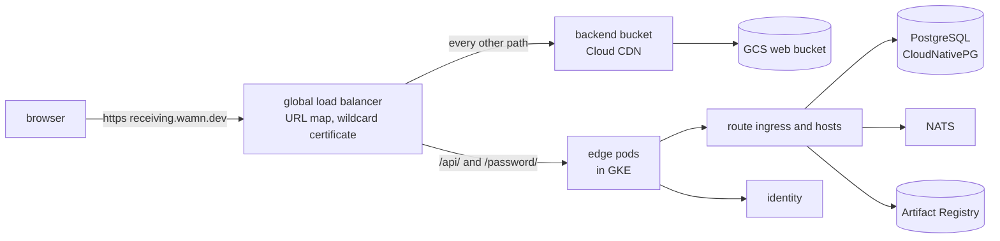

# Google Cloud deployment

This plan deploys the platform and its first application to Google Cloud for the first time.
Beads issue `wamn-ghx2` holds the work, and it becomes an epic after the owner review.
It is a proposal. Nothing is created in the project until the owner accepts it, and each step below waits for its own start.
The rules of the web host come from [web deployment](web-deployment.md).

## 1. What exists

The owner created these on 2026-09-25, and they cost almost nothing while no workload runs.

| Item | Value |
| --- | --- |
| Project | `wamn-dev`, display name `wamn`, number `540250462877`, no organization |
| Billing | account `01E392-13CC0D-277806`, linked |
| Enabled APIs | `dns.googleapis.com` and the defaults of a new project |
| DNS | public Cloud DNS zone `wamn-dev` for `wamn.dev`, delegated by the `.dev` registry since 2026-09-25 21:31 EDT |
| DNS records | the Namecheap mail forwarding records, copied: five `eforward` MX records and one SPF TXT record |
| Certificate issuer | Let's Encrypt, contact `dkkloimwieder@gmail.com` |

## 2. One subdomain per application

Owner ruling of 2026-09-25: each deployed application first gets its own subdomain, for example `receiving.wamn.dev`, because many applications will be tested.
This replaces decision 3.2 of [web deployment](web-deployment.md) for Google Cloud testing.
It has these consequences:

- Each application publishes its release with `--route-host <app>.wamn.dev`.
- The session cookies have no `Domain`, so each subdomain holds its own session. A person signs in to each application separately.
- One wildcard certificate for `*.wamn.dev` covers every application. Let's Encrypt issues a wildcard certificate only through the DNS challenge, which the Cloud DNS zone supports.
- The load balancer gets one host rule per application, and each host serves the web client path of its own release.
- The edge chart takes one host today. It needs a list of applications, each with a host and a bucket path, before a second application deploys. That change is step 5 below.

## 3. The shape



The kind edge case already tests the edge rules. Only the load balancer, the bucket and the certificate are new.

## 4. Product choices and why

| Need | Choice | Why | Rejected alternative |
| --- | --- | --- | --- |
| Kubernetes | GKE Standard, one zone | The Config Connector add-on runs only on Standard clusters. The runtime operator and the hosts run as they do in kind, with no Autopilot pod restrictions to test first. One zonal cluster per billing account gets the monthly management credit, which covers its management fee. | Autopilot: needs Config Connector installed by hand, and its pod rules are unmeasured for the hosts. A regional cluster: three times the nodes, and no credit. |
| Region | `us-east4` (Virginia) | It is the default region of your gcloud configuration, and it is near you. | `us-central1`: about 10 percent cheaper machines, but farther away. Changing the region is one value. |
| Machines | `e2-standard-4` (4 vCPU, 16 GB) on demand for a full test, `e2-standard-2` Spot for a limited test | Each host requests 2 CPU, and a full test runs two hosts, identity, PostgreSQL, NATS, the operators and the edge. Three 4 vCPU nodes hold that with room, as the 8-core kind machine does. | Larger machines: no measurement asks for them. |
| Google Cloud resources | Config Connector, rendered by the edge chart | The chart already renders the load balancer, the bucket and the certificate from one values file, and Helm installs and removes them with the rest. | Terraform: not installed here, and a second tool with its own state. |
| PostgreSQL | CloudNativePG in the cluster, PostgreSQL 18 | The repository already owns its manifests and its [backup and recovery runbook](../operations/backup-and-recovery.md). Provisioning creates a database and roles per project environment, as it does in kind. | Cloud SQL: its limited superuser can refuse the role and ownership work that provisioning does, and no test here covers that. |
| Backups | CloudNativePG backups to a GCS bucket | The runbook uses an object store, and GCS serves the S3 API. | None for a test deployment. |
| NATS | In the cluster, from `deploy/infra` | Google Cloud has no managed NATS. | None. |
| Images and components | Artifact Registry in `us-east4` | It stores container images and OCI artifacts. It replaces the kind registry for the host and identity images and for the component and release artifacts. It uses Google Cloud identity, with no password file. | A registry in the cluster: one more stateful workload to back up. |
| Web files | GCS bucket behind a Cloud CDN backend bucket | This is decision 3.1 of web deployment. `wamn web upload` writes to it through the S3 API with an HMAC key. | None. |
| Load balancer | Global external Application Load Balancer | Its URL map sends paths to the edge or to the bucket, rewrites paths, and serves Cloud CDN. | The classic load balancer: it has no path template rewrite. |
| Certificate | cert-manager with a Let's Encrypt DNS challenge on the Cloud DNS zone | A wildcard certificate needs the DNS challenge, and cert-manager renews it. It needs a service account that can change records in the zone. | Google-managed certificates: no wildcard without Certificate Manager DNS authorization, and a second renewal system. |
| Mail | No real mail at first. The first accounts take their invitation from the database, as the kind edge case does. | A real sender needs a Resend key and records for a verified sender on `wamn.dev`. | Resend now: the owner decides on it once real users need invitations. |

## 5. Steps

Each step ends with a test of its result. Unless the next step follows on the same day, each step also ends with the shutdown of section 8.

1. Enable the APIs: Compute Engine, Kubernetes Engine, Cloud Storage, Artifact Registry, IAM. Create the Artifact Registry repository and the two buckets (web files and backups). Nothing runs yet.
2. Create the GKE cluster with the Config Connector add-on and Workload Identity. Install cert-manager, the Let's Encrypt `ClusterIssuer` for the DNS challenge, and the `*.wamn.dev` certificate. Make sure that the certificate is ready.
3. Build and push the host and identity images and the Receiving components to Artifact Registry. Install the runtime operator, NATS and CloudNativePG, then identity and the hosts, with values files for Google Cloud. Provision Receiving and publish its release with `--route-host receiving.wamn.dev`.
4. Upload the Receiving client with `wamn web upload`. Install the edge chart with the Google Cloud values. Add the DNS record for `receiving.wamn.dev`. In a browser, sign in and complete a supplier change. Measure a CDN hit on an asset and no CDN on `/api`.
5. Change the edge chart to take a list of applications, each with its host and bucket path, and deploy a second application beside Receiving.

Each step writes its commands into a new operations page, `docs/operations/gcp.md`, so the next deployment repeats them.

## 6. Cost

The prices are approximate on-demand list prices in `us-east4`, from memory.
Before step 2, make sure that they are current in the Google Cloud pricing calculator.

| Item | Full test | Limited test |
| --- | --- | --- |
| Nodes | 3 x `e2-standard-4`, about 0.15 USD an hour each | 2 x `e2-standard-2` Spot, about 0.02 to 0.03 USD an hour each |
| Cluster management | 0.10 USD an hour, covered by the zonal credit | the same |
| Load balancer | about 0.025 USD an hour for the forwarding rule, and a small charge per GB | the same, only while it exists |
| Disks | about 0.04 USD per GB each month (balanced) | the same. The disks stay after the nodes scale to 0. |
| Cloud DNS | 0.20 USD a month for the zone | the same |
| GCS, Artifact Registry, CDN egress | cents for a test | the same |
| Total while running | about 0.50 USD an hour, about 360 USD a month for a cluster that never stops | about 0.10 USD an hour |

Two test hours a day on five days cost about 5 USD a week in full mode. In limited mode, they cost about 1 USD.
While nothing runs, the disks, the buckets, the registry and the DNS zone cost a few USD a month.

## 7. Limited mode

A limited test runs the same platform on less, for a short time.

- Use a node pool of 2 x `e2-standard-2` Spot machines. Google can stop a Spot machine at any time, and a test then repeats.
- Run one host replica with a request of 0.5 CPU, not two replicas with 2 CPU. The Google Cloud values file sets it. The kind values stay as they are.
- Run NATS with one replica and stream replicas 1, and CloudNativePG with one instance. The environment configuration declares the stream replicas, so it states 1.
- Keep boot disks at 30 GB, not the default 100 GB.
- Scale the node pool to 0 after each session. The cluster and its disks stay, and the next session scales it up again in a few minutes.
- If the next session is more than a day away, delete the load balancer. Helm installs it again.
- Set a budget alert on the billing account before step 2. Section 8 gives the command.

## 8. Shutdown

Use the level that fits. Each level lists its commands and a test of the result.
Run every command against `--project wamn-dev`.

### 8.1 Budget alert, before anything runs

Create an alert that mails the billing account owner at 50, 90 and 100 percent of 50 USD a month.
An alert does not stop anything. It only sends mail.

```bash
gcloud billing budgets create --billing-account=01E392-13CC0D-277806 \
  --display-name="wamn-dev" --budget-amount=50USD \
  --filter-projects=projects/wamn-dev \
  --threshold-rule=percent=0.5 --threshold-rule=percent=0.9 --threshold-rule=percent=1.0
```

### 8.2 Pause: stop the machines, keep everything else

The cluster, its disks and the load balancer stay. Only the machines stop.

```bash
gcloud container clusters resize wamn --project wamn-dev --zone us-east4-a \
  --node-pool default-pool --num-nodes 0
```

Make sure that no machine runs:

```bash
gcloud compute instances list --project wamn-dev
```

To resume, run the same resize with the node count of the mode.

### 8.3 Stop the load balancer

Uninstall the edge chart while the cluster runs. Config Connector then deletes the Google Cloud resources that it created.
Do this before 8.4. If the cluster goes first, nothing deletes those resources, and they keep costing money.

```bash
helm uninstall wamn-edge --namespace <namespace>
gcloud compute forwarding-rules list --project wamn-dev --global
gcloud compute addresses list --project wamn-dev --global
```

Both lists must be empty.

### 8.4 Delete the cluster

```bash
gcloud container clusters delete wamn --project wamn-dev --zone us-east4-a
```

The disks of the PostgreSQL and NATS volumes can outlive the cluster. List them.
When their data is no longer needed, delete them:

```bash
gcloud compute disks list --project wamn-dev
gcloud compute disks delete <disk> --project wamn-dev --zone us-east4-a
```

Then make sure that no load balancer part remains. Delete each part that remains:

```bash
gcloud compute forwarding-rules list --project wamn-dev --global
gcloud compute target-https-proxies list --project wamn-dev
gcloud compute url-maps list --project wamn-dev
gcloud compute backend-services list --project wamn-dev --global
gcloud compute backend-buckets list --project wamn-dev
gcloud compute health-checks list --project wamn-dev --global
gcloud compute ssl-certificates list --project wamn-dev --global
gcloud compute addresses list --project wamn-dev --global
gcloud compute network-endpoint-groups list --project wamn-dev
```

### 8.5 Stop all billing at once

If costs must stop now, unlink billing.
Google then stops the billable services of the project, and it can delete their resources.
The project, its DNS zone and its configuration stay.

```bash
gcloud billing projects unlink wamn-dev
```

To end everything, delete the project. It can be restored for 30 days.

```bash
gcloud projects delete wamn-dev
```

The DNS zone goes with the project. Before you delete it, set the Namecheap name servers back to Namecheap, or `wamn.dev` stops resolving, and mail forwarding stops with it.

## 9. Out

- Real invitation mail.
- A second environment, for example staging and production.
- A regional cluster or more than one PostgreSQL instance.
- CI that deploys.
