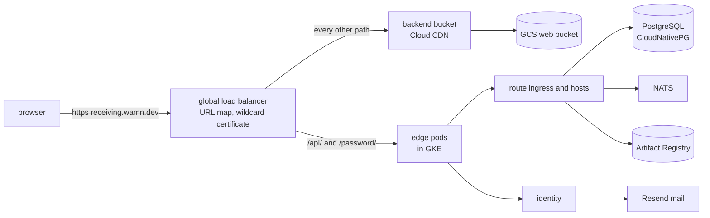

# Google Cloud deployment

This plan is Epic 23. It deploys the platform and its first application to Google Cloud for the first time.
Beads epic `wamn-ghx2` holds the work, with one issue for each step of section 5.
The owner reviewed the plan on 2026-09-25, and each step waits for its own start.
The rules of the web host come from [web deployment](web-deployment.md).
The commands of each finished step are in [Google Cloud operations](../operations/gcp.md).

## 1. What exists

The owner created these on 2026-09-25, and they cost almost nothing while no workload runs.

| Item | Value |
| --- | --- |
| Project | `wamn-dev`, display name `wamn`, number `540250462877`, no organization |
| Billing | account `01E392-13CC0D-277806`, linked |
| Enabled APIs | `dns.googleapis.com` and the defaults of a new project |
| DNS | public Cloud DNS zone `wamn-dev` for `wamn.dev`, delegated by the `.dev` registry since 2026-09-25 21:31 EDT |
| DNS records | the Namecheap mail forwarding records, copied: five `eforward` MX records and one SPF TXT record |
| Certificate issuer | Let's Encrypt, contact `dkkloimwieder@gmail.com` |
| Region | `us-central1`, zone `us-central1-a` |

## 2. One subdomain per application

Owner ruling of 2026-09-25: each deployed application first gets its own subdomain, for example `receiving.wamn.dev`, because many applications will be tested.
This replaces decision 3.2 of [web deployment](web-deployment.md) for Google Cloud testing.
It has these consequences:

- Each application publishes its release with `--route-host <app>.wamn.dev`.
- The session cookies have no `Domain`, so each subdomain holds its own session. A person signs in to each application separately.
- One wildcard certificate for `*.wamn.dev` covers every application. Let's Encrypt issues a wildcard certificate only through the DNS challenge, which the Cloud DNS zone supports.
- The load balancer gets one host rule per application, and each host serves the web client path of its own release.
- The edge chart takes one host today. It needs a list of applications, each with a host and a bucket path, before a second application deploys. That change is step 5 below.

## 3. The shape



The kind edge case already tests the edge rules. Only the load balancer, the bucket and the certificate are new.

## 4. Product choices and why

| Need | Choice | Why | Rejected alternative |
| --- | --- | --- | --- |
| Kubernetes | GKE Standard, one zone | The runtime operator and the hosts run as they do in kind, with no Autopilot pod restrictions to test first. One zonal cluster per billing account gets the monthly management credit, which covers its management fee. | Autopilot: its pod rules are unmeasured for the hosts. A regional cluster: three times the nodes, and no credit. |
| Region | `us-central1` (Iowa), zone `us-central1-a` | Owner ruling of 2026-09-25. It is among the cheapest regions for the machines below. | None. |
| Machines | 2 x `e2-standard-2` Spot, or 1 x `e2-standard-4` Spot | This is the only mode. Section 7 gives its rules. The benchmark of section 6 measures the machines. Only a measured need brings back a larger mode. | 3 x `e2-standard-4` on demand: removed until a measurement asks for it. |
| Disks | `pd-standard`, for the boot disks and the volumes | It costs less than half of `pd-balanced`. A test deployment has no disk speed target. | `pd-balanced`, the GKE default: 2.5 times the price. |
| Google Cloud resources | `gcloud` commands in [Google Cloud operations](../operations/gcp.md) | Section 4.1 gives the reasons. | Config Connector. Terraform: not installed here, and a second tool with its own state. |
| PostgreSQL | CloudNativePG in the cluster, PostgreSQL 18, one instance | The repository already owns its manifests and its [backup and recovery runbook](../operations/backup-and-recovery.md). Provisioning creates a database and roles per project environment, as it does in kind. | Cloud SQL: its limited superuser can refuse the role and ownership work that provisioning does, and no test here covers that. |
| Backups | CloudNativePG backups to a GCS bucket | The runbook uses an object store, and GCS serves the S3 API. | None for a test deployment. |
| NATS | In the cluster, from `deploy/infra` | Google Cloud has no managed NATS. | None. |
| Images and components | Artifact Registry in `us-central1` | It stores container images and OCI artifacts. It replaces the kind registry for the host and identity images and for the component and release artifacts. It uses Google Cloud identity, with no password file. | A registry in the cluster: one more stateful workload to back up. |
| Web files | GCS bucket behind a Cloud CDN backend bucket | This is decision 3.1 of web deployment. `wamn web upload` writes to it through the S3 API with an HMAC key. | None. |
| Load balancer | Global external Application Load Balancer | Its URL map sends paths to the edge or to the bucket, rewrites paths, and serves Cloud CDN. | The classic load balancer: it has no path template rewrite. |
| Certificate | cert-manager with a Let's Encrypt DNS challenge on the Cloud DNS zone | A wildcard certificate needs the DNS challenge, and cert-manager renews it. It needs a service account that can change records in the zone. | Google-managed certificates: no wildcard without Certificate Manager DNS authorization, and a second renewal system. |
| Mail | Resend, sending from `noreply@wamn.dev` | Identity sends real invitations, so the first account signs up by email. The Resend domain records go into the Cloud DNS zone, and the API key goes into a Kubernetes secret that the owner creates (section 4.2). | Invitations from the database: the kind edge case already tests that path. |

### 4.1 Config Connector is replaced

Owner question of 2026-09-25: measure the CPU of Config Connector on the 2-node pool, or replace it with `gcloud` commands.
This plan replaces it. The edge chart renders no Google Cloud resource, and step 4 removes its Config Connector template.
These are the reasons:

- Config Connector runs a controller in the cluster, and the pool has about 4 CPU and 12 GB for everything.
- Config Connector needs a service account with rights to change most resources of the project. The `gcloud` commands run as the owner, one visible command at a time.
- A cluster deleted before its Config Connector resources leaves them running and billing. The `gcloud` commands have a matching delete list in the operations page.

The endpoint groups stay. GKE creates them from the annotation on the edge Service, without Config Connector.

### 4.2 The mail secret

Owner ruling of 2026-09-25: the owner creates the Resend API key and puts it into the cluster. Step 3 tells the owner the namespace of identity and the moment that it needs the key.
The secret has this name and shape:

| Field | Value |
| --- | --- |
| Kind | `Secret`, type `Opaque` |
| Name | `identity-resend` |
| Namespace | the namespace of the identity release |
| Key | `api-key`, the Resend API key |

The identity values then set `resendSecret: identity-resend` and `resendFrom: noreply@wamn.dev`.
To create it without the key in the shell history, write the key to a file first:

```bash
kubectl create secret generic identity-resend --namespace <identity namespace> \
  --from-file=api-key=<file that holds the key>
```

## 5. Steps

Each step ends with a test of its result. Unless the next step follows on the same day, each step also ends with the pause of section 9.2.
Each step writes its commands into [Google Cloud operations](../operations/gcp.md), so the next deployment repeats them.

1. Cost controls and storage, before anything runs. Enable the APIs. Lower the quotas of section 8.1. Create the guard of section 8.2: the Pub/Sub topic, the guard function, the budget and the daily scale-to-zero job. Test the unlink of billing once for real. Create the Artifact Registry repository and the two buckets (web files and backups). No machine runs.
2. Create the GKE cluster with Workload Identity and no Config Connector. Its one node pool `main` has the rules of section 7. Install cert-manager, the Let's Encrypt `ClusterIssuer` for the DNS challenge, and the `*.wamn.dev` certificate. Make sure that the certificate is ready, then scale `main` to 0. Section 5.1 gives the owner rulings of this step.
3. Add the Resend domain records to the Cloud DNS zone, and make sure that Resend reports the domain as verified. Build and push the host and identity images and the Receiving components to Artifact Registry. Install the runtime operator, NATS and CloudNativePG, then identity and the hosts, with values files for Google Cloud. The owner creates the secret of section 4.2. The identity values name it and the sender `noreply@wamn.dev`. Provision Receiving and publish its release with `--route-host receiving.wamn.dev`.
4. Remove the Config Connector template from the edge chart. Upload the Receiving client with `wamn web upload`. Install the edge chart with the Google Cloud values. Create the bucket read access, the backend bucket, the backend service, the URL map, the certificate, the address and the forwarding rule with `gcloud`. Add the DNS record for `receiving.wamn.dev`. Send an invitation by email, then sign up and sign in from the mail in a browser. Complete a supplier change. Measure a CDN hit on an asset and no CDN on `/api`.
5. Change the edge chart to take a list of applications, each with its host and bucket path. Deploy a second application beside Receiving.

### 5.1 Step 2 rulings

Owner rulings of 2026-09-25:

- The cluster `wamn` runs on the VPC `wamn`, subnet `wamn-us-central1`: primary range `10.10.0.0/24`, secondary ranges `pods` `10.20.0.0/16` and `services` `10.30.0.0/20`. The VPC has no firewall rule of ours. GKE adds its own, and step 4 adds the health check rule. There is no SSH rule. The first attempts on the `default` network failed, and [Google Cloud operations](../operations/gcp.md) records them.
- gcloud cannot name the first pool of a new cluster. The cluster starts with a temporary `default-pool` of 1 Spot node. Step 2 adds `main` and then deletes `default-pool`.
- The cluster uses the regular release channel.
- The nodes run as the service account `wamn-nodes`, with only `roles/logging.logWriter`, `roles/monitoring.metricWriter` and `roles/artifactregistry.reader`. The Compute default account has Editor on the project, so the nodes do not use it.
- GKE sends system logs only. Workload logs and Managed Prometheus are off. The free logging tier of 50 GiB a month is the ceiling, not the target.
- The cert-manager Kubernetes service account gets `roles/dns.admin` on zone `wamn-dev` only, through Workload Identity. There is no Google service account and no key.
- The ClusterIssuer is `letsencrypt`. The Certificate and its secret are `wamn-edge-tls`, in namespace `edge`.
- The issuer first uses the Let's Encrypt staging server, then production, so a mistake does not use the production rate limit of `*.wamn.dev`.

### 5.2 Step 3 procedure

The kind cluster cases are not a deployment to repeat on GKE. They run PostgreSQL, the event NATS, the OCI registry and MinIO as local Docker containers, and they provision and publish through library calls inside the test process.
Step 3 uses the command path of [deployment](../operations/deployment.md) and [repository delivery](../operations/delivery.md) instead, with the standing manifests in `deploy/infra` and `deploy/platform`.
This is the order. Section 5.3 gives the owner rulings.

1. Scale `main` to 2.
2. Build the host and identity images with `tools/journey-image-cache`, and push them to `us-central1-docker.pkg.dev/wamn-dev/wamn`. The nodes pull them as `wamn-nodes`, with `roles/artifactregistry.reader`.
3. Build the Receiving components with `tools/build-components`, which applies the path remapping of `tools/guest-rustflags`, so the digests match a local build.
4. Install the runtime operator chart `2.10.0` with `deploy/infra/values-wamn.yaml`, and the internal CA of `deploy/infra/wasmcloud-ca-issuer.yaml`.
5. Install the event NATS from `deploy/infra/nats-jetstream.yaml` with one replica, and declare stream replicas 1 in the environment configuration.
6. Install CloudNativePG from `deploy/infra/cnpg-operator.yaml` and one cluster with one instance on the storage class `standard` (`pd-standard`).
7. Apply `deploy/sql/system-schema.sql` as `wamn_system`, and set `registry.meta.platform_domain`.
8. Run the provisioning verbs of [deployment ordering](../operations/deployment.md#deployment-ordering) from this machine, through a port-forward to PostgreSQL: `provision-org`, `provision-project-env`, `provision-identity-issuer`, `apply-package`, `reconcile-package-data-access`, `push-component`, `reconcile-run-plane`.
9. The owner creates the Resend secret of section 4.2. Then install identity with `deploy/platform/identity`, and the host with one replica at a request of 0.5 CPU.
10. Publish the Receiving release with `--route-host receiving.wamn.dev`, and point the host at its manifest digest.
11. Make sure that the host serves the release through a port-forward. Scale `main` to 0.

Each command goes into section 3 of [Google Cloud operations](../operations/gcp.md) as it runs.

### 5.3 Step 3 rulings

Owner rulings of 2026-09-26:

- Publish with `publish-release` directly. The first cloud deployment is not a release qualification, and the qualified path repeats the kind cases that already ran.
- No service account key. The host pods run as a Kubernetes service account that Workload Identity binds to a Google service account with `roles/artifactregistry.reader`, and there is no docker config Secret. If the component pull cannot use Workload Identity today, that is a finding, and a CronJob refreshes a short-lived token. A key is never the answer.
- One CloudNativePG cluster with one instance holds the system database and the tenant databases as separate databases. Two clusters are the production shape, not the test shape.
- Namespaces: `platform` (operator, NATS, CloudNativePG), `identity`, `hosts` and `edge`. Organization `wamn`, project `receiving`, tenant `dev`, environment `dev`.
- The platform domain of the principal rows is `wamn.dev`.
- Identity uses the internal CA of the cluster for its TLS. The public `*.wamn.dev` certificate ends at the edge.
- The CDC reader and the materializer run as workloads.
- Tempo and the OpenTelemetry collector are left out. Observability comes with a later epic.
- CloudNativePG backups come later. The operations page states that they are not configured.
- The event NATS users and permissions come from a small example program that calls `event_broker::prepare` of `test-support/infrastructure`. A hand-written file would state again what the program derives. If the program cannot run outside the test crate, that is a finding, and the interim is a file that holds the program output verbatim, with its command in the operations page.
- The host pulls components with a short-lived Artifact Registry token that a CronJob refreshes into the docker config Secret, because the host cannot use Workload Identity for that pull (finding `wamn-i87m`). The CronJob runs as a Kubernetes service account that Workload Identity binds to a Google service account with only `roles/artifactregistry.reader`.

## 6. Benchmark

A separate issue of the epic builds `tools/bench`, a benchmark tool that runs from any machine over HTTPS against a deployed host.
It drives the Receiving route interface: a read, a write, and a list at the seed of 1000 rows.
Each run has a stated concurrency and duration.
Each run writes one JSON file with p50, p95 and p99 latency, throughput and error rate, tagged with the tier.

| Tier | Nodes |
| --- | --- |
| 1 | 1 x `e2-standard-2` Spot |
| 2 | 2 x `e2-standard-2` Spot |
| 3 | 1 x `e2-standard-4` Spot |
| 4 | 2 x `e2-standard-4` on demand |

Each tier gets one scale-up, one run and one scale-down, and its result file goes under `tests/bench/`.
The node choice of section 7 follows the results.
Tier 4 uses all 8 CPU of the quota, so no other machine runs at the same time.

## 7. The only mode

A test deployment runs on little, for a short time. There is no other mode until a measured run needs one.

- The node pool `main` has 2 x `e2-standard-2` Spot machines, or 1 x `e2-standard-4` Spot. Google can stop a Spot machine at any time, with a notice of 30 seconds, and a test then repeats.
- The pool has no autoscaler, because an autoscaler starts nodes again for pending pods after a scale to 0. Its size is at most 2, and you set it by hand.
- The pool upgrades with a surge of 0 and one unavailable node, so an upgrade does not pass the CPU quota.
- The boot disks are `pd-standard`, 30 GB, not the default 100 GB `pd-balanced`.
- The volumes of PostgreSQL and NATS use the GKE storage class `standard`, which is `pd-standard`. The default class `standard-rwo` is `pd-balanced`, and the SSD quota of section 8.1 refuses it.
- One host replica runs with a request of 0.5 CPU, not two replicas with 2 CPU. The Google Cloud values file sets it. The kind values stay as they are.
- NATS runs with one replica and stream replicas 1. The environment configuration declares the stream replicas, so it states 1.
- Scale the node pool to 0 after each session. The cluster and its disks stay, and the next session scales it up again in a few minutes.
- If the next session is more than a day away, delete the load balancer with the commands of the operations page.

### 7.1 One PostgreSQL instance on Spot machines

CloudNativePG runs one instance, and its node can stop at any time.
This is the result:

- When Google stops the node, PostgreSQL stops without a clean shutdown. It recovers from its write-ahead log at the next start, as after a power loss. A committed transaction survives.
- The volume is a zonal disk. If the node stops, the disk stays. The pod starts again on a node in the same zone, and the database is down until then.
- With 2 nodes, the other node can take the pod. With 1 node, the database is down until Google gives the pool a machine again.
- Nothing fails over. The platform returns errors while the database is down, and a test run in that time fails.
- The backups in the GCS bucket are the only copy outside the disk. If the disk is lost, the recovery of the backup runbook restores the last archived state.

This is acceptable for test data. It is not acceptable for data that a person needs to keep.

## 8. Cost controls

Each control acts on the project `wamn-dev` only. No control acts on the billing account or on a list of projects.
Billing data reaches the budget hours late. The quotas are the hard cap, and the guard is the backstop.

### 8.1 Quotas, the hard cap

Step 1 lowers these Compute Engine quotas of `wamn-dev` through the Cloud Quotas API. Google refuses a request that passes a quota, so no bill can grow past them.

| Quota | Scope | Value | Result |
| --- | --- | --- | --- |
| CPUs, all regions | project | 8 | At most 2 x `e2-standard-4`, in any region. |
| CPUs | `us-central1` | 8 | The same, in the region. |
| Global static IP addresses | project | 1 | One load balancer address. |
| Standard disk | `us-central1` | 200 GB | Every boot disk and volume together. |
| SSD disk | `us-central1` | 0 GB | No disk escapes the 200 GB cap through `pd-balanced` or `pd-ssd`. |

Owner ruling of 2026-09-25: the SSD quota stays at 0, and every boot disk and volume is `pd-standard` for now. Only a measured run that needs SSD raises the SSD quota.
The preemptible CPU quota of `us-central1` is 0 by design. With 0, Spot machines count against the standard CPU quota, so the CPU quota of 8 is the one regional limit for every machine. Owner ruling of 2026-09-26: do not raise it. Once a region has preemptible quota, Spot machines count only against that quota, and the region then allows 8 standard CPUs and the Spot CPUs on top. Source: [Preemptible VM instances](https://docs.cloud.google.com/compute/docs/instances/preemptible).
The disk quotas are regional. The CPU quota of all regions stops a machine in any other region, so a disk elsewhere has no machine to use it.

### 8.2 The guard

If the budget runs out, the guard stops the machines and then billing. It has four parts, all in `wamn-dev`:

- A Pub/Sub topic `wamn-guard`.
- One budget of 150 USD a month on billing account `01E392-13CC0D-277806`, filtered to `wamn-dev`. Section 8.3 gives the amount. Owner ruling of 2026-09-25: it counts cost before credits, so the guard acts on gross spend. At 50, 90 and 100 percent it mails the billing administrators, and it publishes every update to `wamn-guard`.
- A Cloud Run function `wamn-guard` on the topic, with its own service account. It reads the project id `wamn-dev`, the zone and the cluster name `wamn` from its `config.json`, and a message cannot change them. From 50 percent of the budget, it sets every node pool of cluster `wamn` to 0 nodes. From 100 percent, it unlinks the billing account from `wamn-dev`, as section 9.5 does by hand.
- A Cloud Scheduler job that publishes a scale-to-zero message to `wamn-guard` once a day, at 03:00 America/New_York. A session that you forget stops by the next morning.

Owner ruling of 2026-09-25: the guard stops every node pool of cluster `wamn`, benchmark pools included, because a guard that spares a pool is not a guard.
The source of the function is Python in `deploy/gcp/guard`. Its test feeds it a fake budget message for each threshold.
Step 1 also tests the 100 percent action for real, once, before any workload exists. It publishes a fake 100 percent message, sees billing unlink, links billing again at once, and makes sure that the project serves again.

The service account of the function has two grants, both on the project `wamn-dev`. A custom role allows it to read the cluster and set a node pool size. Project Billing Manager allows it to unlink billing from this project. It has no grant on the billing account.

### 8.3 The budget amount

Owner ruling of 2026-09-25: the budget is 150 USD, and it counts cost before credits. Do not lower it to 50 USD without this arithmetic.

- The GKE management fee is 0.10 USD an hour for each hour that the cluster exists, also at 0 nodes. A month has about 720 hours, so the fee is about 72 USD.
- The zonal credit pays the fee back on the invoice. The budget counts cost before credits, so it sees the full 72 USD.
- With a budget of 50 USD, the fee alone reaches 50 percent in about 10 days and 100 percent in about 21 days. The guard then unlinks billing, although no machine ran.
- With 150 USD, the fee leaves 150 - 72 = 78 USD of real spend. At about 0.11 USD an hour for 2 x `e2-standard-2` Spot and the load balancer, that is about 700 hours.
- The 50 percent line is 75 USD. A cluster that stands all month reaches it only near the end, with little other spend, and the guard then stops the pools, which costs nothing.

## 9. Shutdown

Use the level that fits. Each level lists its commands and a test of the result.
Run every command against `--project wamn-dev`.

### 9.1 The guard, before anything runs

Step 1 creates the guard of section 8.2. It stops the machines at 50 percent of the budget, and it unlinks billing at 100 percent. Section 8.3 gives the amount.
The operations page lists its commands.

### 9.2 Pause: stop the machines, keep everything else

The cluster, its disks and the load balancer stay. Only the machines stop.

```bash
gcloud container clusters resize wamn --project wamn-dev --zone us-central1-a \
  --node-pool main --num-nodes 0
```

Make sure that no machine runs:

```bash
gcloud compute instances list --project wamn-dev
```

To resume, run the same resize with the node count of section 7.

### 9.3 Stop the load balancer

Delete the load balancer parts with the delete list of the operations page, in its order.
Then make sure that both lists are empty:

```bash
gcloud compute forwarding-rules list --project wamn-dev --global
gcloud compute addresses list --project wamn-dev --global
```

### 9.4 Delete the cluster

```bash
gcloud container clusters delete wamn --project wamn-dev --zone us-central1-a
```

The disks of the PostgreSQL and NATS volumes can outlive the cluster. List them.
When their data is no longer needed, delete them:

```bash
gcloud compute disks list --project wamn-dev
gcloud compute disks delete <disk> --project wamn-dev --zone us-central1-a
```

The endpoint groups of the edge can also outlive the cluster. Then make sure that no load balancer part remains. Delete each part that remains:

```bash
gcloud compute forwarding-rules list --project wamn-dev --global
gcloud compute target-https-proxies list --project wamn-dev
gcloud compute url-maps list --project wamn-dev
gcloud compute backend-services list --project wamn-dev --global
gcloud compute backend-buckets list --project wamn-dev
gcloud compute health-checks list --project wamn-dev --global
gcloud compute ssl-certificates list --project wamn-dev --global
gcloud compute addresses list --project wamn-dev --global
gcloud compute network-endpoint-groups list --project wamn-dev
```

### 9.5 Stop all billing at once

If costs must stop now, unlink billing.
Google then stops the billable services of the project, and it can delete their resources.
The project, its DNS zone and its configuration stay.

```bash
gcloud billing projects unlink wamn-dev
```

To end everything, delete the project. It can be restored for 30 days.

```bash
gcloud projects delete wamn-dev
```

The DNS zone goes with the project. Before you delete it, set the Namecheap name servers back to Namecheap, or `wamn.dev` stops resolving, and mail forwarding stops with it.

## 10. Cost

Step 1 read these list prices in `us-central1` from the Cloud Billing catalog on 2026-09-25. The GKE management fee and the zonal credit come from the GKE price page.
A machine price is the sum of its CPU price and its memory price.

| Item | Price | 2 x `e2-standard-2` Spot |
| --- | --- | --- |
| Nodes | `e2-standard-2`: 0.040 USD an hour Spot, 0.067 on demand. `e2-standard-4`: 0.080 USD an hour Spot, 0.134 on demand. | 0.080 USD an hour |
| Node external addresses | 0.0025 USD an hour on a Spot machine, 0.005 on demand | 0.005 USD an hour |
| Cluster management | 0.10 USD an hour, covered by the zonal credit | 0 |
| Load balancer | 0.025 USD an hour for the first forwarding rule, and a small charge per GB | 0.025 USD an hour, only while it exists |
| Disks | `pd-standard` 0.04 USD per GB each month, after 30 free GB. `pd-balanced` is 0.10 USD. | 2 x 30 GB boot and about 20 GB of volumes: about 2 USD a month. The disks stay after the nodes scale to 0. |
| Cloud DNS | 0.20 USD a month for the zone | the same |
| GCS, Artifact Registry, CDN egress, the guard | cents for a test | the same |
| Resend | free up to its monthly limit | 0 |
| Total while running | | about 0.11 USD an hour |

Two test hours a day on five days cost about 1.10 USD a week.
Tier 4 of the benchmark, 2 x `e2-standard-4` on demand, costs about 0.30 USD an hour.
While nothing runs, the disks, the buckets, the registry and the DNS zone cost a few USD a month.

## 11. Out

- A second environment, for example staging and production.
- A regional cluster or more than one PostgreSQL instance.
- A mode with larger or on-demand machines, until the benchmark measures a need.
- CI that deploys.
