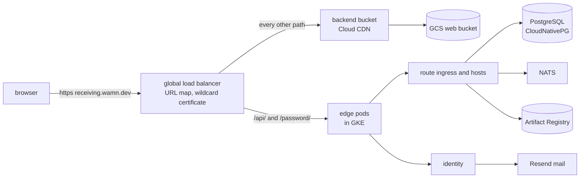

# Google Cloud deployment

This plan is Epic 23. It deploys the platform and its first application to Google Cloud for the first time.
Beads epic `wamn-ghx2` holds the work, with one issue for each step of section 5.
The owner reviewed the plan on 2026-09-25, and each step waits for its own start.
The rules of the web host come from [web deployment](web-deployment.md).
The commands of each finished step are in [Google Cloud operations](../operations/gcp.md).

## 1. What exists

The owner created these on 2026-09-25, and they cost almost nothing while no workload runs.

| Item | Value |
| --- | --- |
| Project | `wamn-dev`, display name `wamn`, number `540250462877`, no organization |
| Billing | account `01E392-13CC0D-277806`, linked |
| Enabled APIs | `dns.googleapis.com` and the defaults of a new project |
| DNS | public Cloud DNS zone `wamn-dev` for `wamn.dev`, delegated by the `.dev` registry since 2026-09-25 21:31 EDT |
| DNS records | the Namecheap mail forwarding records, copied: five `eforward` MX records and one SPF TXT record |
| Certificate issuer | Let's Encrypt, contact `dkkloimwieder@gmail.com` |
| Region | `us-central1`, zone `us-central1-a` |

## 2. One subdomain per application

Owner ruling of 2026-09-25: each deployed application first gets its own subdomain, for example `receiving.wamn.dev`, because many applications will be tested.
This replaces decision 3.2 of [web deployment](web-deployment.md) for Google Cloud testing.
It has these consequences:

- Each application publishes its release with `--route-host <app>.wamn.dev`.
- The session cookies have no `Domain`, so each subdomain holds its own session. A person signs in to each application separately.
- One wildcard certificate for `*.wamn.dev` covers every application. Let's Encrypt issues a wildcard certificate only through the DNS challenge, which the Cloud DNS zone supports.
- The load balancer gets one host rule per application, and each host serves the web client path of its own release.
- The edge chart takes one host today. It needs a list of applications, each with a host and a bucket path, before a second application deploys. That change is step 5 below.

## 3. The shape


```mermaid
flowchart LR
  B[browser] -->|https receiving.wamn.dev| LB[global load balancer<br/>URL map, wildcard certificate]
  LB -->|/api/ and /password/| E[edge pods<br/>in GKE]
  LB -->|every other path| BB[backend bucket<br/>Cloud CDN]
  BB --> GCS[(GCS web bucket)]
  E --> R[route ingress and hosts]
  E --> I[identity]
  I --> M[Resend mail]
  R --> PG[(PostgreSQL<br/>CloudNativePG)]
  R --> N[NATS]
  R --> AR[(Artifact Registry)]
```

The kind edge case already tests the edge rules. Only the load balancer, the bucket and the certificate are new.

## 4. Product choices and why

| Need | Choice | Why | Rejected alternative |
| --- | --- | --- | --- |
| Kubernetes | GKE Standard, one zone | The runtime operator and the hosts run as they do in kind, with no Autopilot pod restrictions to test first. One zonal cluster per billing account gets the monthly management credit, which covers its management fee. | Autopilot: its pod rules are unmeasured for the hosts. A regional cluster: three times the nodes, and no credit. |
| Region | `us-central1` (Iowa), zone `us-central1-a` | Owner ruling of 2026-09-25. It is among the cheapest regions for the machines below. | None. |
| Machines | 2 x `e2-standard-2` Spot, or 1 x `e2-standard-4` Spot | This is the only mode. Section 7 gives its rules. The benchmark of section 6 measures the machines. Only a measured need brings back a larger mode. | 3 x `e2-standard-4` on demand: removed until a measurement asks for it. |
| Disks | `pd-standard`, for the boot disks and the volumes | It costs less than half of `pd-balanced`. A test deployment has no disk speed target. | `pd-balanced`, the GKE default: 2.5 times the price. |
| Google Cloud resources | `gcloud` commands in [Google Cloud operations](../operations/gcp.md) | Section 4.1 gives the reasons. | Config Connector. Terraform: not installed here, and a second tool with its own state. |
| PostgreSQL | CloudNativePG in the cluster, PostgreSQL 18, one instance | The repository already owns its manifests and its [backup and recovery runbook](../operations/backup-and-recovery.md). Provisioning creates a database and roles per project environment, as it does in kind. | Cloud SQL: its limited superuser can refuse the role and ownership work that provisioning does, and no test here covers that. |
| Backups | CloudNativePG backups to a GCS bucket | The runbook uses an object store, and GCS serves the S3 API. | None for a test deployment. |
| NATS | In the cluster, from `deploy/infra` | Google Cloud has no managed NATS. | None. |
| Images and components | Artifact Registry in `us-central1` | It stores container images and OCI artifacts. It replaces the kind registry for the host and identity images and for the component and release artifacts. It uses Google Cloud identity, with no password file. | A registry in the cluster: one more stateful workload to back up. |
| Web files | GCS bucket behind a Cloud CDN backend bucket | This is decision 3.1 of web deployment. `wamn web upload` writes to it with a `gs://` sink and Application Default Credentials, the owner's `gcloud auth application-default login` token. No HMAC key exists. | None. |
| Load balancer | Global external Application Load Balancer | Its URL map sends paths to the edge or to the bucket, rewrites paths, and serves Cloud CDN. | The classic load balancer: it has no path template rewrite. |
| Certificate | cert-manager with a Let's Encrypt DNS challenge on the Cloud DNS zone | A wildcard certificate needs the DNS challenge, and cert-manager renews it. It needs a service account that can change records in the zone. | Google-managed certificates: no wildcard without Certificate Manager DNS authorization, and a second renewal system. |
| Mail | Resend, sending from `noreply@wamn.dev` | Identity sends real invitations, so the first account signs up by email. The Resend domain records go into the Cloud DNS zone, and the API key goes into a Kubernetes secret that the owner creates (section 4.2). | Invitations from the database: the kind edge case already tests that path. |

### 4.1 Config Connector is replaced

Owner question of 2026-09-25: measure the CPU of Config Connector on the 2-node pool, or replace it with `gcloud` commands.
This plan replaces it. The edge chart renders no Google Cloud resource, and step 4 removes its Config Connector template.
These are the reasons:

- Config Connector runs a controller in the cluster, and the pool has about 4 CPU and 12 GB for everything.
- Config Connector needs a service account with rights to change most resources of the project. The `gcloud` commands run as the owner, one visible command at a time.
- A cluster deleted before its Config Connector resources leaves them running and billing. The `gcloud` commands have a matching delete list in the operations page.

The endpoint groups stay. GKE creates them from the annotation on the edge Service, without Config Connector.

### 4.2 The mail secret

Owner ruling of 2026-09-25: the owner creates the Resend API key and puts it into the cluster. Step 3 tells the owner the namespace of identity and the moment that it needs the key.
The secret has this name and shape:

| Field | Value |
| --- | --- |
| Kind | `Secret`, type `Opaque` |
| Name | `identity-resend` |
| Namespace | the namespace of the identity release |
| Key | `api-key`, the Resend API key |

The identity values then set `resendSecret: identity-resend` and `resendFrom: noreply@wamn.dev`.
To create it without the key in the shell history, write the key to a file first:

```bash
kubectl create secret generic identity-resend --namespace <identity namespace> \
  --from-file=api-key=<file that holds the key>
```

## 5. Steps

Each step ends with a test of its result. Unless the next step follows on the same day, each step also ends with the pause of section 9.2.
Each step writes its commands into [Google Cloud operations](../operations/gcp.md), so the next deployment repeats them.

1. Cost controls and storage, before anything runs. Enable the APIs. Lower the quotas of section 8.1. Create the guard of section 8.2: the Pub/Sub topic, the guard function, the budget and the daily scale-to-zero job. Test the unlink of billing once for real. Create the Artifact Registry repository and the two buckets (web files and backups). No machine runs.
2. Create the GKE cluster with Workload Identity and no Config Connector. Its one node pool `main` has the rules of section 7. Install cert-manager, the Let's Encrypt `ClusterIssuer` for the DNS challenge, and the `*.wamn.dev` certificate. Make sure that the certificate is ready, then scale `main` to 0. Section 5.1 gives the owner rulings of this step.
3. Add the Resend domain records to the Cloud DNS zone, and make sure that Resend reports the domain as verified. Build and push the host and identity images and the Receiving components to Artifact Registry. Install the runtime operator, NATS and CloudNativePG, then identity and the hosts, with values files for Google Cloud. The owner creates the secret of section 4.2. The identity values name it and the sender `noreply@wamn.dev`. Provision Receiving and publish its release with `--route-host receiving.wamn.dev`.
4. Remove the Config Connector template from the edge chart. Upload the Receiving client with `wamn web upload`. Install the edge chart with the Google Cloud values. Create the bucket read access, the backend bucket, the backend service, the URL map, the certificate, the address and the forwarding rule with `gcloud`. Add the DNS record for `receiving.wamn.dev`. Send an invitation by email, then sign up and sign in from the mail in a browser. Complete a supplier change. Measure a CDN hit on an asset and no CDN on `/api`.
5. Change the edge chart to take a list of applications, each with its host and bucket path. Deploy a second application beside Receiving.

### 5.1 Step 2 rulings

Owner rulings of 2026-09-25:

- The cluster `wamn` runs on the VPC `wamn`, subnet `wamn-us-central1`: primary range `10.10.0.0/24`, secondary ranges `pods` `10.20.0.0/16` and `services` `10.30.0.0/20`. The VPC has no firewall rule of ours. GKE adds its own, and step 4 adds the health check rule. There is no SSH rule. The first attempts on the `default` network failed, and [Google Cloud operations](../operations/gcp.md) records them.
- gcloud cannot name the first pool of a new cluster. The cluster starts with a temporary `default-pool` of 1 Spot node. Step 2 adds `main` and then deletes `default-pool`.
- The cluster uses the regular release channel.
- The nodes run as the service account `wamn-nodes`, with only `roles/logging.logWriter`, `roles/monitoring.metricWriter` and `roles/artifactregistry.reader`. The Compute default account has Editor on the project, so the nodes do not use it.
- GKE sends system logs only. Workload logs and Managed Prometheus are off. The free logging tier of 50 GiB a month is the ceiling, not the target.
- The cert-manager Kubernetes service account gets `roles/dns.admin` on zone `wamn-dev` only, through Workload Identity. There is no Google service account and no key.
- The ClusterIssuer is `letsencrypt`. The Certificate and its secret are `wamn-edge-tls`, in namespace `edge`.
- The issuer first uses the Let's Encrypt staging server, then production, so a mistake does not use the production rate limit of `*.wamn.dev`.

### 5.2 Step 3 procedure

The kind cluster cases are not a deployment to repeat on GKE. They run PostgreSQL, the event NATS, the OCI registry and MinIO as local Docker containers, and they provision and publish through library calls inside the test process.
Step 3 uses the command path of [deployment](../operations/deployment.md) and [repository delivery](../operations/delivery.md) instead, with the standing manifests in `deploy/infra` and `deploy/platform` and the Google Cloud copies in `deploy/gcp`.
The steps ran in this order. Section 5.3 gives the owner rulings, and section 3 of [Google Cloud operations](../operations/gcp.md) gives each command and its time.

1. Scale `main` to 2.
2. Build the host and identity images with `tools/journey-image-cache`, and push them to `us-central1-docker.pkg.dev/wamn-dev/wamn`. The nodes pull them as `wamn-nodes`, with `roles/artifactregistry.reader`.
3. Build the Receiving components with `tools/build-components`, which applies the path remapping of `tools/guest-rustflags`, so the digests match a local build.
4. Install the runtime operator chart `2.10.0` with `deploy/infra/values-wamn.yaml`, and the internal CA of `deploy/infra/wasmcloud-ca-issuer.yaml`.
5. Run the example program `event_broker_files`, and make the Secrets `evt-nats-authorization` and `evt-nats-bootstrap`. Install the event NATS from `deploy/gcp/nats-jetstream.yaml` with one replica, and run its tap-stream Job. Make the three user Secrets in `platform` and the two host Secrets in `hosts`.
6. Install CloudNativePG from `deploy/infra/cnpg-operator.yaml` and the cluster `wamn-pg` with one instance on the storage class `standard`. Its `initdb` makes the database `wamn_system` with the owner `wamn_system`.
7. Run `wamn-ctl provision-system`, which installs the control store and sets `registry.meta.platform_domain`.
8. Run `provision-org` and `provision-project-env` through a port-forward to PostgreSQL. Apply the role SQL, the `Database`, the privilege SQL and the Secret. Run the NATS program again for org `dkk`, restart the event NATS and run the tap-stream Job again.
9. Run `provision-identity-issuer`, `reconcile-run-plane`, `apply-package`, `reconcile-package-data-access` and `push-component --declaration-template`.
10. Apply the identity certificates and the operator CA, copy the ConfigMap `identity-ca` into `hosts` and `edge`, and apply the session target. The owner creates the Resend Secret of section 4.2. Install identity and make sure that it answers from `hosts`.
11. Prepare generation `a` of the five host credentials. Create the Google service account `wamn-registry-reader` and its bindings, and install the registry token CronJob with a first run by hand.
12. Publish and activate the session key.
13. Mint the management-author PAT through the temporary `/etc/hosts` line and a port-forward to identity.
14. Run `publish-release` with `--route-host receiving.wamn.dev`, `push-release-manifest` and `print-release-env`. Write the host values with the example program `host_values_files`, and install the host with one replica at a request of 0.5 CPU. The host crash-looped until step 15 made the source stream.
15. Run `enable-cdc-project-env`, and apply its role SQL, CDC SQL and Secret. Prepare generation `a` of the registry-reader credential. Build and push the CDC reader image, deploy `deploy/gcp/cdc-reader.yaml`, and restart the host.
16. Make sure that the host serves the release through a port-forward. Scale `main` to 0, unless step 4 follows on the same day.

On 2026-09-27 the daily guard scaled `main` to 0 during step 3, so step 1 ran again. Two steps are temporary: the `/etc/hosts` line of step 13 (finding `wamn-n5d1`), and the `jq` edits of the namespace and the database host in emitted Secrets (findings `wamn-6b4g` and `wamn-lczu`).

### 5.3 Step 3 rulings

Owner rulings of 2026-09-26:

- Publish with `publish-release` directly. The first cloud deployment is not a release qualification, and the qualified path repeats the kind cases that already ran.
- No service account key. The host pods run as a Kubernetes service account that Workload Identity binds to a Google service account with `roles/artifactregistry.reader`, and there is no docker config Secret. If the component pull cannot use Workload Identity today, that is a finding, and a CronJob refreshes a short-lived token. A key is never the answer.
- One CloudNativePG cluster with one instance holds the system database and the tenant databases as separate databases. Two clusters are the production shape, not the test shape.
- Namespaces: `platform` (operator, NATS, CloudNativePG), `identity`, `hosts` and `edge`. Organization `dkk`, the owner's handle, because the org id `wamn` is under the reserved `wamn` prefix. Project `receiving`, tenant `dev`, environment `dev`.
- The platform domain of the principal rows is `wamn.dev`.
- Identity uses the internal CA of the cluster for its TLS. The public `*.wamn.dev` certificate ends at the edge.
- The CDC reader and the materializer run as workloads.
- Tempo and the OpenTelemetry collector are left out. Observability comes with a later epic.
- CloudNativePG backups come later. The operations page states that they are not configured.
- The event NATS users and permissions come from a small example program that calls `event_broker::prepare` of `test-support/infrastructure`. A hand-written file would state again what the program derives. If the program cannot run outside the test crate, that is a finding, and the interim is a file that holds the program output verbatim, with its command in the operations page.
- The host pulls components with a short-lived Artifact Registry token that a CronJob refreshes into the docker config Secret, because the host cannot use Workload Identity for that pull (finding `wamn-i87m`). The CronJob runs as a Kubernetes service account that Workload Identity binds to a Google service account with only `roles/artifactregistry.reader`.
- The example program adds one user after `prepare()`: `tap-admin`. It can publish only `$JS.API.STREAM.INFO.WAMN_TAP`, `$JS.API.STREAM.CREATE.WAMN_TAP`, `$JS.API.STREAM.UPDATE.WAMN_TAP` and `_INBOX_tap-admin.>`, and subscribe only to `_INBOX_tap-admin.>`. The program writes its nats CLI context as `context.json` for the Secret `evt-nats-bootstrap`.
- The program writes only the `authorization` block, as `authorization.conf`, for the Secret `evt-nats-authorization`. It holds the users of `prepare()` and `tap-admin`. The manifest supplies `listen`, `http`, `jetstream` and the `include`.
- The Google Cloud copy of the NATS manifest is `deploy/gcp/nats-jetstream.yaml` in namespace `platform`. It has one replica, no `cluster` block or cluster port, and no anti-affinity spread. It keeps the headless Service and the volume claim. `deploy/infra` does not change.
- The Secret `wamn-event-nats` in `hosts` holds the `runtime` user with the keys of `cluster/deployment.rs`, and `stream_replicas` is `1`. The Secret `wamn-materializer-nats` in `hosts` holds the binding with the server `nats://evt-nats.platform.svc.cluster.local:4222`. The host values and the CDC reader use the same URL.
- The `provisioning` user creates the event streams and consumers in the provisioning step only. Its Secret, and the Secrets of `publisher` and `observer`, stay in `platform` and are never mounted into a host. Their names are `evt-nats-provisioning`, `evt-nats-publisher` and `evt-nats-observer`, with the keys `username` and `password`.
- The CloudNativePG cluster `wamn-pg` bootstraps the database `wamn_system` with the owner `wamn_system`, as `deploy/platform/wamn-sysdb.yaml` does. CloudNativePG holds the owner login in the Secret `wamn-pg-app` and the superuser in `wamn-pg-superuser`.
- A new verb `wamn-ctl provision-system --system-url <superuser URL> --platform-domain wamn.dev` installs the control store from `CONTROL_BOOTSTRAP_SQL` and writes `registry.meta.platform_domain`. It refuses when the schema `registry` exists. It is the first verb of the deployment ordering, and it runs from this machine through a port-forward.
- `deploy/sql/postgres-init.sql` is a test fixture with seed data and is not applied.
- `provision-org` uses `--template trials --pool wamn-pg`, the one template that places an org on the shared cluster.
- `provision-project-env` runs with `--namespace platform --secret-namespace hosts`. The `Database` resource goes to `platform`, the namespace of its `Cluster`. The credential Secret goes to `hosts`, with its `metadata.namespace` set by `jq` until the finding on the one `--namespace` flag is fixed.
- The identity issuer is `https://identity.identity.svc.cluster.local`: release `identity` in namespace `identity`, the form of the kind cases. Its certificate comes from the internal CA and carries that DNS name. The edge sends `/password` there and checks the CA through `identityCaConfigMap`. Identity has no public host.
- `reconcile-run-plane --schema wamn_run` runs after `provision-identity-issuer` and before `apply-package`, because it installs the catalog schema that `apply-package` writes into.
- The event NATS pod restarts now to load the `dkk` users. The operations page records a check that `WAMN_TAP` exists and that the `dkk` provisioning user connects.
- `WAMN_TAP` uses memory storage, so an event NATS restart drops it by design. The tap Job runs again after every restart.
- Every credential Secret that a verb emits gets the host `wamn-pg-rw.platform.svc.cluster.local:5432` by `jq`, because the verbs copy the host of the admin URL, which is the port-forward. A finding asks for the `--database-host` flag that the event-reader verb has.
- `push-component` gets `--declaration-template` with `--tenant`, which renders `publication/components/*.json.in` with `render_declaration_document`, as the dev coordinator does.
- Components go to `us-central1-docker.pkg.dev/wamn-dev/wamn/components` with `--admit-platform-package wamn:node --admit-platform-package wamn:postgres`. The operator push uses a `.dockerconfigjson` with user `oauth2accesstoken` and a `gcloud auth print-access-token` token, in a mode 0600 file of a private temporary directory, deleted after the push. The token never appears on a command line.
- Identity TLS comes from `deploy/gcp/identity-certificate.yaml`: the `Certificate` `identity` from `ClusterIssuer wasmcloud-ca`, DNS name `identity.identity.svc.cluster.local`, Secret `identity-tls`. Its `ca.crt` is copied into the ConfigMap `identity-ca` in `hosts` and in `edge`, for the host's `WAMN_IDENTITY_CA_FILE` and the edge's `identityCaConfigMap`.
- The session target is the `session-role-reader` generation `a` in `identity`, with the host set by `jq`, passed as `sessionTargetSecrets[0]`.
- The operator CA is a separate CA from `deploy/gcp/identity-operator-ca.yaml`: a `SelfSigned` `Issuer`, the CA `Certificate` `identity-operator-ca`, the CA `Issuer` `identity-operator`, and one client `Certificate` `operator-dkk`. Identity uses `operatorCaSecret: identity-operator-ca`, because step 4 sends an invitation. It is not `wasmcloud-ca`, because a host certificate must not act as an operator. The owner reads `tls.crt` and `tls.key` of `operator-dkk` into mode 0600 files when sending the invitation, and never commits them.
- `deploy/gcp/values-identity.yaml` names the issuer, `wamn-identity-db`, `identity-tls`, `identity-operator-ca`, `identity-resend`, `noreply@wamn.dev`, the session target and the identity image by digest, never by tag.
- After the install, a pod in `hosts` makes sure that `GET /.well-known` answers over TLS against `identity-ca`. Then the host installs.
- `publish-release` runs before the host installs, because the host refuses a release digest that does not exist.
- The host Secrets are generation `a` of guest (`wamn-host-db`), `executor-platform`, `identity-reader`, `http-admitter` and `event-materializer`, in `hosts`, with the host set by `jq`.
- `deploy/gcp/values-host.yaml` is the Receiving overlay with namespace `hosts`, 1 replica, requests of 500m CPU and 256Mi, and limits of 4Gi memory and 2 CPU, the whole node. The event NATS URL and the CDC reader host name `platform`.
- The registry token CronJob of `deploy/gcp/registry-token.yaml` runs every 30 minutes as the Kubernetes service account `registry-token` in `hosts`. Workload Identity binds it to the Google service account `wamn-registry-reader`, which has `roles/artifactregistry.reader` on repository `wamn` only. The job reads a token from the metadata server and writes the Secret `wamn-registry-pull` with user `oauth2accesstoken` for `us-central1-docker.pkg.dev`. A Role allows `get`, `create` and `update` on that one Secret name. A first run by `kubectl create job --from` comes before the host starts.
- The CronJob runs `curlimages/curl` pinned by digest, with no `kubectl`. The manifest carries `wamn-registry-pull` as an empty `kubernetes.io/dockerconfigjson` Secret, and the Role allows only `get` and `patch` on that one name. The job reads the token from the metadata server, and patches the Secret with `application/merge-patch+json` through the pod's service account token. It uses `concurrencyPolicy: Forbid`, one kept history entry each way, `restartPolicy: OnFailure`, and requests of 10m CPU and 16Mi. The token never reaches the log, because the script prints only the HTTP status of the patch. After the first run by hand, the Secret data must be non-empty before the host installs.
- `deploy/gcp/values-host.yaml` is the output of an example program over `render_host_values`, with base `values-host-default.yaml`, the Receiving overlay, namespace `hosts` and 1 replica. The program makes the Google Cloud edits: requests of 500m and 256Mi, limits of 2 CPU and 4Gi, the event NATS URL in `platform`, the host image by digest, and the release digest from `print-release-env`.
- The same program adds the session entries of `session_cluster::adjust_host`: `WAMN_SESSION_ISSUER` `https://identity.identity.svc.cluster.local`, `WAMN_SESSION_INSTANCE_SUFFIX` `zf7o454t`, and `WAMN_SESSION_JWKS_CA` `/etc/identity-ca/ca.crt`, with the ConfigMap `identity-ca` mounted at `/etc/identity-ca`.
- The publisher is the management-author service principal, as in kind. It is minted over the real identity name: the owner maps `identity.identity.svc.cluster.local` to `127.0.0.1` in `/etc/hosts`, and a port-forward serves `svc/identity` on port 8443. `provision-project-env` runs again with only the PAT flags and the `operator-dkk` client certificate. The emitted PAT Secret is not applied yet, and its file stays at mode 0600 in the work directory.
- A new verb `push-release-manifest` pushes the release manifest with no qualification commit, because this deployment is not a qualification. The alias of that name leaves `publish-qualified-release`.
- The release is `--effective-release-id 1`, pushed to `us-central1-docker.pkg.dev/wamn-dev/wamn/releases` with the push credential of `push-component`.
- The session key is published and activated with `wamn-identity publish` and `wamn-identity activate <kid>` in the identity pod. The key set at `/.well-known/jwks.json` then shows the key.
- The event streams come from `enable-cdc-project-env --schema receiving --stream-replicas 1 --dup-window-secs 120 --db-host wamn-pg-rw.platform.svc.cluster.local --namespace platform --secret-namespace platform`, with the `evt-nats-provisioning` user through a port-forward and the source stream name of the NATS program. Its role SQL, CDC SQL and Secret are applied in that order, the Secret to `platform`.
- The replication password is `openssl rand -hex 32` in a mode 0600 file, passed as `WAMN_REPLICATION_PASSWORD` on that one command, and the file is deleted after the Secret is applied.
- The CDC reader runs in `platform` from the image `us-central1-docker.pkg.dev/wamn-dev/wamn/wamn-cdc-reader` (Dockerfile target `cdc-reader`), by digest. `deploy/gcp/cdc-reader.yaml` uses the `event-reader` ServiceAccount of `event-reader-rbac.yaml` in `platform`, `automountServiceAccountToken: false`, one replica, the environment that the kind case gives `cdc::start` (`WAMN_CDC_URL`, `WAMN_SYSTEM_URL`, the event NATS URL in `platform` and the `publisher` user), and requests of 50m and 64Mi with no limits. The host restarts after the reader reaches the publication.

Owner rulings of 2026-09-27:

- The CDC reader keeps its default feedback and slot monitor intervals, 5 and 30 seconds. The kind values 1 and 0 are test-speed settings, and the slot monitor stays on in a deployment.
- The reader Deployment uses `strategy: Recreate`, because one replication slot has one reader.

- The `flow-http` and materializer workloads deploy as the kind case deploys them. `tools/build-components all` builds them, and they go to `us-central1-docker.pkg.dev/wamn-dev/wamn/components` with their digests recorded. They render into `hosts` with catalog `default`, environment `hosts`, and project and schema `receiving`. The materializer intervals are deployment values: fetch 1000 ms, sweep 5000 ms. The serve check runs after them, and step 3 then closes.

- Tenants (2026-09-27): a tenant is one per project database in this deployment, so it takes the project's name. WMS uses tenant `wms`. Receiving keeps tenant `dev`, as it was provisioned. `provision-project-env` refused tenant `dev` for `dkk/wms/dev` with `tenant-environment-identity-projection-content-conflict`, because `dev` is bound to `dkk/receiving/dev`.

### 5.4 Step 4 rulings

Owner rulings of 2026-09-27:

- No HMAC key of any kind. `wamn web upload` takes a `gs://` sink, built by `object_store`'s `GoogleCloudStorageBuilder` from the environment, with Application Default Credentials. The owner runs `gcloud auth application-default login` once on this machine. That is a user OAuth token in the gcloud configuration, not a key. The `s3://` sink stays for kind. One unit test makes sure that the sink scheme selects the builder. This replaces the first HMAC ruling of the same day, because `gsutil hmac create` accepts only a service account.
- Before the invitation, from outside the cluster: `index.html` answers `Cache-Control: no-cache`. One hashed asset answers `public, max-age=31536000, immutable`, with a CDN hit on the second request. `/api/location/list` answers 401 with no CDN header. A `/password/...` GET reaches identity, not the bucket. Then the deployment agent sends the invitation to the owner's address with the operator verb and `operator-dkk`, and the owner signs up from the mail.
- The `gcloud` load balancer commands copy the removed Config Connector template exactly: names from the release `wamn-edge`, a health check on port 8443 at `/healthz`, a firewall rule for `35.191.0.0/16` and `130.211.0.0/22`, and the certificate uploaded from `edge/wamn-edge-tls`. The NEG annotation of the edge Service stays behind a `neg` value.
- The DNS record for `receiving.wamn.dev` is an A record with TTL 300.
- The load balancer copy of the certificate does not renew with cert-manager. That is a finding, not a procedure. Its fix is a CronJob in `edge`, like the registry token CronJob, that copies the renewed Secret into a new `gcloud compute ssl-certificates` entry and moves the proxy to it.
- Pool `main` stays at 2 nodes until step 4 ends. If the guard scales it to 0 first, scale it back and continue. The guard does not change.
- A new verb `wamn-ctl invite --principal <id>` sends the invitation. It uses the identity client and the operator certificate flags of the PAT mint (`--pat-issuer`, `--pat-client-cert`, `--pat-client-key`, `--pat-server-ca`), posts `/invitations`, and prints identity's reply without the token. One unit test covers the request shape, and the enrollment section of `docs/operations/deployment.md` names the verb.
- The owner's principal comes from `create-human --subject dkkloimwieder@gmail.com --display-name dkk`, then `grant-project-env-membership` for `dkk/receiving/dev`, then `reconcile-run-plane`. The invitation goes to that address.
- Order: the upload, the `index.html` and asset measurements, then the three verbs and the invitation through the port-forward.
- Sign-in refusal (2026-09-27): the owner signed up, `/password/login` passes, and `/password/environments` answers 401. Find the cause from the cluster side, in this order: the identity log at the refusal; whether identity connects with the session target `sessionTargetSecrets[0]`, whose URL must name `wamn-pg-rw.platform.svc.cluster.local:5432` and the Receiving database; the `Set-Cookie` attributes and the CSRF cookie of a wrong-password `POST /password/login` from outside, compared with the kind edge case (`Domain`, `Path`, `Secure`, a missing CSRF cookie); and the edge log, whether `Cookie` and `x-wamn-csrf` reach the edge and go on to identity. Fix configuration. File code defects with the log line quoted. Then the owner signs in again.
- Mail: Gmail shows "via amazonses.com", because the message has no DKIM signature for `wamn.dev` and its return path is on SES. The `wamn.dev` zone gets the DKIM record `resend._domainkey`, the return path CNAMEs `rsend.wamn.dev` and `send.wamn.dev` from the values of the Resend domain page that the owner pastes, and `_dmarc.wamn.dev TXT "v=DMARC1; p=none;"`. Resend uses CNAMEs for the return path, not the MX and TXT that this plan named first (owner, 2026-09-30). Wait until Resend shows the records verified, and record the four records on the operations page. On 2026-09-30 Resend showed DKIM and SPF verified, but no zone served them: the status was stale after `wamn.dev` moved to Cloud DNS (`wamn-ghx2.8`).
- One finding, outside this epic: the invitation mail shows a raw code to paste and mentions a PAT. A web sign-up mail carries one link with the code in it.
- Sign-in cause (2026-09-27): the owner principal had no password, and its invitation was unused, because the web client had no page to accept an invitation (`wamn-ch2w`). Ruling: `web/shell` gets a route `/invite`. It reads the code from the URL fragment (`/invite#<code>`), so the code never reaches the load balancer log. It asks for the email and the password twice, and posts `/password/enroll` with the body of the enrollment section of `docs/architecture/execution.md`. On a refusal it shows identity's text, and on success it goes to the sign-in page. It uses Zaidan components and no new dependency, with one component test on the request shape. The client is uploaded again with `wamn web upload`.
- The invitation mail carries one line and one link, `<invite base>/invite#<code>`, and nothing else. The base is a new identity chart value `inviteUrl`, `https://receiving.wamn.dev` in `deploy/gcp/values-identity.yaml`. An empty value keeps the old text for kind. The identity image is built and pushed again, its digest recorded, and identity rolled.
- Then a new invitation with `wamn-ctl invite`. The owner signs up from the mail in the browser, signs in, and says so. Then the supplier change, and step 4 closes with the four measurements plus the sign-up and the sign-in. `wamn-ch2w` closes with this. The DKIM records wait for the Resend values and do not block the mail.
- Role (2026-09-27): after sign-up, sign-in listed no environment, because the owner held no role. For tonight only, the owner gets `route-caller`, the one role that exists, by one SQL insert into `app_system.user_roles` through the port-forward. The operations page records it as temporary. The missing user roles are a P1 finding with their own epic: `operator` and `admin` written by publish, `wamn-ctl grant-role` and `revoke-role`, and the system role renamed `platform`, which no person holds.

### 5.5 Step 5 and step 6 rulings

Owner rulings of 2026-09-27:

- `wamn-v50u` (table editing) is P1, because it blocks an operator's daily work. It belongs to the web table owner. `wamn-w5fu` closes with the commit that made the mail one link.
- Step 5 (`wamn-ghx2.5`): the edge chart takes a list of applications, each with its host and bucket path. WMS deploys beside Receiving along the same path as Receiving: `wms.wamn.dev` on the same certificate and load balancer, with its own publish, host group, client upload and DNS record. The one measurement: the owner signs in at `wms.wamn.dev` and completes one pallet move in the browser. The owner's WMS role tonight is the same temporary insert, recorded.
- Step 6 (`wamn-ghx2.6`): `tools/bench` as section 6 states it. A read, a write and a list against `receiving.wamn.dev` at the seed of 1000 rows. One JSON file per run with p50, p95, p99, throughput and error rate. The four tier runs, each tier set with `gcloud`, and the pool returns to 2 x `e2-standard-2` Spot after.
- No stop between the steps. The agent reports at the WMS move and at the tier table.
- Sign-in scope (2026-09-27, `wamn-9a3v`): the shared sign-in page asked identity for every environment of the account and let the person pick. At `wms.wamn.dev` it signed the owner in to Receiving, and the WMS host refused that session. Nothing crossed, but the page's scope is wrong. A client knows which application it is and asks for that one. Fix before the WMS move: the shell's sign-in takes the application's org and project from the generated client (`@wamn/<app>-client` names its package), asks identity for that project's environments only, signs in to the one it gets, and offers a choice only when that project has more than one environment. An environment of another project is never listed and never accepted. One component test: two projects returned, one offered. Upload both clients again. Then the owner signs in at `wms.wamn.dev`, makes the move, and the agent confirms the label in `wamn-dev-labels`.
- Sign-in scope rulings (2026-09-27, `wamn-9a3v`): the generated client names no org. The org is a deployment value, like the route host. `wamn web upload` takes `--org` and gives the build the org and the project of `@wamn/<project>-client`, and `main.tsx` reads both. No `wamn.json` field. Identity filters: `/password/environments` takes optional `org` and `project` and returns only that project's environments, and the shell always sends both. A person's other environments never leave identity. The shell refuses an audience outside its org and project at `/:aud`. Identity's `/password/session` keeps its role check, and the host refuses a session of another audience. No new server check.
- Sign-in scope follow-up (2026-09-27, `wamn-9a3v`): the dev server reads `org` and `project` from the `dev.json` that the dev loop writes, as it reads `route_host` and `session_identity`. No new variables. A second shell test: `/:aud` with an audience of another project refuses. The rename of WMS pallet to packaging (main `cacde6a8e`) comes in by rebase after step 5. The move is measured on release 1 as deployed, the rename lands on the next publish, and step 6 benchmarks Receiving, which the rename does not touch.
- Label store (2026-09-27): Cloud Storage, no MinIO. `wamn_blobstore` gets a binding `provider: gcs` with the bucket and no credential handle. It builds `object_store`'s `GoogleCloudStorageBuilder` (feature `gcp`) with no credentials set, so the crate takes its token from the instance metadata server, which under Workload Identity is the pod's Google service account. `provider: s3` stays for kind. One unit test: the `gcs` binding parses and refuses a credential handle. Bucket `wamn-dev-labels`, uniform access, no public read. Google service account `wamn-blob` with `roles/storage.objectAdmin` on that bucket only. The host's Kubernetes service account in `hosts` gets the Workload Identity binding to it, and nothing else changes on the host. `bind-connection` for the WMS label alias names the `gcs` binding. The kind values keep MinIO. The test is the WMS move with its label stored.
- WMS names (2026-09-27): org `dkk`, project `wms`, env `dev`, tenant `wms` (section 5.3), host group `wms` in the `wamn-host` release at a 500m request, workloads `wms-flow-http` and `wms-materializer` at fetch 1000 ms and sweep 5000 ms, and data from `wms-seed-small.sql`.
- Bench sign-in and load: the bench signs in with the PAT of the route-caller service principal, minted like the management-author PAT (`--emit-route-caller-pat-secret`), read from a mode 0600 file and deleted after the runs. No PAT for a person. The calls are purchase-order `get`, purchase-order `update` as a supplier change, and purchase-order `query`. Each worker updates purchase orders from its own slice of the 1000 and cycles the suppliers, so no two workers write one row. A concurrency conflict still counts as an error. Concurrency 4 and 16, 60 seconds each, for each call and each tier: 24 runs.
- Tiers: a pool `bench-<tier>` for each tier with the machine type and count of section 6, Spot for tiers 1 to 3 and on demand for tier 4. `main` is at 0 while it runs. The pool is deleted after, and `main` returns to 2. Tier 4 fits the 8 CPU quota only with `main` at 0.
- Bench order (2026-09-28): the bench runs on the current code, and `wamn-wq26` follows the tier table. The runs use Receiving release 1 and bench commit `33e6828e6`. The bench service principal needed only its tenant `users` row, which `reconcile-run-plane` writes, because the host gives a service PAT the role's permissions directly.
- Bench rulings (2026-09-28): tier 1 stays in the table as "does not fit, no runs", because the platform requests about 3.4 CPU and one `e2-standard-2` offers about 1.9. Tier 4 is skipped: the 8 CPU quota is by design, and two on-demand `e2-standard-4` need all 8 with nothing else running, the client VM included. No quota request and no client outside Google Cloud.
- WMS CDC after the 1000 seed (2026-09-28): the WMS reader was down while WAL passed `max_slot_wal_keep_size`, so its slot was invalidated and the reader stops on `CAPTURE GAP`. Re-enable it now: drop the invalidated slot, let the reader make a new one, and accept the gap, which holds only seed data with no consumer. The finding asks for a stated recovery step in the runbook and a reader that reports the gap instead of exiting.
- Role model (2026-09-28, `wamn-wq26`, after the tier table): no `platform` role. Publish writes `operator` where it wrote `route-caller`, with exactly the operation permissions of the published packages, and `admin` beside it with the same set until an administration operation exists (roadmap item 5). `route-caller` and the system-role flag go. `wamn-ctl grant-role` and `revoke-role` take `--user <email>` and `--role operator|admin`, resolve the email in the tenant, refuse an unknown or ambiguous one, and refuse without the `users` row, naming `reconcile-run-plane`. The bench service becomes `wamn-operator-*` with `--emit-operator-pat-secret` and holds `operator` through `grant-role`. The owner's temporary row is replaced by `grant-role --role admin`. Live tests for both roles and both verbs run on a disposable database.
- Role model details (2026-09-28, `wamn-wq26`): `grant-role` and `revoke-role` take `--org --project --env` like `reconcile-run-plane` and resolve the target in the registry, because a role grant names an environment, not a database URL. The identity check of a service PAT reads `operator`, and `admin` passes it too. On wamn-dev: delete the `route-caller` role rows, which removes the temporary rows, and the owner gets `admin` by `grant-role`. Disable the old `wamn-route-caller-*` principals and revoke their PATs. Drop `is_system` from `app-schema.sql` and from the live databases with one statement each, recorded on the operations page. Nothing named `route-caller` remains anywhere. The dev loop grants `operator` to its service right after its first publish, in code, where it seeded `route-caller`.
- Role rollout (2026-09-28, `wamn-wq26`): no SQL copy of roles, because publish is the one writer of roles. Both applications are provisioned again and published from `main` (`apply-package`, `reconcile-package-data-access`, `push-component`, `publish-release`, host values with the new digests), because the dev databases are disposable and Epic 25 changed the WMS schema. The 1000 seed and the owner's `admin` grant follow, and the operations page records the release ids. Records keep the old name: the disabled principal, its `users` row, `tests/sweeps/` and `docs/history/`. "Nothing named `route-caller`" covers code, SQL, docs of the current system, and live roles. The service `wamn-operator-dkk--receiving--dev` is minted now and holds `operator`, and its PAT file stays at mode 0600 for the next bench. The Helm release reads deployed again, and `wamn-wq26` closes with the owner signed in as `admin` at both hosts.
- Re-provision method (2026-09-28, `wamn-wq26`): `apply-package` refuses the edited initial migrations, and a same-name database loses the generation grants. Both environments are marked disposable with one `UPDATE` each, recorded on the operations page, and take the supported recreate path with new suffixes. Sections 3.7 to 3.20 and 5.2 to 5.5 of the operations page run again as written. The operator service is minted after, against the new Receiving database. Then the roles, the owner's `admin` grant, the two publishes and the seed of 1000.
- Re-provision, corrected (2026-09-28, `wamn-wq26`): no supported recreate path exists, because `provision-project-env` keeps the stored suffix and the disposable recreate is the dev loop's template clone. Nothing is marked disposable. Delete the two `registry.project_envs` rows and their `catalog.tenant_environments` rows, and drop the two databases with their CDC slots and replication roles. `provision-project-env` then mints new suffixes, and sections 3.7 to 3.20 and 5.2 to 5.5 run as written. Use generation `b` wherever a verb refuses the existing credential, and report each such step. Retire the old generation roles of the dropped databases with their verbs, so the cluster holds no role for a database that no longer exists. Where a verb has no retire path for a role, drop it with one statement and note it on the operations page. The teardown section written now is the interim procedure of a P2 finding: no verb deletes an environment.
- The sealed package, corrected (2026-09-29, `wamn-wq26`): no version bump. The package, component and release rows of a torn-down environment are orphans of that teardown, so they go with it. Delete the `dev` and `wms` rows from those `wamn_system` tables with the immutability triggers off for that statement only, in the teardown section of the operations page. The teardown finding adds that the missing verb must remove these rows too. Acme stays on `1.0.0`. Both applications publish as release 1 on the new databases. The identity issuer retires generation `a` once identity runs on `b`. The owner's memberships are granted again as section 4.5 states, then the `admin` grants. A P2 finding records that the package version sits in every operation id, so a new version renames about 120 authored files.
- WMS rulings (2026-09-29, `wamn-wq26`): the teardown also deletes the old gate audit row and gate report, with the trigger off for that one statement, deletes the old materializer consumer so that `enable-cdc-project-env` creates it with the new filter, and deletes both event streams of the dropped databases with their provisioning users: a torn-down environment's stream is deleted, not purged, and `enable-cdc-project-env` creates it again. No NATS permission is added. The teardown finding lists these steps as work for the missing verb. The rebuilt identity and CDC reader images are pinned by digest in `values-identity.yaml` and both `cdc-reader` manifests, and roll out.
- Tier table (2026-09-29, `wamn-ghx2.6`): the tier table lives in section 6.1 of this plan, the one place it belongs. `wamn-ghx2.6` gets a note that points there. A close reason stays as written.
- Reset refusal (2026-09-29, `wamn-ghx2.9`, P2, identity): on a `/password/reset` refusal, identity logs the cause at the server (expired, consumed, unknown secret, no such account, password rule) at info level with the account email and never the secret. The caller still gets one uniform "password request refused", by design. The page keeps its text, and the finding is not the table agent's. The reset mail states the 15-minute lifetime as an absolute time, in the format of the invite mail.
- CDC reader slot (2026-09-29, `wamn-59z6`): the spec `docs/plan/cdc-reader-slot.md` is accepted with the rulings of its section 7. `max_slot_wal_keep_size` is 4 GB on wamn-dev, applied at once. Keeping a slot alive is never an operator's job. The keepalive confirm comes first, then the limit, then the gap stop and report with `registry.capture_gap`, `wamn-ctl recover-capture-gap` and `wamn-ctl close-capture-gap`.
- Keepalive confirm and readiness (2026-09-29, `wamn-59z6`): the fork `dkkloimwieder/pg-walstream` changes only so that `next_event` returns a keepalive with its `wal_end`. The reader applies the rule: no transaction open and the last returned commit acknowledged, then it confirms that `wal_end`. The new rev is pinned in `Cargo.toml`. The reader has no readiness probe and gets none. A reader with a gap stays running and stopped, and the gap shows in `CDC_CAPTURE_GAP` and `pg_replication_slots`.
- Gap row (2026-09-29, `wamn-59z6`): `registry.capture_gap` is keyed by the `registry.event_readers` row and keeps the lost slot's name. `start_lsn` is the invalidated slot's `confirmed_flush_lsn`, or the LSN of the last source-stream event for a missing slot, or null for an empty stream. `start_at` is that event's `commit_ts`, or the registration's `created_at` for an empty stream. No `detected_at`, and the reader stays `SELECT` only. One `CDC_CAPTURE_GAP` per process, then a silent read every 30 seconds.
- Slot name and wamn-dev schema (2026-09-29, `wamn-59z6`): `recover-capture-gap` drops and creates the slot under `cdc_object_name(org, project, env, instance)`, and the publication and the role stay untouched. wamn-dev gets `registry.capture_gap` by one `CREATE TABLE` and one `GRANT`, recorded on the operations page next to the `is_system` drop. A P2 finding covers the missing system schema upgrade. Merge to main after the verbs, then the rollout and the live proof.
- Schema changes (2026-09-29, `wamn-o8b9`, P2): no verb applies a schema change to an installed database. `provision-system` installs the system schema once, and `reconcile-run-plane` applies `app-schema.sql` to a fresh project database only. `registry.capture_gap` is the case done by hand. `is_system` is the case answered by provisioning both environments again, the cost the finding removes. The design is `docs/plan/upgrades.md`. The operations page gets a section "Schema changes applied by hand", and every later hand statement goes there.
- Gap verbs (2026-09-29, `wamn-59z6`): `start_lsn` and `start_at` come from the newest event whose `Nats-Msg-Id` is `<project>_<env>:<lsn>`, and a derived event is skipped. `recover-capture-gap` reads the stream with the observer credential through the three NATS flags of `enable-cdc-project-env`. The database flags follow `enable-cdc-project-env` and `reconcile-replica-identity`. Recover refuses a healthy slot, an active slot, and another database. Close refuses no row and a closed newest row. Each refusal names its reason on one line.
- Namespaces (2026-09-29, `wamn-6b4g`): `provision-org` and `provision-project-env` take `--cluster-namespace` (`WAMN_CLUSTER_NAMESPACE`, default `wamn-system`), the namespace of the CNPG Cluster, which the Database shares. `--namespace` keeps meaning the Secret namespace. Section 3.7 of the operations page loses both `jq` steps. A PAT-only rerun needs no `--emit-secret`, fixed in its own commit. The live proof applies both files of Receiving and of WMS with no `jq`, and `kubectl apply` answers "unchanged" for all four objects. `recover-org-cluster` takes the same flag, and the ObjectStore and the ScheduledBackup use the same value: one value for everything that lives beside the Cluster.
- Edge certificate (2026-09-29, `wamn-ghx2.7`): as section 2.5 of the operations page does for cert-manager, a custom role holds the six permissions and is bound to the Workload Identity principal of the job's Kubernetes service account, with no Google service account. If the Compute API refuses a federated principal, stop and report before any Google service account. That account would be `wamn-edge-cert` with the same custom role, never `roles/compute.loadBalancerAdmin`. The job uses the pinned curl image and the Compute REST API, once a day inside the running hours, and does nothing when the serial in the Secret equals the serial the proxy serves. A new entry is `wamn-edge-<first 12 hex digits of the serial>`. The old entry is deleted only after the move's operation is `DONE`, and never the entry the proxy serves. The live test deletes `edge/wamn-edge-tls` as section 2.5 does, runs the job with `kubectl create job --from=cronjob`, and shows the new serial through `openssl s_client` with SNI.
- Replication role password (2026-09-29, `wamn-fipl`): the role SQL of `enable-cdc-project-env` gets `ELSE ALTER ROLE … PASSWORD` with the same attributes as the `CREATE`, so every run makes the role hold the Secret's password. The verb states the role and compares nothing. The tests are a string assertion and a local `postgres:18` container where the SQL runs twice and the second password logs in. The live test runs `enable-cdc-project-env` again for Receiving with a new password, applies the role SQL and the Secret, restarts the reader if it reads the Secret at start, and shows it streaming. The bead records the `passwd` hash change from `pg_authid`, never the passwords.
- Run-plane cutovers (2026-10-01, `wamn-aegl`, `wamn-qpgq`): the run-plane cutovers stay in `reconcile-run-plane` through the cutover. They move to project migrations after the B3 baseline. Both issues wait for B4.
- Desk check (2026-10-01): the B10 host values switch to `--registry-token-metadata` (`wamn-i87m.1`). The IAM grant and the ConfigMap come before the `helm upgrade`. The CronJob and `wamn-registry-reader` go after the serve check passes. The drifts of the desk check are six issues, one per type, and each lists every instance. Every `gcp.md` cite in `kind-to-type.md` section 3.2 and in the text of `wamn-ld93.13` to `.26` names a section, not a line. If a section is long, the cite adds the first word of the command. Each command in section 3.2 is complete and ready to copy, with a section cite after it. A secret path or token is named by its private file, never by its value.
- Cutover qualification (2026-10-01, `wamn-ld93.29`): B7 step 6 is a kind run, and B0 adds `tools/delivery-owned build-native`. Before the day, on a kind stack at the cutover commit, you mint release 2 twice on two fresh databases with the exact B7 inputs. You compare the two canonical digests in `catalog.release_manifest_snapshots`, and you do the same for WMS with its wiring version. If they are equal, mint, `prepare-release` and `qualify-release` run on that stack before the stop. Inside the stop, `publish-release` on wamn-dev makes the same bytes and `publish-qualified-release` refuses different bytes. If they differ, or if the live `publish-qualified-release` refuses, qualification runs inside the stop, with images and native binaries built at B0. You time the qualification on kind beforehand and write the stop budget into section 3.2. No head is set without a qualification.
- Registry helper (2026-10-01, `wamn-i87m.1`): the ConfigMap `wamn-registry-helper` in namespace `hosts` has one key `config.json` with `{"credHelpers":{"us-central1-docker.pkg.dev":"wamn"}}`. It lives in the new file `deploy/gcp/registry-helper.yaml`, applied with `kubectl` at B10 before the `helm upgrade`. `registry-token.yaml` is deleted in the same commit. The mount path `/etc/wamn/registry` and `DOCKER_CONFIG` stay, and only the volume source changes from the Secret to the ConfigMap. `WAMN_REGISTRY_AUTH_FILE` goes. The renderer changes now on main with its tests, and `deploy/gcp/values-host.yaml` is rendered again only at B10, because the committed file states what runs.
- SYS (2026-10-01, `wamn-ld93.28`): `SYS` is the `wamn_system` database URL with its superuser. Section 3.2 defines it once, read from the CNPG superuser Secret as `gcp.md` reads `T`, never typed.
- Job logs (2026-09-29, `wamn-ghx2.7`): save a job's log to the scratchpad before you delete the job.
- Unknown host (2026-09-30, `wamn-uo2p`): an unknown host and the bare address answer nothing that lists the bucket. The default of the URL map is not the bucket but a 404, from a backend service with no endpoints or from the load balancer itself, whichever the URL map allows. The bucket stays behind the named hosts only. `allUsers` keeps `objectViewer`, because listing is the defect, not reading. A service with no endpoints answers 503, so the default route aborts with the load balancer's own 404.
- Credential host (2026-09-30, `wamn-lczu`): `provision-project-env` and `provision-identity-issuer` take `--db-host` and `--db-port`, the names and defaults of `enable-cdc-project-env`. One pair per run applies to every URL the run emits, with the default `<target cluster>-rw:5432`. On wamn-dev the system and project databases share one cluster, so one pair is right. A dedicated org cluster would need a separate system host, which is not measured, so nothing is built for it. `provision-identity-issuer` has no default and refuses without `--db-host`, and every caller in the repository passes it. The live test is Receiving only. The issuer is covered by a unit test and by one rendering through the port-forward, with no live issuer run.
- NATS include (2026-09-29, `wamn-lrf1`): the fix is the one line in `deploy/infra/nats-jetstream.yaml`, which now includes `../nats-authorization/authorization.conf` as the Google Cloud copy does. The comment in both copies says that both use the relative path and keeps the finding id. The test is a local `nats:2.10-alpine` container with the rendered `nats.conf` and a stub authorization file at the same two mount paths, and no cluster. The server starts and logs the include. routes-5c hears of the container first, and the container goes after.
- Environment teardown (2026-09-30, `wamn-psss`): `wamn-ctl delete-project-env`, specified in `docs/plan/environment-teardown.md` with the owner rulings in its section 7 and on the issue. The plan output lists the `Database` and the Secrets first as "delete before this run", each with "stop every workload that reads it". The verb reads the tenant row by triple as the superuser, then deletes as `wamn_system` with the tenant claimed. It refuses when `cluster_name` differs from `registry.orgs.pool_cluster`, and it refuses a dedicated org (`wamn-3icz`).
- Operator image (2026-09-30, `wamn-n5d1`, `wamn-lo7z`): the rulings of `docs/plan/operator-image.md` section 7. The `ctl` stage is the operator image. The Jobs run in namespace `identity`, with a short-lived `wamn-system-admin` Secret made by `kubectl` and owned by the Job. The proving run is one PAT mint for `wamn-operator-dkk--receiving--dev` and a revoke of the previous PAT.
- Schema upgrade (2026-09-30, `wamn-o8b9`): the rulings of `docs/plan/schema-upgrade.md` section 7. The verb is `upgrade-schema`, with `--baseline` on the first run only. The renames of the cutover stay in `reconcile-run-plane`, and `wamn-qpgq` moves the in-code schema changes under `upgrade-schema` later.
- Schema upgrade at the cutover (2026-09-30, `wamn-o8b9`, ruling 5 of `docs/plan/schema-upgrade.md`): B2 and B3 of `docs/plan/kind-to-type.md` are one `upgrade-schema` run each, with `--baseline` and `--confirm`. The run records the baseline and applies the `kind` → `type` migration. A7 places the two migration files. The section 7 page of `gcp.md` ends with these runs.
- Cutover rollback (2026-09-30, ruling 6 of `docs/plan/schema-upgrade.md`): a new migration with the names swapped, `0003` system and `0002` project. If the rollback happens, the file is written and committed then.
- Operator image (2026-09-30, rulings 6 to 8 of `docs/plan/operator-image.md`): the `gates` rebuild is measured on a test-only commit, `ctl` plus `gates` before and `gates` alone after. The Jobs keep `ttlSecondsAfterFinished: 600`, and the `mint-pat` pod waits at most 300 seconds for its file to be read.
- Password refusal log (2026-09-30, `wamn-ghx2.9`): identity logs through `tracing` with `tracing-subscriber`, as every other service does. The readiness line "identity listening on" is a tracing line on stderr, and both of its readers read it there. The result JSON of `publish`, `activate`, `remove` and `retire` stays on stdout, because it is the result of the verb. Each refusal logs at info level with the email and the cause: expired, consumed, unknown secret, no such account, already enrolled or password rule. A reset for an account with no password and a recovery address that changed before the lock both log "no such account", with a second field `reason=no-password` or `reason=address-changed`. Both mails state "The link expires at YYYY-MM-DD HH:MM UTC." from the token row's `expires_at`, in the link form and the code form.
- Workload guest tags (2026-09-30, `wamn-orba`): nothing is tagged again before the cutover. At B0 step 4 of `docs/plan/kind-to-type.md` section 3.2, each distinct guest file is pushed once to `components/flow-http` or `components/materializer`, tagged with the sha256 hex of the file, the tag rule of `push_component.rs:523`. Receiving and WMS name that one digest. At B13, after B12, the four fixed tags are deleted, immutable tags go on, and the record goes into section 7 of the operations page. No second digest of one file, no copy tool, and no manifest names a digest that the cluster does not run.
- Rollback ordinal (2026-09-30, ruling 8 of `docs/plan/schema-upgrade.md`): the swapped rollback file takes the next free ordinal when the rollback is written, today `0004` on the system side. `system/0002_event_reader_schema.sql` made the kind-to-type system file `0003`.
- PAT run (2026-09-30, `wamn-rjtf`): a `provision-project-env` run that passes any `--emit-*` output provisions and may also mint. A run with only PAT flags mints, reads the recorded environment and writes nothing to the registry. It refuses an environment that the registry does not hold, and it refuses `--secret-namespace` and `--disposable` with one line. `mint-pat.yaml` and section 3.16 of the operations page lose `__SECRET_NAMESPACE__`.
- PAT run schema (2026-10-01, `wamn-rjtf`): a PAT run issues no schema statement. The `durability_class` statements move to the system migration `0004_env_policy_durability.sql`. `resolve_cluster`, `provision-org` and the policy read of `reconcile-run-plane` and `publish-release` only read, and `provision-system` records `0004` as applied on a fresh install. No mint or invitation runs on wamn-dev until B2, and the operator Jobs are part of the binaries of the cutover. The live check of `wamn-rjtf` runs after B10, and the issue stays open until then.

## 6. Benchmark

A separate issue of the epic builds `tools/bench`, a benchmark tool that runs from any machine over HTTPS against a deployed host.
It drives the Receiving route interface: a read, a write, and a list at the seed of 1000 rows.
Each run has a stated concurrency and duration.
Each run writes one JSON file with p50, p95 and p99 latency, throughput and error rate, tagged with the tier.

| Tier | Nodes |
| --- | --- |
| 1 | 1 x `e2-standard-2` Spot |
| 2 | 2 x `e2-standard-2` Spot |
| 3 | 1 x `e2-standard-4` Spot |
| 4 | 2 x `e2-standard-4` on demand |

Each tier gets one scale-up, one run and one scale-down, and its result file goes under `tests/bench/`.
The node choice of section 7 follows the results.
Tier 4 uses all 8 CPU of the quota, so no other machine runs at the same time.

### 6.1 Tier results

The runs of 2026-09-28 used Receiving release 1 (`sha256:aeb74968dfe09b113a115863ec8be5475923d9577914332081923052a41c16c4`), the host image `wamn-host:src-b68fac526bdd771b` and bench commit `33e6828e6`. The client was the VM `wamn-bench-client`, an `e2-small` in `us-central1-a`. Each run lasted 60 seconds, and all runs had 0 errors. The raw files are in `tests/bench/`. Latency is in milliseconds.

| Tier | Nodes | Call | Concurrency | Throughput | p50 | p95 | p99 |
| --- | --- | --- | --- | --- | --- | --- | --- |
| 1 | 1 x `e2-standard-2` Spot | | | does not fit, no runs | | | |
| 2 | 2 x `e2-standard-2` Spot | get | 4 | 256/s | 11.3 | 26.6 | 55.3 |
| 2 | | get | 16 | 626/s | 22.7 | 37.5 | 55.5 |
| 2 | | update | 4 | 208/s | 15.8 | 27.9 | 50.3 |
| 2 | | update | 16 | 402/s | 35.3 | 61.1 | 109.0 |
| 2 | | query | 4 | 152/s | 22.3 | 32.6 | 53.8 |
| 2 | | query | 16 | 235/s | 64.5 | 89.5 | 140.4 |
| 3 | 1 x `e2-standard-4` Spot | get | 4 | 318/s | 10.5 | 19.4 | 38.3 |
| 3 | | get | 16 | 663/s | 21.4 | 31.9 | 53.9 |
| 3 | | update | 4 | 227/s | 14.2 | 27.1 | 44.9 |
| 3 | | update | 16 | 458/s | 30.1 | 52.6 | 82.2 |
| 3 | | query | 4 | 183/s | 18.6 | 28.0 | 60.2 |
| 3 | | query | 16 | 256/s | 59.3 | 77.4 | 128.1 |
| 4 | 2 x `e2-standard-4` on demand | | | skipped | | | |

Tier 1 does not fit: the platform requests about 3.4 CPU, and one `e2-standard-2` offers about 1.9. With it, `wamn-pg-1`, `evt-nats-0` and `hostgroup-default` stayed `Pending` on "Insufficient cpu". Tier 4 is skipped: the 8 CPU quota is by design, and two on-demand `e2-standard-4` need all 8 with nothing else running, the client VM included.

## 7. The only mode

A test deployment runs on little, for a short time. There is no other mode until a measured run needs one.

- The node pool `main` has 2 x `e2-standard-2` Spot machines, or 1 x `e2-standard-4` Spot. Google can stop a Spot machine at any time, with a notice of 30 seconds, and a test then repeats.
- The pool has no autoscaler, because an autoscaler starts nodes again for pending pods after a scale to 0. Its size is at most 2, and you set it by hand.
- The pool upgrades with a surge of 0 and one unavailable node, so an upgrade does not pass the CPU quota.
- The boot disks are `pd-standard`, 30 GB, not the default 100 GB `pd-balanced`.
- The volumes of PostgreSQL and NATS use the GKE storage class `standard`, which is `pd-standard`. The default class `standard-rwo` is `pd-balanced`, and the SSD quota of section 8.1 refuses it.
- One host replica runs with a request of 0.5 CPU, not two replicas with 2 CPU. The Google Cloud values file sets it. The kind values stay as they are.
- NATS runs with one replica and stream replicas 1. The environment configuration declares the stream replicas, so it states 1.
- Scale the node pool to 0 after each session. The cluster and its disks stay, and the next session scales it up again in a few minutes.
- If the next session is more than a day away, delete the load balancer with the commands of the operations page.

### 7.1 One PostgreSQL instance on Spot machines

CloudNativePG runs one instance, and its node can stop at any time.
This is the result:

- When Google stops the node, PostgreSQL stops without a clean shutdown. It recovers from its write-ahead log at the next start, as after a power loss. A committed transaction survives.
- The volume is a zonal disk. If the node stops, the disk stays. The pod starts again on a node in the same zone, and the database is down until then.
- With 2 nodes, the other node can take the pod. With 1 node, the database is down until Google gives the pool a machine again.
- Nothing fails over. The platform returns errors while the database is down, and a test run in that time fails.
- The backups in the GCS bucket are the only copy outside the disk. If the disk is lost, the recovery of the backup runbook restores the last archived state.

This is acceptable for test data. It is not acceptable for data that a person needs to keep.

## 8. Cost controls

Each control acts on the project `wamn-dev` only. No control acts on the billing account or on a list of projects.
Billing data reaches the budget hours late. The quotas are the hard cap, and the guard is the backstop.

### 8.1 Quotas, the hard cap

Step 1 lowers these Compute Engine quotas of `wamn-dev` through the Cloud Quotas API. Google refuses a request that passes a quota, so no bill can grow past them.

| Quota | Scope | Value | Result |
| --- | --- | --- | --- |
| CPUs, all regions | project | 8 | At most 2 x `e2-standard-4`, in any region. |
| CPUs | `us-central1` | 8 | The same, in the region. |
| Global static IP addresses | project | 1 | One load balancer address. |
| Standard disk | `us-central1` | 200 GB | Every boot disk and volume together. |
| SSD disk | `us-central1` | 0 GB | No disk escapes the 200 GB cap through `pd-balanced` or `pd-ssd`. |

Owner ruling of 2026-09-25: the SSD quota stays at 0, and every boot disk and volume is `pd-standard` for now. Only a measured run that needs SSD raises the SSD quota.
The preemptible CPU quota of `us-central1` is 0 by design. With 0, Spot machines count against the standard CPU quota, so the CPU quota of 8 is the one regional limit for every machine. Owner ruling of 2026-09-26: do not raise it. Once a region has preemptible quota, Spot machines count only against that quota, and the region then allows 8 standard CPUs and the Spot CPUs on top. Source: [Preemptible VM instances](https://docs.cloud.google.com/compute/docs/instances/preemptible).
The disk quotas are regional. The CPU quota of all regions stops a machine in any other region, so a disk elsewhere has no machine to use it.

### 8.2 The guard

If the budget runs out, the guard stops the machines and then billing. It has four parts, all in `wamn-dev`:

- A Pub/Sub topic `wamn-guard`.
- One budget of 150 USD a month on billing account `01E392-13CC0D-277806`, filtered to `wamn-dev`. Section 8.3 gives the amount. Owner ruling of 2026-09-25: it counts cost before credits, so the guard acts on gross spend. At 50, 90 and 100 percent it mails the billing administrators, and it publishes every update to `wamn-guard`.
- A Cloud Run function `wamn-guard` on the topic, with its own service account. It reads the project id `wamn-dev`, the zone and the cluster name `wamn` from its `config.json`, and a message cannot change them. From 50 percent of the budget, it sets every node pool of cluster `wamn` to 0 nodes. From 100 percent, it unlinks the billing account from `wamn-dev`, as section 9.5 does by hand.
- A Cloud Scheduler job that publishes a scale-to-zero message to `wamn-guard` once a day, at 03:00 America/New_York. A session that you forget stops by the next morning.

Owner ruling of 2026-09-25: the guard stops every node pool of cluster `wamn`, benchmark pools included, because a guard that spares a pool is not a guard.
The source of the function is Python in `deploy/gcp/guard`. Its test feeds it a fake budget message for each threshold.
Step 1 also tests the 100 percent action for real, once, before any workload exists. It publishes a fake 100 percent message, sees billing unlink, links billing again at once, and makes sure that the project serves again.

The service account of the function has two grants, both on the project `wamn-dev`. A custom role allows it to read the cluster and set a node pool size. Project Billing Manager allows it to unlink billing from this project. It has no grant on the billing account.

### 8.3 The budget amount

Owner ruling of 2026-09-25: the budget is 150 USD, and it counts cost before credits. Do not lower it to 50 USD without this arithmetic.

- The GKE management fee is 0.10 USD an hour for each hour that the cluster exists, also at 0 nodes. A month has about 720 hours, so the fee is about 72 USD.
- The zonal credit pays the fee back on the invoice. The budget counts cost before credits, so it sees the full 72 USD.
- With a budget of 50 USD, the fee alone reaches 50 percent in about 10 days and 100 percent in about 21 days. The guard then unlinks billing, although no machine ran.
- With 150 USD, the fee leaves 150 - 72 = 78 USD of real spend. At about 0.11 USD an hour for 2 x `e2-standard-2` Spot and the load balancer, that is about 700 hours.
- The 50 percent line is 75 USD. A cluster that stands all month reaches it only near the end, with little other spend, and the guard then stops the pools, which costs nothing.

## 9. Shutdown

Use the level that fits. Each level lists its commands and a test of the result.
Run every command against `--project wamn-dev`.

### 9.1 The guard, before anything runs

Step 1 creates the guard of section 8.2. It stops the machines at 50 percent of the budget, and it unlinks billing at 100 percent. Section 8.3 gives the amount.
The operations page lists its commands.

### 9.2 Pause: stop the machines, keep everything else

The cluster, its disks and the load balancer stay. Only the machines stop.

```bash
gcloud container clusters resize wamn --project wamn-dev --zone us-central1-a \
  --node-pool main --num-nodes 0
```

Make sure that no machine runs:

```bash
gcloud compute instances list --project wamn-dev
```

To resume, run the same resize with the node count of section 7.

### 9.3 Stop the load balancer

Delete the load balancer parts with the delete list of the operations page, in its order.
Then make sure that both lists are empty:

```bash
gcloud compute forwarding-rules list --project wamn-dev --global
gcloud compute addresses list --project wamn-dev --global
```

### 9.4 Delete the cluster

```bash
gcloud container clusters delete wamn --project wamn-dev --zone us-central1-a
```

The disks of the PostgreSQL and NATS volumes can outlive the cluster. List them.
When their data is no longer needed, delete them:

```bash
gcloud compute disks list --project wamn-dev
gcloud compute disks delete <disk> --project wamn-dev --zone us-central1-a
```

The endpoint groups of the edge can also outlive the cluster. Then make sure that no load balancer part remains. Delete each part that remains:

```bash
gcloud compute forwarding-rules list --project wamn-dev --global
gcloud compute target-https-proxies list --project wamn-dev
gcloud compute url-maps list --project wamn-dev
gcloud compute backend-services list --project wamn-dev --global
gcloud compute backend-buckets list --project wamn-dev
gcloud compute health-checks list --project wamn-dev --global
gcloud compute ssl-certificates list --project wamn-dev --global
gcloud compute addresses list --project wamn-dev --global
gcloud compute network-endpoint-groups list --project wamn-dev
```

### 9.5 Stop all billing at once

If costs must stop now, unlink billing.
Google then stops the billable services of the project, and it can delete their resources.
The project, its DNS zone and its configuration stay.

```bash
gcloud billing projects unlink wamn-dev
```

To end everything, delete the project. It can be restored for 30 days.

```bash
gcloud projects delete wamn-dev
```

The DNS zone goes with the project. Before you delete it, set the Namecheap name servers back to Namecheap, or `wamn.dev` stops resolving, and mail forwarding stops with it.

## 10. Cost

Step 1 read these list prices in `us-central1` from the Cloud Billing catalog on 2026-09-25. The GKE management fee and the zonal credit come from the GKE price page.
A machine price is the sum of its CPU price and its memory price.

| Item | Price | 2 x `e2-standard-2` Spot |
| --- | --- | --- |
| Nodes | `e2-standard-2`: 0.040 USD an hour Spot, 0.067 on demand. `e2-standard-4`: 0.080 USD an hour Spot, 0.134 on demand. | 0.080 USD an hour |
| Node external addresses | 0.0025 USD an hour on a Spot machine, 0.005 on demand | 0.005 USD an hour |
| Cluster management | 0.10 USD an hour, covered by the zonal credit | 0 |
| Load balancer | 0.025 USD an hour for the first forwarding rule, and a small charge per GB | 0.025 USD an hour, only while it exists |
| Disks | `pd-standard` 0.04 USD per GB each month, after 30 free GB. `pd-balanced` is 0.10 USD. | 2 x 30 GB boot and about 20 GB of volumes: about 2 USD a month. The disks stay after the nodes scale to 0. |
| Cloud DNS | 0.20 USD a month for the zone | the same |
| GCS, Artifact Registry, CDN egress, the guard | cents for a test | the same |
| Resend | free up to its monthly limit | 0 |
| Total while running | | about 0.11 USD an hour |

Two test hours a day on five days cost about 1.10 USD a week.
Tier 4 of the benchmark, 2 x `e2-standard-4` on demand, costs about 0.30 USD an hour.
While nothing runs, the disks, the buckets, the registry and the DNS zone cost a few USD a month.

## 11. Out

- A second environment, for example staging and production.
- A regional cluster or more than one PostgreSQL instance.
- A mode with larger or on-demand machines, until the benchmark measures a need.
- CI that deploys.
