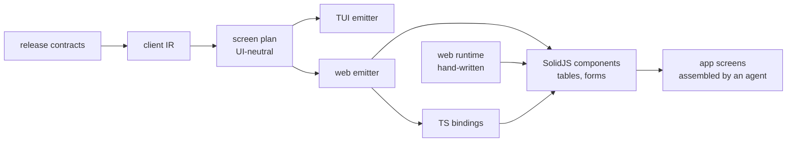

# wamn web operator client — initial spec

2026-09-20 · @Someone

## 1. Goal and scope

Generated browser UIs for human admins and operators, from the release contract, with one generator base shared by every UI target.

In:

- Generated TS bindings, and generated table and form components.
- SolidJS, client side only. TanStack Table and TanStack Form.
- Screens assembled from components by an agent or a developer.
- Local dev and real deployment. Login through the existing identity service.

Out, until an epic brings it in:

- SSR, SSE, live updates. OIDC.
- Exact table and form format.
- Charts, dashboards, flow editor.
- Editing or customizing generated files.

## 2. Decisions

| Topic | Decision |
| --- | --- |
| UI at run time | None. Every emitter writes screen code from a shared plan. No UI is built from data at run time. |
| Generator base | One UI-neutral screen plan in the generator. Web now; TUI, gpui, native build on it later. |
| TUI | Will match in method and meaning: generated screens from the same plan. Layout may differ. Work deferred. Output unchanged until then. |
| Generated output | TS bindings, plus one SolidJS component per operation, chosen by the plan's role. An operation whose shape has no supported role gets no component, and the generator reports it by name. |
| Screens | Owned by the agent. After a regeneration the agent adapts or replaces them. |
| Generated files | Not edited, for now. Customizing later, possibly as a generator output. |
| Names | snake\_case in the contract, camelCase in TS. The wire keeps snake\_case; bindings map in one place. |
| Labels | Field name with spaces by default. An authored label in `wamn.json` overrides. Carried in the IR. |
| Annotations | One description string per field and per operation. |
| Token storage | HttpOnly, Secure, SameSite=Strict cookie set by identity. CSRF token on writes. No web storage. |
| Hosting | Static files on a CDN bucket. One public host; the edge proxy routes API paths to the platform. |
| First target | Receiving. Admin UI follows the evaluation. |
| Admin UI | One standard UI across the platform, same generator, over a platform admin contract. |
| App spec | Free-form for now. Lives in `apps/<app>/docs/`. Drives tests of application behavior. |
| Tests | Generator and emitter correctness is tested in the generator crate on a platform fixture, never in applications. No checks of generated files. Applications test their own behavior, including screens they assemble. |

## 3. Shape

- **Screen plan.** Per operation: role (table, detail, form, delete), columns, inputs, paging, supplied fields, record link, revision binding. Interaction meaning only. No layout, styling, or framework concept enters it.
- **Generated output.** Per application. Bindings carry no framework code. Components are self-contained with typed props.
- **Web runtime.** One platform package the components call: transport, credentials, error meaning, paging, shared input and cell helpers.
- **App.** Routes, login, navigation, screens. Not generated.

## 4. Current state

Facts from the code at `d1b2310c`, after Epics 1, 2, and 3A.

- `client_ir.rs` (IR v3), `client_plan.rs` (screen plan), `client_rust.rs` (Rust bindings), `client_ts.rs` (TypeScript bindings), `client_route.rs`, `client_tui.rs`.
- `client_ts.rs` writes `generated/client-ts/`: one module per model, an index, and a `package.json`. A package opts in with `npm_distribution` in its manifest. Receiving declares `@wamn/receiving-client`. WMS and Acme declare none and generate no TypeScript.
- The wire contract is hand-written and lives in `web/runtime`, as the package `@wamn/web-runtime`. Every generated module imports it by name, and the emitted `package.json` declares it as the one dependency. An application resolves the name through its own configuration.
- The runtime implements the transport: the URL, the credential the application supplies, the request envelope, and the classification of one reply into the four outcomes. It also supplies the request identity, the idempotency key, and the time the intent started.
- One case table at `crates/client/tui/tests/data/classification-cases.json` holds both clients to one rule. A Rust test and the runtime's own tests read it.
- The browser trusts the platform for the values inside a reply. It holds no schema validator and no copy of the wire spelling rules. A reply whose value violates its own field contract reads as completed there and as uncertain in the terminal.
- Names: the generator decides every member name and emits a field map beside each operation, so no name rule exists at run time. A key that no map declares keeps its spelling, which leaves a `json` value alone. A contract name that does not reverse is refused at emit.
- A bounded list returns `{ rows }`, and a page returns `{ item, nextCursor }`. A declared value domain types as a union of its literals.
- `client_plan.rs` holds the screen rules: role, effective result class, columns, inputs, rows, paging with the input path of every page control, row links, supplied fields, record link, revision binding. It is built from the IR, borrows its contract values, and is not serialized.
- `client_tui.rs` `emit_model` writes one `ScreenSpec` constant per operation from the plan. No screen code.
- The TUI renders from that data at run time: one generic `Screen` in `crates/client/tui` (`screen.rs`), with `table.rs` and `form.rs`.
- The run time and the terminal operator still hold their own copy of the rules the plan states. The TUI reads the plan in the "TUI matches" epic.
- `client_rust.rs` keeps its own copy of the effective-result-fields rule.
- The checks are local commands: `check_client_ts` for the generated bindings, and `npm run check` with `npm test` in `web/runtime`. No test and no build needs Node.
- No components, no CORS, no cookie session, and no static hosting.
- No labels or descriptions in `wamn.json` or the IR.
- Admin functions are `ctl` verbs only. No HTTP admin API. No HTTP read API for runs (grep only).

## 5. Process

One epic at a time.

1. An agent scopes the epic and writes its spec and issues, from this document and the code.
2. Review of the spec and issues. Work starts after it.
3. The agent completes the epic.
4. Review of the result. This document takes the decisions and corrections.
5. Only then is the next epic scoped.

Each epic below gives a goal, a done-when, and what stays out. The epic spec fills in the rest. Later epics stay one line until their turn.

## 6. Epics 1 to 4: the starting point

### Epic 1: screen plan

- **Goal.** One UI-neutral plan type in the generator, built from the client IR. It holds the rules that are scattered today (section 4).
- **Done when.** The TUI emitter prints `ScreenSpec` from the plan with unchanged output (one-time check for this refactor). Plan rules have generator tests on a platform fixture.
- **Out.** Any change to TUI run-time code. Any web output.

### Epic 2: TS bindings

- **Goal.** `client_ts.rs`: types and one function per public operation, from the IR. Name mapping in one place.
- **Done when.** Bindings for the platform fixture compile under `tsc` in strict mode, and the emitter has generator tests. Receiving bindings generate.
- **Out.** Components. Labels and descriptions.

### Epic 3: web runtime and components

The epic split in two at its scope. The runtime came first, and the component emitter follows it.

**Epic 3A: Epic 2 fixes and the hand-written web runtime.** Done.

- **Goal.** The three fixes the Epic 2 review named, one screen plan change, and the hand-written runtime that implements the transport.
- **Done when.** The fixes have generator tests, the runtime classifies the four outcomes the same as `classify()`, and one case table holds both clients.
- **Out.** The component emitter. Cookie login. Customizing.

**Epic 3B: generated SolidJS components.**

- **Goal.** One component per operation by plan role. Unsupported shapes are reported, not forced into a table or form. The runtime gains the page state, the input helpers, and the cell helpers that the components call.
- **Done when.** Components for the fixture compile. A testing method for a generated component is written down and used once. Receiving components generate.
- **Out.** Exact visual format. Cookie login. Customizing.
- **Input validation.** What an operator types is checked in the browser with `zod`, from a schema the generator emits. A reply is not re-checked, because the platform is the authority on its own values.

### Epic 4: Receiving demo and evaluation

- **Goal.** One disposable demo page that mounts every generated Receiving component against the local stack, in the local dev loop. It proves component ergonomics only. It has no routes or navigation design and is not the start of a product.
- **Done when.** Every Receiving operation can be run from the demo screen. A short list of issues and an ergonomics verdict exist. That review decides the later epics.
- **Out.** Deployment. Screens meant for real operators. App structure that later work would inherit.
- **Login.** The demo uses the existing \`/password/session\` login and bearer token, held in memory, behind the Vite proxy. No temporary auth design. Cookie and CSRF stay a later epic.

## 7. Later epics

Named only. Order and content are decided after the Epic 4 review.

- Cookie session and CSRF in the identity service.
- CDN bucket, edge proxy, first real deployment. On GCP this is a load balancer URL map with a storage bucket and Cloud CDN (assumed, not tested).
- Platform admin contract and HTTP API, then the standard admin UI: users, roles, applications, tenants. Performance and metrics need chart components.
- Application UIs: Receiving, WMS.
- Authored labels and descriptions in the manifest, contract, and IR.
- Authoring support: generated docs, skills for agent and human authors, the app spec format.
- Screen population: selectors fed by a list, table row to form. Multiple outer items per submit.
- TUI matches: generated screens from the plan; `crates/client/tui` shrinks to helpers.
