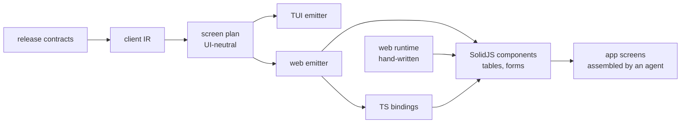

# wamn web operator client — initial spec

2026-09-20 · @Someone

## 1. Goal and scope

Generated browser UIs for human admins and operators, from the release contract, with one generator base shared by every UI target.

In:

- Generated TS bindings, and generated table and form components.
- SolidJS, client side only. TanStack Table and TanStack Form.
- Screens assembled from components by an agent or a developer.
- Local dev and real deployment. Login through the existing identity service.

Out, until an epic brings it in:

- SSR, SSE, live updates. OIDC.
- Exact table and form format.
- Charts, dashboards, flow editor.
- Editing or customizing generated files.

## 2. Decisions

| Topic | Decision |
| --- | --- |
| UI at run time | None. Every emitter writes screen code from a shared plan. No UI is built from data at run time. |
| Generator base | One UI-neutral screen plan in the generator. Web now; TUI, gpui, native build on it later. |
| TUI | Will match in method and meaning: generated screens from the same plan. Layout may differ. Work deferred. Output unchanged until then. |
| Generated output | TS bindings, plus one SolidJS component per operation, chosen by the plan's role. An operation whose shape has no supported role gets no component, and the generator reports it by name. |
| Screens | Owned by the agent. After a regeneration the agent adapts or replaces them. |
| Generated files | Not edited, for now. Customizing later, possibly as a generator output. |
| Names | snake\_case in the contract, camelCase in TS. The wire keeps snake\_case; bindings map in one place. |
| Labels | Field name with spaces by default. An authored label in `wamn.json` overrides. Carried in the IR. |
| Annotations | One description string per field and per operation. |
| Token storage | HttpOnly, Secure, SameSite=Strict cookie set by identity. CSRF token on writes. No web storage. |
| Hosting | Static files on a CDN bucket. One public host; the edge proxy routes API paths to the platform. |
| First target | Receiving. Admin UI follows the evaluation. |
| Admin UI | One standard UI across the platform, same generator, over a platform admin contract. |
| App spec | Free-form for now. Lives in `apps/<app>/docs/`. Drives tests of application behavior. |
| Tests | Generator and emitter correctness is tested in the generator crate on a platform fixture, never in applications. No checks of generated files. Applications test their own behavior, including screens they assemble. |

## 3. Shape

- **Screen plan.** Per operation: role (table, detail, form, delete), columns, inputs, paging, supplied fields, record link, revision binding. Interaction meaning only. No layout, styling, or framework concept enters it.
- **Generated output.** Per application. Bindings carry no framework code. Components are self-contained with typed props.
- **Web runtime.** One platform package the components call: transport, credentials, error meaning, paging, shared input and cell helpers.
- **App.** Routes, login, navigation, screens. Not generated.

## 4. Current state

Facts from the code at `cdb6dd1e`, after Epics 1, 2, 3A, and 3B.

- `client_ir.rs` (IR v3), `client_plan.rs` (screen plan), `client_rust.rs` (Rust bindings), `client_ts.rs` (TypeScript bindings), `client_component.rs` (SolidJS components), `client_route.rs`, `client_tui.rs`.
- A package opts in with `client_package` in its manifest. Receiving declares `@wamn/receiving-client`. WMS and Acme declare none and generate no TypeScript.
- `generated/client-ts/` holds one module per model, an index, and a `package.json`. Its `components/` directory holds one component module per model and its own index.
- The wire contract and the transport are hand-written in `web/runtime`, as the package `@wamn/web-runtime`. Every generated module imports it by name. The emitted `package.json` declares it and `@wamn/ui`, the package in `web/ui` that the components render through.
- The runtime classifies one reply into the four outcomes. It supplies the request identity, the idempotency key and the start time. It also holds the page state, the draft members and the cell text.
- One case table at `crates/client/tui/tests/data/classification-cases.json` holds both clients to one rule. A Rust test and the runtime's own tests read it.
- The browser trusts the platform for the values inside a reply. A reply whose value violates its own field contract reads as completed there and as uncertain in the terminal.
- Components take the plan role: table, detail, form, delete. A shape with no role gets no component, and the index names it with the reason.
- A form checks what the operator types with an emitted `zod` schema. It writes the reserved inputs from the runtime, and it marks the member that a refusal names. A repeated input group renders as a list.
- A command whose plan binds a revision reads the record first and sends the revision it read. A revision with no binding is a prop.
- Names: the generator decides every member name and emits a field map beside each operation, so no name rule exists at run time. A contract name that does not reverse is refused at emit.
- A bounded list returns `{ rows }`, and a page returns `{ item, nextCursor }`. A declared value domain types as a union. A request declares writable members, and a result keeps read only members.
- `client_plan.rs` holds the screen rules: role, effective result class, columns, inputs, rows, paging, row links, supplied fields, record link, revision binding. Paging names the input path of every page control.
- `client_tui.rs` `emit_model` writes one `ScreenSpec` constant per operation from the plan. The TUI renders from that data at run time. It still holds its own copy of the rules the plan states.
- The checks are local commands: `check_client_ts` for the bindings, and `check_client_components` for the components. `web/runtime` runs `npm run check` and `npm test`. No test and no build needs Node.
- No application shell, no demo page, no CORS, no cookie session, and no static hosting.
- No labels or descriptions in `wamn.json` or the IR. A component derives a label from the field path.
- Admin functions are `ctl` verbs only. No HTTP admin API. No HTTP read API for runs (grep only).
- `web/demo` is the disposable page that runs the Receiving components against a local stack. It resolves the runtime, the generated client and the four framework packages by alias, because a generated module sits outside the package that installs them. Its Vite proxy gives the browser one origin: the release routes by a `Host` header, and the issuer signs its own certificate.
- `apps/wamn_receiving/tests/fixtures/receiving-seed.sql` builds 10, 100 or 1000 items, locations and purchase orders, deterministically. The small dataset is saved beside it. Receiving declares no operation that creates any of those records.
- An application integer is `int32` by default, and `int64` is opt-in with a reason. A Postgres internal, such as a transaction identity or a history position, never enters an application contract. A real `int64` stays a string on the wire and opaque in the browser. The Receiving contract carries no `int64`: a revision is `int32`, and the purchase order history pages by an opaque cursor. Two spellings of `int64` still exist inside the platform, which `wamn-wpvg` owns.

## 5. Process

One epic at a time.

1. An agent scopes the epic and writes its spec and issues, from this document and the code.
2. Review of the spec and issues. Work starts after it.
3. The agent completes the epic.
4. Review of the result. This document takes the decisions and corrections.
5. Only then is the next epic scoped.

Each epic below gives a goal, a done-when, and what stays out. The epic spec fills in the rest. Later epics stay one line until their turn.

## 6. Epics 1 to 4: the starting point

### Epic 1: screen plan

- **Goal.** One UI-neutral plan type in the generator, built from the client IR. It holds the rules that are scattered today (section 4).
- **Done when.** The TUI emitter prints `ScreenSpec` from the plan with unchanged output (one-time check for this refactor). Plan rules have generator tests on a platform fixture.
- **Out.** Any change to TUI run-time code. Any web output.

### Epic 2: TS bindings

- **Goal.** `client_ts.rs`: types and one function per public operation, from the IR. Name mapping in one place.
- **Done when.** Bindings for the platform fixture compile under `tsc` in strict mode, and the emitter has generator tests. Receiving bindings generate.
- **Out.** Components. Labels and descriptions.

### Epic 3: web runtime and components

The epic split in two at its scope. The runtime came first, and the component emitter follows it.

**Epic 3A: Epic 2 fixes and the hand-written web runtime.** Done.

- **Goal.** The three fixes the Epic 2 review named, one screen plan change, and the hand-written runtime that implements the transport.
- **Done when.** The fixes have generator tests, the runtime classifies the four outcomes the same as `classify()`, and one case table holds both clients.
- **Out.** The component emitter. Cookie login. Customizing.

**Epic 3B: generated SolidJS components.** Done.

- **Goal.** One component per operation by plan role. Unsupported shapes are reported, not forced into a table or form. The runtime gains the page state, the input helpers, and the cell helpers that the components call.
- **Done when.** Components for the fixture compile. A testing method for a generated component is written down and used once. Receiving components generate.
- **Out.** Exact visual format. Cookie login. Customizing.
- **Input validation.** What an operator types is checked in the browser with `zod`, from a schema the generator emits. A reply is not re-checked, because the platform is the authority on its own values.

### Epic 4: Receiving demo and evaluation

- **Goal.** One disposable demo page that mounts every generated Receiving component against the local stack, in the local dev loop. It proves component ergonomics only. It has no routes or navigation design and is not the start of a product.
- **Done when.** Every Receiving operation can be run from the demo screen. A short list of issues and an ergonomics verdict exist. That review decides the later epics.
- **Out.** Deployment. Screens meant for real operators. App structure that later work would inherit.
- **Login.** The demo uses the existing \`/password/session\` login and bearer token, held in memory, behind the Vite proxy. No temporary auth design. Cookie and CSRF stay a later epic.

## 7. Later epics

The Epic 4 evaluation proposed the order below, and the owner review of 2026-09-22 confirmed it.

1. **The defects the demo found.** Epic 5, Beads `wamn-iq82`. CLOSED on 2026-09-22, and the owner review accepted it. `wamn-uuo6`: an `int64` is a string and the wire wants a number. `wamn-v8ku`: a refusal marks no field. `wamn-m9qt`: initial values cannot reach a nested member. `wamn-wrlp`: a detail demands a request identity it discards. `wamn-br5r`: a revision reads as 0. The first one blocks a whole operation. The integer ruling of 2026-09-22 governs the fix. An application integer is `int32` by default, and an `int64` is opt-in with a reason. A Postgres internal never enters an application contract. A real `int64` stays a string on the wire and opaque in the browser.
Epic 5 closed the five defects at the layer that owns each one. A contract integer maps to `int32`, so it is a number in the bindings and on the wire. A revision carries the width of its own column, and Receiving declares `row_version` as `int4`. The purchase order history drops the transaction identity and every database position, and it pages by an opaque cursor. The Receiving client contract therefore carries no `int64`. The runtime reads a refusal as one declared path and decides which control it marks, including one line of a repeated group. A form states the values it can start with, and a detail states the record inputs alone. No caller supplies a value that the component writes over. A concurrency conflict reads both wire spellings of a revision. Three results were measured in the browser against a local stack on 2026-09-22. The purchase order history draws its rows. A second page follows the cursor of the last entry. A receipt line with the quantity `0` marks its own quantity control. Two findings came out of the work and stay open. `wamn-wpvg` holds the wire spelling of an `int64`, which is still two rules inside the platform. `wamn-cguw` holds the line member names, which only Receiving can spell today.

2. **Authored labels and descriptions** in the manifest, contract, and IR. Epic 6, Beads `wamn-c2y5`. BUILT on 2026-09-22, and the epic waits for the owner review.
Epic 6 put one optional label and one optional description in the manifest, at the three carriers an author can reach. An operation input or result field states them on its own object. A model states them in `field_text`, keyed by column name, because a model has no per-field object. An operation states them on itself. The text travels through the generated contract and the client IR, and the plan hands it to an emitter, which reads no manifest. A component reads the label wherever it states text for a person. A table column header, a detail term, a form control and a page control all read it. A field with no authored label keeps its name with spaces. A description reaches the TypeScript type as a comment, and no screen shows it. The owner ruled that a component renders no heading. Each module exports its screen name as a constant, and the page that places it decides where that text goes. The text never enters a published route schema, so no attachment definition-hash moves. An application that authors nothing regenerates to the same bytes, which WMS and the Acme overlay proved. The key `npm_distribution` became `client_package` in the same epic, because nothing is published and the name is only what a workspace imports. Receiving authors labels for its operator fields, and the browser showed them against a local stack on 2026-09-22. One gap stays open. A repeated input group is synthesized from the leaf paths, so no author can label it, which `wamn-j3yr` holds.

3. **Screen population:** selectors fed by a list, table row to form. Multiple outer items per submit. The demo made the operator paste identifiers by hand, which is the largest ergonomic cost measured. Epic 7, Beads `wamn-rm14`, which also holds `wamn-z5vd`, `wamn-s3kd` and `wamn-j3yr`.
Epic 7 made one contract member carry the fact that an input names a record, whoever produced it. A generated action derives `references` from its column's foreign key, an authored operation declares it, and every read that serves rows states `lists`. No reader asks which producer wrote the member. The plan resolves what spans two operations beside the row link it already had: which list serves an input, how one selector narrows another, and which result fields of a row fill which inputs of a form. A component then renders a selector instead of a text control, and a table row opens a form already filled. A narrowed selector offers nothing until the operator chooses the record it narrows by, and it reads again when that value changes. A repeated group carries the label its line bound declares, it stops at the declared bounds, and a refusal marks the one line it names. Receiving gained a supplier model, so a foreign key rather than a declaration derives its selector, and one filter on the purchase order number. Measured in a browser against a local stack on 2026-09-22: a receipt completed with its order, its line and its location each chosen from a list, the line list offered the six lines of that order alone, a purchase order row opened the receipt form already filled, a line was added and removed, and a supplier change completed. No control asked for a pasted identity. Three findings stay open. `wamn-jaxo` holds the rest of decision 2: a selector renders no filter control and no next page control, which `wamn-rm14.4` closed with that stated and `wamn-rm14.8` then declared the filter for. `wamn-icxo` holds a create input that says a field may be omitted when its column cannot default. `wamn-mf0i` holds a component emitted for an operation the release does not serve.
Epic 7b, Beads `wamn-sxb5`, then finished decision 2 and closed `wamn-jaxo`. A selector renders one search control: the list's declared filter on its display field. When the list serves pages, it also renders a next page control. It renders no other filter of that list. A selector asks one question, which is the text it already shows. A list that declares no such filter gives the first page and the next page control. The emitted index then names that selector, its input and the list it reads. An author closes the gap by declaring the filter. The search sends the filter and no cursor. The next page sends the cursor the last reply returned. Both call the binding the first read called. The plan carries the two controls as data on the populated input, so the emitters apply no rule of their own. Only a model query declares a filter. The platform fixture states that with a second model whose query a selector searches. Measured in a browser against a local stack on 2026-09-22, at one thousand purchase orders. The purchase order selector found `PO-0742` by its number. The next page control took its options from one hundred to two hundred, and the first page stayed above the second. The supplier selector, the location selector and the receipt line selector showed no search control, which is what the index reported. One limit stays, and it belongs to the platform filter contract rather than to the selector. A declared filter compares with `IN`, so a search matches a value in full. `wamn-yxm6` holds a match mode for every table.
Epic 8, Beads `wamn-587f`, then took every application name out of the generator. A command declares the line members that state its canonical order, so no closed enum in the platform spells one application's fields. A custom codec writes the type names of its own operation. An `int64` is a JSON string in every codec path, and one function states that rule. The result fields of an operation have one owner, which is the plan. A component is emitted only for an operation the release serves, and the index reports the skipped ones by name. Because a count is an application integer, the WMS `pallet_count` became an `int32` under the integer ruling. A grep for `receiving`, `purchase_order`, `receipt` and `RecordReceipt` in `crates/schema/generator/src` returns nothing outside comments. The three packages regenerate, and 23 generated files moved, each with its reason in the notes of `wamn-587f.6`. One item moved out of the epic. The platform tests still copy Receiving and WMS across 19 files and 802 lines, which `wamn-587f.7` holds for its own epic.
Epic 9, Beads `wamn-pdhq`, then gave the platform tests one fixture application at `apps/platform_fixture` and a minimal overlay. The tests of its nine items take them. The first closeout found about 600 lines of application vocabulary in 93 test files that no item named. It also found that `tools/build-components all` refused the fixture, because its components had no crate. The owner kept both in the epic. The fixture now builds its guest components, and the 93 files state a neutral vocabulary. COMPLETE on 2026-09-23, and the epic waits for the owner review. No test under `crates/`, `services/` or `test-support/` reads Receiving, WMS or Acme or states their vocabulary. The workspace tests and `tools/build-components all` pass.
Epic 10, Beads `wamn-ut5e`, then gave the components a UI base. CLOSED on 2026-09-23, and the owner review accepted it. Generated code moved to TanStack Table 9 and renders through `web/ui`, the platform package that holds the copied Zaidan components and one theme. The generator writes no class and no Zaidan code. It names the composed exports of `web/ui`: the data grid, the fields, the record selector, the confirmation dialog and the outcome toast. Measured in a browser against a fresh local stack at one thousand purchase orders on 2026-09-23. A table read 100 rows with a next page control. A supplier change submitted and showed its toast. The purchase order selector found `PO-0742` by its number and paged from 100 to 200 options. The dark mode reached the whole page. Receiving declares no delete, so the fixture test covers the confirmation dialog. Two findings from the review stay open. `wamn-xlnr` prunes the Zaidan CSS that no copied component uses, and `wamn-jc27` lets an application set the selector search pause.
4. **Cookie session and CSRF** in the identity service.
5. **Platform admin contract and HTTP API,** then the standard admin UI: users, roles, applications, tenants. Performance and metrics need chart components.
6. **Application UIs:** Receiving, WMS. These wait for 2 and 3.
7. **CDN bucket, edge proxy, first real deployment.** On GCP this is a load balancer URL map with a storage bucket and Cloud CDN (assumed, not tested).
8. **TUI matches:** generated screens from the plan, and `crates/client/tui` shrinks to helpers.
9. **Authoring support:** generated docs, skills for agent and human authors, the app spec format.

## 8. The Epic 4 verdict

Written on 2026-09-22 from one run of `web/demo` against a local stack. The filled checklist is in the notes of Beads `wamn-78or`.

**The components work.** Nine of nine mount against a real release. Eight of nine run. One, the purchase order history, cannot run at all, because both of its page inputs are typed as strings and the route wants numbers.

**The shape is right.** A table reads on request. A row link is a callback. The demo chose what opening a row means, and the page address never changed. A form renders no control for a supplied field. The runtime writes the request identity, the idempotency key and the time. A revision-bound form reads the record inside its own submit, so no revision control exists. A repeated group adds and removes lines. No generated file was edited.

**The revision window is real and reachable.** A separate writer commits between the form's read and its write. The page then reads `concurrency_conflict` with both revisions. The two round trips per submission are a cost, not a fix. The later screen-population epic can carry the revision from the row that filled the form.

**What hurts, in order.**
1. Types that do not match the wire. An `int64` is a string in the bindings, and a contract integer is a number on the wire.
2. A refusal names its field and the form marks nothing, so an operator reads a code above the screen.
3. Every label is a field path with spaces.
4. Every record identity is typed or pasted by hand, because nothing feeds a control from a list.
5. Props force a caller to state values it must not choose: a request identity the component discards, and initial values that cannot reach a nested member.

**What the demo does not answer.** Visual format, because the page has no styling. Volume, because a bounded list drew 1000 rows into the document with no window. Multiple items per submission, which stays out of scope.
